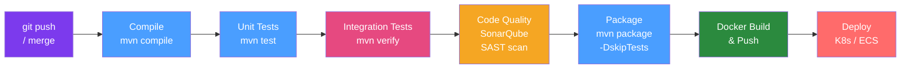

# 🚀 CI/CD for Java

> [!abstract] TL;DR
> A production CI/CD pipeline for Java microservices runs through: compile → unit test → integration test → static analysis → security scan → package → Docker build/push → deploy. GitHub Actions and GitLab CI are the dominant platforms. Key optimisations: Maven/Gradle dependency caching, parallel test execution, and matrix builds for multi-JDK testing.

## Intuition — analogy FIRST

CI/CD is a **car manufacturing assembly line**. Raw code (raw materials) enters at one end. Each station (pipeline stage) performs one specific job: weld the frame (compile), test the brakes (unit tests), full road test (integration tests), safety inspection (security scan), paint and finish (Docker build), then drive it to the showroom (deploy). If any station finds a defect, the car doesn't advance. The assembly line runs continuously — as soon as a developer pushes code, the car starts being built. You don't wait until Friday to check if this week's code works.

---

## How It Works



## Key Concepts / Details

### GitHub Actions Pipeline

```yaml
# .github/workflows/ci.yml
name: Java CI/CD

on:
  push:
    branches: [main, develop]
  pull_request:
    branches: [main]

jobs:
  build-and-test:
    runs-on: ubuntu-latest
    
    strategy:
      matrix:
        java-version: [21]  # Test on multiple: [17, 21]
    
    steps:
      - uses: actions/checkout@v4
      
      - name: Set up JDK ${{ matrix.java-version }}
        uses: actions/setup-java@v4
        with:
          java-version: ${{ matrix.java-version }}
          distribution: 'temurin'
          cache: 'maven'  # Automatically caches ~/.m2/repository
      
      - name: Compile
        run: mvn -B compile --no-transfer-progress
      
      - name: Unit Tests
        run: mvn -B test --no-transfer-progress
      
      - name: Integration Tests
        run: mvn -B verify -DskipUnitTests --no-transfer-progress
        env:
          SPRING_PROFILES_ACTIVE: test
      
      - name: SonarQube Analysis
        run: mvn -B sonar:sonar --no-transfer-progress
        env:
          SONAR_TOKEN: ${{ secrets.SONAR_TOKEN }}
          SONAR_HOST_URL: ${{ vars.SONAR_HOST_URL }}
      
      - name: Build Docker Image
        run: |
          mvn -B spring-boot:build-image \
            -Dspring-boot.build-image.imageName=myapp:${{ github.sha }}
      
      - name: Push to Container Registry
        if: github.ref == 'refs/heads/main'
        run: |
          docker tag myapp:${{ github.sha }} ghcr.io/${{ github.repository }}:${{ github.sha }}
          docker push ghcr.io/${{ github.repository }}:${{ github.sha }}
  
  deploy-staging:
    needs: build-and-test
    if: github.ref == 'refs/heads/main'
    runs-on: ubuntu-latest
    environment: staging
    
    steps:
      - name: Deploy to Kubernetes
        run: |
          kubectl set image deployment/myapp \
            myapp=ghcr.io/${{ github.repository }}:${{ github.sha }}
          kubectl rollout status deployment/myapp --timeout=120s
```

### GitLab CI Equivalent

```yaml
# .gitlab-ci.yml
stages:
  - build
  - test
  - scan
  - package
  - deploy

variables:
  MAVEN_OPTS: "-Dmaven.repo.local=$CI_PROJECT_DIR/.m2/repository"
  MAVEN_CLI_OPTS: "--batch-mode --no-transfer-progress"

cache:
  paths:
    - .m2/repository/

compile:
  stage: build
  image: eclipse-temurin:21-jdk
  script: mvn $MAVEN_CLI_OPTS compile

unit-test:
  stage: test
  image: eclipse-temurin:21-jdk
  script: mvn $MAVEN_CLI_OPTS test
  artifacts:
    reports:
      junit: target/surefire-reports/*.xml

integration-test:
  stage: test
  image: eclipse-temurin:21-jdk
  services:
    - postgres:15  # Sidecar DB for integration tests
  script: mvn $MAVEN_CLI_OPTS verify -DskipUnitTests

docker-build:
  stage: package
  image: docker:24
  services: [docker:24-dind]
  script:
    - docker build -t $CI_REGISTRY_IMAGE:$CI_COMMIT_SHA .
    - docker push $CI_REGISTRY_IMAGE:$CI_COMMIT_SHA
  only: [main]
```

### Deployment Strategies

| Strategy | How | Risk | Rollback |
|----------|-----|------|----------|
| **Rolling Update** | Replace pods gradually (default K8s) | Low blast radius | `kubectl rollout undo` |
| **Blue-Green** | Run both versions, switch traffic | Zero downtime | Instant (switch back) |
| **Canary** | Route 5% traffic to new, ramp up | Controlled risk | Remove canary |
| **Feature Flag** | Deploy code but toggle via flag | Decouple deploy/release | Toggle flag off |

### Feature Flags with LaunchDarkly / Unleash

```java
@Service
public class PaymentService {
    
    private final LDClient launchDarkly;
    
    public PaymentResult processPayment(Payment payment, String userId) {
        // Check feature flag for new payment processor
        boolean useNewProcessor = launchDarkly.boolVariation(
                "new-payment-processor", 
                LDContext.create(userId), 
                false);  // default = false (old processor)
        
        if (useNewProcessor) {
            return newPaymentProcessor.process(payment);
        } else {
            return legacyPaymentProcessor.process(payment);
        }
    }
}
```

### Trunk-Based Development vs GitFlow

| Aspect | Trunk-Based | GitFlow |
|--------|------------|---------|
| Branches | Short-lived feature branches (< 1 day) | long-running feature/release/hotfix branches |
| Integration | Merge to main frequently | Merge to develop, then release |
| CI triggers | Every commit to main | Branch-specific pipelines |
| Suitable for | High-velocity teams, microservices | Large teams, scheduled releases |
| Feature isolation | Feature flags | Feature branches |

## Real-World Notes

- **OWASP Dependency Check**: Add `mvn org.owasp:dependency-check-maven:check` to your pipeline to catch CVEs in third-party jars.
- **SonarQube quality gate**: Configure quality gates to fail the build on: new critical bugs, security hotspots, coverage drop below 80%, duplications above 3%.
- **Parallel jobs**: Split unit and integration tests into parallel jobs to reduce total pipeline time. GitHub Actions matrix strategy is ideal.
- **Secret management**: Never hardcode secrets in YAML. Use GitHub Actions secrets, GitLab CI/CD variables, or Vault Agent Injector in Kubernetes.

## Common Pitfalls

- **No caching**: Maven downloads 200+ jars on every run without caching — 3-5 minutes wasted. Always configure Maven/Gradle caching.
- **Running integration tests in unit test phase**: Integration tests that spin up Testcontainers are slow. Separate them into a `verify` phase or a separate job.
- **Deploying without rollout wait**: `kubectl set image` returns immediately. Without `kubectl rollout status --timeout`, you don't know if the deployment succeeded before moving on.
- **Skipping tests on main**: Never use `-DskipTests` on main branch builds. Test speed is a tooling problem — fix it, don't skip.

## Related Concepts
- [[Maven_CI]] — Maven-specific CI optimisations
- [[Docker_Spring_Boot]] — Building the Docker image in the pipeline
- [[Kubernetes_Deployment_Java]] — Kubernetes deployment in the deploy stage

## Review Questions
1. What Maven flags make CI output cleaner and more reproducible?
2. What is the difference between blue-green and canary deployments?
3. How do feature flags decouple code deployment from feature release?
4. How do you cache Maven dependencies in GitHub Actions?
5. Why should integration tests run in a separate stage from unit tests?

## Sources
- GitHub Actions documentation — https://docs.github.com/en/actions
- GitLab CI/CD documentation — https://docs.gitlab.com/ee/ci/
- Accelerate (DORA metrics book) — Nicole Forsgren, Jez Humble, Gene Kim

#java #devops #cicd #github-actions
