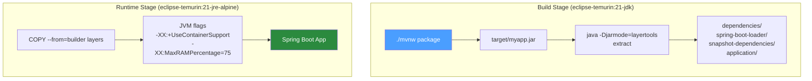

# 🐳 Docker for Spring Boot

> [!abstract] TL;DR
> Dockerizing Spring Boot correctly requires: a multi-stage Dockerfile (builder + minimal JRE runtime), Spring Boot layertools to exploit Docker layer caching for dependencies vs application code, container-aware JVM flags (`-XX:+UseContainerSupport`, `-XX:MaxRAMPercentage=75`), and a non-root user for security. Spring Boot Buildpacks provide an alternative zero-Dockerfile path.

## Intuition — analogy FIRST

Packaging a Spring Boot app into Docker is like **moving to a new apartment**. Naive approach: pack everything in one giant box (fat jar as single Docker layer) — if you change one sock, you have to repack and re-ship the entire box. Smart approach: use separate labelled boxes for furniture (framework JARs — rarely changes), books (library JARs — changes less often), and daily clothes (your application code — changes constantly). Docker layer caching is the moving van — it only re-ships changed boxes. Spring Boot layertools creates these boxes automatically.

---

## How It Works



## Key Concepts / Details

### Multi-Stage Dockerfile with Layertools

```dockerfile
# Stage 1: Build
FROM eclipse-temurin:21-jdk-alpine AS builder
WORKDIR /app

# Copy Maven Wrapper and POM first (layer cache for dependencies)
COPY .mvn/ .mvn/
COPY mvnw pom.xml ./
RUN ./mvnw dependency:go-offline -B --no-transfer-progress

# Copy source and build
COPY src/ src/
RUN ./mvnw package -DskipTests -B --no-transfer-progress

# Extract layers for Docker layer caching
RUN java -Djarmode=layertools -jar target/*.jar extract --destination /app/extracted

# ─────────────────────────────────────────────
# Stage 2: Runtime (minimal image)
FROM eclipse-temurin:21-jre-alpine AS runtime
WORKDIR /app

# Security: run as non-root user
RUN addgroup -S spring && adduser -S spring -G spring
USER spring:spring

# Copy layers in cache-friendly order (least → most likely to change)
COPY --from=builder /app/extracted/dependencies ./
COPY --from=builder /app/extracted/spring-boot-loader ./
COPY --from=builder /app/extracted/snapshot-dependencies ./
COPY --from=builder /app/extracted/application ./

# Health check (Docker-level, supplements K8s probes)
HEALTHCHECK --interval=30s --timeout=10s --start-period=60s --retries=3 \
    CMD wget -qO- http://localhost:8080/actuator/health/liveness || exit 1

EXPOSE 8080

ENTRYPOINT ["java", \
    "-XX:+UseContainerSupport", \
    "-XX:MaxRAMPercentage=75.0", \
    "-XX:+ExitOnOutOfMemoryError", \
    "-Djava.security.egd=file:/dev/./urandom", \
    "org.springframework.boot.loader.launch.JarLauncher"]
```

### Key JVM Flags for Containers

```bash
# Container CPU/memory awareness
-XX:+UseContainerSupport       # Use cgroup memory limits (default in Java 11+)
-XX:MaxRAMPercentage=75.0      # Use 75% of container memory for heap
-XX:InitialRAMPercentage=50.0  # Start heap at 50%

# Stability
-XX:+ExitOnOutOfMemoryError    # Crash immediately on OOM (let K8s restart)
-XX:+HeapDumpOnOutOfMemoryError
-XX:HeapDumpPath=/tmp/heap.hprof

# Performance
-Djava.security.egd=file:/dev/./urandom  # Faster random number generation
-XX:+UseG1GC                  # G1 GC (default in Java 9+)
-XX:+UseZGC                   # For latency-sensitive services (Java 21)

# Observability
-Dcom.sun.management.jmxremote
-Dcom.sun.management.jmxremote.port=9090
-Dcom.sun.management.jmxremote.ssl=false
-Dcom.sun.management.jmxremote.authenticate=false
```

### Environment Variable JVM Config (Production Pattern)

Don't hardcode JVM flags in the Dockerfile. Pass them at runtime:

```dockerfile
# In Dockerfile ENTRYPOINT use exec form with JAVA_OPTS
ENTRYPOINT ["sh", "-c", "exec java $JAVA_OPTS org.springframework.boot.loader.launch.JarLauncher"]
```

```yaml
# In Kubernetes deployment:
env:
  - name: JAVA_OPTS
    value: "-XX:+UseContainerSupport -XX:MaxRAMPercentage=75.0 -XX:+ExitOnOutOfMemoryError"
  - name: SPRING_PROFILES_ACTIVE
    value: production
```

### Spring Boot Buildpacks (Zero-Dockerfile Alternative)

```bash
# Build OCI image without a Dockerfile (uses Cloud Native Buildpacks)
./mvnw spring-boot:build-image \
  -Dspring-boot.build-image.imageName=myapp:latest \
  -Dspring-boot.build-image.builder=paketobuildpacks/builder-jammy-base

# In pom.xml for customisation:
```

```xml
<plugin>
    <groupId>org.springframework.boot</groupId>
    <artifactId>spring-boot-maven-plugin</artifactId>
    <configuration>
        <image>
            <name>registry.example.com/myapp:${project.version}</name>
            <env>
                <BP_JVM_VERSION>21</BP_JVM_VERSION>
                <BPE_JAVA_OPTS>-XX:MaxRAMPercentage=75</BPE_JAVA_OPTS>
            </env>
        </image>
    </configuration>
</plugin>
```

Buildpacks: automatically use the latest security patches for the base image without Dockerfile changes.

### .dockerignore

```
target/
!target/*.jar
.git/
.mvn/
*.md
src/test/
.github/
```

### Image Size Comparison

| Base Image | Size | Notes |
|-----------|------|-------|
| `eclipse-temurin:21-jdk` | ~450MB | Full JDK — only for build stage |
| `eclipse-temurin:21-jre` | ~250MB | JRE only — good runtime base |
| `eclipse-temurin:21-jre-alpine` | ~100MB | Alpine Linux — smallest JRE image |
| `gcr.io/distroless/java21` | ~80MB | No shell, more secure |
| GraalVM native image | ~50MB | No JVM — fastest startup |

### Multi-Platform Build (ARM64 + AMD64)

```bash
# Build for both Apple Silicon and x86 cloud servers
docker buildx build \
  --platform linux/amd64,linux/arm64 \
  --tag myapp:latest \
  --push \
  .
```

## Real-World Notes

- **Layer invalidation**: The `COPY .mvn/ pom.xml ./` + `dependency:go-offline` pattern creates a stable Docker layer. Only when `pom.xml` changes does Maven re-download dependencies — typically once per dependency update, not every commit.
- **Secrets at runtime, not build time**: Never `COPY` `.env` files or credentials into Docker images. Use K8s Secrets / Docker secrets mounted at runtime.
- **Distroless for production**: `gcr.io/distroless/java21` has no shell, package manager, or utilities — shrinks attack surface significantly. Debugging requires ephemeral debug containers.
- **Container resource limits**: Always set `resources.requests` and `resources.limits` in Kubernetes. Without limits, JVM's `UseContainerSupport` has no cgroup to read — it defaults to host memory.

## Common Pitfalls

- **Not using `UseContainerSupport`**: Pre-Java-10 JVMs or JVMs with the flag disabled read host memory (`-Xmx` based on host RAM), leading to OOM kills as JVM heap exceeds container memory limit.
- **COPY in wrong order**: `COPY src/ src/` before `dependency:go-offline` means dependency layer invalidates on every source change. Always copy `pom.xml` first, resolve dependencies, then copy source.
- **Running as root**: `USER root` in the container is a security risk. Always create and switch to a non-root user.
- **Forgetting `EXPOSE`**: `EXPOSE` doesn't publish the port — it's documentation. But it's required for K8s health check probes to work with `httpGet`.

## Related Concepts
- [[CI_CD_Java]] — Docker build/push step in the CI pipeline
- [[Kubernetes_Deployment_Java]] — Running the Docker image in K8s
- [[Java_Health_Checks]] — Actuator health check used in HEALTHCHECK and K8s probes

## Review Questions
1. What is the purpose of Spring Boot layertools in Docker builds?
2. What do `-XX:+UseContainerSupport` and `-XX:MaxRAMPercentage` do?
3. Why should the `COPY pom.xml` and `dependency:go-offline` steps come before `COPY src/`?
4. What is the difference between a multi-stage Dockerfile and Spring Boot Buildpacks?
5. What security risk does running a container as root introduce?

## Sources
- Spring Boot Docker documentation: https://docs.spring.io/spring-boot/docs/current/reference/html/container-images.html
- Eclipse Temurin Docker images: https://hub.docker.com/_/eclipse-temurin

#java #devops #docker #spring-boot #containers
