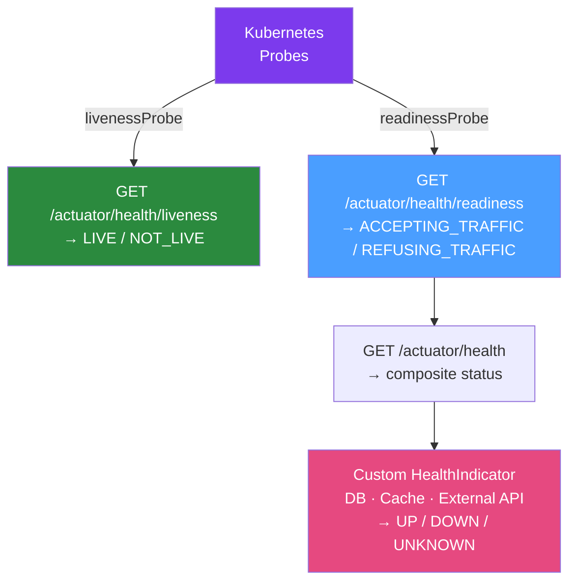

# 🏥 Java Health Checks

> [!abstract] TL;DR
> Spring Boot Actuator provides production-ready health check endpoints at `/actuator/health`. Health groups separate **liveness** (is the app alive and not stuck?) from **readiness** (is the app ready to serve traffic?). Custom `HealthIndicator` beans add business-level health checks. Graceful shutdown ensures in-flight requests complete before the JVM terminates.

## Intuition — analogy FIRST

Health checks are like a **hospital triage system** with two different questions. The **liveness** check asks: "Is the patient alive? Are they breathing?" — if No, call a code blue immediately (restart the pod). The **readiness** check asks: "Is the patient stable enough to see visitors?" — if No, no new visitors (requests) are sent in, but the patient (pod) isn't restarted. Graceful shutdown is the "last rites" period: existing visitors are allowed to finish their conversation, then the patient (pod) is retired cleanly. Without this separation, a temporarily overwhelmed service (failing downstream DB query) would cause Kubernetes to restart it — the wrong medicine.

---

## How It Works



## Key Concepts / Details

### Actuator Configuration

```yaml
# application.yml
management:
  server:
    port: 8081  # Separate port for management (K8s probes hit this, not 8080)
  endpoints:
    web:
      exposure:
        include: health, info, metrics, prometheus
  endpoint:
    health:
      show-details: when-authorized  # Full details only for authenticated callers
      show-components: always
      probes:
        enabled: true  # Enable liveness + readiness groups
  health:
    livenessstate:
      enabled: true
    readinessstate:
      enabled: true
    diskspace:
      enabled: true
      threshold: 500MB
    db:
      enabled: true  # auto-configured when DataSource present
```

### Liveness vs Readiness Groups

Spring Boot auto-configures two health groups when `probes.enabled: true`:

```yaml
management:
  endpoint:
    health:
      group:
        liveness:
          include: livenessState       # Only JVM liveness — do NOT include DB here
        readiness:
          include: readinessState, db, redis, diskSpace  # All dependencies
```

**Liveness** (`/actuator/health/liveness`):
- Should only include `livenessState` (internal JVM health)
- Failing = "restart the pod"
- Adding DB checks here means temporary DB blip → pod restart → thundering herd

**Readiness** (`/actuator/health/readiness`):
- Should include all dependencies the app needs to serve traffic
- Failing = "remove from load balancer, don't restart"
- DB down → app marks itself unready → traffic drained → DB recovers → app marks ready again

### Custom HealthIndicator

```java
@Component
public class PaymentServiceHealthIndicator implements HealthIndicator {
    
    private final PaymentServiceClient paymentClient;
    
    @Override
    public Health health() {
        try {
            PaymentServiceStatus status = paymentClient.ping();
            
            if (status.isOperational()) {
                return Health.up()
                        .withDetail("version", status.getVersion())
                        .withDetail("latency_ms", status.getLatencyMs())
                        .build();
            } else {
                return Health.down()
                        .withDetail("reason", status.getDegradationReason())
                        .build();
            }
        } catch (Exception e) {
            return Health.down(e)
                    .withDetail("error", e.getMessage())
                    .build();
        }
    }
}
```

The indicator name is derived from the class name: `paymentService` → visible at `/actuator/health/paymentService`.

### Reactive Health Indicator (WebFlux)

```java
@Component
public class ReactiveDbHealthIndicator implements ReactiveHealthIndicator {
    
    private final DatabaseClient databaseClient;
    
    @Override
    public Mono<Health> health() {
        return databaseClient.sql("SELECT 1")
                .fetch().rowsUpdated()
                .map(count -> Health.up().build())
                .onErrorResume(e -> Mono.just(Health.down(e).build()));
    }
}
```

### Programmatic Liveness/Readiness State

```java
@Component
public class AppInitializer implements ApplicationListener<ApplicationReadyEvent> {
    
    private final ApplicationContext context;
    
    @Override
    public void onApplicationEvent(ApplicationReadyEvent event) {
        // Mark app as ready after custom initialization
        AvailabilityChangeEvent.publish(context, ReadinessState.ACCEPTING_TRAFFIC);
    }
}

// Marking app as not ready during maintenance
@RestController
@RequiredArgsConstructor
public class MaintenanceController {
    private final ApplicationContext context;
    
    @PostMapping("/admin/maintenance/on")
    public void enableMaintenance() {
        AvailabilityChangeEvent.publish(context, ReadinessState.REFUSING_TRAFFIC);
    }
    
    @PostMapping("/admin/maintenance/off")
    public void disableMaintenance() {
        AvailabilityChangeEvent.publish(context, ReadinessState.ACCEPTING_TRAFFIC);
    }
}
```

### Graceful Shutdown

```yaml
server:
  shutdown: graceful  # Wait for in-flight requests to complete

spring:
  lifecycle:
    timeout-per-shutdown-phase: 30s  # Max time to wait for in-flight requests
```

The shutdown sequence:
1. Pod receives SIGTERM
2. `preStop` hook runs (optional sleep to allow load balancer deregistration)
3. Spring marks app as `REFUSING_TRAFFIC` (readiness probe fails → K8s removes from Endpoints)
4. App waits up to `timeout-per-shutdown-phase` for in-flight requests to complete
5. Spring shuts down all beans in reverse order
6. JVM exits

```java
// Custom shutdown hook (if you need cleanup)
@Component
public class CustomShutdownHook {
    
    private final KafkaListenerEndpointRegistry kafkaRegistry;
    
    @EventListener(ContextClosedEvent.class)
    public void onContextClosed() {
        // Stop Kafka consumers before Spring context closes
        kafkaRegistry.stop();
        log.info("Kafka consumers stopped gracefully");
    }
}
```

### Health Status Response

```json
// GET /actuator/health (show-details: always)
{
  "status": "UP",
  "groups": ["liveness", "readiness"],
  "components": {
    "db": {
      "status": "UP",
      "details": {
        "database": "PostgreSQL",
        "validationQuery": "isValid()"
      }
    },
    "diskSpace": {
      "status": "UP",
      "details": {"total": 107374182400, "free": 50000000000, "threshold": 524288000}
    },
    "paymentService": {
      "status": "UP",
      "details": {"version": "2.1.0", "latency_ms": 45}
    },
    "livenessState": {"status": "LIVE"},
    "readinessState": {"status": "ACCEPTING_TRAFFIC"}
  }
}
```

## Real-World Notes

- **Cache health results**: If you have many custom health indicators hitting external services, the `/actuator/health` endpoint can become slow. Cache results: `@Cacheable(value = "health", key = "'paymentService'")` with short TTL.
- **Alert on UNKNOWN**: Spring Boot uses `UNKNOWN` status when a health indicator throws an exception but the exception isn't a `HealthIndicator` implementation issue. `UNKNOWN` should trigger alerts — it means the health check itself is broken.
- **Separate management port**: Use `management.server.port: 8081` so K8s probes and internal tools don't compete with external traffic on port 8080, and so management endpoints aren't exposed through the Ingress.

## Common Pitfalls

- **DB check in liveness group**: Temporary DB unavailability causes liveness failure → pod restart → all connections dropped → DB avalanche. Keep liveness to JVM state only.
- **No startup probe**: Spring Boot apps can take 10-30 seconds to start. Without a startup probe, liveness probe fires immediately and restarts the pod in a loop.
- **Not testing graceful shutdown**: `server.shutdown=graceful` only helps if tested. Validate with `curl` during rolling deploy — ensure no 502s with `maxUnavailable: 0`.
- **Missing `timeout-per-shutdown-phase`**: Default is 30s. Long-running background jobs (Kafka consumers, scheduled tasks) may not finish in 30s. Set appropriate timeout.

## Related Concepts
- [[Kubernetes_Deployment_Java]] — K8s probe configuration that calls health endpoints
- [[Docker_Spring_Boot]] — HEALTHCHECK directive using liveness endpoint

## Review Questions
1. What is the difference between liveness and readiness health groups?
2. Why should database health checks NOT be included in the liveness group?
3. How does Spring Boot graceful shutdown work? What triggers it?
4. How do you programmatically mark an application as not ready?
5. What is the purpose of separating the management port from the application port?

## Sources
- Spring Boot Actuator: https://docs.spring.io/spring-boot/docs/current/reference/html/actuator.html
- Spring Boot Graceful Shutdown: https://docs.spring.io/spring-boot/docs/current/reference/html/web.html#web.graceful-shutdown

#java #devops #spring-boot #health-checks #actuator
