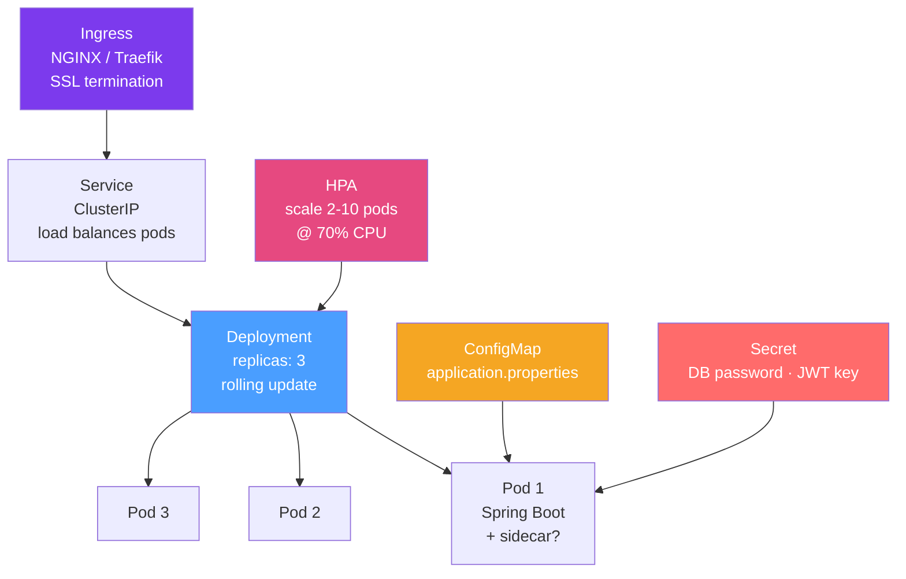

# ☸️ Kubernetes Deployment for Java

> [!abstract] TL;DR
> Deploying Spring Boot to Kubernetes requires: a properly sized Deployment with resource requests/limits, liveness/readiness/startup probes hitting Actuator health endpoints, ConfigMaps and Secrets for externalized configuration, a Horizontal Pod Autoscaler for scaling, and an init container for Flyway/Liquibase schema migrations before the app starts.

## Intuition — analogy FIRST

Kubernetes is like a **smart hotel operations system**. You don't tell the hotel which specific room to put guests in — you specify your requirements (size, floor, amenities) and the system finds available rooms (nodes). If a guest gets sick (pod crash), the system automatically moves them. The hotel concierge (readiness probe) checks if the room is ready before sending guests. The health inspector (liveness probe) periodically checks if the room is still liveable. If the hotel fills up (high CPU/memory), new floors automatically open (HPA scales pods).

---

## How It Works



## Key Concepts / Details

### Complete Deployment YAML

```yaml
apiVersion: apps/v1
kind: Deployment
metadata:
  name: myapp
  namespace: production
  labels:
    app: myapp
    version: "1.5.0"
spec:
  replicas: 3
  selector:
    matchLabels:
      app: myapp
  strategy:
    type: RollingUpdate
    rollingUpdate:
      maxUnavailable: 0      # Never reduce below desired count
      maxSurge: 1            # Allow 1 extra pod during update
  
  template:
    metadata:
      labels:
        app: myapp
    spec:
      serviceAccountName: myapp-sa  # Least-privilege service account
      
      # Init container: run DB migrations before app starts
      initContainers:
        - name: db-migrate
          image: myapp:1.5.0
          command: ["java", "-jar", "/app/app.jar", "--spring.batch.job.enabled=false"]
          env:
            - name: SPRING_PROFILES_ACTIVE
              value: "migration"
          envFrom:
            - secretRef:
                name: myapp-db-secret
      
      containers:
        - name: myapp
          image: myapp:1.5.0
          ports:
            - containerPort: 8080
              name: http
            - containerPort: 8081
              name: management
          
          # Resource constraints — critical for JVM containers
          resources:
            requests:
              memory: "512Mi"    # JVM minimum
              cpu: "250m"        # 0.25 CPU cores
            limits:
              memory: "1Gi"      # JVM max (UseContainerSupport reads this)
              cpu: "1000m"       # 1 CPU core max
          
          env:
            - name: JAVA_OPTS
              value: "-XX:+UseContainerSupport -XX:MaxRAMPercentage=75.0 -XX:+ExitOnOutOfMemoryError"
            - name: SPRING_PROFILES_ACTIVE
              value: "production"
            - name: DB_PASSWORD
              valueFrom:
                secretKeyRef:
                  name: myapp-db-secret
                  key: password
          
          envFrom:
            - configMapRef:
                name: myapp-config
          
          # Startup probe: allow 120s for slow JVM startup
          startupProbe:
            httpGet:
              path: /actuator/health/liveness
              port: management
            failureThreshold: 24   # 24 * 5s = 120s max startup
            periodSeconds: 5
          
          # Liveness: restart if app is deadlocked/stuck
          livenessProbe:
            httpGet:
              path: /actuator/health/liveness
              port: management
            initialDelaySeconds: 0   # startup probe handles delay
            periodSeconds: 10
            failureThreshold: 3
          
          # Readiness: remove from load balancer if not ready
          readinessProbe:
            httpGet:
              path: /actuator/health/readiness
              port: management
            periodSeconds: 5
            failureThreshold: 3
          
          # Graceful shutdown
          lifecycle:
            preStop:
              exec:
                command: ["sleep", "10"]  # Allow load balancer to deregister
```

### ConfigMap for Application Config

```yaml
apiVersion: v1
kind: ConfigMap
metadata:
  name: myapp-config
data:
  SPRING_DATASOURCE_URL: "jdbc:postgresql://postgres-svc:5432/mydb"
  SERVER_PORT: "8080"
  MANAGEMENT_SERVER_PORT: "8081"
  SPRING_JPA_SHOW_SQL: "false"
  LOGGING_LEVEL_ROOT: "INFO"
```

### Service

```yaml
apiVersion: v1
kind: Service
metadata:
  name: myapp-svc
spec:
  selector:
    app: myapp
  ports:
    - name: http
      port: 80
      targetPort: 8080
    - name: management
      port: 8081
      targetPort: 8081
  type: ClusterIP
```

### Horizontal Pod Autoscaler

```yaml
apiVersion: autoscaling/v2
kind: HorizontalPodAutoscaler
metadata:
  name: myapp-hpa
spec:
  scaleTargetRef:
    apiVersion: apps/v1
    kind: Deployment
    name: myapp
  minReplicas: 2
  maxReplicas: 10
  metrics:
    - type: Resource
      resource:
        name: cpu
        target:
          type: Utilization
          averageUtilization: 70
    - type: Resource
      resource:
        name: memory
        target:
          type: Utilization
          averageUtilization: 80
```

### Helm Chart Structure

For parameterised deployments across environments:

```
mychart/
├── Chart.yaml
├── values.yaml          # defaults
├── values-staging.yaml  # staging overrides
├── values-prod.yaml     # production overrides
└── templates/
    ├── deployment.yaml  # uses {{ .Values.image.tag }}
    ├── service.yaml
    ├── configmap.yaml
    ├── secret.yaml
    └── hpa.yaml
```

```yaml
# values.yaml
image:
  repository: myapp
  tag: latest
  pullPolicy: IfNotPresent

replicas: 2
resources:
  requests: {memory: 512Mi, cpu: 250m}
  limits:   {memory: 1Gi,  cpu: 1000m}

autoscaling:
  enabled: true
  minReplicas: 2
  maxReplicas: 10
```

```bash
# Deploy with Helm
helm upgrade --install myapp ./mychart \
  -f values-prod.yaml \
  --set image.tag=1.5.0 \
  --namespace production \
  --create-namespace \
  --wait --timeout 5m
```

### RBAC for Least Privilege

```yaml
apiVersion: v1
kind: ServiceAccount
metadata:
  name: myapp-sa
---
apiVersion: rbac.authorization.k8s.io/v1
kind: Role
metadata:
  name: myapp-role
rules:
  - apiGroups: [""]
    resources: ["configmaps"]
    verbs: ["get", "list"]  # read-only access to ConfigMaps
---
apiVersion: rbac.authorization.k8s.io/v1
kind: RoleBinding
metadata:
  name: myapp-rolebinding
subjects:
  - kind: ServiceAccount
    name: myapp-sa
roleRef:
  kind: Role
  name: myapp-role
  apiGroup: rbac.authorization.k8s.io
```

## Real-World Notes

- **`maxUnavailable: 0`**: The safest rolling update setting for stateful services — never reduces available pods below the desired count during rollout. Add `maxSurge: 1` to allow one extra pod.
- **`preStop` sleep**: The 10s `preStop` sleep gives Kubernetes time to remove the pod from Endpoints before it shuts down — prevents 502 errors during rolling updates.
- **Startup vs liveness probes**: Without `startupProbe`, a slow-starting Spring Boot app (10+ seconds) fails liveness checks and gets restarted in a loop. Startup probe disables liveness until startup succeeds.
- **Init container for migrations**: Running Flyway in an init container ensures the DB schema is ready before any app pods start — prevents startup-time migration conflicts.

## Common Pitfalls

- **No resource limits**: JVM without container limits may read host RAM instead of container RAM → heap sized too large → OOM kill.
- **Same probe for liveness and readiness**: Liveness and readiness serve different purposes. Don't reuse the same endpoint — a temporarily unavailable downstream dependency should fail readiness but not liveness.
- **No `preStop` sleep**: Pod removed from load balancer and terminated simultaneously → in-flight requests get 502s.
- **Hardcoded secrets in ConfigMap**: ConfigMaps are not encrypted. Never put passwords/API keys in ConfigMaps. Use Kubernetes Secrets (base64 encoded, and ideally via Vault agent injector or Sealed Secrets for gitops).

## Related Concepts
- [[Docker_Spring_Boot]] — The container image deployed by Kubernetes
- [[Java_Health_Checks]] — Actuator health endpoints used by K8s probes
- [[CI_CD_Java]] — The pipeline that triggers Kubernetes deployments

## Review Questions
1. What is the difference between `startupProbe`, `livenessProbe`, and `readinessProbe`?
2. Why is `maxUnavailable: 0` the safest rolling update setting?
3. What is the purpose of the `preStop` hook with a `sleep` command?
4. Why should you use an init container for database migrations?
5. What is the risk of not setting `resources.limits` for a Java container?

## Sources
- Kubernetes Deployment documentation: https://kubernetes.io/docs/concepts/workloads/controllers/deployment/
- Spring Boot on Kubernetes: https://docs.spring.io/spring-boot/docs/current/reference/html/deployment.html#deployment.cloud.kubernetes
- Helm documentation: https://helm.sh/docs/

#java #devops #kubernetes #spring-boot #helm
