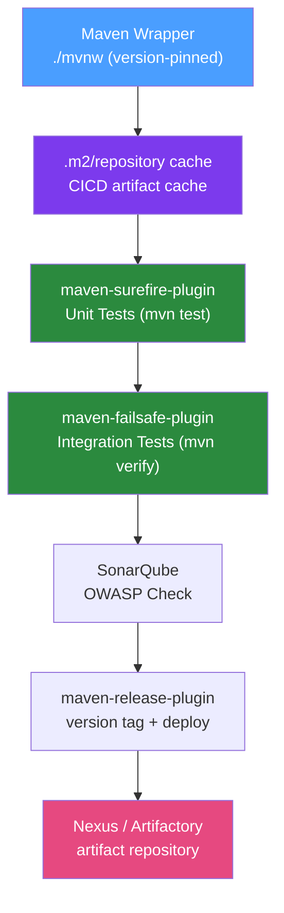

# ⚙️ Maven in CI/CD

> [!abstract] TL;DR
> Maven CI optimisation focuses on three areas: reproducible, noise-free output (`-B --no-transfer-progress`), fast execution (parallel builds, caching, separating test phases), and reliable artifact management (Surefire for unit tests, Failsafe for integration tests, publishing to Nexus/Artifactory). Maven Wrapper (`mvnw`) ensures consistent Maven versions across developers and CI agents.

## Intuition — analogy FIRST

Maven in CI is like running a **professional commercial kitchen** vs a home cook. At home you improvise — grab whatever's in the fridge, estimate measurements. A commercial kitchen (CI pipeline) needs reproducibility: the same recipe, same tools, same timings, every time — regardless of who's cooking (which CI agent). `mvnw` is the standardised recipe card format. `-B` batch mode is the kitchen rule against playing music (no interactive prompts). Dependency caching is the mise en place — all ingredients prepped before service starts so nothing blocks during the rush.

---

## How It Works



## Key Concepts / Details

### Essential CI Flags

```bash
# The CI standard command prefix:
./mvnw \
  --batch-mode \              # -B: no interactive prompts, no ANSI colors
  --no-transfer-progress \    # suppress download progress bars (cleaner logs)
  --fail-at-end \             # -fae: run all modules, collect all failures
  -T 4 \                      # parallel build with 4 threads (or 1C for 1 per CPU)
  clean verify
```

Flag reference:

| Flag | Short | Purpose |
|------|-------|---------|
| `--batch-mode` | `-B` | Disable interactive mode, suppress colors |
| `--no-transfer-progress` | | Suppress artifact download progress bars |
| `--fail-at-end` | `-fae` | Continue past failures to report all issues |
| `--threads 4` | `-T 4` | Parallel module builds |
| `--offline` | `-o` | Use only cached artifacts (if cache is warm) |
| `--update-snapshots` | `-U` | Force check for newer SNAPSHOT versions |

### Maven Wrapper

Always use `mvnw` in CI — pins the Maven version in the project:

```bash
# Generate Maven Wrapper for a specific version
./mvnw wrapper:wrapper -Dmaven=3.9.6

# Commit generated files:
git add .mvn/ mvnw mvnw.cmd
```

The wrapper downloads the exact Maven version specified in `.mvn/wrapper/maven-wrapper.properties` — CI agents don't need Maven pre-installed.

### Surefire (Unit Tests) vs Failsafe (Integration Tests)

Separation is critical: unit tests must not spin up Spring contexts, DBs, or containers.

```xml
<plugin>
    <groupId>org.apache.maven.plugins</groupId>
    <artifactId>maven-surefire-plugin</artifactId>
    <version>3.2.5</version>
    <configuration>
        <!-- Unit tests: no @SpringBootTest, no Testcontainers -->
        <excludes>
            <exclude>**/*IT.java</exclude>
            <exclude>**/*IntegrationTest.java</exclude>
        </excludes>
        <forkCount>2</forkCount>           <!-- parallel fork for speed -->
        <reuseForks>true</reuseForks>
    </configuration>
</plugin>

<plugin>
    <groupId>org.apache.maven.plugins</groupId>
    <artifactId>maven-failsafe-plugin</artifactId>
    <version>3.2.5</version>
    <configuration>
        <!-- Integration tests: *IT.java, *IntegrationTest.java -->
        <includes>
            <include>**/*IT.java</include>
            <include>**/*IntegrationTest.java</include>
        </includes>
    </configuration>
    <executions>
        <execution>
            <goals>
                <goal>integration-test</goal>
                <goal>verify</goal>  <!-- fails build if integration tests fail -->
            </goals>
        </execution>
    </executions>
</plugin>
```

Phase mapping:
- `mvn test` — runs Surefire (unit tests) only
- `mvn verify` — runs Surefire + Failsafe (unit + integration tests)
- `mvn package -DskipTests` — package without any tests (use only in Docker build stages)

### Dependency Vulnerability Scanning

```xml
<plugin>
    <groupId>org.owasp</groupId>
    <artifactId>dependency-check-maven</artifactId>
    <version>9.0.9</version>
    <configuration>
        <failBuildOnCVSS>7</failBuildOnCVSS>  <!-- fail on High/Critical CVEs -->
        <suppressionFile>suppression.xml</suppressionFile>
    </configuration>
    <executions>
        <execution>
            <goals><goal>check</goal></goals>
        </execution>
    </executions>
</plugin>
```

### SonarQube Integration

```xml
<plugin>
    <groupId>org.sonarsource.scanner.maven</groupId>
    <artifactId>sonar-maven-plugin</artifactId>
    <version>3.11.0.3922</version>
</plugin>
```

```bash
./mvnw sonar:sonar \
  -Dsonar.host.url=https://sonarqube.company.com \
  -Dsonar.login=${SONAR_TOKEN} \
  -Dsonar.projectKey=my-service \
  -Dsonar.coverage.jacoco.xmlReportPaths=target/site/jacoco/jacoco.xml
```

### Dependency Version Management

```xml
<!-- Check for outdated dependencies -->
<plugin>
    <groupId>org.codehaus.mojo</groupId>
    <artifactId>versions-maven-plugin</artifactId>
    <version>2.16.2</version>
</plugin>
```

```bash
# Report outdated versions without modifying pom.xml
./mvnw versions:display-dependency-updates versions:display-plugin-updates
```

### Publishing to Nexus/Artifactory

```xml
<!-- In pom.xml -->
<distributionManagement>
    <repository>
        <id>nexus-releases</id>
        <url>https://nexus.company.com/repository/maven-releases/</url>
    </repository>
    <snapshotRepository>
        <id>nexus-snapshots</id>
        <url>https://nexus.company.com/repository/maven-snapshots/</url>
    </snapshotRepository>
</distributionManagement>
```

```bash
# In CI (after tests pass):
./mvnw deploy -DskipTests \
  -s .mvn/settings.xml  # settings.xml with nexus credentials from env vars
```

`~/.m2/settings.xml` (or project-local):

```xml
<settings>
  <servers>
    <server>
      <id>nexus-releases</id>
      <username>${env.NEXUS_USER}</username>
      <password>${env.NEXUS_PASSWORD}</password>
    </server>
  </servers>
</settings>
```

### Release Automation

```bash
# Automated release (bumps version, creates git tag, deploys)
./mvnw release:prepare release:perform \
  -Darguments="-DskipTests" \
  -DreleaseVersion=1.5.0 \
  -DdevelopmentVersion=1.6.0-SNAPSHOT \
  -Dtag=v1.5.0
```

## Real-World Notes

- **BOM (Bill of Materials)**: Use Spring Boot BOM for dependency management — avoids version conflicts across Spring ecosystem.
- **Incremental builds with `-am` and `-pl`**: In a multi-module project, build only changed modules: `./mvnw -pl changed-module -am test`.
- **CI environment settings**: Set `CI=true` environment variable — many tools (Maven Wrapper, JUnit Platform) check this to adjust behaviour.
- **Parallel forks cautiously**: `forkCount=2` doubles memory usage. With 4 parallel forks and Testcontainers, you may hit Docker socket limits.

## Common Pitfalls

- **No Maven Wrapper**: Different CI agents have different Maven versions installed → non-reproducible builds. Always commit `mvnw`.
- **`-DskipTests` everywhere**: If tests are skipped in the package phase and nowhere else runs them, your CI pipeline is a rubber stamp. Only skip in Docker build stages after tests already ran.
- **Mixing unit and integration tests**: Slow Testcontainers startup in unit tests destroys developer feedback speed. Enforce the naming convention and Surefire/Failsafe split.
- **Not caching `.m2`**: Re-downloading 300MB of dependencies on every CI run wastes 3-5 minutes. Always configure Maven repository caching.

## Related Concepts
- [[CI_CD_Java]] — The pipeline that orchestrates Maven commands
- [[Docker_Spring_Boot]] — Maven's `spring-boot:build-image` goal for Docker
- [[Kubernetes_Deployment_Java]] — What happens after Maven builds the artifact

## Review Questions
1. What is the difference between `maven-surefire-plugin` and `maven-failsafe-plugin`?
2. What Maven phases do `mvn test` and `mvn verify` execute?
3. Why should you always use `mvnw` instead of a system-installed `mvn` in CI?
4. How do you publish a SNAPSHOT artifact to Nexus from a CI pipeline securely?
5. What does `-fae` do and when is it useful in CI?

## Sources
- Maven Surefire Plugin: https://maven.apache.org/surefire/maven-surefire-plugin/
- Maven Failsafe Plugin: https://maven.apache.org/surefire/maven-failsafe-plugin/
- Maven in CI/CD — OWASP Dependency Check: https://jeremylong.github.io/DependencyCheck/

#java #devops #maven #cicd
