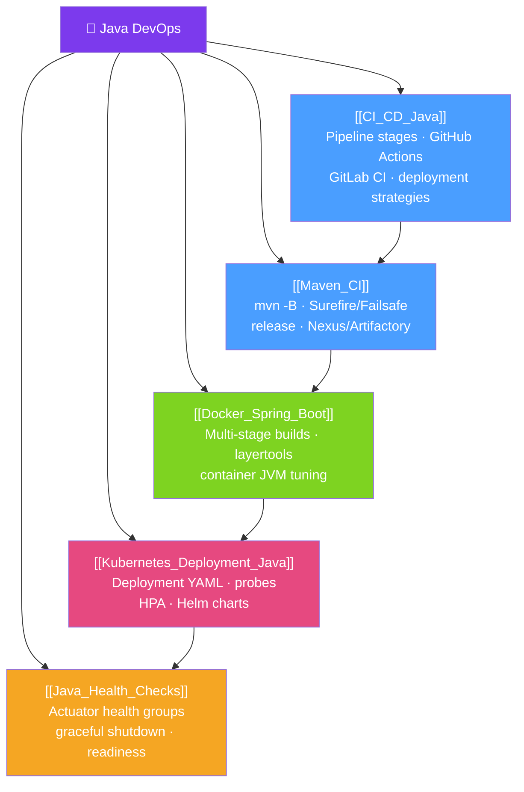

# 🗺️ Java DevOps — Map of Content

> [!abstract] What This Section Covers
> Modern Java applications live and die by their delivery pipeline. This section covers the full DevOps lifecycle for Java projects: CI/CD pipelines (GitHub Actions, GitLab CI), Maven in CI environments, Dockerizing Spring Boot applications properly, deploying to Kubernetes with production-grade health checks, and the Spring Boot Actuator health check patterns that make zero-downtime deployments possible. A Java engineer who can't ship confidently is only half effective.

## Concept Map

## Learning Path
1. [[CI_CD_Java]] — Understand the pipeline stages before optimising individual steps.
2. [[Maven_CI]] — Tune Maven for reliable, fast CI execution.
3. [[Docker_Spring_Boot]] — Package your Spring Boot app efficiently for container deployment.
4. [[Kubernetes_Deployment_Java]] — Deploy and scale the containerised app on Kubernetes.
5. [[Java_Health_Checks]] — Configure health, readiness, and graceful shutdown for zero-downtime.

## All Notes at a Glance
| Note | Difficulty | What You'll Learn |
|------|------------|-------------------|
| [[CI_CD_Java]] | Intermediate | Pipeline stages, GitHub Actions YAML, deployment strategies, feature flags |
| [[Maven_CI]] | Intermediate | Batch mode, Surefire/Failsafe, Maven Wrapper, Nexus publishing |
| [[Docker_Spring_Boot]] | Intermediate | Multi-stage Dockerfile, Spring Boot layertools, container JVM flags |
| [[Kubernetes_Deployment_Java]] | Advanced | Deployment YAML, probes, HPA, Helm, init containers for migrations |
| [[Java_Health_Checks]] | Intermediate | Actuator health groups, custom indicators, graceful shutdown configuration |

## Key Questions This Section Answers
- What are the stages of a production CI/CD pipeline for a Java microservice?
- How do you cache Maven dependencies in GitHub Actions?
- How do you build a minimal Docker image for Spring Boot using layertools?
- What JVM flags should you always set when running Java in containers?
- How do you configure liveness vs readiness probes for a Spring Boot app in Kubernetes?
- How does Spring Boot graceful shutdown work?

## Related Sections
- [[_MOC_Java_Master|↑ Java Master MOC]]
- [[_MOC_Performance_Advanced|→ Java Performance Advanced]] — performance tuning complements DevOps
- [[_MOC_Java_Ecosystem|→ Java Ecosystem]] — alternative frameworks (Quarkus, Micronaut) have native image DevOps implications

#java #devops #MOC #java-devops
