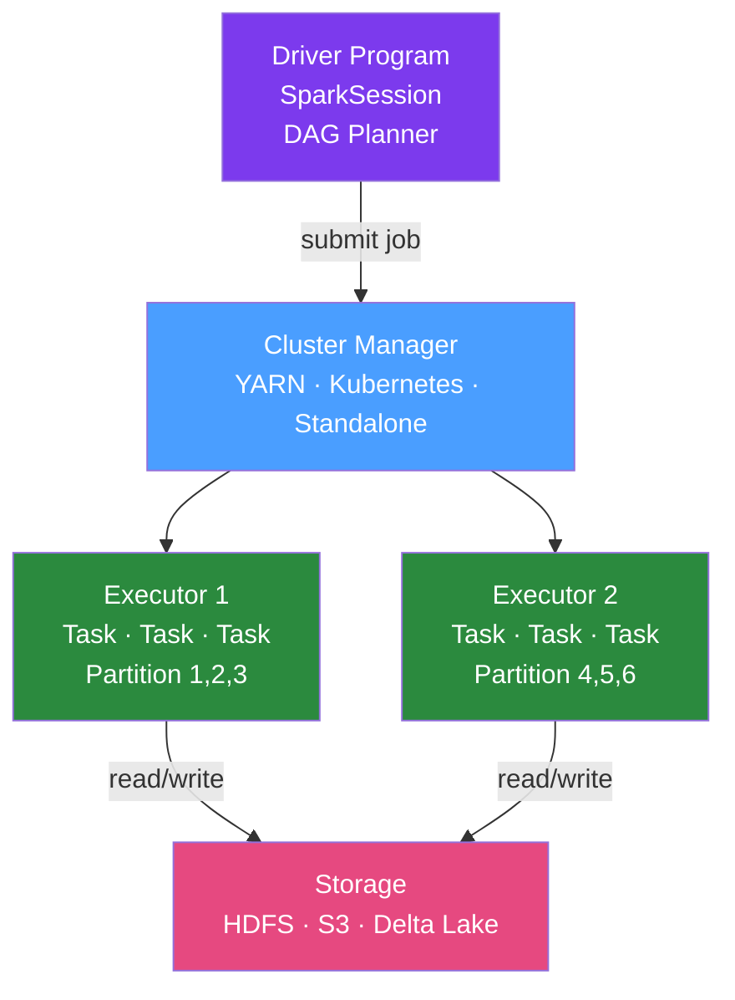

# ⚡ Apache Spark with Java

> [!abstract] TL;DR
> Apache Spark is the dominant distributed data processing engine. The Java API provides three abstractions: **RDD** (resilient distributed dataset — low-level, avoid in new code), **DataFrame** (tabular with schema, Python/SQL-friendly), and **Dataset\<T\>** (type-safe Java API over DataFrame). Use Spark when data exceeds single-machine RAM (typically > 10GB) or when you need distributed computation over a cluster.

## Intuition — analogy FIRST

Apache Spark is like a **distributed postal sorting facility with thousands of clerks**. You hand over a massive pile of mail (data), describe the sorting rules (transformations), and Spark figures out how to divide the work across all clerks (executors) working in parallel. Unlike MapReduce (old approach — each clerk writes results to files before the next clerk starts), Spark keeps intermediate results in memory — like the clerks passing sorted batches directly to the next station rather than putting them back in trucks. Dataset is the modern API: you say "these are letters of type `Order`" and the compiler checks you're sorting them correctly.

---

## How It Works



## Key Concepts / Details

### SparkSession — Entry Point

```java
SparkSession spark = SparkSession.builder()
        .appName("OrderProcessor")
        .master("local[4]")           // local mode: 4 threads (dev/test)
        // .master("yarn")            // YARN cluster
        .config("spark.sql.shuffle.partitions", "200")
        .config("spark.executor.memory", "4g")
        .config("spark.executor.cores", "2")
        .getOrCreate();
```

### DataFrame Operations (Untyped)

```java
// Load data
Dataset<Row> orders = spark.read()
        .option("header", "true")
        .option("inferSchema", "true")
        .csv("s3://mybucket/orders/*.csv");

// Schema
orders.printSchema();

// Transformations (lazy — nothing runs yet)
Dataset<Row> result = orders
        .filter(col("status").equalTo("COMPLETED"))
        .groupBy(col("customer_id"))
        .agg(
                sum("amount").as("total_spent"),
                count("*").as("order_count"),
                max("created_at").as("last_order_date")
        )
        .filter(col("total_spent").gt(1000))
        .orderBy(col("total_spent").desc());

// Action — triggers computation
result.show(20);
result.write()
        .mode(SaveMode.Overwrite)
        .partitionBy("region")
        .parquet("s3://mybucket/output/customer-summary/");
```

### Dataset\<T\> — Type-Safe Java API

```java
// Define Java bean for typed operations
public class Order implements Serializable {
    private String id;
    private String customerId;
    private BigDecimal amount;
    private String status;
    // getters/setters required by Spark
}

// Encoder for Java bean
Encoder<Order> orderEncoder = Encoders.bean(Order.class);

// Typed Dataset
Dataset<Order> typedOrders = spark.read()
        .parquet("s3://bucket/orders/")
        .as(orderEncoder);

// Type-safe operations (compile-time checking!)
Dataset<Order> completed = typedOrders
        .filter((FilterFunction<Order>) o -> o.getStatus().equals("COMPLETED"));

// Map to another type
Dataset<CustomerSummary> summaries = typedOrders
        .groupByKey((MapFunction<Order, String>) Order::getCustomerId, Encoders.STRING())
        .mapGroups((customerId, orders, sink) -> {
            CustomerSummary summary = new CustomerSummary();
            summary.setCustomerId(customerId);
            orders.forEachRemaining(o -> summary.addOrder(o));
            sink.call(summary);
        }, Encoders.bean(CustomerSummary.class));
```

### Spark SQL

```java
// Register temp view for SQL
orders.createOrReplaceTempView("orders");

Dataset<Row> sqlResult = spark.sql("""
        SELECT customer_id,
               SUM(amount) as total_spent,
               COUNT(*) as order_count
        FROM orders
        WHERE status = 'COMPLETED'
          AND created_at >= '2026-01-01'
        GROUP BY customer_id
        HAVING SUM(amount) > 1000
        ORDER BY total_spent DESC
        """);
```

### Broadcast Joins — Avoiding Shuffle

When one table is small (< 100MB), broadcast it to all executors to avoid expensive shuffle:

```java
import static org.apache.spark.sql.functions.*;

Dataset<Row> smallLookup = spark.read().json("s3://bucket/country-codes.json");

Dataset<Row> result = orders.join(
        broadcast(smallLookup),  // broadcast hint
        orders.col("country_code").equalTo(smallLookup.col("code")),
        "left"
);
```

### Caching and Persistence

```java
// Cache in memory (default)
Dataset<Row> frequentlyUsed = expensiveQuery.cache();
frequentlyUsed.count();  // triggers cache population

// Custom persistence level
import org.apache.spark.storage.StorageLevel;
dataset.persist(StorageLevel.MEMORY_AND_DISK());

// Release cache
frequentlyUsed.unpersist();
```

Storage levels: `MEMORY_ONLY`, `MEMORY_AND_DISK`, `DISK_ONLY`, `MEMORY_ONLY_SER` (serialized, slower but smaller).

### Performance Tuning

```java
// Partition tuning
// Read with target partitions
spark.read().option("numPartitions", 200).jdbc(url, "orders", properties);

// Repartition for shuffle
Dataset<Row> repartitioned = dataset.repartition(200, col("customer_id"));

// Coalesce (reduce partitions without full shuffle)
dataset.coalesce(10).write().parquet("output/");

// Explain plan (equivalent to SQL EXPLAIN ANALYZE)
result.explain("formatted");  // shows physical plan, estimated rows, costs
```

### Common Spark Tuning Parameters

| Parameter | Default | Recommendation |
|-----------|---------|----------------|
| `spark.sql.shuffle.partitions` | 200 | 2-3x number of cores for large shuffles |
| `spark.executor.memory` | 1g | Size to data volume per executor |
| `spark.executor.cores` | 1 | 2-4 per executor (avoid I/O contention) |
| `spark.sql.autoBroadcastJoinThreshold` | 10MB | Increase to 100MB if joins are slow |
| `spark.default.parallelism` | 2× executors | Match to data size |

## Real-World Notes

- **Spark on Kubernetes**: Modern Spark runs natively on K8s (`spark-submit --master k8s://...`). Each executor is a pod — enables auto-scaling and fits into existing K8s infrastructure.
- **Delta Lake**: Open-source storage layer adding ACID transactions, time travel, and schema enforcement to Parquet on S3/HDFS. Standard for data lakehouses.
- **Java vs Scala API**: Spark is written in Scala. The Java API wraps Scala types, requiring verbose lambda syntax. For new Spark projects with Java teams, consider PySpark for interactive work + Java/Scala for production ETL.
- **Adaptive Query Execution (AQE)**: Spark 3.0+ enables AQE by default — dynamically adjusts shuffle partitions, converts sort-merge joins to broadcast joins based on runtime statistics.

## Common Pitfalls

- **Using RDD instead of DataFrame**: RDDs have no query optimization. Always use DataFrame/Dataset for SQL-style operations.
- **Calling `count()` in a loop**: Each `count()` triggers a full scan. Materialize results once with `.cache()` then reuse.
- **Data skew in joins**: If one `customer_id` has 90% of orders, one partition is 90x larger — that executor is the bottleneck. Use salting to distribute skewed keys.
- **Not unpersisting cached datasets**: Cached datasets consume executor memory permanently until `unpersist()` or Spark restarts.

## Related Concepts
- [[Hadoop_Java]] — Hadoop ecosystem that Spark built on top of
- [[Big_Data_Patterns]] — Lambda/Kappa architecture using Spark
- [[Java_Streams_Advanced]] — Java's in-process alternative

## Review Questions
1. What are the three Spark data abstractions and how do they differ?
2. When should you use `broadcast()` in a Spark join?
3. What does `cache()` do and when should you call `unpersist()`?
4. What is the `spark.sql.shuffle.partitions` parameter and how do you tune it?
5. What is the difference between `repartition()` and `coalesce()`?

## Sources
- Apache Spark Java API: https://spark.apache.org/docs/latest/api/java/
- Spark Tuning Guide: https://spark.apache.org/docs/latest/tuning.html
- Delta Lake documentation: https://docs.delta.io/

#java #spark #big-data #distributed
