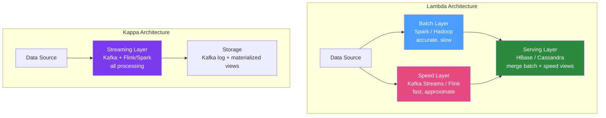

# 📐 Big Data Patterns

> [!abstract] TL;DR
> Big data systems require architectural patterns beyond simple ETL. The **Lambda Architecture** (batch + speed + serving layers) handles both historical and real-time data but has operational complexity. The **Kappa Architecture** simplifies by using only streaming. The **Data Lakehouse** combines data lake flexibility with warehouse performance using open table formats (Delta Lake, Apache Iceberg). Partitioning strategies determine query performance at scale.

## Intuition — analogy FIRST

Big data architecture is like a **city newspaper's publishing operation**. Lambda Architecture is the classic model: reporters file stories (streaming layer — fast but incomplete), typesetters set the next day's full edition overnight (batch layer — accurate, slow), and readers get both the morning edition AND breaking news alerts. Kappa Architecture says: what if breaking news alerts are so good that you don't need the morning edition? Everything becomes streaming. The Data Lakehouse is the modern newsroom: one unified system (like a digital-first newsroom) that serves both the raw wire feeds (data lake) and the polished edition (warehouse) from a single storage layer.

---

## How It Works



## Key Concepts / Details

### Lambda Architecture

**Three layers**:

1. **Batch Layer**: Reprocesses all historical data periodically (daily/weekly). Produces accurate "batch views" using Spark/Hadoop. Source of truth — tolerates latency.

2. **Speed Layer**: Processes only recent data (since last batch). Produces "real-time views" approximation. Compensates for batch layer latency.

3. **Serving Layer**: Merges batch and speed views to answer queries. Returns accurate results for old data, approximate+fast for recent data.

**Pros**: Accurate historical + low-latency real-time; fault tolerant (reprocess from source if speed layer fails).
**Cons**: Two codebases (batch and streaming), operational complexity, eventual consistency, storage duplication.

### Kappa Architecture

**Single streaming layer**: All data flows through a streaming system. Historical data is replayed from Kafka (long retention) or object storage. No separate batch layer.

```
Raw events → Kafka (∞ retention) → Flink/Spark Streaming → Materialized views
```

**Pros**: One codebase, simpler operations, consistent processing logic.
**Cons**: Reprocessing requires replaying entire Kafka topic (slow for years of data), Kafka retention costs, streaming frameworks less mature for complex batch queries.

**When to choose**:
- Lambda: When batch accuracy is critical and you need different processing semantics for historical vs real-time
- Kappa: When streaming semantics work for all cases and operational simplicity matters

### Data Lakehouse

Combines data lake (raw, flexible storage on S3/GCS) with warehouse (ACID, query performance) using open table formats:

| Format | Creator | Key Feature |
|--------|---------|-------------|
| **Delta Lake** | Databricks | ACID transactions on Parquet, time travel, Merge/Upsert |
| **Apache Iceberg** | Netflix/Apple | Table versioning, partition evolution, hidden partitioning |
| **Apache Hudi** | Uber | Upsert-heavy workloads, incremental queries |

```java
// Delta Lake with Spark Java API
SparkSession spark = SparkSession.builder()
        .config("spark.jars.packages", "io.delta:delta-core_2.12:3.0.0")
        .config("spark.sql.extensions", "io.delta.sql.DeltaSparkSessionExtension")
        .getOrCreate();

// Write Delta table
orders.write()
        .format("delta")
        .mode(SaveMode.Append)
        .save("s3://bucket/delta/orders/");

// ACID upsert (Merge)
DeltaTable deltaTable = DeltaTable.forPath(spark, "s3://bucket/delta/orders/");
Dataset<Row> newOrders = spark.read().parquet("s3://bucket/staging/orders/");

deltaTable.as("existing")
        .merge(newOrders.as("updates"), "existing.order_id = updates.order_id")
        .whenMatched().updateAll()
        .whenNotMatched().insertAll()
        .execute();

// Time travel — query historical version
Dataset<Row> yesterday = spark.read()
        .format("delta")
        .option("timestampAsOf", "2026-01-14")
        .load("s3://bucket/delta/orders/");
```

### Partitioning Strategies

Partitioning determines which files are read for a query — the single most important performance decision:

| Strategy | Partition Key | Good For | Bad For |
|----------|--------------|---------|---------|
| **By date** | `year/month/day` | Time-range queries, retention | Point lookups |
| **By entity** | `customer_id` | Per-customer analytics | Cross-customer aggregations |
| **By hash** | `hash(id) % N` | Even distribution, avoid skew | Range scans |
| **Z-ordering** | Multi-column | Multi-dimensional filters (Delta/Iceberg) | Single-column filters |

```python
# Partition by date (most common)
spark.write()
     .partitionBy("year", "month", "day")
     .parquet("s3://bucket/events/")

# Partition pruning: query only reads relevant partitions
spark.sql("SELECT * FROM events WHERE year=2026 AND month=1")
# Spark reads only s3://bucket/events/year=2026/month=1/
```

### Columnar Storage Formats

| Format | Encoding | Splittable | Schema | Best For |
|--------|----------|-----------|--------|---------|
| **Parquet** | Columnar | Yes | Embedded | Analytics, wide tables, Spark |
| **ORC** | Columnar | Yes | Embedded | Hive queries, better compression |
| **Avro** | Row-based | Yes | External (Schema Registry) | Kafka messages, row-level access |
| **CSV/JSON** | Row-based | Yes | External | Human-readable, interchange |

Parquet advantage: reading only 5 of 100 columns reads 5% of data (columnar projection pushdown).

### Small File Problem and Compaction

```java
// Problem: many small files created by streaming writes
// Solution: periodic compaction job

// Spark: coalesce small files
spark.read().parquet("s3://bucket/events/year=2026/month=1/")
     .repartition(10)  // consolidate to 10 files
     .write()
     .mode(SaveMode.Overwrite)
     .parquet("s3://bucket/events/year=2026/month=1/");

// Delta Lake: automatic file compaction
spark.sql("OPTIMIZE delta.`s3://bucket/delta/events/`");

// Delta VACUUM: remove old files after time travel window
spark.sql("VACUUM delta.`s3://bucket/delta/events/` RETAIN 168 HOURS");
```

### Stream-Table Duality (Kafka)

Every Kafka topic (stream) can be viewed as a table (current state) and vice versa:

- **Stream → Table**: Kafka topic + Kafka Streams `KTable` (aggregated state)
- **Table → Stream**: CDC (Debezium) converts DB table to Kafka stream of changes

This duality is the foundation of the Kappa Architecture and event sourcing patterns.

## Real-World Notes

- **Data Mesh**: Modern take on data ownership — each domain team owns its data products, published via standardised APIs. Counters the "data lake swamp" anti-pattern where central team can't keep up with all data needs.
- **Query engines**: Trino/Presto and Athena (AWS) can query Parquet/ORC on S3 directly — no cluster needed. Ideal for ad-hoc analytics without a Spark cluster.
- **Medallion architecture**: Bronze (raw, immutable), Silver (cleaned, deduplicated), Gold (business-level aggregates) — popularised by Databricks as a pragmatic pipeline architecture.

## Common Pitfalls

- **Lambda architecture complexity**: The two-codebase problem is real. Teams end up with subtle inconsistencies between batch and streaming results. Kappa is often simpler in practice.
- **No partitioning strategy**: Unpartitioned tables require full scans for all queries. Every large table needs a partitioning strategy from day 1.
- **Ignoring compaction**: Streaming writes create thousands of small files over time. Without scheduled compaction, query performance degrades severely.
- **Choosing format without considering use case**: CSV for 10TB of data requires a full scan for every query. Always use columnar formats (Parquet/ORC) for analytics.

## Related Concepts
- [[Apache_Spark_Java]] — Batch and streaming processing for these architectures
- [[Data_Pipeline_Java]] — The pipelines that feed these architectures
- [[Hadoop_Java]] — HDFS as the storage layer for Lambda architecture

## Review Questions
1. What are the three layers of Lambda Architecture and what does each do?
2. What is the main advantage of Kappa Architecture over Lambda?
3. What is the Data Lakehouse and how does it differ from a data lake?
4. Why does columnar storage (Parquet) improve analytics query performance?
5. What is the small file problem and how do you address it?

## Sources
- "Big Data" by Nathan Marz (Lambda Architecture inventor)
- Delta Lake documentation: https://docs.delta.io/
- Apache Iceberg documentation: https://iceberg.apache.org/docs/

#java #big-data #lambda-architecture #kappa #data-lakehouse
