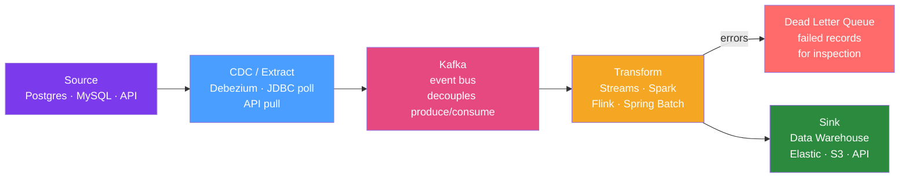

# 🔄 Data Pipeline Patterns in Java

> [!abstract] TL;DR
> Data pipelines move, transform, and load data between systems reliably. Key patterns: ETL (extract-transform-load) vs ELT (extract-load-transform in the warehouse), Change Data Capture (CDC) with Debezium to capture DB changes as Kafka events, dead-letter queues for failed records, idempotency for safe replay, and schema evolution with Avro/Protobuf.

## Intuition — analogy FIRST

A data pipeline is like a **city's water distribution network**. Water (data) is extracted from the source (reservoir/database), treated (transformed/filtered), and delivered to consumers (analytics, downstream services). The treatment plant (pipeline) must handle: contaminated input (bad data → dead-letter queue), pipe breaks (transient failures → retry), demand spikes (backpressure), and infrastructure changes (schema evolution — like upgrading old pipes without stopping water flow). CDC (Change Data Capture) is like adding pressure sensors to the pipes at the source — instead of pumping all the water periodically, you only ship new water as it arrives.

---

## How It Works



## Key Concepts / Details

### ETL vs ELT

| Aspect | ETL (Extract-Transform-Load) | ELT (Extract-Load-Transform) |
|--------|------------------------------|------------------------------|
| Transform location | During pipeline (before load) | In the warehouse after load |
| Tools | Spark, Spring Batch, Talend | dbt, Snowflake, BigQuery |
| Schema | Structured output required | Flexible — raw data stored |
| When | Data quality/compliance rules | Analytics, data exploration |
| Example | Transform orders CSV → clean fact table | Load raw Kafka events → warehouse → dbt models |

### Change Data Capture with Debezium

CDC captures row-level changes from DB transaction logs without modifying the source:

```yaml
# Debezium PostgreSQL Connector config (Kafka Connect)
{
  "name": "postgres-source",
  "config": {
    "connector.class": "io.debezium.connector.postgresql.PostgresConnector",
    "database.hostname": "postgres",
    "database.port": "5432",
    "database.user": "debezium",
    "database.password": "dbz",
    "database.dbname": "orders",
    "plugin.name": "pgoutput",
    "topic.prefix": "myapp",
    "table.include.list": "public.orders,public.customers",
    "transforms": "route",
    "transforms.route.type": "org.apache.kafka.connect.transforms.ReplaceField$Value"
  }
}
```

Debezium produces Kafka events for each change:

```json
{
  "op": "u",       // u=update, c=create, d=delete, r=read (snapshot)
  "before": {"id": "123", "status": "PENDING"},
  "after":  {"id": "123", "status": "COMPLETED"},
  "source": {"table": "orders", "lsn": 1234567, "ts_ms": 1706266800000}
}
```

### Consuming CDC Events in Spring Boot

```java
@Component
@KafkaListener(topics = "myapp.public.orders", groupId = "order-processor")
public class OrderChangeEventConsumer {
    
    @KafkaHandler
    public void handle(ConsumerRecord<String, String> record) throws Exception {
        JsonNode event = objectMapper.readTree(record.value());
        String operation = event.get("op").asText();
        
        switch (operation) {
            case "c", "u" -> {
                JsonNode after = event.get("after");
                Order order = objectMapper.treeToValue(after, Order.class);
                orderProjectionService.upsert(order);
            }
            case "d" -> {
                JsonNode before = event.get("before");
                String orderId = before.get("id").asText();
                orderProjectionService.markDeleted(orderId);
            }
        }
    }
}
```

### Dead Letter Queue Pattern

```java
@Bean
public ConsumerFactory<String, String> consumerFactory() {
    Map<String, Object> config = Map.of(
            ConsumerConfig.BOOTSTRAP_SERVERS_CONFIG, "kafka:9092",
            ConsumerConfig.GROUP_ID_CONFIG, "order-processor",
            ErrorHandlingDeserializer.VALUE_DESERIALIZER_CLASS, JsonDeserializer.class
    );
    return new DefaultKafkaConsumerFactory<>(config);
}

@Bean
public ConcurrentKafkaListenerContainerFactory<String, String> kafkaListenerContainerFactory(
        ConsumerFactory<String, String> cf,
        KafkaTemplate<String, String> kafkaTemplate) {
    
    var factory = new ConcurrentKafkaListenerContainerFactory<String, String>();
    factory.setConsumerFactory(cf);
    
    // Dead letter topic on failure
    factory.setCommonErrorHandler(new DefaultErrorHandler(
            new DeadLetterPublishingRecoverer(kafkaTemplate,
                    (record, ex) -> new TopicPartition(
                            record.topic() + ".DLT",  // dead-letter topic
                            record.partition())),
            new FixedBackOff(1000L, 3)  // 3 retries with 1s delay
    ));
    
    return factory;
}
```

### Idempotency — Safe Replay

Pipeline records must be processable multiple times with the same result (at-least-once delivery):

```java
@Service
public class IdempotentOrderProcessor {
    
    private final OrderRepository repository;
    private final ProcessedEventRepository processedEvents;
    
    @Transactional
    public void process(String eventId, Order order) {
        // Check if already processed
        if (processedEvents.existsById(eventId)) {
            log.info("Duplicate event {}, skipping", eventId);
            return;
        }
        
        // Process
        repository.save(order);
        
        // Mark as processed (within same transaction)
        processedEvents.save(new ProcessedEvent(eventId, LocalDateTime.now()));
    }
}

// Alternative: use database unique constraint on event ID in target table
// INSERT INTO orders (...) ON CONFLICT (event_id) DO NOTHING;
```

### Schema Evolution with Avro

```java
// Producer — serializes with schema
@Bean
public ProducerFactory<String, OrderEvent> producerFactory(SchemaRegistryClient schemaRegistry) {
    return new DefaultKafkaProducerFactory<>(Map.of(
            ProducerConfig.BOOTSTRAP_SERVERS_CONFIG, "kafka:9092",
            ProducerConfig.VALUE_SERIALIZER_CLASS_CONFIG, KafkaAvroSerializer.class,
            "schema.registry.url", "http://schema-registry:8081"
    ));
}

// Avro schema evolution rules (backward compatibility):
// - Add optional field with default: OK (old consumers ignore it)
// - Remove field: OK (consumers treat missing as default)
// - Rename field: NOT OK without alias
// - Change type: NOT OK (int → long is incompatible)
```

Schema Registry enforces compatibility: `BACKWARD` (new schema reads old data), `FORWARD` (old schema reads new data), `FULL` (both).

### Backpressure in Pipelines

```java
// Kafka consumer backpressure: pause when downstream is slow
@Component
public class BackpressureAwareConsumer {
    
    private final MessageListenerContainer container;
    private final SomeSlowDownstreamService downstream;
    
    @KafkaListener(topics = "orders")
    public void consume(ConsumerRecord<String, Order> record,
                        Acknowledgment ack) {
        try {
            downstream.process(record.value());
            ack.acknowledge();
        } catch (DownstreamOverloadedException e) {
            // Pause consumer — let Kafka buffer
            container.pause();
            // Schedule resume after downstream recovers
            scheduler.schedule(container::resume, 30, TimeUnit.SECONDS);
        }
    }
}
```

## Real-World Notes

- **Outbox pattern**: To reliably publish events when a DB write succeeds, write the event to an `outbox` table in the same transaction, then Debezium streams it to Kafka. Avoids dual-write inconsistency (DB write succeeds but Kafka publish fails).
- **Data quality**: Add data quality checks (Great Expectations, Deequ for Spark) at pipeline entry points. Fail fast on quality violations rather than propagating bad data.
- **Monitoring pipeline lag**: Use Kafka consumer group lag (via `kafka-consumer-groups.sh --describe`) as the primary pipeline health metric. Alert when lag grows.

## Common Pitfalls

- **Non-idempotent writes causing duplicates**: At-least-once delivery (Kafka default) means records can be processed twice. Design writes as upserts or use idempotency keys.
- **Schema drift without registry**: Without a schema registry, producers add fields that break consumers. Enforce schema validation at the producer level.
- **Missing dead-letter handling**: Failed records silently lost is worse than pipeline failure. Always route failures to DLT with enough context to understand why.
- **Ordering guarantee assumptions**: Kafka only guarantees order within a partition. If your pipeline assumes total order, you have a bug waiting to happen.

## Related Concepts
- [[Apache_Spark_Java]] — Batch processing stage in ETL pipelines
- [[Big_Data_Patterns]] — Architecture patterns (Lambda, Kappa) using pipelines
- [[Hadoop_Java]] — HDFS/Hive as pipeline sink

## Review Questions
1. What is the difference between ETL and ELT? When do you choose each?
2. How does Debezium capture changes from a PostgreSQL database?
3. What is the Outbox pattern and what problem does it solve?
4. Why does at-least-once delivery require idempotent consumers?
5. How does a schema registry enforce schema evolution compatibility?

## Sources
- Debezium documentation: https://debezium.io/documentation/
- Confluent Schema Registry: https://docs.confluent.io/platform/current/schema-registry/
- Martin Fowler — Patterns of Enterprise Application Architecture

#java #data-pipeline #etl #cdc #debezium #kafka
