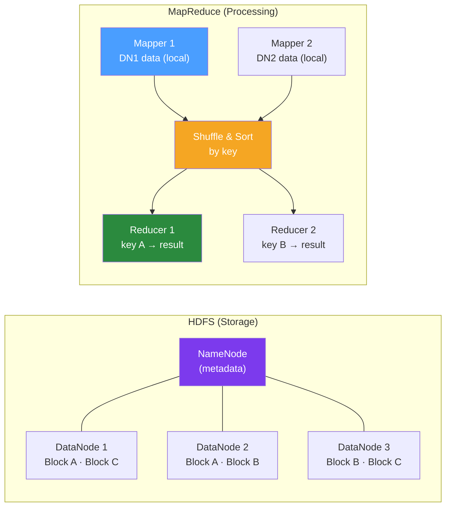

# 🐘 Hadoop and Java

> [!abstract] TL;DR
> Apache Hadoop is the foundational open-source framework for distributed storage (HDFS) and processing (MapReduce/YARN). While MapReduce is largely superseded by Apache Spark for new development, understanding Hadoop is essential: it underpins many enterprise data platforms, and the Hadoop ecosystem (Hive, HBase, YARN) remains widely deployed. Java is Hadoop's native language — MapReduce jobs are written as Java classes.

## Intuition — analogy FIRST

Hadoop MapReduce is like a **census bureau processing millions of survey forms**. The **Map** phase: local offices (mappers running on each data node) each process their local pile of forms and produce summarised tallies by category (key-value pairs). The **Shuffle** phase: the postal system routes all tallies for the same category to the same counting office. The **Reduce** phase: each counting office combines all tallies for its assigned categories into final counts. HDFS is the filing cabinet system: each form is stored in 3 copies across different offices (data nodes) — if one office burns down (node fails), the forms are still accessible from the other two copies.

---

## How It Works



## Key Concepts / Details

### Writing a MapReduce Job in Java

**Classic example: Word Count**

```java
// Mapper — processes each input line, emits (word, 1) pairs
public class WordCountMapper 
        extends Mapper<LongWritable, Text, Text, IntWritable> {
    
    private final Text word = new Text();
    private final IntWritable one = new IntWritable(1);
    
    @Override
    protected void map(LongWritable key, Text value, Context context) 
            throws IOException, InterruptedException {
        String line = value.toString().toLowerCase();
        StringTokenizer tokenizer = new StringTokenizer(line);
        while (tokenizer.hasMoreTokens()) {
            word.set(tokenizer.nextToken());
            context.write(word, one);
        }
    }
}

// Reducer — receives (word, [1, 1, 1, ...]), emits (word, total)
public class WordCountReducer 
        extends Reducer<Text, IntWritable, Text, IntWritable> {
    
    private final IntWritable result = new IntWritable();
    
    @Override
    protected void reduce(Text key, Iterable<IntWritable> values, Context context)
            throws IOException, InterruptedException {
        int sum = StreamSupport.stream(values.spliterator(), false)
                .mapToInt(IntWritable::get)
                .sum();
        result.set(sum);
        context.write(key, result);
    }
}

// Job driver
public class WordCountJob {
    public static void main(String[] args) throws Exception {
        Configuration conf = new Configuration();
        Job job = Job.getInstance(conf, "word count");
        
        job.setJarByClass(WordCountJob.class);
        job.setMapperClass(WordCountMapper.class);
        job.setCombinerClass(WordCountReducer.class);  // local reduce before shuffle
        job.setReducerClass(WordCountReducer.class);
        
        job.setOutputKeyClass(Text.class);
        job.setOutputValueClass(IntWritable.class);
        
        FileInputFormat.addInputPath(job, new Path(args[0]));
        FileOutputFormat.setOutputPath(job, new Path(args[1]));
        
        System.exit(job.waitForCompletion(true) ? 0 : 1);
    }
}
```

Submit:
```bash
hadoop jar wordcount.jar WordCountJob /input/documents/ /output/wordcount/
```

### HDFS Java API

```java
Configuration conf = new Configuration();
conf.set("fs.defaultFS", "hdfs://namenode:8020");
FileSystem fs = FileSystem.get(conf);

// Write a file to HDFS
Path hdfsPath = new Path("/data/orders/2026-01-15/orders.csv");
try (FSDataOutputStream out = fs.create(hdfsPath, true)) {
    out.writeBytes("orderId,customerId,amount\n");
    out.writeBytes("123,456,99.99\n");
}

// Read a file from HDFS
try (FSDataInputStream in = fs.open(hdfsPath);
     BufferedReader reader = new BufferedReader(new InputStreamReader(in))) {
    reader.lines().forEach(System.out::println);
}

// List directory
RemoteIterator<LocatedFileStatus> files = fs.listFiles(new Path("/data/orders/"), true);
while (files.hasNext()) {
    LocatedFileStatus status = files.next();
    System.out.printf("File: %s, Size: %d bytes%n", status.getPath(), status.getLen());
}

// Copy local file to HDFS
fs.copyFromLocalFile(new Path("/local/file.csv"), new Path("/hdfs/file.csv"));
```

### Hadoop Ecosystem Components

| Component | Purpose | Modern Equivalent |
|-----------|---------|-------------------|
| **HDFS** | Distributed storage | S3, GCS, Azure Blob + Hadoop Compatible FS |
| **MapReduce** | Batch processing | Apache Spark |
| **YARN** | Resource management | Kubernetes |
| **Hive** | SQL over HDFS | Spark SQL, Trino/Presto |
| **HBase** | Wide-column store | Cassandra, BigTable |
| **Pig** | Data flow scripting | Spark, Python |
| **Sqoop** | RDBMS ↔ Hadoop | Debezium, Airbyte |
| **Flume** | Log ingestion | Kafka, Logstash |
| **Oozie** | Workflow scheduler | Airflow, Prefect |
| **Zookeeper** | Distributed coordination | etcd |

### Hive — SQL Over Hadoop

```sql
-- Create external Hive table over HDFS parquet files
CREATE EXTERNAL TABLE orders (
    order_id STRING,
    customer_id STRING,
    amount DECIMAL(10,2),
    status STRING,
    created_at TIMESTAMP
)
STORED AS PARQUET
LOCATION '/data/orders/2026/';

-- Query (translates to MapReduce or Tez/Spark job)
SELECT status, COUNT(*) as cnt, SUM(amount) as revenue
FROM orders
WHERE YEAR(created_at) = 2026
GROUP BY status;
```

### HBase — Wide-Column Store

```java
Configuration conf = HBaseConfiguration.create();
conf.set("hbase.zookeeper.quorum", "zookeeper-host");

Connection connection = ConnectionFactory.createConnection(conf);
Table table = connection.getTable(TableName.valueOf("orders"));

// Write
Put put = new Put(Bytes.toBytes("order:12345"));
put.addColumn(Bytes.toBytes("details"), Bytes.toBytes("amount"), 
        Bytes.toBytes("99.99"));
put.addColumn(Bytes.toBytes("details"), Bytes.toBytes("status"), 
        Bytes.toBytes("COMPLETED"));
table.put(put);

// Read by row key (very fast — O(1))
Get get = new Get(Bytes.toBytes("order:12345"));
Result result = table.get(get);
String amount = Bytes.toString(result.getValue(
        Bytes.toBytes("details"), Bytes.toBytes("amount")));
```

HBase is ideal for: random real-time access to large datasets by row key, time-series data (row key = `sensor:YYYYMMDDHHMMSS`), adjacency lists.

### Why MapReduce is Largely Replaced by Spark

| Aspect | MapReduce | Spark |
|--------|-----------|-------|
| Performance | Disk I/O between stages | In-memory (10-100× faster) |
| API | Low-level Java only | High-level (Java, Scala, Python, R, SQL) |
| Iterative algorithms | Very slow (ML, graph) | Efficient with caching |
| Streaming | Not supported | Native (Spark Streaming, Structured Streaming) |
| Learning curve | High | Lower (especially PySpark) |
| When to use | Very large stable pipelines, legacy | New development |

MapReduce still makes sense for: extremely large stable batch jobs where YARN + MapReduce is the enterprise standard, when Spark doesn't fit memory constraints, or in deeply integrated Hadoop ecosystem deployments.

## Real-World Notes

- **Cloudera/Hortonworks**: Most enterprise Hadoop deployments use Cloudera Data Platform (CDP) or the legacy HDP (Hortonworks Data Platform). Both package Hadoop ecosystem with management tooling.
- **Object storage as HDFS replacement**: New Hadoop installations often use S3 (with `s3a://` filesystem) instead of HDFS — cheaper, no NameNode SPOF, unlimited storage.
- **Speculative execution**: Hadoop/YARN relaunches slow tasks on other nodes (`mapreduce.map.speculative=true`) — handles stragglers automatically.

## Common Pitfalls

- **Small file problem**: HDFS performs poorly with millions of small files (10KB each). Each file requires a NameNode metadata entry. Combine small files: `CombineFileInputFormat`, or use Parquet which packs many records into large files.
- **Missing Combiner**: Not using a `Combiner` for associative/commutative operations (sum, count) wastes network bandwidth during shuffle. Add `job.setCombinerClass()`.
- **Wrong data type**: Using `Text` when you need numeric comparison sorts lexicographically (`"9" > "10"`). Use `LongWritable`/`IntWritable` for numbers.

## Related Concepts
- [[Apache_Spark_Java]] — The modern replacement for MapReduce
- [[Big_Data_Patterns]] — Architectural patterns using HDFS and the Hadoop ecosystem
- [[Data_Pipeline_Java]] — Sqoop/Flume for ingesting data into Hadoop

## Review Questions
1. What are the three phases of MapReduce processing?
2. What does a Combiner do and when should you use one?
3. What is the small file problem in HDFS and how do you mitigate it?
4. What is the primary reason Spark replaced MapReduce for most use cases?
5. What is HBase designed for and how does it differ from HDFS?

## Sources
- Apache Hadoop documentation: https://hadoop.apache.org/docs/
- HBase documentation: https://hbase.apache.org/book.html

#java #hadoop #mapreduce #hdfs #big-data
