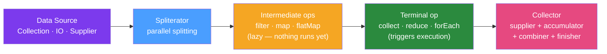

# 🌊 Java Streams Advanced

> [!abstract] TL;DR
> Advanced Java Streams goes beyond `filter`/`map`/`collect` to custom `Collector` implementations, `Collectors.teeing()` for simultaneous aggregations, `Stream.takeWhile()`/`dropWhile()` for conditional slicing, custom `Spliterator` for parallel-capable data sources, and a deep understanding of when parallel streams hurt rather than help.

## Intuition — analogy FIRST

The Java Stream pipeline is like a **factory assembly line** — but an invisible one: items flow through the line only when the final packaging station (terminal operation) orders them. Custom `Collector` is designing the packaging station yourself: you specify how to create the container, how to add items, how to combine containers when the line splits for parallelism, and what the final packaged result looks like. `Collectors.teeing()` is having two packaging stations for the same items simultaneously — like boxing apples for supermarkets AND counting them for inventory at the same time.

---

## How It Works



## Key Concepts / Details

### Collectors.teeing() — Two Simultaneous Aggregations

Java 12+ — collects into two downstream collectors simultaneously, then merges results:

```java
// Count total and sum in one pass (O(n))
record Summary(long count, BigDecimal total) {}

Summary orderSummary = orders.stream()
        .collect(Collectors.teeing(
                Collectors.counting(),
                Collectors.reducing(BigDecimal.ZERO, Order::getAmount, BigDecimal::add),
                Summary::new
        ));
// Old approach needed two passes: .count() then .mapToInt().sum()

// Average and max in one pass
record Stats(OptionalDouble average, OptionalInt max) {}
Stats stats = intList.stream()
        .collect(Collectors.teeing(
                Collectors.averagingInt(Integer::intValue),
                Collectors.maxBy(Integer::compareTo),
                (avg, max) -> new Stats(OptionalDouble.of(avg), max.map(Object::hashCode).stream().findFirst())
        ));
```

### Custom Collector

The `Collector` interface has 5 components:

```java
// Build a frequency map (Histogram) — custom Collector
public static <T> Collector<T, ?, Map<T, Long>> toHistogram() {
    return Collector.of(
            HashMap::new,                                    // supplier: create container
            (map, item) -> map.merge(item, 1L, Long::sum),  // accumulator: add item
            (map1, map2) -> {                                // combiner: merge parallel results
                map2.forEach((k, v) -> map1.merge(k, v, Long::sum));
                return map1;
            },
            Collections::unmodifiableMap,                   // finisher: final transform
            Collector.Characteristics.UNORDERED             // characteristics
    );
}

// Usage
Map<String, Long> wordFrequency = words.stream()
        .collect(toHistogram());
```

Characteristics that affect performance:
- `CONCURRENT`: accumulator can be called from multiple threads on same container
- `UNORDERED`: result doesn't depend on encounter order (enables better parallel)
- `IDENTITY_FINISH`: finisher is identity (skip the finisher call)

### Java 9+ Stream Methods

```java
// takeWhile — take elements while predicate is true (stops at first false)
List<Integer> ascending = List.of(1, 2, 3, 4, 5, 3, 7);
List<Integer> taken = ascending.stream()
        .takeWhile(n -> n < 5)
        .toList();  // [1, 2, 3, 4]

// dropWhile — drop elements while predicate is true (yields rest)
List<Integer> dropped = ascending.stream()
        .dropWhile(n -> n < 5)
        .toList();  // [5, 3, 7]

// Stream.iterate with predicate (replaces external counter)
Stream.iterate(0, n -> n < 100, n -> n + 2)  // even numbers 0..98
        .forEach(System.out::println);

// Stream.ofNullable — single element or empty if null
Optional<String> nullable = null;
Stream.ofNullable(nullable)  // empty stream (no NPE)
        .findFirst();

// Collectors.toUnmodifiableList() — Java 10+
List<String> immutable = stream.collect(Collectors.toUnmodifiableList());
```

### Numeric Streams — Performance Wins

Always prefer primitive streams over boxed streams for numeric computation:

```java
// Boxed (slow — auto-unboxes on every operation)
long sum1 = orders.stream()
        .map(Order::getQuantity)       // Stream<Integer>
        .reduce(0, Integer::sum);      // boxes/unboxes repeatedly

// Primitive stream (fast)
long sum2 = orders.stream()
        .mapToInt(Order::getQuantity)  // IntStream (no boxing)
        .sum();                         // direct int arithmetic

// LongStream for large numbers
long totalRevenue = orders.stream()
        .mapToLong(o -> o.getPrice().movePointRight(2).longValue())
        .sum();

// Statistics in one pass
IntSummaryStatistics stats = orders.stream()
        .mapToInt(Order::getQuantity)
        .summaryStatistics();
// stats.getCount(), getSum(), getMin(), getMax(), getAverage()
```

### Custom Spliterator

For parallel streaming over custom data sources:

```java
public class CsvFileSpliterator implements Spliterator<String[]> {
    private final BufferedReader reader;
    private final AtomicLong position;
    private final long endPosition;
    
    @Override
    public boolean tryAdvance(Consumer<? super String[]> action) {
        try {
            String line = reader.readLine();
            if (line == null) return false;
            action.accept(line.split(","));
            return true;
        } catch (IOException e) {
            throw new UncheckedIOException(e);
        }
    }
    
    @Override
    public Spliterator<String[]> trySplit() {
        // Split the file range in half for parallel processing
        // Returns null if splitting isn't feasible
        return null; // simplified — real impl would split file range
    }
    
    @Override
    public long estimateSize() { return Long.MAX_VALUE; }
    
    @Override
    public int characteristics() {
        return ORDERED | NONNULL;
    }
}

// Create parallel stream from custom spliterator
StreamSupport.stream(new CsvFileSpliterator(reader, 0, fileSize), true)
        .filter(fields -> fields.length > 3)
        .map(fields -> new Order(fields[0], fields[1]))
        .collect(Collectors.toList());
```

### Parallel Streams — When They Help vs Hurt

```java
// Good: CPU-bound, large dataset, stateless operations
List<ProcessedItem> results = largeList.parallelStream()
        .map(item -> cpuBoundTransform(item))  // expensive computation
        .filter(item -> item.isValid())
        .collect(Collectors.toList());

// BAD: IO-bound (threads block waiting for IO, not using CPU)
// BAD: Small dataset (fork/join overhead exceeds savings)
// BAD: Stateful operations (sorted, distinct need full data)
// BAD: Non-thread-safe downstream (HashMap accumulation)
```

Parallel stream rules:
1. Data source must be efficiently splittable: `ArrayList` (yes), `LinkedList` (no), `HashSet` (yes)
2. Operations must be stateless and non-interfering
3. Avoid: `limit()`, `findFirst()`, `sorted()` — force sequential processing or encounter-order maintenance

### Stream.Builder

```java
// Build a stream programmatically when source isn't a collection
Stream.Builder<String> builder = Stream.builder();
builder.accept("first");
if (condition) builder.accept("optional");
builder.accept("last");
Stream<String> stream = builder.build();
```

## Real-World Notes

- **`Collectors.groupingBy` with downstream**: Combine grouping with aggregation: `groupingBy(Order::getStatus, Collectors.counting())` → `Map<Status, Long>`.
- **`partitioningBy`**: Binary split by predicate into `{true: List, false: List}` — cleaner than two separate filters.
- **Memory in parallel streams**: Parallel stream collects results from multiple threads and merges — temporarily uses more memory than sequential. Watch heap usage for large datasets.
- **Avoid `.collect(Collectors.toList())` → prefer `.toList()`**: Java 16+ `stream.toList()` returns an unmodifiable list without the `Collectors` overhead.

## Common Pitfalls

- **Parallel stream on small collections**: `parallelStream()` on < 1000 items is usually slower than sequential due to fork/join overhead.
- **Shared mutable state in lambdas**: Lambdas must not modify external variables. `effectivelyFinal` rule prevents most cases, but `AtomicInteger` counters in lambdas are legal and dangerous in parallel streams.
- **Custom `Collector` missing `combiner`**: In sequential streams, `combiner` is never called. But in parallel streams it combines partial results — a missing or incorrect `combiner` gives wrong results only in parallel.

## Related Concepts
- [[Apache_Spark_Java]] — When Java Streams aren't enough (distributed data)
- [[Data_Pipeline_Java]] — Streams as the in-process component of larger pipelines

## Review Questions
1. What does `Collectors.teeing()` do and what problem does it solve?
2. What are the four components of a custom `Collector`?
3. When do parallel streams help vs hurt performance?
4. What is the difference between `takeWhile()` and `filter()`?
5. Why should you prefer `mapToInt()` over `map()` for numeric streams?

## Sources
- Java SE 21 Stream API: https://docs.oracle.com/en/java/docs/api/java.base/java/util/stream/package-summary.html
- Collectors.teeing(): https://docs.oracle.com/en/java/docs/api/java.base/java/util/stream/Collectors.html#teeing

#java #streams #functional #collectors #advanced
