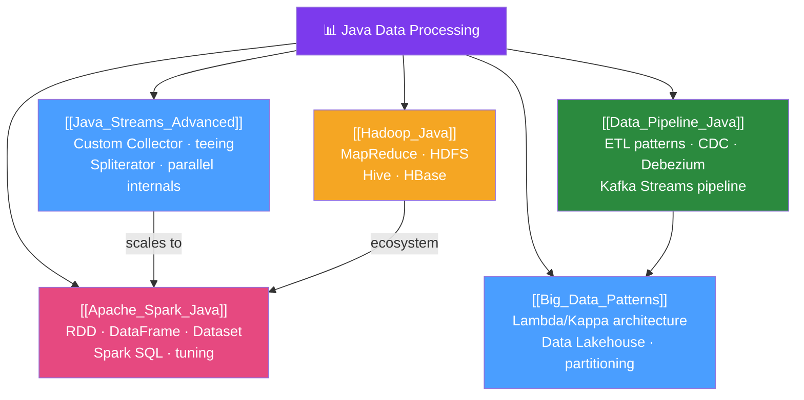

# 🗺️ Java Data Processing — Map of Content

> [!abstract] What This Section Covers
> Java's ecosystem for data processing spans from advanced Stream API patterns for in-memory work, to Apache Spark and Hadoop for distributed petabyte-scale computation, to architectural patterns for building robust data pipelines. This section equips Java engineers to choose the right tool: Java Streams for millions of records in memory, Spark for distributed computation, and pipeline patterns for connecting data systems reliably.

## Concept Map

## Learning Path
1. [[Java_Streams_Advanced]] — Master the Java Streams API fully before moving to distributed frameworks.
2. [[Data_Pipeline_Java]] — Understand pipeline architecture patterns that apply at any scale.
3. [[Apache_Spark_Java]] — Apply distributed computing when data exceeds single-machine capacity.
4. [[Hadoop_Java]] — Understand the Hadoop ecosystem that underpins many big data platforms.
5. [[Big_Data_Patterns]] — Learn the architectural patterns that make big data systems reliable.

## All Notes at a Glance
| Note | Difficulty | What You'll Learn |
|------|------------|-------------------|
| [[Java_Streams_Advanced]] | Advanced | Custom Collectors, teeing, Spliterator, parallel stream internals |
| [[Apache_Spark_Java]] | Advanced | Spark Java API, DataFrame/Dataset, Spark SQL, tuning, Kubernetes |
| [[Hadoop_Java]] | Intermediate | MapReduce Java API, HDFS, Hive, HBase, modern relevance |
| [[Data_Pipeline_Java]] | Advanced | ETL/ELT, CDC with Debezium, Spring Batch pipelines, schema evolution |
| [[Big_Data_Patterns]] | Advanced | Lambda/Kappa architecture, Data Lakehouse, partitioning strategies |

## Key Questions This Section Answers
- When should you use Java Streams vs Apache Spark?
- How do you write a custom `Collector` in Java?
- How does MapReduce work at the code level?
- What is Change Data Capture and how does Debezium implement it?
- What is the difference between Lambda and Kappa architecture?
- What columnar format (Parquet, ORC, Avro) should you use and when?

## Related Sections
- [[_MOC_Java_Master|↑ Java Master MOC]]
- [[_MOC_Spring_Batch|↔ Spring Batch]] — batch processing for structured pipelines
- [[_MOC_Spring_Integration|↔ Spring Integration]] — message-driven data flows

#java #data-processing #MOC #big-data
