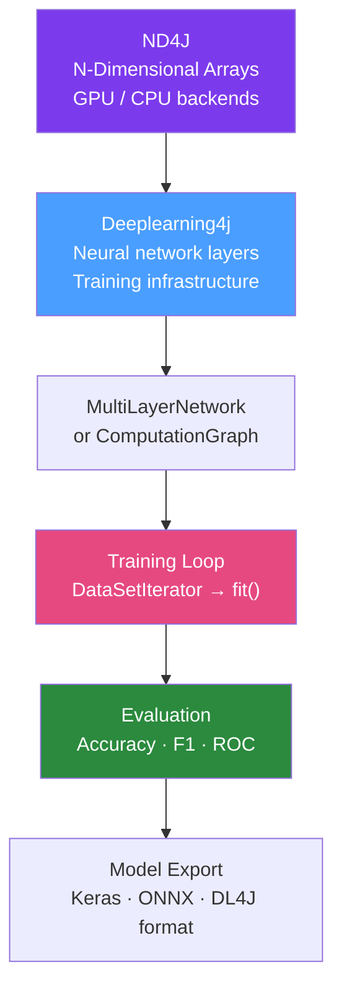

# 🧠 Deeplearning4j

> [!abstract] TL;DR
> Eclipse Deeplearning4j (DL4J) is the leading deep learning framework for the JVM, built on ND4J (N-Dimensional Arrays for Java). It supports neural network training, GPU acceleration via CUDA, model import from Keras/TensorFlow, and distributed training via Apache Spark. DL4J is the choice when you need to train or run deep learning models natively in Java without a Python dependency.

## Intuition — analogy FIRST

DL4J on the JVM is like building a **high-performance engine factory inside a Java warehouse**. The warehouse (JVM) usually does business software work. DL4J adds a specialized engine-building division (ND4J): it speaks the native language of engines (tensors/matrices, GPU operations), works as fast as dedicated Python frameworks, but lives inside your existing Java warehouse. You can import blueprints from other factories (Keras models), run the assembly line in parallel across multiple warehouses (Spark), and deliver engines (trained models) directly to your Java-based products.

---

## How It Works



## Key Concepts / Details

### Setup

```xml
<dependencies>
    <dependency>
        <groupId>org.deeplearning4j</groupId>
        <artifactId>deeplearning4j-core</artifactId>
        <version>1.0.0-M2.1</version>
    </dependency>
    <!-- CPU backend -->
    <dependency>
        <groupId>org.nd4j</groupId>
        <artifactId>nd4j-native-platform</artifactId>
        <version>1.0.0-M2.1</version>
    </dependency>
    <!-- GPU backend (swap with above) -->
    <!--
    <dependency>
        <groupId>org.nd4j</groupId>
        <artifactId>nd4j-cuda-11.6-platform</artifactId>
        <version>1.0.0-M2.1</version>
    </dependency>
    -->
</dependencies>
```

### Building a Neural Network

```java
// Feedforward network for classification
MultiLayerConfiguration conf = new NeuralNetConfiguration.Builder()
        .seed(42)
        .optimizationAlgo(OptimizationAlgorithm.STOCHASTIC_GRADIENT_DESCENT)
        .updater(new Adam(0.001))
        .weightInit(WeightInit.XAVIER)
        .list()
        .layer(new DenseLayer.Builder()
                .nIn(784)      // input features (e.g., 28x28 MNIST pixels)
                .nOut(256)
                .activation(Activation.RELU)
                .dropOut(0.5)
                .build())
        .layer(new DenseLayer.Builder()
                .nIn(256).nOut(128)
                .activation(Activation.RELU)
                .build())
        .layer(new OutputLayer.Builder(LossFunctions.LossFunction.NEGATIVELOGLIKELIHOOD)
                .nIn(128).nOut(10)  // 10 classes (digits 0-9)
                .activation(Activation.SOFTMAX)
                .build())
        .build();

MultiLayerNetwork model = new MultiLayerNetwork(conf);
model.init();
model.setListeners(new ScoreIterationListener(100));  // print score every 100 iterations
```

### Training

```java
// DataSetIterator from CSV
RecordReaderDataSetIterator iterator = new RecordReaderDataSetIterator.Builder(
        new CSVRecordReader(1, ','),  // skip header
        batchSize)
        .regression(false)           // classification
        .numPossibleLabels(10)
        .labelIndex(784)             // last column is label
        .build();
iterator.initialize(new FileSplit(new File("data/train.csv")));

// Train for N epochs
int epochs = 10;
for (int i = 0; i < epochs; i++) {
    model.fit(iterator);
    iterator.reset();
    
    // Evaluate after each epoch
    Evaluation eval = model.evaluate(testIterator);
    System.out.printf("Epoch %d: Accuracy=%.4f, F1=%.4f%n",
            i, eval.accuracy(), eval.f1());
    testIterator.reset();
}
```

### Model Persistence

```java
// Save
ModelSerializer.writeModel(model, new File("model.zip"), true);

// Load
MultiLayerNetwork loaded = ModelSerializer.restoreMultiLayerNetwork("model.zip");
```

### Keras Model Import

```java
// Import a model trained in Python (Keras/TensorFlow)
MultiLayerNetwork kerasModel = KerasModelImport.importKerasSequentialModelAndWeights(
        "model.h5",
        true  // enforce training config
);
```

### Inference

```java
// Prepare input as ND4J array
INDArray input = Nd4j.create(new double[][]{{pixel1, pixel2, ..., pixel784}});

// Predict
INDArray output = model.output(input);
int predictedClass = output.argMax(1).getInt(0);
double confidence = output.getDouble(predictedClass);

System.out.printf("Predicted: %d (%.1f%% confidence)%n", predictedClass, confidence * 100);
```

### Convolutional Neural Network (Image Classification)

```java
MultiLayerConfiguration cnnConf = new NeuralNetConfiguration.Builder()
        .seed(42)
        .updater(new Adam(0.0001))
        .list()
        .layer(new ConvolutionLayer.Builder(3, 3)
                .nIn(3)     // RGB channels
                .nOut(32)   // 32 filters
                .stride(1, 1)
                .activation(Activation.RELU)
                .build())
        .layer(new SubsamplingLayer.Builder(PoolingType.MAX)
                .kernelSize(2, 2)
                .stride(2, 2)
                .build())
        .layer(new ConvolutionLayer.Builder(3, 3)
                .nOut(64)
                .activation(Activation.RELU)
                .build())
        .layer(new SubsamplingLayer.Builder(PoolingType.MAX)
                .kernelSize(2, 2).stride(2, 2)
                .build())
        .layer(new DenseLayer.Builder().nOut(128).activation(Activation.RELU).build())
        .layer(new OutputLayer.Builder(LossFunctions.LossFunction.NEGATIVELOGLIKELIHOOD)
                .nOut(numClasses)
                .activation(Activation.SOFTMAX)
                .build())
        .setInputType(InputType.convolutional(height, width, channels))
        .build();
```

### Distributed Training with Spark

```java
SparkConf sparkConf = new SparkConf().setAppName("DL4J-Training");
JavaSparkContext sc = new JavaSparkContext(sparkConf);

// Distribute data to Spark
JavaRDD<DataSet> trainData = sc.parallelize(localData, numPartitions);

// Spark training configuration
VoidConfiguration voidConf = VoidConfiguration.builder()
        .unicastPort(40123)
        .networkMask("10.0.0.0/16")
        .build();

TrainingMaster trainingMaster = new SharedTrainingMaster.Builder(voidConf, batchSize)
        .updatesThreshold(1e-3)
        .rddTrainingApproach(RDDTrainingApproach.Export)
        .batchSizePerWorker(32)
        .build();

SparkDl4jMultiLayer sparkModel = new SparkDl4jMultiLayer(sc, model, trainingMaster);
for (int epoch = 0; epoch < 5; epoch++) {
    sparkModel.fit(trainData);
}
```

## Real-World Notes

- **DL4J vs calling Python**: For most Java teams, calling a Python FastAPI/Flask inference server is simpler than training with DL4J. DL4J shines when: Java is a hard requirement, you need tight JVM integration (Spring batch inference), or you're importing a Keras model.
- **ONNX Runtime**: A lighter-weight alternative for Java inference — import models from PyTorch/TensorFlow as ONNX format, run with `com.microsoft.onnxruntime:onnxruntime`.
- **Transfer learning**: DL4J Model Zoo provides pre-trained models (VGG-16, ResNet) that you can fine-tune on custom data.

## Common Pitfalls

- **Out of memory**: ND4J allocates native (off-heap) memory. Monitor with `Nd4j.getMemoryManager().getActiveMemory()`. Set `-Xmx` lower than total RAM to leave room for native memory.
- **Wrong input shape**: DL4J expects specific input shapes. For CNNs: `[batch, channels, height, width]`. Errors appear as shape mismatch exceptions.
- **Not resetting iterators**: `DataSetIterator.reset()` must be called between epochs, or the iterator returns no data on subsequent epochs.

## Related Concepts
- [[Java_ML_Libraries]] — Lighter-weight alternatives for classical ML
- [[OpenNLP]] — NLP without neural networks
- [[Spring_AI]] — LLM integration vs custom neural network training

## Review Questions
1. What is ND4J and why is it central to DL4J?
2. How do you import a Keras model trained in Python into DL4J?
3. What does `model.setListeners(new ScoreIterationListener(100))` do?
4. When would you use DL4J vs calling a Python inference server?
5. How does DL4J enable distributed training on Apache Spark?

## Sources
- Deeplearning4j documentation: https://deeplearning4j.konduit.ai/
- DL4J Model Zoo: https://deeplearning4j.konduit.ai/models/model-zoo

#java #deep-learning #dl4j #neural-networks #ai
