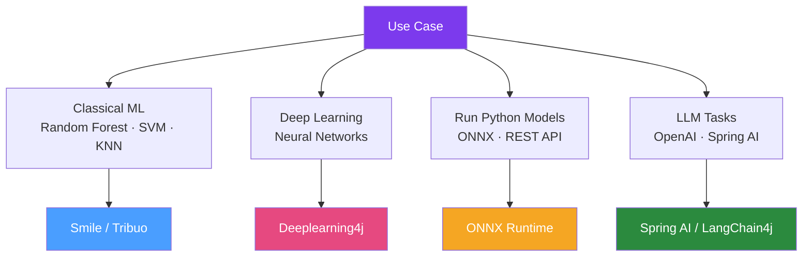

# 📚 Java ML Libraries

> [!abstract] TL;DR
> The Java ML ecosystem offers choices for every use case: **Smile** for fast classical ML, **Tribuo** (Oracle) for production-grade classical ML with provenance tracking, **Weka** for research and rapid prototyping, **ONNX Runtime** for running models trained in Python, and **DL4J** for deep learning. The key insight: most Java teams are better served by calling a Python inference server or using ONNX Runtime than by training models natively in Java.

## Intuition — analogy FIRST

Choosing a Java ML library is like choosing a **power tool for a renovation job**. Smile is the cordless drill — versatile, fast, fits in a toolbox (JAR), handles most jobs. Weka is the workbench with every tool — great in a workshop (research/teaching) but cumbersome on a job site (production). Tribuo is the professional contractor's kit — built for accountability (provenance: which data trained which model), comes with quality certification (Oracle). ONNX Runtime is the socket adapter — it doesn't do the work itself, but it lets you use the best tools from another country (Python PyTorch/TensorFlow models) in your Java environment.

---

## How It Works



## Key Concepts / Details

### Library Comparison Table

| Library | Creator | Focus | Performance | Production? |
|---------|---------|-------|-------------|-------------|
| **Smile** | Haifeng Li | Classical ML, fast | Very high | Yes |
| **Tribuo** | Oracle | Classical ML, provenance | High | Yes |
| **Weka** | University of Waikato | Research, GUI | Moderate | Research/prototyping |
| **DL4J** | Eclipse | Deep learning | High (GPU) | Yes |
| **ONNX Runtime** | Microsoft | Inference only | Very high | Yes |
| **JSAT** | Various | Classical ML, research | High | No (no Maven central) |

### Smile — Statistical Machine Intelligence and Learning Engine

```xml
<dependency>
    <groupId>com.github.haifengl</groupId>
    <artifactId>smile-core</artifactId>
    <version>3.1.1</version>
</dependency>
```

```java
import smile.classification.*;
import smile.regression.*;
import smile.data.*;
import smile.validation.*;

// Load data
DataFrame df = Read.csv("iris.csv");
int[] y = df.column("species").toIntArray();
double[][] X = df.drop("species").toArray();

// Random Forest classifier
RandomForest rf = RandomForest.fit(Formula.lhs("species"), df);

// Evaluate
ClassificationValidations<RandomForest> cv = ClassificationValidation.cv(10, 
        RandomForest::fit, Formula.lhs("species"), df);
System.out.printf("10-fold CV Accuracy: %.4f%n", cv.avg.accuracy);

// Predict
int[] predictions = rf.predict(testDf);

// Linear Regression
OLS regression = OLS.fit(Formula.lhs("price"), housingDf);
System.out.printf("R² = %.4f%n", regression.RSquared());
double prediction = regression.predict(new double[]{2000, 3, 2}); // sqft, beds, baths
```

Smile supports: Random Forest, Gradient Boosting, SVM, k-NN, Naive Bayes, Logistic Regression, Neural Networks (shallow), k-Means, DBSCAN, PCA, t-SNE.

### Tribuo — Oracle's Production ML Library

```xml
<dependency>
    <groupId>org.tribuo</groupId>
    <artifactId>tribuo-classification-sgd</artifactId>
    <version>4.3.1</version>
</dependency>
```

```java
// Tribuo emphasises provenance — every model knows its training data and config
DataSource<Label> trainingSource = new CSVDataSource<>(
        Paths.get("train.csv"),
        new CSVLoader<>(Labels.LABEL_FACTORY));
MutableDataset<Label> trainingData = new MutableDataset<>(trainingSource);

// Linear classifier
LinearSGDTrainer<Label> trainer = new LinearSGDTrainer<>(
        new LogMulticlass(),  // multinomial logistic regression
        SGD.getSimpleSGD(0.1),
        5,    // epochs
        1000, // logging interval
        42    // seed
);

Model<Label> model = trainer.train(trainingData);

// Provenance — can always trace back to training data/config
ModelProvenance prov = model.getProvenance();
System.out.println(prov.toString());  // full audit trail

// Evaluate
Evaluator<Label, LabelEvaluation> evaluator = new LabelEvaluator();
LabelEvaluation eval = evaluator.evaluate(model, testData);
System.out.printf("Accuracy: %.4f%n", eval.accuracy());
```

### ONNX Runtime — Run Python Models in Java

```xml
<dependency>
    <groupId>com.microsoft.onnxruntime</groupId>
    <artifactId>onnxruntime</artifactId>
    <version>1.19.2</version>
</dependency>
```

```java
// Export from Python: model.save("model.onnx") or torch.onnx.export(...)

OrtEnvironment env = OrtEnvironment.getEnvironment();
OrtSession session = env.createSession("model.onnx");

// Prepare input (must match model's expected input shape)
float[][] inputData = preprocessInput(rawText);  // tokenize, vectorize
OnnxTensor inputTensor = OnnxTensor.createTensor(env, inputData);

// Run inference
Map<String, OnnxTensorLike> inputs = Map.of("input_ids", inputTensor);
try (OrtSession.Result results = session.run(inputs)) {
    float[][] logits = (float[][]) results.get(0).getValue();
    int predictedClass = argMax(logits[0]);
    System.out.println("Predicted class: " + predictedClass);
}
```

ONNX Runtime supports: PyTorch, TensorFlow, scikit-learn, XGBoost, LightGBM models. GPU acceleration via CUDA, CoreML (Mac), DirectML (Windows).

### Feature Engineering in Java

```java
// Smile feature engineering
double[][] normalised = MathEx.unitize(features);           // L2 normalisation
double[][] standardised = MathEx.standardize(features);     // z-score standardisation
double[] log = Arrays.stream(rawFeature).map(Math::log).toArray();

// One-hot encoding
String[] categories = {"PENDING", "PROCESSING", "COMPLETED", "CANCELLED"};
int categoryIndex = Arrays.asList(categories).indexOf(status);
double[] oneHot = new double[categories.length];
oneHot[categoryIndex] = 1.0;

// Smile DataFrame for feature engineering
DataFrame df = DataFrame.of(samples, "featureA", "featureB", "label");
df = df.merge(DataFrame.of(encodedCategoricals));  // add encoded columns
```

### When to Use Java ML vs Python ML

| Scenario | Java ML | Python ML (REST/gRPC) |
|---------|---------|----------------------|
| Java microservice with ML feature | ✅ Smile/Tribuo | REST adds latency |
| Training large models | ❌ Too verbose | ✅ PyTorch/TF ecosystem |
| Real-time inference (<1ms) | ✅ ONNX in-process | REST too slow |
| Batch inference (millions/day) | ✅ Spark + DL4J/ONNX | Both work |
| LLM tasks | ✅ Spring AI/LangChain4j | Both work |
| Experiment/exploration | ❌ Poor notebooks | ✅ Jupyter |
| Model iteration speed | ❌ Compile cycle | ✅ Python REPL |

## Real-World Notes

- **Train in Python, infer in Java**: The most pragmatic pattern for teams that need Python for training (better ecosystem, Jupyter, faster iteration) but Java for production inference. ONNX Runtime bridges the gap with minimal overhead.
- **Feature parity**: When the same feature computation runs in both Python (training) and Java (inference), ensure exact parity — different floating point behaviour, tokenization, normalisation can cause training/serving skew.
- **Model registry**: For any serious ML deployment, use MLflow or similar to version models, track experiments, and manage deployment lifecycle.

## Common Pitfalls

- **Training/serving skew**: Feature preprocessing in Python uses `sklearn.preprocessing.StandardScaler`; Java inference recomputes differently. Always save and load the exact same preprocessing parameters.
- **Forgetting ONNX opset version**: ONNX models have opset versions. Export with the opset supported by your ONNX Runtime version (`torch.onnx.export(..., opset_version=17)`).
- **Using Weka in production**: Weka's API is designed for research and batch experiments, not low-latency production inference. Use Smile or ONNX for production.

## Related Concepts
- [[Deeplearning4j]] — When you need deep learning natively on JVM
- [[OpenNLP]] — NLP-specific library
- [[Spring_AI]] — For LLM-based ML tasks

## Review Questions
1. When should you use ONNX Runtime instead of a pure Java ML library?
2. What is Tribuo's "provenance" feature and why is it valuable?
3. How do you export a scikit-learn model for use in Java?
4. What is training/serving skew and how do you prevent it?
5. What Smile algorithm would you use for a multi-class classification problem?

## Sources
- Smile documentation: https://haifengl.github.io/smile/
- Tribuo documentation: https://tribuo.org/
- ONNX Runtime Java API: https://onnxruntime.ai/docs/api/java/

#java #ml #machine-learning #smile #tribuo #onnx
