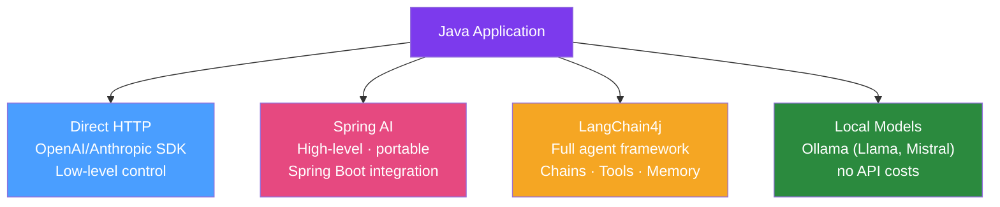

# 🔗 LLM Integration in Java

> [!abstract] TL;DR
> Integrating LLMs into Java applications can be done via: direct HTTP client calls to provider APIs, the official Java SDKs (OpenAI, Anthropic), Spring AI for Spring Boot applications, or LangChain4j for a full agent/chain framework. Key patterns: streaming responses, structured output extraction, function/tool calling, conversation memory, and RAG pipelines.

## Intuition — analogy FIRST

Integrating an LLM into your Java service is like **hiring an expert consultant** for specific tasks. Direct API calls are like emailing the consultant directly. Spring AI is like having a secretary (the framework) who manages the email format, attachments (tools), filing system (memory), and knows your company's standard letterhead (system prompt). LangChain4j is like hiring an entire consulting team (agents) who can call each other and use external tools (web search, code execution) to solve complex problems. You choose based on how complex your use case is.

---

## How It Works



## Key Concepts / Details

### Direct OpenAI Java SDK

```java
// Add: com.openai:openai-java:0.x.x
OpenAIClient client = OpenAIOkHttpClient.builder()
        .apiKey(System.getenv("OPENAI_API_KEY"))
        .build();

ChatCompletion completion = client.chat().completions().create(
        ChatCompletionCreateParams.builder()
                .model(ChatModel.GPT_4O)
                .addUserMessage("Summarise this Java stack trace: " + stackTrace)
                .maxTokens(500)
                .temperature(0.3)
                .build()
);

String summary = completion.choices().get(0).message().content().orElseThrow();
```

### LangChain4j — Agent Framework

```xml
<dependency>
    <groupId>dev.langchain4j</groupId>
    <artifactId>langchain4j-open-ai-spring-boot-starter</artifactId>
    <version>0.35.0</version>
</dependency>
```

```java
// Declarative AI Service (high-level)
@AiService
public interface CustomerSupportAgent {
    
    @SystemMessage("You are a helpful customer support agent. Answer concisely.")
    String chat(@MemoryId String customerId, @UserMessage String userMessage);
}

// Structured extraction
@AiService  
public interface OrderExtractor {
    
    @UserMessage("Extract order details from: {{text}}")
    OrderDetails extract(@V("text") String customerMessage);
}

record OrderDetails(String productName, int quantity, String deliveryAddress) {}

// Usage in Spring
@Service
public class SupportService {
    private final CustomerSupportAgent agent;  // Auto-injected by LangChain4j
    private final OrderExtractor extractor;
    
    public String handleCustomer(String customerId, String message) {
        return agent.chat(customerId, message);
    }
}
```

### LangChain4j Tool Calling

```java
// Define tools as methods in a class
public class CustomerTools {
    
    private final OrderRepository orderRepo;
    
    @Tool("Look up an order by order ID")
    public Order getOrder(@P("The order ID") String orderId) {
        return orderRepo.findById(orderId).orElseThrow();
    }
    
    @Tool("Update the status of an order")
    public String updateOrderStatus(
            @P("Order ID") String orderId,
            @P("New status: PROCESSING, SHIPPED, DELIVERED, CANCELLED") String status) {
        orderRepo.updateStatus(orderId, OrderStatus.valueOf(status));
        return "Order " + orderId + " status updated to " + status;
    }
}

// Register tools with agent
@AiService
@Tool(CustomerTools.class)
public interface OrderSupportAgent {
    @SystemMessage("You help customers with their orders. Use tools when needed.")
    String chat(@MemoryId String sessionId, @UserMessage String message);
}
```

### Streaming Responses

```java
// LangChain4j streaming interface
@AiService
public interface StreamingAssistant {
    TokenStream chat(String userMessage);
}

// Spring MVC SSE endpoint
@RestController
public class StreamingController {
    private final StreamingAssistant assistant;
    
    @GetMapping(value = "/chat/stream", produces = MediaType.TEXT_EVENT_STREAM_VALUE)
    public SseEmitter streamChat(@RequestParam String message) {
        SseEmitter emitter = new SseEmitter(60_000L);  // 60s timeout
        
        assistant.chat(message)
                .onNext(token -> {
                    try {
                        emitter.send(token);
                    } catch (IOException e) {
                        emitter.completeWithError(e);
                    }
                })
                .onComplete(emitter::complete)
                .onError(emitter::completeWithError)
                .start();
        
        return emitter;
    }
}
```

### Conversation Memory

```java
// In-memory (per-session)
ChatMemory memory = MessageWindowChatMemory.withMaxMessages(10);

// Persistent (database-backed)
@Bean
public ChatMemoryStore chatMemoryStore(JdbcTemplate jdbc) {
    return new JdbcChatMemoryStore(jdbc);  // custom implementation
}

@Bean
public ChatMemory persistentMemory(ChatMemoryStore store) {
    return MessageWindowChatMemory.builder()
            .chatMemoryStore(store)
            .maxMessages(20)
            .build();
}
```

### Retry and Rate Limiting for API Calls

```java
@Service
public class ResilientLlmService {
    
    private final ChatLanguageModel model;
    private final RetryTemplate retryTemplate;
    
    public ResilientLlmService(ChatLanguageModel model) {
        this.model = model;
        this.retryTemplate = RetryTemplate.builder()
                .maxAttempts(3)
                .exponentialBackoff(2000, 2, 30000)  // 2s, 4s, 8s
                .retryOn(Exception.class)
                .build();
    }
    
    public String generateWithRetry(String prompt) {
        return retryTemplate.execute(ctx -> {
            return model.generate(prompt);
        });
    }
}
```

### Local LLMs with Ollama

```xml
<dependency>
    <groupId>dev.langchain4j</groupId>
    <artifactId>langchain4j-ollama-spring-boot-starter</artifactId>
    <version>0.35.0</version>
</dependency>
```

```yaml
langchain4j:
  ollama:
    chat-model:
      base-url: http://localhost:11434
      model-name: llama3.2:8b
      temperature: 0.7
```

```bash
# Start Ollama locally
ollama pull llama3.2:8b
ollama serve
```

### Cost Management

```java
// Token counting before API call
@Service
public class CostAwareLlmService {
    
    private final Tokenizer tokenizer;
    private final MeterRegistry meterRegistry;
    
    public String generate(String prompt) {
        int inputTokens = tokenizer.estimateTokenCountInText(prompt);
        
        // Guard against extremely long prompts
        if (inputTokens > 100_000) {
            throw new PromptTooLongException("Prompt has " + inputTokens + " tokens");
        }
        
        Response<AiMessage> response = model.generate(UserMessage.from(prompt));
        
        int outputTokens = response.tokenUsage().outputTokenCount();
        double cost = (inputTokens * 0.0001 + outputTokens * 0.0003) / 1000; // example pricing
        
        meterRegistry.counter("llm.tokens.input").increment(inputTokens);
        meterRegistry.counter("llm.tokens.output").increment(outputTokens);
        meterRegistry.counter("llm.cost.usd").increment(cost);
        
        return response.content().text();
    }
}
```

## Real-World Notes

- **Java vs Python for LLM**: Python's LangChain ecosystem is more mature. For Java teams building AI features into existing Java services, Spring AI / LangChain4j reduce context switching. For standalone ML/AI services, Python may be more productive.
- **Prompt caching**: Anthropic and OpenAI support prompt caching for long, repeated context (system prompts, RAG context). Cache can reduce costs by 90% for repeated queries.
- **Structured output reliability**: LLMs occasionally produce malformed JSON. Always validate the parsed output and implement retry with corrective prompt on parse failure.
- **Guardrails**: Use `SafeGuardAdvisor` (Spring AI) or content moderation API to filter inappropriate inputs/outputs before they reach users.

## Common Pitfalls

- **Not setting timeouts**: LLM API calls can take 30+ seconds for long contexts. Without HTTP client timeouts, a slow model response blocks threads indefinitely.
- **Logging prompt/response in production**: Prompts often contain user data (PII). Structured logging of full prompts can cause compliance violations. Log only metadata (token counts, model, latency).
- **Temperature 1.0 for structured extraction**: High temperature causes inconsistent JSON output format. Use `temperature: 0.1` or lower for deterministic structured extraction.

## Related Concepts
- [[Spring_AI]] — Spring's official LLM integration framework
- [[Java_ML_Libraries]] — Traditional ML libraries for non-LLM tasks

## Review Questions
1. What is LangChain4j's `@AiService` and how does it simplify LLM integration?
2. How do you stream LLM responses to a browser using SSE?
3. What tool calling and why might an LLM need to call Java methods?
4. How do you implement retry logic for LLM API calls?
5. What are the trade-offs between using Spring AI vs LangChain4j?

## Sources
- LangChain4j documentation: https://docs.langchain4j.dev/
- OpenAI Java SDK: https://github.com/openai/openai-java
- Anthropic Java SDK: https://github.com/anthropics/anthropic-sdk-java

#java #llm #ai #langchain4j #openai #anthropic
