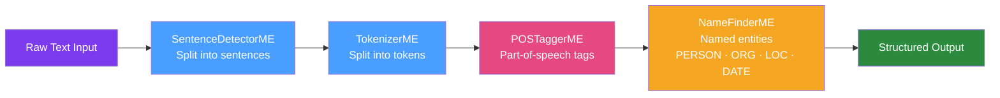

# 📝 Apache OpenNLP

> [!abstract] TL;DR
> Apache OpenNLP is a Java library for classical NLP tasks: sentence detection, tokenization, part-of-speech tagging, named entity recognition (NER), chunking, parsing, and coreference resolution. It uses Maximum Entropy and Perceptron machine learning models (not deep learning). Use it for production NLP tasks where you need a lightweight, interpretable, and fast Java-native solution without GPU requirements.

## Intuition — analogy FIRST

OpenNLP is like a **skilled copy editor working from a style guide**. Given raw text ("Apple Inc. CEO Tim Cook announced record profits in Cupertino, California."), the copy editor systematically marks: where sentences begin and end (sentence detection), each individual word (tokenization), what grammatical role each word plays (POS: noun, verb, proper noun), and which words refer to people/organisations/locations (NER). The editor learned these rules from thousands of examples — not by understanding meaning, but by learning statistical patterns of what sequences of words typically look like in those roles.

---

## How It Works



## Key Concepts / Details

### Setup

```xml
<dependency>
    <groupId>org.apache.opennlp</groupId>
    <artifactId>opennlp-tools</artifactId>
    <version>2.3.3</version>
</dependency>
```

Download pre-trained models: https://opennlp.apache.org/models.html (en-sent.bin, en-token.bin, en-pos-maxent.bin, en-ner-person.bin, etc.)

### Sentence Detection

```java
// Load model (do this once, models are expensive to load)
try (InputStream modelStream = Files.newInputStream(Paths.get("models/en-sent.bin"))) {
    SentenceModel model = new SentenceModel(modelStream);
    SentenceDetectorME sentenceDetector = new SentenceDetectorME(model);
    
    String text = "Apple Inc. CEO Tim Cook announced record profits. " +
                  "The company exceeded Wall Street expectations by 20%.";
    
    String[] sentences = sentenceDetector.sentDetect(text);
    // sentences[0] = "Apple Inc. CEO Tim Cook announced record profits."
    // sentences[1] = "The company exceeded Wall Street expectations by 20%."
    
    // With character offsets
    Span[] spans = sentenceDetector.sentPosDetect(text);
    for (Span span : spans) {
        System.out.printf("Sentence [%d, %d]: %s%n",
                span.getStart(), span.getEnd(), text.substring(span.getStart(), span.getEnd()));
    }
}
```

### Tokenization

```java
try (InputStream modelStream = Files.newInputStream(Paths.get("models/en-token.bin"))) {
    TokenizerModel model = new TokenizerModel(modelStream);
    TokenizerME tokenizer = new TokenizerME(model);
    
    String sentence = "Apple's revenue grew 15% to $394.3 billion.";
    String[] tokens = tokenizer.tokenize(sentence);
    // ["Apple's", "revenue", "grew", "15", "%", "to", "$", "394.3", "billion", "."]
    
    // With character offsets
    Span[] tokenSpans = tokenizer.tokenizePos(sentence);
}
```

### Named Entity Recognition (NER)

```java
public class NerPipeline {
    private final SentenceDetectorME sentDetector;
    private final TokenizerME tokenizer;
    private final NameFinderME personFinder;
    private final NameFinderME orgFinder;
    private final NameFinderME locationFinder;
    
    public NerPipeline() throws IOException {
        sentDetector = new SentenceDetectorME(loadModel("en-sent.bin"));
        tokenizer = new TokenizerME(loadModel("en-token.bin"));
        personFinder = new NameFinderME(new TokenNameFinderModel(
                Files.newInputStream(Paths.get("models/en-ner-person.bin"))));
        orgFinder = new NameFinderME(new TokenNameFinderModel(
                Files.newInputStream(Paths.get("models/en-ner-organization.bin"))));
        locationFinder = new NameFinderME(new TokenNameFinderModel(
                Files.newInputStream(Paths.get("models/en-ner-location.bin"))));
    }
    
    public List<NamedEntity> extractEntities(String text) {
        List<NamedEntity> entities = new ArrayList<>();
        
        for (String sentence : sentDetector.sentDetect(text)) {
            String[] tokens = tokenizer.tokenize(sentence);
            
            // Find persons
            Span[] personSpans = personFinder.find(tokens);
            for (Span span : personSpans) {
                String name = String.join(" ", 
                        Arrays.copyOfRange(tokens, span.getStart(), span.getEnd()));
                entities.add(new NamedEntity("PERSON", name, span.getProb()));
            }
            
            // Find organizations
            Span[] orgSpans = orgFinder.find(tokens);
            for (Span span : orgSpans) {
                String org = String.join(" ",
                        Arrays.copyOfRange(tokens, span.getStart(), span.getEnd()));
                entities.add(new NamedEntity("ORGANIZATION", org, span.getProb()));
            }
            
            // Find locations
            Span[] locSpans = locationFinder.find(tokens);
            for (Span span : locSpans) {
                String loc = String.join(" ",
                        Arrays.copyOfRange(tokens, span.getStart(), span.getEnd()));
                entities.add(new NamedEntity("LOCATION", loc, span.getProb()));
            }
            
            // IMPORTANT: clear adaptive data between sentences
            personFinder.clearAdaptiveData();
            orgFinder.clearAdaptiveData();
            locationFinder.clearAdaptiveData();
        }
        
        return entities;
    }
}

public record NamedEntity(String type, String text, double confidence) {}
```

### Part-of-Speech Tagging

```java
try (InputStream modelStream = Files.newInputStream(Paths.get("models/en-pos-maxent.bin"))) {
    POSModel model = new POSModel(modelStream);
    POSTaggerME tagger = new POSTaggerME(model);
    
    String[] tokens = {"Apple", "announced", "record", "profits", "."};
    String[] posTags = tagger.tag(tokens);
    // NNP (proper noun), VBD (past tense verb), JJ (adjective), NNS (plural noun), .
    
    double[][] topKProbs = tagger.probsForMatrix();  // probability for each tag
}
```

POS tag reference (Penn Treebank): NN (noun), VB (verb), JJ (adjective), RB (adverb), IN (preposition), DT (determiner), NNP (proper noun singular), NNS (plural noun).

### Training a Custom NER Model

```java
// Training data format (.train file):
// <START:product> iPhone 15 Pro <END> was released alongside <START:product> Apple Watch <END> .

// Training
ObjectStream<NameSample> sampleStream = new NameSampleDataStream(
        new PlainTextByLineStream(
                new MarkableFileInputStreamFactory(new File("custom-ner.train")),
                StandardCharsets.UTF_8));

TrainingParameters params = TrainingParameters.defaultParams();
params.put(TrainingParameters.ITERATIONS_PARAM, 100);
params.put(TrainingParameters.CUTOFF_PARAM, 2);

TokenNameFinderModel customModel = NameFinderME.train(
        "en",                    // language
        "product",               // entity type
        sampleStream,
        params,
        TokenNameFinderFactory.create(null, null, Collections.emptyMap(), new BioCodec())
);

// Save
customModel.serialize(new File("en-ner-product.bin"));
```

### Spring Integration

```java
@Component
public class NlpService {
    
    private final SentenceDetectorME sentDetector;
    private final TokenizerME tokenizer;
    private final NameFinderME[] nameFinders;
    
    @PostConstruct
    public void initialize() throws IOException {
        sentDetector = new SentenceDetectorME(loadModel("en-sent.bin"));
        tokenizer = new TokenizerME(loadModel("en-token.bin"));
        nameFinders = new NameFinderME[]{
                new NameFinderME(loadNameModel("en-ner-person.bin")),
                new NameFinderME(loadNameModel("en-ner-organization.bin"))
        };
    }
}
```

## Real-World Notes

- **Thread safety**: OpenNLP model objects (`SentenceModel`, `TokenizerModel`) are thread-safe and can be shared. The `ME` (Maximum Entropy) taggers are NOT thread-safe — create one per thread or use a pool.
- **Model caching**: Loading models from disk is slow (100-500ms). Initialize all models at application startup as `@PostConstruct` beans, not per-request.
- **OpenNLP vs spaCy**: spaCy (Python) has better accuracy on most benchmarks and more pre-trained models. Use OpenNLP when you need pure Java (no Python), lightweight deployment, or interpretable model outputs.

## Common Pitfalls

- **Forgetting `clearAdaptiveData()`**: The NER `NameFinderME` maintains adaptive state between sentences in the same document. Forgetting to call `clearAdaptiveData()` between documents causes state leakage and incorrect predictions on subsequent documents.
- **Treating tokenization as `split(" ")`**: Natural language tokenization is complex: "Apple's" → `["Apple", "'s"]`, "15%" → `["15", "%"]`. Always use OpenNLP's tokenizer.
- **Low confidence scores**: Default pre-trained models have lower accuracy on domain-specific text (legal, medical, financial). Fine-tune or train custom models for production use.

## Related Concepts
- [[Java_ML_Libraries]] — Broader ML library ecosystem
- [[Deeplearning4j]] — When you need deep learning-based NLP
- [[Spring_AI]] — LLM-based text processing as an alternative

## Review Questions
1. What NLP tasks does Apache OpenNLP support?
2. Why must you call `clearAdaptiveData()` between documents when using `NameFinderME`?
3. Why is it important to initialize OpenNLP models at application startup?
4. How do you train a custom NER model for domain-specific entities?
5. What format does OpenNLP training data use?

## Sources
- Apache OpenNLP documentation: https://opennlp.apache.org/docs/
- OpenNLP models: https://opennlp.apache.org/models.html

#java #nlp #opennlp #ner #named-entity-recognition
