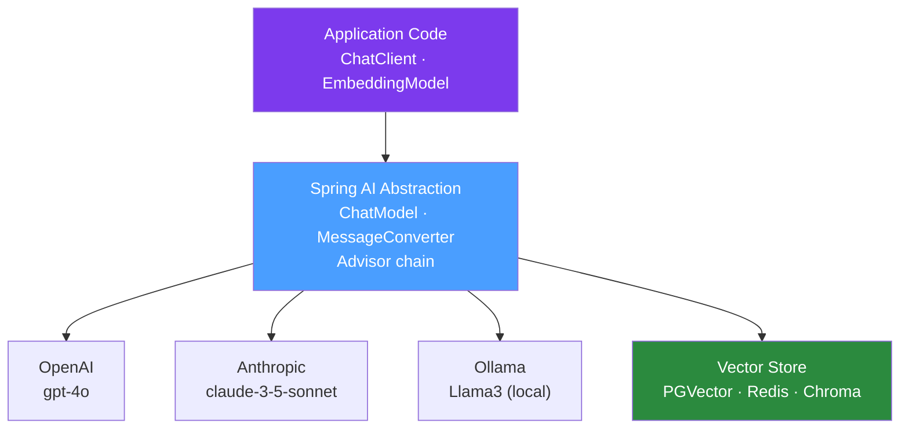

# 🤖 Spring AI

> [!abstract] TL;DR
> Spring AI is the official Spring portfolio project for building AI-powered Java applications. It provides a portable abstraction over AI providers (OpenAI, Anthropic, Azure OpenAI, Ollama) with the same Spring idioms: `@Bean`-configured models, `@Autowired` `ChatClient`, advisor chains for RAG and memory, and Spring Boot autoconfiguration via starters.

## Intuition — analogy FIRST

Spring AI is like **Spring Data for AI models**. Just as Spring Data lets you write `UserRepository` once and swap PostgreSQL for MongoDB without changing business code, Spring AI lets you write `chatClient.prompt("Summarise this").call().content()` once and swap OpenAI GPT-4 for Anthropic Claude or a local Ollama model by changing one dependency and two config lines. The `ChatClient` is the JdbcTemplate equivalent — a high-level, fluent API that hides provider-specific HTTP APIs, authentication, rate limiting, and error handling.

---

## How It Works



## Key Concepts / Details

### Setup

```xml
<!-- pom.xml — Spring Boot 3.x + Spring AI BOM -->
<dependencyManagement>
    <dependencies>
        <dependency>
            <groupId>org.springframework.ai</groupId>
            <artifactId>spring-ai-bom</artifactId>
            <version>1.0.0</version>
            <type>pom</type>
            <scope>import</scope>
        </dependency>
    </dependencies>
</dependencyManagement>

<dependencies>
    <!-- Choose your provider starter -->
    <dependency>
        <groupId>org.springframework.ai</groupId>
        <artifactId>spring-ai-openai-spring-boot-starter</artifactId>
    </dependency>
    <!-- or: spring-ai-anthropic-spring-boot-starter -->
    <!-- or: spring-ai-ollama-spring-boot-starter -->
</dependencies>
```

```yaml
spring:
  ai:
    openai:
      api-key: ${OPENAI_API_KEY}
      chat:
        options:
          model: gpt-4o
          temperature: 0.7
          max-tokens: 2000
```

### ChatClient — Fluent API

```java
@Service
public class CustomerSupportService {
    
    private final ChatClient chatClient;
    
    public CustomerSupportService(ChatClient.Builder builder) {
        this.chatClient = builder
                .defaultSystem("You are a helpful customer support agent for TechCorp. " +
                               "Always be concise and professional.")
                .build();
    }
    
    // Simple text response
    public String answer(String userQuestion) {
        return chatClient.prompt()
                .user(userQuestion)
                .call()
                .content();
    }
    
    // Structured output — extract typed Java object
    public TicketDetails extractTicketDetails(String userMessage) {
        return chatClient.prompt()
                .user(userMessage)
                .call()
                .entity(TicketDetails.class);
    }
    
    // Streaming response (Server-Sent Events)
    public Flux<String> streamAnswer(String question) {
        return chatClient.prompt()
                .user(question)
                .stream()
                .content();
    }
}

// REST endpoint with SSE streaming
@RestController
public class ChatController {
    private final CustomerSupportService service;
    
    @GetMapping(value = "/chat/stream", produces = MediaType.TEXT_EVENT_STREAM_VALUE)
    public Flux<String> streamChat(@RequestParam String question) {
        return service.streamAnswer(question);
    }
}
```

### RAG — Retrieval-Augmented Generation

```java
@Configuration
public class RagConfig {
    
    // 1. Ingest documents into vector store
    @Bean
    public CommandLineRunner ingestDocuments(
            VectorStore vectorStore,
            TokenTextSplitter splitter) {
        return args -> {
            Resource pdf = new ClassPathResource("product-manual.pdf");
            List<Document> docs = new PdfPageDocumentReader(pdf).get();
            List<Document> chunks = splitter.apply(docs);
            vectorStore.accept(chunks);  // embed + store
        };
    }
    
    // 2. RAG-enabled ChatClient
    @Bean
    public ChatClient ragChatClient(ChatClient.Builder builder,
                                     VectorStore vectorStore) {
        return builder
                .defaultAdvisors(
                        new QuestionAnswerAdvisor(vectorStore,
                                SearchRequest.defaults()
                                        .withTopK(5)        // retrieve top 5 chunks
                                        .withSimilarityThreshold(0.75))
                )
                .build();
    }
}
```

### Tool/Function Calling

```java
// Define a tool as a Spring @Bean
@Bean
@Description("Get the current weather for a city")
public Function<WeatherRequest, WeatherResponse> currentWeather(
        WeatherApiClient client) {
    return request -> client.getWeather(request.city(), request.unit());
}

public record WeatherRequest(String city, String unit) {}
public record WeatherResponse(String description, double temperature, String unit) {}

// ChatClient uses the tool automatically
@Service
public class WeatherAssistant {
    private final ChatClient chatClient;
    
    public WeatherAssistant(ChatClient.Builder builder) {
        this.chatClient = builder
                .defaultFunctions("currentWeather")  // register tool
                .build();
    }
    
    public String answer(String question) {
        // If user asks "What's the weather in Tokyo?", model calls currentWeather
        return chatClient.prompt()
                .user(question)
                .call()
                .content();
    }
}
```

### Chat Memory (Multi-turn Conversations)

```java
@Bean
public ChatClient conversationalChatClient(
        ChatClient.Builder builder,
        ChatMemory memory) {
    return builder
            .defaultAdvisors(
                    new MessageChatMemoryAdvisor(memory)  // injects history
            )
            .build();
}

@Bean
public ChatMemory chatMemory() {
    return new InMemoryChatMemory();  // or JdbcChatMemory for persistence
}

// Usage — conversation ID tracks sessions
public String chat(String conversationId, String message) {
    return chatClient.prompt()
            .user(message)
            .advisors(a -> a.param(CHAT_MEMORY_CONVERSATION_ID_KEY, conversationId))
            .call()
            .content();
}
```

### Vector Stores

```yaml
# PGVector (PostgreSQL with vector extension)
spring:
  ai:
    vectorstore:
      pgvector:
        initialize-schema: true
        dimensions: 1536  # OpenAI text-embedding-3-small
```

```java
@Bean
public VectorStore vectorStore(JdbcTemplate jdbcTemplate, EmbeddingModel embeddingModel) {
    return new PgVectorStore(jdbcTemplate, embeddingModel);
}

// Similarity search
List<Document> relevant = vectorStore.similaritySearch(
        SearchRequest.query("What is the return policy?")
                .withTopK(3)
                .withSimilarityThreshold(0.8)
                .withFilterExpression("category == 'policy'")
);
```

### Observability

Spring AI auto-configures Micrometer spans for each model call:

```yaml
management:
  tracing:
    enabled: true
spring:
  ai:
    chat:
      observations:
        include-prompt: true       # Include prompt text in span (caution: PII)
        include-completion: true   # Include response in span
```

Metrics emitted: `gen_ai.client.token.usage` (prompt + completion tokens), `gen_ai.client.operation.duration`.

## Real-World Notes

- **Provider portability**: Spring AI's abstraction means you can start with OpenAI and switch to Anthropic or a local Ollama model without changing business code — just swap the starter and config.
- **Cost management**: Token counts from `ChatResponse.getMetadata().getUsage()`. Cache common prompts with `@Cacheable` on deterministic queries.
- **Testing without API calls**: Use `MockChatModel` in unit tests, WireMock for API-level integration tests.

## Common Pitfalls

- **Blocking in WebFlux**: `chatClient.call()` is synchronous. In a WebFlux context, use `.stream()` which returns `Flux<String>`, or wrap with `Mono.fromCallable(...).subscribeOn(Schedulers.boundedElastic())`.
- **No system prompt**: Without a system prompt, LLMs answer in a generic default style. Always define a system prompt that scopes the model's role.
- **RAG without evaluation**: RAG quality depends on chunk size, embedding model, and similarity threshold. Evaluate retrieval quality with test questions before production.

## Related Concepts
- [[LLM_Integration_Java]] — Lower-level LLM integration patterns with LangChain4j
- [[Java_ML_Libraries]] — Traditional ML libraries for non-LLM use cases

## Review Questions
1. How does Spring AI achieve provider portability across OpenAI, Anthropic, and Ollama?
2. What is the `QuestionAnswerAdvisor` and how does it implement RAG?
3. How do you register a Java function as an LLM tool in Spring AI?
4. How do you stream LLM responses in a Spring MVC REST endpoint?
5. How do you test Spring AI code without making real API calls?

## Sources
- Spring AI Reference: https://docs.spring.io/spring-ai/reference/
- Spring AI GitHub: https://github.com/spring-projects/spring-ai

#java #spring #ai #llm #spring-ai #rag
