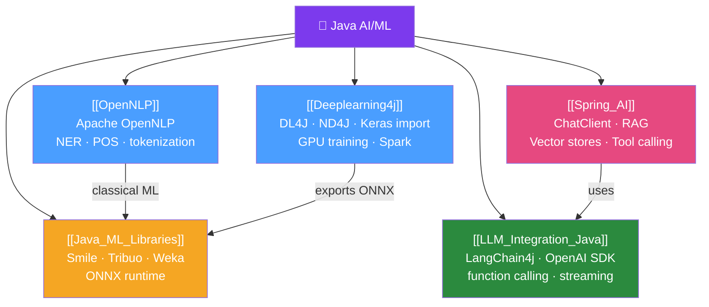

# 🗺️ Java AI/ML — Map of Content

> [!abstract] What This Section Covers
> Java's AI/ML ecosystem has expanded dramatically. This section covers: DL4J for deep learning on the JVM, Apache OpenNLP for classical NLP tasks, Spring AI for integrating LLMs into Spring Boot applications, the broader Java ML library landscape, and patterns for integrating LLMs (Claude, GPT-4) into Java microservices using frameworks like LangChain4j and Spring AI.

## Concept Map

## Learning Path
1. [[Java_ML_Libraries]] — Survey the Java ML landscape before choosing a framework.
2. [[OpenNLP]] — Classical NLP tasks without neural networks.
3. [[Deeplearning4j]] — Training neural networks natively on the JVM.
4. [[LLM_Integration_Java]] — Integrating LLM APIs (OpenAI, Anthropic) into Java services.
5. [[Spring_AI]] — The Spring-idiomatic way to build AI-powered applications.

## All Notes at a Glance
| Note | Difficulty | What You'll Learn |
|------|------------|-------------------|
| [[Deeplearning4j]] | Advanced | DL4J network config, training, Keras import, Spark integration |
| [[OpenNLP]] | Intermediate | Tokenization, NER, POS tagging, custom model training |
| [[Spring_AI]] | Intermediate | ChatClient, RAG pipeline, vector stores, tool calling |
| [[Java_ML_Libraries]] | Intermediate | Smile, Tribuo, Weka, ONNX runtime comparison |
| [[LLM_Integration_Java]] | Advanced | LangChain4j, streaming, tool calling, local LLMs with Ollama |

## Key Questions This Section Answers
- What Java library should I use for classical ML (random forests, SVM)?
- How do I train a named entity recognition model with Apache OpenNLP?
- How does Spring AI abstract over different LLM providers?
- How do I stream LLM responses in a Spring Boot REST endpoint?
- When should I use Java ML vs calling Python ML services?
- How do I implement RAG (Retrieval-Augmented Generation) in Java?

## Related Sections
- [[_MOC_Java_Master|↑ Java Master MOC]]
- [[_MOC_Spring_Batch|↔ Spring Batch]] — batch ML inference pipelines
- [[_MOC_Data_Processing|↔ Java Data Processing]] — feature engineering for ML

#java #ai #ml #MOC #spring-ai
