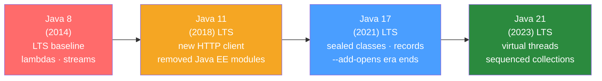

# ⬆️ Java 8 to 21 Migration

> [!abstract] TL;DR
> Migrating from Java 8 to Java 21 involves navigating breaking changes across multiple major releases: Java 9's module system affecting classpath-based apps, Java 11's removed Java EE modules, Java 17's sealed access to JVM internals, and the `javax.*` → `jakarta.*` namespace change in Spring Boot 3. The recommended path is incremental: 8 → 11 → 17 → 21, testing thoroughly at each step.

## Intuition — analogy FIRST

Upgrading Java versions is like **renovating a building floor-by-floor while tenants are still inside**. Each floor (Java version) adds new amenities (features) but some load-bearing walls moved (breaking changes). The biggest disruption was Java 9 (they added the module system — like adding a security card system throughout the building, affecting everyone who relied on internal access). Java 17 was like patching the gaps in the security system. Java 21 added an elevator (virtual threads) that makes everyone faster. The renovation is worth it, but you have to do it carefully, floor-by-floor.

---

## How It Works



## Key Concepts / Details

### Java 8 → Java 11 Breaking Changes

#### Removed Java EE and CORBA Modules

Java 11 removed the Java EE modules that were bundled in Java 8:

| Removed Module | Classes | Replacement |
|---------------|---------|-------------|
| `java.xml.bind` | JAXB (`javax.xml.bind.*`) | `jakarta.xml.bind:jakarta.xml.bind-api` |
| `java.xml.ws` | JAX-WS (`javax.xml.ws.*`) | `jakarta.xml.ws:jakarta.xml.ws-api` |
| `java.activation` | JavaMail activation | `com.sun.activation:javax.activation` |
| `java.corba` | CORBA | None (dead technology) |
| `javax.transaction` | JTA | `jakarta.transaction:jakarta.transaction-api` |

```xml
<!-- Add these to pom.xml when migrating to Java 11+ -->
<dependency>
    <groupId>jakarta.xml.bind</groupId>
    <artifactId>jakarta.xml.bind-api</artifactId>
    <version>4.0.2</version>
</dependency>
<dependency>
    <groupId>com.sun.xml.bind</groupId>
    <artifactId>jaxb-impl</artifactId>
    <version>4.0.5</version>
</dependency>
```

#### New Java 11 APIs

```java
// String methods
"  hello  ".strip();           // locale-aware (vs trim() which is unicode-unaware)
"".isBlank();                  // true if empty or whitespace only
"line1\nline2\nline3".lines(); // Stream<String>
"abc".repeat(3);               // "abcabcabc"

// New HTTP Client (replaces HttpURLConnection and deprecated Apache HttpClient)
HttpClient client = HttpClient.newBuilder()
        .connectTimeout(Duration.ofSeconds(10))
        .build();
HttpResponse<String> response = client.send(
        HttpRequest.newBuilder(URI.create("https://api.example.com/orders"))
                .header("Authorization", "Bearer " + token)
                .GET()
                .build(),
        HttpResponse.BodyHandlers.ofString());

// Files utilities
Path tempFile = Files.createTempFile("prefix", ".tmp");
String content = Files.readString(tempFile, StandardCharsets.UTF_8);
Files.writeString(tempFile, "content", StandardCharsets.UTF_8);
```

### Java 9 Module System Impact

Most existing Java 8 apps use the classpath and are placed in the **unnamed module** when run on Java 9+. This works BUT:

```bash
# Reflection on internal JDK classes now requires --add-opens
# Error: Unable to make field private... accessible: module java.base does not "opens"...
java --add-opens java.base/java.lang=ALL-UNNAMED \
     --add-opens java.base/java.util=ALL-UNNAMED \
     --add-exports java.base/sun.nio.ch=ALL-UNNAMED \
     -jar myapp.jar
```

Long-term solution: don't rely on private JDK internals (Unsafe, private reflection). Modern libraries (Hibernate 6, Jackson 2.14+) are Java 17-module-safe.

### Java 17 Features

```java
// Records (Java 16 GA)
public record OrderSummary(String orderId, BigDecimal total, String status) {
    // Compact constructor for validation
    public OrderSummary {
        if (total.compareTo(BigDecimal.ZERO) < 0) {
            throw new IllegalArgumentException("Total cannot be negative");
        }
    }
}

// Sealed classes (Java 17 GA)
public sealed interface Shape permits Circle, Rectangle, Triangle {}
public record Circle(double radius) implements Shape {}
public record Rectangle(double width, double height) implements Shape {}
public record Triangle(double a, double b, double c) implements Shape {}

// Pattern matching for instanceof (Java 16 GA)
if (obj instanceof Order order && order.getTotal().compareTo(BigDecimal.ZERO) > 0) {
    processOrder(order);
}

// Switch expression (Java 14 GA)
double area = switch (shape) {
    case Circle c -> Math.PI * c.radius() * c.radius();
    case Rectangle r -> r.width() * r.height();
    case Triangle t -> computeTriangleArea(t);
};
```

### Spring Boot 2 → Spring Boot 3 (javax → jakarta)

Spring Boot 3 requires Java 17+ and changed all `javax.*` imports to `jakarta.*`:

```bash
# Automated migration with OpenRewrite
./mvnw org.openrewrite.maven:rewrite-maven-plugin:run \
  -Drewrite.recipeArtifactCoordinates=org.openrewrite.recipe:rewrite-spring:LATEST \
  -Drewrite.activeRecipes=org.openrewrite.java.spring.boot3.UpgradeSpringBoot_3_0
```

```java
// Before (Spring Boot 2 / Java EE)
import javax.persistence.Entity;
import javax.validation.constraints.NotNull;
import javax.servlet.http.HttpServletRequest;

// After (Spring Boot 3 / Jakarta EE)
import jakarta.persistence.Entity;
import jakarta.validation.constraints.NotNull;
import jakarta.servlet.http.HttpServletRequest;
```

Migration checklist:
1. Update Spring Boot to 3.x (`groupId: org.springframework.boot, version: 3.x`)
2. Require Java 17 minimum
3. Replace all `javax.*` imports with `jakarta.*`
4. Update Hibernate to 6.x (if using JPA)
5. Update Flyway to 9.x (Jakarta namespace support)
6. Check all third-party libraries for Spring Boot 3 compatibility

### Java 21 Features

```java
// Virtual threads (Project Loom)
try (var executor = Executors.newVirtualThreadPerTaskExecutor()) {
    IntStream.range(0, 100_000).forEach(i ->
            executor.submit(() -> {
                // Blocking IO — no longer blocks a platform thread
                String result = httpClient.send(request, ...).body();
                return result;
            })
    );
}

// Thread.ofVirtual()
Thread vThread = Thread.ofVirtual().start(() -> System.out.println("virtual!"));

// Sequenced Collections
List<String> list = List.of("a", "b", "c");
list.getFirst();  // "a"
list.getLast();   // "c"
list.reversed();  // ["c", "b", "a"]

// Pattern matching in switch (Java 21 GA)
String formatted = switch (obj) {
    case Integer i -> "Int: " + i;
    case String s when s.length() > 10 -> "Long string: " + s;
    case String s -> "Short string: " + s;
    case null -> "null";
    default -> "Other: " + obj;
};
```

### Deprecated API Replacements

| Java 8 (deprecated) | Modern replacement |
|---------------------|-------------------|
| `new Date()` | `LocalDate.now()` / `Instant.now()` |
| `new SimpleDateFormat("yyyy-MM-dd")` | `DateTimeFormatter.ofPattern("yyyy-MM-dd")` |
| `StringBuffer` (synchronized) | `StringBuilder` |
| `Vector`, `Hashtable` | `ArrayList`, `HashMap` |
| `Thread.stop()`, `suspend()` | Cooperative cancellation, `interrupt()` |
| `SecurityManager` (removed Java 17) | OS-level security |
| `Finalizers` (`finalize()`) | `Cleaner`, `AutoCloseable` |

## Real-World Notes

- **Incremental migration path**: Java 8 → 11 first (LTS), test thoroughly, then 11 → 17, then 17 → 21. Don't skip LTS versions.
- **OpenRewrite**: Automated refactoring tool that handles many mechanical migrations (javax→jakarta, Spring Boot 2→3, JUnit 4→5) without manual search-and-replace.
- **Docker image updates**: When upgrading Java version, update Dockerfile base image: `eclipse-temurin:11-jre-alpine` → `eclipse-temurin:21-jre-alpine`. Test startup time and memory usage.
- **GC changes**: G1 GC is default since Java 9. ZGC is production-ready in Java 21 with generational mode. Re-tune GC flags when upgrading.

## Common Pitfalls

- **Assuming `--add-opens` works forever**: `--add-opens` is a workaround, not a fix. Libraries using `sun.misc.Unsafe` or deep reflection need upgrading. `--add-opens` may be removed in future JDK versions.
- **Forgetting `module-info.java` for libraries**: If you publish a JAR, adding `module-info.java` (JPMS) requires careful planning. Start with unnamed module, migrate gradually.
- **`javax.xml.bind` works in Java 11**: It doesn't — it was removed. Many teams running Java 8 apps on Java 11 use `--add-modules java.xml.bind` which only works until Java 8 EOL in some distributions.

## Related Concepts
- [[Modernizing_Legacy_Java]] — Refactoring the code after the version upgrade
- [[Monolith_to_Microservices]] — Larger modernization context

## Review Questions
1. What modules were removed from Java 8 in Java 11 and what are their replacements?
2. What is the `javax.*` → `jakarta.*` change and which Spring Boot version requires it?
3. What is the `--add-opens` flag and when is it needed?
4. How do virtual threads in Java 21 change the threading model?
5. What is OpenRewrite and what Java migrations can it automate?

## Sources
- Java release notes: https://www.oracle.com/java/technologies/javase/jdk-relnotes-index.html
- Spring Boot 3 migration guide: https://github.com/spring-projects/spring-boot/wiki/Spring-Boot-3.0-Migration-Guide
- OpenRewrite: https://docs.openrewrite.org/

#java #migration #java21 #spring-boot-3 #jakarta
