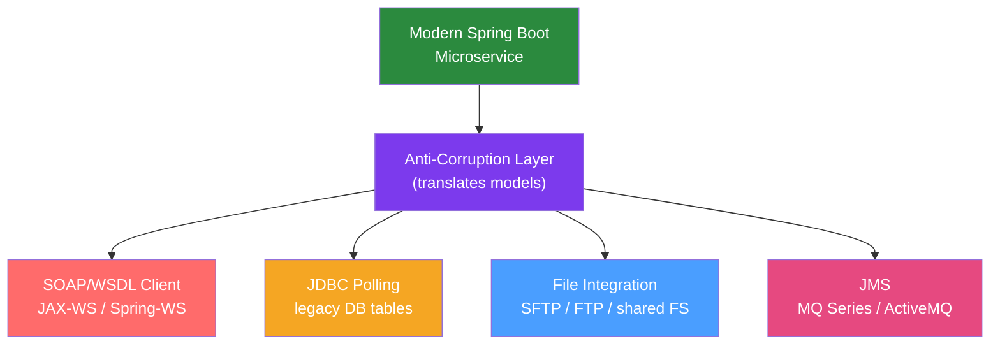

# 🔌 Legacy Integration

> [!abstract] TL;DR
> Integrating with legacy systems requires adapters for each integration style: SOAP web services (JAX-WS or Spring-WS), JDBC polling for legacy databases, SFTP/FTP for file-based exchange, JMS for legacy messaging, and Apache Camel for complex routing. The Anti-Corruption Layer (ACL) pattern translates between legacy domain models and modern models at every integration boundary.

## Intuition — analogy FIRST

Legacy system integration is like **being the translator at a United Nations summit**. Each country (system) speaks a different language — some systems speak SOAP XML (Latin — formal, verbose, old but still used), some speak flat files in EBCDIC (ancient hieroglyphics), some speak Oracle-stored-procedure API (official bureaucratic language), some speak REST (modern English). You (the integration layer) must translate in real-time, keep the UN working, and gradually modernise the communication protocols — without demanding everyone switch languages overnight.

---

## How It Works



## Key Concepts / Details

### SOAP Web Service Client

Many enterprise systems expose SOAP/WSDL web services. Calling them from Java:

```bash
# Generate client stubs from WSDL
wsimport -keep -s src/main/java https://legacy-system/OrderService?wsdl
```

Or with Maven plugin:

```xml
<plugin>
    <groupId>org.codehaus.mojo</groupId>
    <artifactId>jaxws-maven-plugin</artifactId>
    <configuration>
        <wsdlUrls>
            <wsdlUrl>https://legacy-system/OrderService?wsdl</wsdlUrl>
        </wsdlUrls>
        <packageName>com.example.legacy.soap</packageName>
    </configuration>
</plugin>
```

```java
// Generated code usage
@Service
public class LegacyOrderSoapClient {
    
    private final OrderServicePort orderServicePort;
    
    public LegacyOrderSoapClient() {
        OrderService service = new OrderService(
                new URL("https://legacy-system/OrderService?wsdl"),
                new QName("http://legacy.example.com/", "OrderService"));
        this.orderServicePort = service.getOrderServicePort();
    }
    
    public LegacyOrder getOrder(String orderId) {
        try {
            GetOrderRequest request = new GetOrderRequest();
            request.setOrderId(orderId);
            GetOrderResponse response = orderServicePort.getOrder(request);
            return response.getOrder();
        } catch (WebServiceException e) {
            throw new LegacySystemException("SOAP call failed for order " + orderId, e);
        }
    }
}
```

Spring-WS alternative (cleaner, declarative):

```java
@Component
public class SpringWsSoapClient extends WebServiceGatewaySupport {
    
    public GetOrderResponse getOrder(String orderId) {
        GetOrderRequest request = new GetOrderRequest();
        request.setOrderId(orderId);
        
        return (GetOrderResponse) getWebServiceTemplate()
                .marshalSendAndReceive(
                        "https://legacy-system/ws/orders",
                        request,
                        new SoapActionCallback("getOrder"));
    }
}
```

### JDBC Polling — Legacy Database Integration

When you can't change the legacy system but need its data:

```java
@Service
public class LegacyOrderPoller {
    
    private final JdbcTemplate legacyJdbc;
    private final KafkaTemplate<String, OrderEvent> kafka;
    
    // Poll for new orders every 30 seconds
    @Scheduled(fixedDelay = 30_000)
    @Transactional
    public void pollForNewOrders() {
        // Use a "processed" flag or high-water mark to avoid reprocessing
        List<LegacyOrder> newOrders = legacyJdbc.query(
                "SELECT * FROM LEGACY_ORDERS WHERE PROCESSED_FLAG = 'N' AND ROWNUM <= 100 ORDER BY CREATE_DT",
                (rs, n) -> mapToLegacyOrder(rs));
        
        if (newOrders.isEmpty()) return;
        
        for (LegacyOrder legacy : newOrders) {
            // Translate to modern event
            OrderCreatedEvent event = legacyOrderTranslator.toEvent(legacy);
            
            // Publish to Kafka for modern consumers
            kafka.send("order-events", event.getOrderId(), event);
            
            // Mark as processed in legacy DB
            legacyJdbc.update(
                    "UPDATE LEGACY_ORDERS SET PROCESSED_FLAG = 'Y', PROCESSED_DT = SYSDATE WHERE ORDER_ID = ?",
                    legacy.getOrderId());
        }
        
        log.info("Polled and published {} orders from legacy system", newOrders.size());
    }
}
```

### File-Based Integration (SFTP/FTP)

Many legacy systems export data as CSV/fixed-width files via SFTP:

```java
// Apache Camel for SFTP polling (add dependency: camel-sftp-starter)
@Component
public class SftpFileRoute extends RouteBuilder {
    
    @Override
    public void configure() {
        from("sftp://legacy-server/outbound?username=ftpuser&password=secret" +
             "&delay=60000" +          // poll every 60s
             "&move=.processed" +      // move file after processing
             "&stepwise=false" +       // single FTP session
             "&noop=false")            // actually process (move/delete)
             .id("sftp-order-ingestion")
             .log("Processing file: ${header.CamelFileName}")
             .unmarshal().csv()         // parse CSV
             .split(body())             // split rows
             .bean(LegacyFileProcessor.class, "processRow")
             .to("kafka:order-events?brokers=kafka:9092")
             .log("Published ${body} to Kafka");
    }
}
```

For pure Spring without Camel:

```java
@Service
public class SftpPoller {
    
    @Scheduled(cron = "0 */5 * * * *")  // every 5 minutes
    public void pollSftp() throws Exception {
        JSch jsch = new JSch();
        jsch.addIdentity("/path/to/private-key");
        Session session = jsch.getSession("user", "sftp-host", 22);
        session.setConfig("StrictHostKeyChecking", "no");
        session.connect();
        
        ChannelSftp sftp = (ChannelSftp) session.openChannel("sftp");
        sftp.connect();
        
        List<ChannelSftp.LsEntry> files = sftp.ls("/outbound/*.csv");
        for (ChannelSftp.LsEntry file : files) {
            processFile(sftp, file);
            sftp.rename("/outbound/" + file.getFilename(),
                        "/processed/" + file.getFilename());
        }
        
        sftp.disconnect();
        session.disconnect();
    }
}
```

### JMS (IBM MQ / ActiveMQ) Integration

```xml
<dependency>
    <groupId>com.ibm.mq</groupId>
    <artifactId>com.ibm.mq.allclient</artifactId>
    <version>9.3.5.0</version>
</dependency>
```

```java
@Configuration
public class MqConfig {
    
    @Bean
    public MQConnectionFactory mqConnectionFactory() {
        MQConnectionFactory factory = new MQConnectionFactory();
        factory.setHostName("mq-host");
        factory.setPort(1414);
        factory.setQueueManager("QM1");
        factory.setChannel("JAVA.CLIENT.CHANNEL");
        factory.setTransportType(WMQConstants.WMQ_CM_CLIENT);
        return factory;
    }
    
    @Bean
    public JmsListenerContainerFactory<?> mqListenerFactory(
            MQConnectionFactory connectionFactory) {
        DefaultJmsListenerContainerFactory factory = new DefaultJmsListenerContainerFactory();
        factory.setConnectionFactory(connectionFactory);
        factory.setSessionTransacted(true);  // transactional consumption
        factory.setConcurrency("3-10");       // 3-10 concurrent consumers
        return factory;
    }
}

@Component
public class LegacyMqConsumer {
    
    @JmsListener(destination = "LEGACY.ORDERS.QUEUE", 
                 containerFactory = "mqListenerFactory")
    public void onMessage(TextMessage message) throws JMSException {
        String xmlPayload = message.getText();
        LegacyOrderXml legacyOrder = xmlParser.parse(xmlPayload);
        Order order = legacyTranslator.translate(legacyOrder);
        orderService.process(order);
    }
}
```

### Apache Camel for Complex Legacy Routing

Camel provides 300+ components for connecting to legacy systems:

```java
@Configuration
public class LegacyIntegrationRoutes extends RouteBuilder {
    
    @Override
    public void configure() throws Exception {
        
        // Error handling
        onException(LegacySystemException.class)
                .maximumRedeliveries(3)
                .redeliveryDelay(2000)
                .logRetryAttempted(true)
                .handled(true)
                .to("jms:queue:LEGACY.ERROR.QUEUE");
        
        // Route 1: FTP → transformation → Kafka
        from("sftp://legacy/outbound?delay=60000&move=.done")
                .routeId("sftp-to-kafka")
                .convertBodyTo(String.class)
                .unmarshal(new CsvDataFormat())
                .split(body()).streaming()
                .process(this::transformRow)
                .to("kafka:modern-events");
        
        // Route 2: SOAP → REST translation
        from("timer:soap-poll?period=30000")
                .to("cxf:bean:legacyOrderService?defaultOperationName=getNewOrders")
                .split(body())
                .to("rest:POST:http://order-service/api/orders");
    }
}
```

### Fixed-Width File Parsing

Mainframe systems often output fixed-width files:

```java
public class FixedWidthOrderParser {
    
    // Field positions (zero-indexed, inclusive-exclusive)
    private static final int ORDER_ID_START = 0;
    private static final int ORDER_ID_END = 10;
    private static final int AMOUNT_START = 10;
    private static final int AMOUNT_END = 20;
    private static final int STATUS_START = 20;
    private static final int STATUS_END = 22;
    
    public LegacyOrder parse(String line) {
        return new LegacyOrder(
                line.substring(ORDER_ID_START, ORDER_ID_END).trim(),
                new BigDecimal(line.substring(AMOUNT_START, AMOUNT_END).trim()),
                line.substring(STATUS_START, STATUS_END).trim()
        );
    }
}
```

## Real-World Notes

- **Circuit breaker for legacy**: Legacy systems are often less reliable than modern ones. Always wrap legacy calls in a circuit breaker (Resilience4j) to prevent cascade failures.
- **Caching legacy responses**: If the legacy system is slow and data doesn't change often, cache responses with Spring Cache (`@Cacheable`) with an appropriate TTL.
- **Async decoupling**: If the legacy system is slow (e.g., mainframe batch processing), don't call it synchronously from your REST endpoint. Put requests on a queue and return a job ID; poll for completion.

## Common Pitfalls

- **Not handling SOAP faults properly**: `WebServiceException` wraps many SOAP fault types. Parse the fault code to distinguish retryable (timeout) from non-retryable (business error) failures.
- **Character encoding in file processing**: Legacy mainframe files often use EBCDIC encoding, not UTF-8. Always specify encoding explicitly: `Files.readAllLines(path, Charset.forName("IBM037"))`.
- **SFTP polling gaps**: If your SFTP poller crashes mid-poll, files may be partially processed or missed. Use file-move-on-success semantics (move to `.processed/`) to ensure idempotency.
- **Tight coupling to legacy schema**: Direct SQL queries against legacy tables make your code fragile to legacy schema changes. Always use an ACL (adapter class) to isolate legacy data access.

## Related Concepts
- [[Strangler_Fig_Pattern]] — How to use integration adapters during migration
- [[Monolith_to_Microservices]] — Anti-corruption layer in decomposition
- [[Enterprise_Integration_Patterns]] — EIP patterns for legacy connectivity

## Review Questions
1. How do you generate a SOAP client from a WSDL in Java?
2. What is the "high-water mark" pattern for JDBC polling?
3. Why should you always move SFTP files to a "processed" folder after reading?
4. How do you decode EBCDIC-encoded mainframe files in Java?
5. How does Apache Camel simplify legacy integration compared to writing custom adapters?

## Sources
- Apache Camel documentation: https://camel.apache.org/docs/
- IBM MQ Java developer guide: https://www.ibm.com/docs/en/ibm-mq
- Spring-WS documentation: https://docs.spring.io/spring-ws/docs/current/

#java #legacy #integration #soap #camel #sftp
