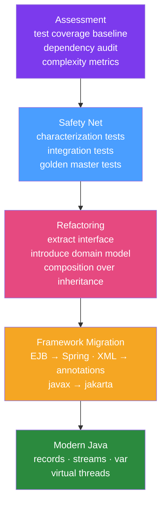

# 🔧 Modernizing Legacy Java

> [!abstract] TL;DR
> Modernizing legacy Java requires a structured approach: establish a test safety net (characterization tests), then incrementally apply refactoring patterns (extract interface, introduce domain model, replace inheritance with composition), migrate from EJB/XML Spring to annotation-based Spring, and eliminate deprecated APIs. Incremental delivery is key — avoid big-bang rewrites.

## Intuition — analogy FIRST

Modernizing legacy code is like **renovating a ship while it's sailing**. You can't stop the ship (business can't pause) and you can't wait until you're in port (that day never comes). You work deck by deck: first, photograph the current state so you know what you're changing (characterization tests). Then replace rotting planks one at a time while the ship keeps sailing. The cardinal rule: don't knock down two walls at once. Each change must keep the ship afloat (all tests passing). The Strangler Fig approach is: build the new hull alongside the old one, gradually move compartments over, then cut away the old hull.

---

## How It Works



## Key Concepts / Details

### Step 1: Assessment

Before changing anything, measure the current state:

```bash
# SonarQube or Checkstyle for metrics:
# - Cyclomatic complexity (target < 10 per method)
# - Code duplication (target < 3%)
# - Test coverage (baseline — improve incrementally)
# - Coupling (afferent = incoming, efferent = outgoing)

# Maven dependency analysis
./mvnw dependency:analyze  # find unused or undeclared deps
./mvnw versions:display-dependency-updates  # find outdated deps

# Find deprecated API usage
grep -r "java.util.Date\|StringBuffer\|Vector\|Hashtable" src/main/java/
grep -r "@Deprecated" src/main/java/  # things you've already flagged
```

### Step 2: Characterization Tests (Safety Net)

When there are no tests, write characterization tests — tests that capture **current behavior** (even if buggy), so refactoring doesn't change it unknowingly:

```java
// Characterization test: document what the system DOES, not what it SHOULD do
@Test
void legacyOrderCalculator_with_discount_code_SAVE20_applies_20_percent() {
    // Arrange
    LegacyOrderCalculator calculator = new LegacyOrderCalculator();
    Order order = buildOrder(100.00, "SAVE20");
    
    // Act
    double total = calculator.calculateTotal(order);
    
    // Assert — capture current behavior
    assertThat(total).isCloseTo(80.00, within(0.01));
    // Note: behavior may be wrong (should be 80 but returns 81 due to bug)
    // We capture 81.0 here and fix the bug AFTER we have full coverage
}
```

### Step 3: Extract Interface for Testability

**Before** (tightly coupled, untestable):

```java
public class OrderService {
    // Directly instantiates dependencies — impossible to test without real DB
    private final LegacyDaoImpl orderDao = new LegacyDaoImpl("jdbc:oracle:...");
    
    public void processOrder(long orderId) {
        Order order = orderDao.findById(orderId);  // hits real DB
        // ... business logic
        orderDao.save(order);
    }
}
```

**After** (extract interface, inject):

```java
// Step 1: Extract interface (from existing LegacyDaoImpl)
public interface OrderRepository {
    Optional<Order> findById(long orderId);
    void save(Order order);
}

// Step 2: Make LegacyDaoImpl implement it
public class LegacyDaoImpl implements OrderRepository {
    // ... existing code unchanged
}

// Step 3: Inject via constructor
public class OrderService {
    private final OrderRepository orderRepository;
    
    public OrderService(OrderRepository orderRepository) {
        this.orderRepository = orderRepository;
    }
    
    public void processOrder(long orderId) {
        Order order = orderRepository.findById(orderId).orElseThrow();
        // Now testable with MockOrderRepository
    }
}
```

### Step 4: Introduce Domain Model

**Anemic domain model** (anti-pattern — service contains all logic):

```java
// Before: Order is just a data holder
public class Order {
    private List<OrderLine> lines;
    private String status;
    // Only getters/setters
}

// All logic in service — hard to reason about, duplicated across services
public class OrderService {
    public boolean canCancel(Order order) { return "PENDING".equals(order.getStatus()); }
    public BigDecimal calculateTotal(Order order) { /* logic */ }
}
```

**Rich domain model** (encapsulate logic in entity):

```java
// After: Order has behavior
public class Order {
    private List<OrderLine> lines;
    private OrderStatus status;
    
    public boolean canCancel() {
        return status == OrderStatus.PENDING;
    }
    
    public void cancel() {
        if (!canCancel()) {
            throw new IllegalStateException("Cannot cancel order in state: " + status);
        }
        this.status = OrderStatus.CANCELLED;
        // Could publish a domain event here
    }
    
    public Money calculateTotal() {
        return lines.stream()
                .map(line -> line.getPrice().multiply(line.getQuantity()))
                .reduce(Money.ZERO, Money::add);
    }
}
```

### Step 5: Migrating from XML Spring to Annotation Config

**Before** (XML configuration):

```xml
<!-- applicationContext.xml -->
<bean id="orderService" class="com.example.OrderServiceImpl">
    <property name="orderDao" ref="orderDao"/>
    <property name="emailService" ref="emailService"/>
</bean>
<bean id="orderDao" class="com.example.OrderDaoImpl">
    <property name="dataSource" ref="dataSource"/>
</bean>
```

**After** (annotation-based with Spring Boot):

```java
@Service  // replaces <bean id="orderService">
public class OrderService {
    
    private final OrderRepository orderRepository;
    private final EmailService emailService;
    
    // Constructor injection (preferred over @Autowired field injection)
    public OrderService(OrderRepository orderRepository, EmailService emailService) {
        this.orderRepository = orderRepository;
        this.emailService = emailService;
    }
}

@Repository  // replaces <bean id="orderDao">
public class OrderRepositoryImpl implements OrderRepository {
    // DataSource auto-configured by Spring Boot
}

// Migration strategy: keep XML config AND annotation config during transition
// Use @ImportResource("classpath:applicationContext.xml") to include legacy XML
@SpringBootApplication
@ImportResource("classpath:legacy/applicationContext.xml")  // import legacy beans
public class Application {
    public static void main(String[] args) {
        SpringApplication.run(Application.class, args);
    }
}
```

### Step 6: Replace Deprecated APIs

```java
// Date/Time migration
// Before
Date now = new Date();
SimpleDateFormat sdf = new SimpleDateFormat("yyyy-MM-dd");
String formatted = sdf.format(now);
Date parsed = sdf.parse("2026-01-15");

// After
LocalDate today = LocalDate.now();
String formatted = today.format(DateTimeFormatter.ISO_LOCAL_DATE);
LocalDate parsed = LocalDate.parse("2026-01-15");

// Legacy collections → streams
// Before
List<String> filtered = new ArrayList<>();
for (Order order : orders) {
    if (order.getTotal() > 100) {
        filtered.add(order.getId());
    }
}

// After
List<String> filtered = orders.stream()
        .filter(o -> o.getTotal().compareTo(BigDecimal.valueOf(100)) > 0)
        .map(Order::getId)
        .toList();
```

### Measuring Progress

```
Week 1:  0% test coverage → 20% (safety net for core flows)
Week 4:  20% → 50% (extract interfaces, inject dependencies)
Week 8:  50% → 70% (introduce domain model, eliminate static/singleton)
Week 12: 70% → 80% (migrate from XML Spring/EJB to annotation Spring)
Week 16: 80% → 85% (Java version upgrade, deprecated API replacement)
```

## Real-World Notes

- **Boy Scout Rule**: "Leave the code cleaner than you found it." Every PR should leave the area touched slightly better — one extracted method, one test added.
- **Feature flag for dark launches**: When refactoring a critical code path, run old and new implementations in parallel (dark launch), compare outputs, then cut over.
- **Technical debt register**: Maintain a living document of technical debt items, prioritised by frequency of change (files changed most often should be modernised first).

## Common Pitfalls

- **Big-bang rewrite**: "We'll rewrite it properly" almost always fails. Business requirements evolve during the rewrite; the new system never reaches feature parity. Strangle instead.
- **Refactoring without tests**: Refactoring untested code is just changing behaviour randomly. Always establish the safety net first.
- **Changing behaviour during refactoring**: Refactoring = behaviour-preserving transformation. Fix bugs in separate commits. Mixing refactoring and bug fixes makes debugging impossible.

## Related Concepts
- [[Java_8_to_21_Migration]] — Version-specific migration steps
- [[Strangler_Fig_Pattern]] — For extracting features to new services
- [[Monolith_to_Microservices]] — For structural decomposition

## Review Questions
1. What is a characterization test and why do you write it before refactoring?
2. Why is the Anemic Domain Model considered an anti-pattern?
3. How do you migrate from XML Spring configuration to annotation-based configuration incrementally?
4. What is the "Boy Scout Rule" in the context of legacy code?
5. Why should you never mix refactoring with bug fixing in the same commit?

## Sources
- Michael Feathers — *Working Effectively with Legacy Code* (the definitive guide)
- Martin Fowler — *Refactoring: Improving the Design of Existing Code*
- OpenRewrite — automated refactoring: https://docs.openrewrite.org/

#java #legacy #refactoring #modernization
