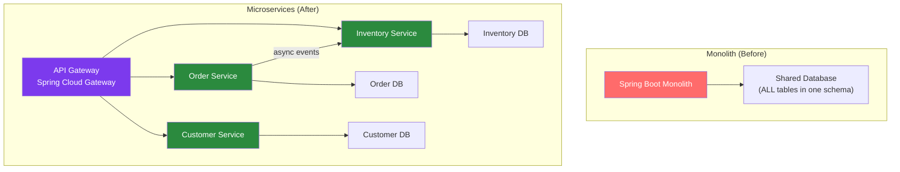

# 🔀 Monolith to Microservices

> [!abstract] TL;DR
> Decomposing a monolith into microservices is a strategic, multi-year effort — not a weekend project. The hardest part is **database decomposition**: moving from a shared schema to service-owned databases. Decomposition should follow bounded context boundaries (from DDD), start with the least-coupled services first, and use the Strangler Fig pattern for incremental migration without a big-bang rewrite.

## Intuition — analogy FIRST

Decomposing a monolith is like **converting a large department store into a shopping mall**. The department store (monolith) is one building with shared infrastructure — one checkout system, one inventory system, one stockroom (database). Converting to a mall: each shop (microservice) gets its own till, its own stock, its own management. The hardest part is splitting the stockroom — you have to physically move inventory, maintain access for existing shops while building new ones, and ensure nothing is lost in transit. You don't demolish the store and build a mall from scratch — you open one shop at a time while the rest of the store keeps operating.

---

## How It Works



## Key Concepts / Details

### When NOT to Decompose

Before starting, validate that decomposition is the right choice:

| Problem | Decomposition Helps? | Better Solution |
|---------|---------------------|-----------------|
| Too slow to deploy | Yes | But consider modular monolith first |
| One team can't scale | Yes | Clear ownership boundaries |
| Different scaling needs per feature | Yes | Extract only that feature |
| Developer productivity | Maybe | Monolith often faster for small teams |
| "Everyone does microservices" | No | Operational complexity is real |
| Performance | No | Decomposition adds network latency |

**Warning signs you're building a distributed monolith**: services that must be deployed together, synchronous call chains across many services, shared databases between services.

### Identifying Bounded Contexts

DDD bounded contexts are the natural decomposition boundaries:

```
E-commerce monolith domains:
┌─────────────────────────────────────────┐
│ Orders          │ Inventory  │ Shipping  │
│ Order.status    │ Stock.qty  │ Shipment  │
│ OrderLine.price │ SKU        │ Tracking  │
├─────────────────────────────────────────┤
│ Customers       │ Payments   │ Catalog   │
│ Customer.email  │ Payment    │ Product   │
│ Address         │ Refund     │ Price     │
└─────────────────────────────────────────┘
```

Extract the **least coupled** bounded context first (fewest references to other domains).

### Database Decomposition Strategy

This is the hardest step. Three phases:

**Phase 1: Separate schema, shared server**

```sql
-- Add schema prefix to all table access in the service
-- Orders service connects to: postgresql://host/db?currentSchema=orders
-- Customer service connects to: postgresql://host/db?currentSchema=customers

-- Cross-service data still accessible via DB joins (temporary)
SELECT o.*, c.email 
FROM orders.order_lines o
JOIN customers.customers c ON o.customer_id = c.id;
```

**Phase 2: Separate databases (break the join)**

```java
// Before: join in DB
// After: join in application code via API call
@Service
public class OrderFulfillmentService {
    
    private final OrderRepository orderRepo;
    private final CustomerServiceClient customerClient;  // HTTP/gRPC call
    
    public OrderSummary getOrderSummary(String orderId) {
        Order order = orderRepo.findById(orderId).orElseThrow();
        CustomerDto customer = customerClient.getCustomer(order.getCustomerId());
        
        return new OrderSummary(order, customer);
    }
}
```

**Phase 3: Event-based data sync (avoid synchronous calls)**

```java
// Order service publishes events when order state changes
@Service
public class OrderService {
    private final KafkaTemplate<String, OrderEvent> kafkaTemplate;
    
    @Transactional
    public void completeOrder(String orderId) {
        Order order = findAndComplete(orderId);
        
        // Publish event for inventory service to update stock
        kafkaTemplate.send("order-events",
                new OrderCompletedEvent(orderId, order.getLineItems()));
    }
}

// Inventory service subscribes and updates its own DB
@KafkaListener(topics = "order-events")
public void onOrderCompleted(OrderCompletedEvent event) {
    event.getLineItems().forEach(item -> 
            inventoryService.decrementStock(item.getSku(), item.getQuantity()));
}
```

### Anti-Corruption Layer for Shared Data

When the new service still needs to read from the legacy monolith's database during migration:

```java
// Temporary: new service reads from legacy DB via ACL
@Repository
public class LegacyCustomerAdapter implements CustomerRepository {
    
    private final JdbcTemplate legacyJdbc;  // connects to legacy monolith DB
    
    @Override
    public Optional<Customer> findById(String id) {
        try {
            return legacyJdbc.queryForObject(
                    "SELECT cust_id, cust_nm, email_addr FROM legacy.customers WHERE cust_id = ?",
                    (rs, n) -> new Customer(
                            rs.getString("cust_id"),
                            rs.getString("cust_nm"),
                            rs.getString("email_addr")),
                    id);
        } catch (EmptyResultDataAccessException e) {
            return Optional.empty();
        }
    }
}
```

Remove this adapter once the Customer service has its own database and data migration is complete.

### Data Migration Strategy

```
1. Dual-write phase (2-4 weeks):
   - New service writes to both legacy DB and its own DB
   - Read from legacy DB (source of truth)
   - Verify data in new DB matches legacy

2. Read migration phase (1-2 weeks):
   - New service reads from its own DB
   - Legacy still writes to both DBs
   - Monitor for data divergence

3. Cutover phase (1 day):
   - Stop legacy writes to legacy DB for this domain
   - New service is the sole owner

4. Cleanup (2-4 weeks):
   - Remove legacy DB access from new service
   - Remove old tables from legacy schema (or archive)
```

### Service Communication Patterns

```java
// Synchronous: request-reply when you need immediate response
@FeignClient("customer-service")
public interface CustomerServiceClient {
    @GetMapping("/customers/{id}")
    CustomerDto getCustomer(@PathVariable String id);
}

// Asynchronous: event-driven when you don't need immediate response
// Producer
kafkaTemplate.send("orders", new OrderPlacedEvent(...));

// Consumer (in inventory service)
@KafkaListener(topics = "orders")
public void reserveInventory(OrderPlacedEvent event) { ... }

// Saga pattern for distributed transactions
// Instead of 2PC, orchestrate via events:
// Order Service → [order.created] → Payment Service
//                                  → [payment.processed] → Inventory Service
//                                                         → [stock.reserved] → Shipping
```

## Real-World Notes

- **Team topology alignment**: Conway's Law says system architecture mirrors team structure. Align service boundaries with team boundaries before decomposing — otherwise teams will fight the boundaries.
- **Strangler fig alongside decomposition**: Use the Strangler Fig (see [[Strangler_Fig_Pattern]]) to incrementally move traffic from monolith to new services. Don't re-implement the monolith entirely first.
- **Modular monolith first**: Before going full microservices, consider a modular monolith (well-separated packages, no cross-module DB joins) — you get most of the organizational benefits without the operational complexity.
- **Service mesh for communication**: Once you have 10+ services, consider Istio or Linkerd for traffic management, mTLS, and observability without changing service code.

## Common Pitfalls

- **Shared database = distributed monolith**: If services share tables, they're not independent. Any schema change requires coordinating all services. The whole point of microservices is independent deployability.
- **Starting with complex domains**: The payment domain is tightly coupled to orders, customers, and inventory. Extract catalog (product management) first — it's usually the least coupled.
- **Ignoring network latency**: What was a method call (nanoseconds) becomes an HTTP call (milliseconds). An N+1 query across services can add 100ms+ latency. Design data locality carefully.
- **Premature decomposition**: At 5 engineers, a monolith is almost always better. At 50 engineers working on the same codebase, decomposition becomes necessary. Size the solution to the problem.

## Related Concepts
- [[Strangler_Fig_Pattern]] — How to extract services incrementally
- [[Legacy_Integration]] — Connecting old and new systems during migration
- [[Modernizing_Legacy_Java]] — Cleaning up the monolith before/during extraction

## Review Questions
1. What is the "distributed monolith" anti-pattern and how do you avoid it?
2. What are the three phases of database decomposition?
3. How do you handle cross-service data queries without shared databases?
4. What is the Saga pattern and how does it handle distributed transactions?
5. When should you choose a modular monolith over microservices?

## Sources
- Sam Newman — *Building Microservices*, 2nd Edition
- Chris Richardson — *Microservices Patterns*
- Martin Fowler — Monolith vs Microservices: https://martinfowler.com/articles/microservices.html

#java #legacy #microservices #decomposition #architecture
