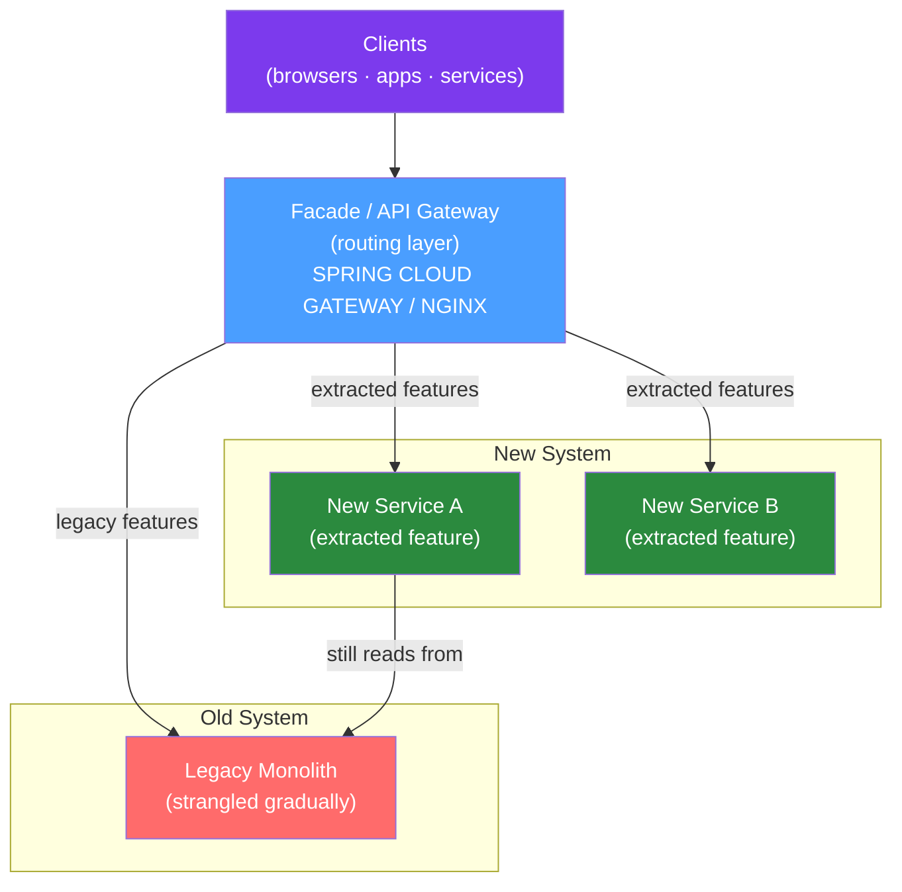

# 🌿 Strangler Fig Pattern

> [!abstract] TL;DR
> The Strangler Fig pattern is an incremental migration strategy where you build new functionality alongside the legacy system and progressively route traffic from the old to the new. Named after the strangler fig tree that grows around its host and eventually replaces it. The pattern avoids big-bang rewrites by delivering value incrementally while maintaining the old system as fallback.

## Intuition — analogy FIRST

The strangler fig tree seeds itself in the canopy of a host tree. It grows downward, wrapping around the host. Over decades, its roots reach the ground and its branches shade the host tree. Eventually, the host tree dies from lack of light, and the strangler fig is a fully independent, robust tree — standing in exactly the same place. The migration is invisible to observers: the forest (users) sees a tree (service) in the same location the whole time. The only difference is what's inside the trunk.

---

## How It Works



## Key Concepts / Details

### The Four Steps

1. **Create the facade**: Put an intercepting layer (API Gateway, NGINX, Spring Cloud Gateway) in front of the monolith. Initially it passes everything through.

2. **Extract a feature**: Build the new service alongside the monolith. Initially, it can call the monolith's database (anti-corruption layer if needed).

3. **Route traffic**: Configure the facade to route the specific feature's endpoints to the new service.

4. **Remove old code**: Once the new service handles all traffic and old code paths are dead, delete the old code from the monolith.

Repeat for each feature until the monolith is empty.

### Spring Cloud Gateway as Strangler Facade

```java
@Configuration
public class StranglerGatewayConfig {
    
    @Bean
    public RouteLocator stranglerRoutes(RouteLocatorBuilder builder) {
        return builder.routes()
                // Route extracted features to new services
                .route("order-service", r -> r
                        .path("/api/v1/orders/**")         // Extracted feature
                        .filters(f -> f.stripPrefix(0))
                        .uri("lb://order-service"))         // New Spring Boot service
                
                .route("inventory-service", r -> r
                        .path("/api/v1/inventory/**")      // Extracted feature
                        .uri("lb://inventory-service"))
                
                // Everything else goes to the monolith
                .route("legacy-monolith", r -> r
                        .path("/**")
                        .uri("http://legacy-monolith:8080"))
                .build();
    }
}
```

### Branch by Abstraction (In-Process Strangling)

When you can't use an external proxy, use Branch by Abstraction to strangle within the same JVM:

```java
// Step 1: Create abstraction
public interface OrderService {
    Order getOrder(String orderId);
    Order placeOrder(PlaceOrderCommand command);
}

// Step 2: Old implementation (existing code behind interface)
@Service("legacyOrderService")
@ConditionalOnProperty(name = "feature.new-order-service", havingValue = "false", matchIfMissing = true)
public class LegacyOrderServiceImpl implements OrderService {
    // ... existing legacy code
}

// Step 3: New implementation
@Service("newOrderService")
@ConditionalOnProperty(name = "feature.new-order-service", havingValue = "true")
public class NewOrderServiceImpl implements OrderService {
    // ... new clean implementation
}

// Step 4: Toggle via configuration
// application.properties: feature.new-order-service=false  (old)
// application.properties: feature.new-order-service=true   (new)
```

### Traffic Shadowing (Validation Pattern)

Before fully routing to the new service, shadow traffic to compare responses:

```java
@Service
public class ShadowingOrderService implements OrderService {
    
    private final OrderService legacyService;
    private final OrderService newService;
    private final DifferenceReporter reporter;
    private final ExecutorService shadowExecutor = Executors.newVirtualThreadPerTaskExecutor();
    
    @Override
    public Order getOrder(String orderId) {
        Order legacyResult = legacyService.getOrder(orderId);  // Always use legacy result
        
        // Shadow: call new service asynchronously, compare
        shadowExecutor.submit(() -> {
            try {
                Order newResult = newService.getOrder(orderId);
                if (!legacyResult.equals(newResult)) {
                    reporter.reportDivergence(orderId, legacyResult, newResult);
                }
            } catch (Exception e) {
                reporter.reportError(orderId, e);
            }
        });
        
        return legacyResult;  // Return legacy result — new service doesn't affect users yet
    }
}
```

### Feature Toggle for Cutover

```java
@Service
public class FeatureToggleOrderService implements OrderService {
    
    private final OrderService legacyService;
    private final OrderService newService;
    private final LaunchDarklyClient featureFlags;
    
    @Override
    public Order getOrder(String orderId) {
        boolean useNewService = featureFlags.boolVariation(
                "use-new-order-service",
                LDContext.create("system"),
                false);
        
        if (useNewService) {
            try {
                return newService.getOrder(orderId);
            } catch (Exception e) {
                log.error("New service failed for order {}, falling back to legacy", orderId, e);
                return legacyService.getOrder(orderId);  // Automatic fallback
            }
        } else {
            return legacyService.getOrder(orderId);
        }
    }
}
```

### Anti-Corruption Layer

When the new service needs data from the legacy system, translate legacy models at the boundary:

```java
// Legacy model (cluttered with legacy conventions)
public class LegacyOrder {
    private int ord_id;
    private String cust_num;
    private double tot_amt;
    private int stat_cd;  // 1=PENDING, 2=COMPLETED, 3=CANCELLED
}

// Modern domain model
public record Order(UUID id, String customerId, Money total, OrderStatus status) {}

// Anti-corruption layer: translates legacy → domain
@Component
public class LegacyOrderAdapter {
    private final LegacyOrderDao legacyDao;
    
    public Optional<Order> findOrder(UUID orderId) {
        LegacyOrder legacy = legacyDao.findByOrdId(toInt(orderId));
        return Optional.ofNullable(legacy)
                .map(this::translate);
    }
    
    private Order translate(LegacyOrder legacy) {
        return new Order(
                toUUID(legacy.getOrd_id()),
                String.valueOf(legacy.getCust_num()),
                Money.of(legacy.getTot_amt(), "USD"),
                toStatus(legacy.getStat_cd())
        );
    }
    
    private OrderStatus toStatus(int statCd) {
        return switch (statCd) {
            case 1 -> OrderStatus.PENDING;
            case 2 -> OrderStatus.COMPLETED;
            case 3 -> OrderStatus.CANCELLED;
            default -> throw new IllegalArgumentException("Unknown status code: " + statCd);
        };
    }
}
```

### Migration Progress Tracking

```
Feature          | Status    | % Traffic New | Cutover Date
-----------------|-----------|---------------|-------------
Order Creation   | Shadowing | 0%            | 2026-03-01
Order Lookup     | Live      | 100%          | 2026-01-15
Order Cancellation | In Dev  | 0%            | 2026-04-01
Payment          | Not started | 0%          | 2026-06-01
```

## Real-World Notes

- **Data synchronization**: When the new service writes to its own DB but reads still hit the legacy DB, you need dual-write or event-based sync until the cutover. This is the hardest part.
- **Canary release**: Route 5% of users to the new service, monitor error rates, gradually increase.
- **Strangling isn't always the answer**: If the legacy system is genuinely unmaintainable (no business logic separation, all stored procedures), rewrite with the strangler fig as a facade might be necessary. But the facade is still valuable.

## Common Pitfalls

- **Starting with the hardest feature**: Start with a small, isolated feature (e.g., profile picture upload) not the core business logic. Build confidence in the process before tackling complex domains.
- **Not monitoring the new service**: The new service needs full observability (metrics, logs, traces) before it handles any production traffic. "Dark launch" without monitoring is flying blind.
- **Leaving the shadow comparison running forever**: Shadow mode is a temporary validation step. Turn it off once divergences drop to zero — it adds latency and operational complexity.

## Related Concepts
- [[Monolith_to_Microservices]] — The broader migration context
- [[Legacy_Integration]] — Anti-corruption layer patterns for legacy data
- [[Modernizing_Legacy_Java]] — Refactoring within the monolith while strangling

## Review Questions
1. What are the four steps of the Strangler Fig pattern?
2. How does traffic shadowing help validate a new service before cutover?
3. What is the purpose of an Anti-Corruption Layer in strangler fig migrations?
4. What is "Branch by Abstraction" and when is it used instead of an API gateway?
5. Why should you start strangling with a small, isolated feature rather than core business logic?

## Sources
- Martin Fowler — Strangler Fig Application: https://martinfowler.com/bliki/StranglerFigApplication.html
- Sam Newman — *Building Microservices* (Chapter on decomposing monoliths)

#java #legacy #strangler-fig #architecture #migration
