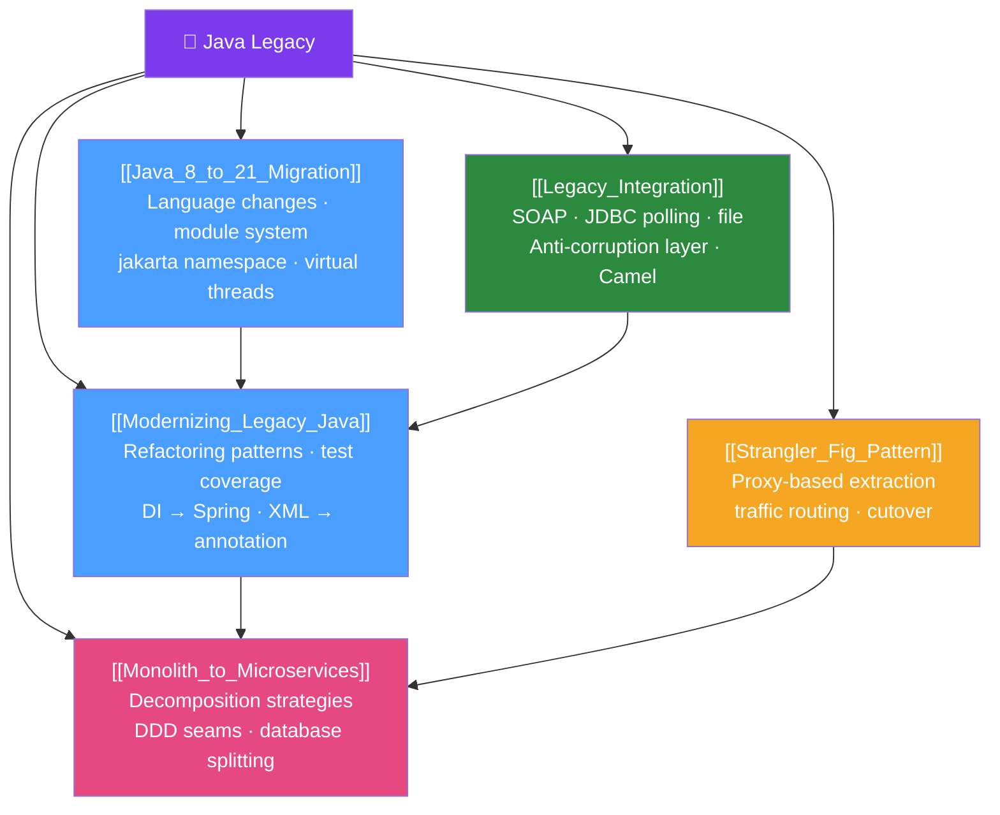

# 🗺️ Java Legacy — Map of Content

> [!abstract] What This Section Covers
> Most Java engineers will spend significant time working with legacy codebases — applications written in Java 6/8 with heavyweight EJBs, XML Spring config, or tightly coupled monoliths. This section covers the practical strategies for modernizing legacy Java: migrating from Java 8 to 21, refactoring techniques, the Strangler Fig pattern for gradual decomposition, monolith-to-microservices migration, and integration patterns for connecting to legacy systems.

## Concept Map

## Learning Path
1. [[Java_8_to_21_Migration]] — Understand what changed between Java versions before modernizing.
2. [[Modernizing_Legacy_Java]] — Apply refactoring patterns to improve the existing codebase.
3. [[Legacy_Integration]] — Connect legacy systems to modern services during migration.
4. [[Strangler_Fig_Pattern]] — Extract features from the legacy system incrementally.
5. [[Monolith_to_Microservices]] — The full decomposition strategy when strangling isn't enough.

## All Notes at a Glance
| Note | Difficulty | What You'll Learn |
|------|------------|-------------------|
| [[Java_8_to_21_Migration]] | Intermediate | Java version changes, namespace migration, breaking changes |
| [[Modernizing_Legacy_Java]] | Advanced | Refactoring patterns, test baselines, Spring migration |
| [[Monolith_to_Microservices]] | Advanced | Decomposition strategy, DB splitting, anti-corruption layer |
| [[Strangler_Fig_Pattern]] | Advanced | Proxy/gateway approach, traffic routing, cutover strategy |
| [[Legacy_Integration]] | Intermediate | SOAP clients, file polling, JDBC bridge, Apache Camel |

## Key Questions This Section Answers
- What breaks when you upgrade from Java 8 to Java 17 or 21?
- What is the `javax.*` → `jakarta.*` namespace change and how do you migrate?
- How do you add tests to a codebase with no tests?
- How does the Strangler Fig pattern work step-by-step?
- How do you split a shared database when decomposing a monolith?
- How do you call a SOAP web service from modern Java code?

## Related Sections
- [[_MOC_Java_Master|↑ Java Master MOC]]
- [[_MOC_Enterprise_Patterns|→ Enterprise Patterns]] — DDD for defining decomposition boundaries
- [[_MOC_Java_DevOps|→ Java DevOps]] — CI/CD for gradually migrated systems

#java #legacy #modernization #MOC
