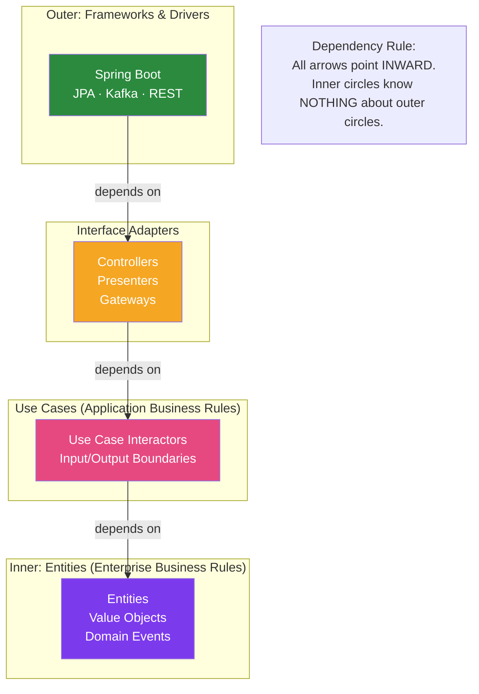

# 🎯 Clean Architecture in Java

> [!abstract] TL;DR
> Clean Architecture (Robert C. Martin) organises code into concentric circles: **Entities** (core business rules), **Use Cases** (application business rules), **Interface Adapters** (controllers/presenters/gateways), **Frameworks & Drivers** (Spring, JPA, Kafka). The **Dependency Rule**: source code dependencies can only point **inward**. Inner circles know nothing about outer circles. This makes business logic independent of frameworks, databases, and UI.

## Intuition — analogy FIRST

Clean Architecture is like the **layers of an onion**. The innermost layer (entities/business rules) is the heart — it doesn't care about what surrounds it. It doesn't know if it's wrapped in a web application or a CLI tool or a batch job. Each outer layer depends on inner layers but not the other way around. Peel away the Spring Boot layer and the business rules still make sense and can be tested. Add a different framework — the rules don't change. The onion can be cut (adapted) in many ways without changing its essential flavour (domain logic).

---

## How It Works



## Key Concepts / Details

### The Four Circles

**Circle 1 — Entities (Enterprise Business Rules)**:
- Most stable, most abstract
- Core business rules that wouldn't change even if you changed the application type
- No framework dependencies whatsoever

```java
// Entity — enterprise-level business rule
// No Spring, no JPA, no Jackson annotations
public class Order {
    private final UUID id;
    private final String customerId;
    private List<OrderLine> lines;
    private OrderStatus status;
    private Money total;
    
    // Business rules baked in:
    public void addItem(Product product, int qty) {
        if (status != OrderStatus.DRAFT) 
            throw new BusinessRuleViolation("Cannot modify confirmed order");
        // ...
    }
    
    public void confirm() {
        if (lines.isEmpty()) 
            throw new BusinessRuleViolation("Empty order cannot be confirmed");
        this.status = OrderStatus.CONFIRMED;
    }
}

// Value Object — enterprise-level
public record Money(BigDecimal amount, String currency) {
    public Money add(Money other) { ... }
    public Money multiply(int qty) { ... }
}
```

**Circle 2 — Use Cases (Application Business Rules)**:
- Orchestrate the flow of data to and from entities
- Define input/output boundaries (ports)
- No knowledge of HTTP, databases, or Spring

```java
// Input boundary (what the use case exposes)
public interface PlaceOrderInputBoundary {
    PlaceOrderOutputData placeOrder(PlaceOrderInputData input);
}

// Output boundary (how results are communicated — Presenter pattern)
public interface PlaceOrderOutputBoundary {
    void presentSuccess(PlaceOrderOutputData data);
    void presentFailure(String errorMessage);
}

// Input/Output data structures (simple data containers — no domain objects)
public record PlaceOrderInputData(String customerId, List<CartItemData> items) {}
public record PlaceOrderOutputData(UUID orderId, Money total, OrderStatus status) {}

// Use Case Interactor
public class PlaceOrderInteractor implements PlaceOrderInputBoundary {
    
    private final OrderRepository orderGateway;       // outbound gateway
    private final PricingGateway pricingGateway;      // outbound gateway
    private final PlaceOrderOutputBoundary presenter;  // output boundary
    
    @Override
    public PlaceOrderOutputData placeOrder(PlaceOrderInputData input) {
        try {
            Money total = pricingGateway.calculatePrice(input.items(), input.customerId());
            Order order = Order.create(input.customerId(), input.items(), total);
            orderGateway.save(order);
            
            PlaceOrderOutputData output = new PlaceOrderOutputData(
                    order.getId(), order.getTotal(), order.getStatus());
            presenter.presentSuccess(output);
            return output;
        } catch (BusinessRuleViolation e) {
            presenter.presentFailure(e.getMessage());
            throw e;
        }
    }
}
```

**Circle 3 — Interface Adapters**:
- Convert data between the use case format and external format (HTTP, DB, Kafka)
- Controllers, Presenters, Gateways
- Only knows about Use Cases and infrastructure in circle 4

```java
// Controller — converts HTTP request to use case input
@RestController
public class PlaceOrderController {
    
    private final PlaceOrderInputBoundary useCase;
    
    @PostMapping("/orders")
    public ResponseEntity<OrderViewModel> placeOrder(@RequestBody OrderRequest request) {
        // Translate HTTP request → use case input data
        PlaceOrderInputData input = new PlaceOrderInputData(
                request.getCustomerId(),
                request.getItems().stream().map(CartItemData::from).toList());
        
        // Execute use case
        PlaceOrderOutputData output = useCase.placeOrder(input);
        
        // Translate use case output → HTTP response
        return ResponseEntity.created(URI.create("/orders/" + output.orderId()))
                             .body(OrderViewModel.from(output));
    }
}

// Gateway — implements the use case's output port for persistence
@Repository
public class JpaOrderGateway implements OrderRepository {
    
    private final JpaOrderSpringDataRepo springData;
    private final OrderEntityMapper mapper;
    
    @Override
    public void save(Order order) {
        springData.save(mapper.toEntity(order));
    }
    
    @Override
    public Optional<Order> findById(UUID id) {
        return springData.findById(id).map(mapper::toDomain);
    }
}
```

**Circle 4 — Frameworks & Drivers**:
- Spring Boot config, JPA entities, Kafka config, REST setup
- Maximum detail, maximum volatility
- Pluggable — swap Spring for Quarkus without touching circles 1–3

### Crossing Circle Boundaries

The critical mechanism: when data crosses inward, you pass simple data structures (DTOs), not domain objects. The Dependency Inversion Principle lets inner circles define interfaces that outer circles implement.

```java
// WRONG — use case depends on Spring (circle 4) — violates dependency rule
@Service  // Spring annotation in use case layer!
public class PlaceOrderUseCase {
    @Autowired  // Spring annotation!
    private JpaOrderRepository repo;  // concrete JPA class from circle 4!
}

// RIGHT — use case defines its own interface; circle 4 implements it
// Use case (circle 2):
public interface OrderRepository {  // defined in circle 2
    void save(Order order);
}

// Circle 4 implements:
@Repository  // Spring in circle 4 only
public class JpaOrderRepository implements OrderRepository { ... }
```

### Comparison: Clean Architecture vs Hexagonal Architecture

| Aspect | Clean Architecture | Hexagonal Architecture |
|--------|-------------------|----------------------|
| Author | Robert C. Martin | Alistair Cockburn |
| Visual metaphor | Concentric circles | Hexagon with ports |
| Circle/zone count | 4 (Entities, UseCases, Adapters, Frameworks) | 3 (Domain, Application, Adapters) |
| Explicit ports | Not named "ports" but same concept | Explicit "port" terminology |
| Presenter pattern | Yes (Output Boundary / Presenter) | Usually not |
| Core idea | Dependency rule + stable abstractions | Ports and adapters |
| Same underlying idea? | **Yes — both put domain at center, framework at outside** | Yes |

### Package Structure

```
src/main/java/com/example/
├── entity/                          ← Circle 1: Enterprise rules
│   ├── Order.java
│   ├── OrderLine.java
│   ├── Money.java
│   └── OrderStatus.java
│
├── usecase/                         ← Circle 2: Application rules
│   ├── port/
│   │   ├── in/
│   │   │   ├── PlaceOrderInputBoundary.java
│   │   │   └── PlaceOrderOutputBoundary.java
│   │   └── out/
│   │       ├── OrderRepository.java
│   │       └── PricingGateway.java
│   └── interactor/
│       └── PlaceOrderInteractor.java
│
├── adapter/                         ← Circle 3: Interface adapters
│   ├── controller/
│   │   └── PlaceOrderController.java
│   ├── presenter/
│   │   └── RestPlaceOrderPresenter.java
│   └── gateway/
│       ├── JpaOrderGateway.java
│       └── OrderEntityMapper.java
│
└── framework/                       ← Circle 4: Frameworks & drivers
    ├── persistence/
    │   ├── OrderEntity.java         (JPA @Entity)
    │   └── OrderJpaRepository.java  (Spring Data)
    ├── config/
    │   ├── SpringConfig.java
    │   └── KafkaConfig.java
    └── web/
        └── WebMvcConfig.java
```

### When to Use Clean Architecture

| Situation | Use Clean Architecture? |
|-----------|------------------------|
| Complex business rules, regulatory domain | Yes — domain must be testable independently |
| Long-lived system (5+ years) | Yes — framework independence pays off |
| Multiple UIs (web + mobile + CLI) | Yes — use cases are UI-agnostic |
| Small CRUD application | No — overhead not justified |
| Microservice with one responsibility | Maybe — hexagonal is simpler for a single context |
| Prototype / startup MVP | No — premature architecture slows delivery |

## Real-World Notes

- **Presenter pattern (optional)**: The Output Boundary / Presenter is the most contentious part of Clean Architecture in practice. Many teams skip it and return DTOs directly from use cases — this works fine for REST APIs.
- **Don't over-invest in circles**: Most real Java teams use a simplified two-ring version: domain (entities + use cases) and infrastructure (adapters + frameworks). The full four circles add complexity that only pays off in very large, long-lived systems.
- **Test independence is the payoff**: The real win is that unit tests for PlaceOrderInteractor don't need Spring context, JPA, or Kafka. They run in milliseconds and are reliable. This is worth the architecture overhead.

## Common Pitfalls

- **Mixing JPA annotations into entities**: `@Entity`, `@Column`, `@GeneratedValue` on your domain Entity class pollutes the innermost circle with framework concerns. Use separate JPA `@Entity` classes in the framework layer.
- **Returning domain objects from use cases**: Use cases return simple output data structures — not domain objects. Returning an `Order` entity from a use case leaks domain internals and creates coupling.
- **Architecture police syndrome**: Architecture boundaries should serve the team, not imprison it. If a strict rule causes enormous boilerplate for a trivial case, it's OK to make a pragmatic exception.

## Related Concepts
- [[Hexagonal_Architecture]] — Equivalent pattern with different vocabulary
- [[Domain_Driven_Design_Java]] — DDD provides the tactical patterns for circle 1 (entities)
- [[SOLID_Principles_Java]] — DIP is the mechanism that makes the dependency rule work

## Review Questions
1. What is the Dependency Rule in Clean Architecture and which direction do dependencies point?
2. What is the difference between Circle 1 (Entities) and Circle 2 (Use Cases)?
3. Why should domain entities NOT have JPA annotations like `@Entity`?
4. How do input/output data structures (DTOs) differ from domain entities?
5. How is Clean Architecture different from Hexagonal Architecture?

## Sources
- Robert C. Martin — *Clean Architecture: A Craftsman's Guide to Software Structure and Design*
- Tom Hombergs — *Get Your Hands Dirty on Clean Architecture* (Java-focused)
- Clean Architecture blog post: https://blog.cleancoder.com/uncle-bob/2012/08/13/the-clean-architecture.html

#java #clean-architecture #architecture #uncle-bob #dependency-rule
