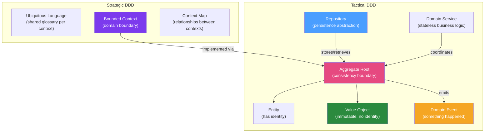

# 🏛️ Domain-Driven Design in Java

> [!abstract] TL;DR
> Domain-Driven Design (DDD) is a software design approach that aligns code structure with business domains. **Strategic DDD** uses bounded contexts, ubiquitous language, and context maps to organise large systems. **Tactical DDD** uses entities, value objects, aggregates, repositories, domain services, and domain events to implement each context in code. DDD is most valuable in complex business domains — overkill for CRUD apps.

## Intuition — analogy FIRST

DDD is like **designing a hospital** using the hospital's own organizational structure. The hospital has departments: Emergency (has its own notion of "Patient"), Radiology ("Patient" is just a scan record), Billing ("Patient" is an account number). Each department has its own language — what "Patient Admitted" means in Emergency is different from what it means in Billing. DDD says: each department (bounded context) should have its own model and its own language (ubiquitous language), even if it sometimes means the same real-world concept appears as different objects in different departments. Trying to share one "Patient" class across all departments creates a monster class that satisfies nobody.

---

## How It Works



## Key Concepts / Details

### Bounded Context

A bounded context is an explicit boundary where a particular domain model applies. Within the boundary, all terms have precise meanings (ubiquitous language). The same word may mean different things in different contexts.

```
Bounded Context: Order Management
  "Order" = shopping order with line items, shipping address, payment
  "Customer" = shipping address + contact info (just what order needs)
  "Product" = just a product ID + price at time of purchase

Bounded Context: Customer Service
  "Order" = customer inquiry with timeline of events
  "Customer" = full profile, history, preferences, loyalty points
  "Product" = doesn't exist here
```

Each bounded context becomes its own Java package (or microservice):

```
com.example.orders/          ← Order Management bounded context
  domain/
    model/
      Order.java             ← Order aggregate root
      OrderLine.java         ← Entity
      Money.java             ← Value object
      OrderStatus.java       ← Value object (enum)
    events/
      OrderPlaced.java       ← Domain event
    repository/
      OrderRepository.java   ← Repository interface
    service/
      PricingService.java    ← Domain service
```

### Entity vs Value Object

**Entity**: Has a unique identity that persists over time. Two entities with the same data are still different if they have different IDs.

**Value Object**: Defined entirely by its attributes. Two value objects with the same attributes are equal. Immutable.

```java
// ENTITY — has identity (orderId)
public class Order {  // Aggregate Root (also an entity)
    private final UUID id;           // identity
    private OrderStatus status;      // mutable state
    private List<OrderLine> lines;   // child entities
    
    // Two orders with same items but different IDs are different Orders
    @Override
    public boolean equals(Object o) {
        if (!(o instanceof Order other)) return false;
        return id.equals(other.id);  // identity-based equality
    }
}

// VALUE OBJECT — no identity, immutable
public record Money(BigDecimal amount, Currency currency) {
    
    public Money {
        Objects.requireNonNull(amount);
        Objects.requireNonNull(currency);
        if (amount.scale() > 2) throw new IllegalArgumentException("Max 2 decimal places");
    }
    
    public Money add(Money other) {
        if (!currency.equals(other.currency)) throw new CurrencyMismatchException();
        return new Money(amount.add(other.amount), currency);
    }
    
    public Money multiply(int quantity) {
        return new Money(amount.multiply(BigDecimal.valueOf(quantity)), currency);
    }
    
    // Two Money(10.00, USD) == Two Money(10.00, USD) ← value-based equality (from record)
}

// VALUE OBJECT — address
public record ShippingAddress(
    String street,
    String city,
    String postalCode,
    String country
) {
    // Immutable, value-based equality — Java records are perfect for VOs
}
```

### Aggregate

An aggregate is a cluster of domain objects (one root entity + optional child entities and value objects) that form a consistency boundary. **Only the Aggregate Root** is accessible from outside. All state changes go through the root, which enforces invariants.

```java
// Aggregate Root: Order
public class Order {
    
    private final UUID id;
    private final String customerId;
    private List<OrderLine> lines;  // Child entities — not exposed directly
    private OrderStatus status;
    private Money total;
    
    // Private constructor — use factory methods
    private Order(UUID id, String customerId) {
        this.id = id;
        this.customerId = customerId;
        this.lines = new ArrayList<>();
        this.status = OrderStatus.DRAFT;
        this.total = Money.ZERO;
    }
    
    // Factory method (also validates invariants)
    public static Order create(String customerId) {
        if (customerId == null || customerId.isBlank())
            throw new DomainException("Customer ID required");
        return new Order(UUID.randomUUID(), customerId);
    }
    
    // Domain behaviour — not just setters
    public void addItem(Product product, int quantity) {
        if (status != OrderStatus.DRAFT) 
            throw new DomainException("Cannot modify confirmed order");
        if (quantity <= 0) 
            throw new DomainException("Quantity must be positive");
        
        // Find existing line or create new one
        lines.stream()
             .filter(l -> l.productId().equals(product.id()))
             .findFirst()
             .ifPresentOrElse(
                 l -> l.increaseQuantity(quantity),
                 () -> lines.add(new OrderLine(product.id(), product.price(), quantity))
             );
        
        recalculateTotal();
    }
    
    public void confirm() {
        if (lines.isEmpty()) throw new DomainException("Cannot confirm empty order");
        if (status != OrderStatus.DRAFT) throw new DomainException("Order already confirmed");
        status = OrderStatus.CONFIRMED;
        registerEvent(new OrderConfirmed(id, customerId, lines, total, Instant.now()));
    }
    
    // Return defensive copy — never expose mutable internal list
    public List<OrderLine> getLines() {
        return Collections.unmodifiableList(lines);
    }
    
    // Domain event registration (published after transaction commits)
    private final List<DomainEvent> events = new ArrayList<>();
    
    protected void registerEvent(DomainEvent event) { events.add(event); }
    
    public List<DomainEvent> pullEvents() {
        List<DomainEvent> copy = List.copyOf(events);
        events.clear();
        return copy;
    }
}

// Child entity — only accessible through Order
public class OrderLine {
    private final UUID productId;
    private final Money unitPrice;
    private int quantity;
    
    // Package-private constructor — only Order can create this
    OrderLine(UUID productId, Money unitPrice, int quantity) {
        this.productId = productId;
        this.unitPrice = unitPrice;
        this.quantity = quantity;
    }
    
    void increaseQuantity(int extra) { quantity += extra; }
    
    public Money lineTotal() { return unitPrice.multiply(quantity); }
}
```

### Repository

The Repository interface belongs to the domain layer. The implementation belongs to the infrastructure layer.

```java
// Domain layer — defines the contract
public interface OrderRepository {
    void save(Order order);
    Optional<Order> findById(UUID id);
    List<Order> findByCustomerId(String customerId);
    List<Order> findByStatus(OrderStatus status);
}

// Infrastructure layer — Spring Data JPA implementation
@Repository
public class JpaOrderRepository implements OrderRepository {
    
    private final OrderJpaRepository jpa;  // Spring Data JPA repository
    private final OrderMapper mapper;
    
    @Override
    @Transactional
    public void save(Order order) {
        OrderEntity entity = mapper.toEntity(order);
        jpa.save(entity);
        
        // Publish domain events after successful save
        order.pullEvents().forEach(eventPublisher::publishEvent);
    }
    
    @Override
    public Optional<Order> findById(UUID id) {
        return jpa.findById(id).map(mapper::toDomain);
    }
}
```

### Domain Service

A Domain Service contains business logic that doesn't naturally belong to a single aggregate. Stateless, named after domain concepts.

```java
// Domain service: transfers money between accounts (spans two aggregates)
public class MoneyTransferService {
    
    private final AccountRepository accountRepository;
    
    public void transfer(UUID fromId, UUID toId, Money amount) {
        Account from = accountRepository.findById(fromId)
                .orElseThrow(() -> new DomainException("Account not found: " + fromId));
        Account to = accountRepository.findById(toId)
                .orElseThrow(() -> new DomainException("Account not found: " + toId));
        
        // Business logic spanning two aggregates
        from.debit(amount);
        to.credit(amount);
        
        accountRepository.save(from);
        accountRepository.save(to);
    }
}
```

### Domain Events

Domain events record something important that happened in the domain:

```java
// Domain event interface
public interface DomainEvent {
    UUID eventId();
    Instant occurredAt();
}

// Concrete event
public record OrderPlaced(
    UUID eventId,
    UUID orderId,
    String customerId,
    List<OrderLine> items,
    Money total,
    Instant occurredAt
) implements DomainEvent {
    
    public OrderPlaced(UUID orderId, String customerId, 
                       List<OrderLine> items, Money total) {
        this(UUID.randomUUID(), orderId, customerId, items, total, Instant.now());
    }
}

// Publish via Spring application events (in-process)
@Component
public class OrderEventPublisher {
    private final ApplicationEventPublisher publisher;
    
    public void publish(List<DomainEvent> events) {
        events.forEach(publisher::publishEvent);
    }
}

// React to domain event (in-process)
@Component
public class InventoryReservationPolicy {
    
    @EventListener
    @Async
    public void on(OrderPlaced event) {
        inventoryService.reserve(event.orderId(), event.items());
    }
}
```

### Context Map — Integration Patterns

```
ORDER CONTEXT ──[Customer/Supplier]──> PAYMENT CONTEXT
                                         ^
ORDER CONTEXT ──[Anti-Corruption Layer]──> LEGACY ERP
```

| Relationship | Description |
|--|--|
| **Shared Kernel** | Two contexts share a small subset of the model (e.g., user identity) |
| **Customer/Supplier** | Downstream uses upstream's API; upstream considers downstream needs |
| **Conformist** | Downstream accepts upstream's model without translation |
| **Anti-Corruption Layer (ACL)** | Downstream translates upstream's model to its own — isolation |
| **Open Host Service** | Upstream provides a well-defined, versioned API for many consumers |
| **Published Language** | Shared data format (JSON schema, Avro) as integration contract |

## Real-World Notes

- **DDD is not for CRUD**: If your domain is "store and retrieve records," DDD adds complexity with no value. DDD shines in complex business rules — insurance, logistics, finance, healthcare.
- **Ubiquitous language in code**: Class names, method names, and variable names should use the exact terms domain experts use. If the business calls it "Fulfilment Note," your class is `FulfilmentNote`, not `ShipmentDocument`.
- **Aggregate size**: Keep aggregates small. An aggregate that loads 500 related objects for every operation has a consistency boundary that's too large. Prefer eventual consistency across aggregate boundaries.

## Common Pitfalls

- **Anemic domain model**: `Order` is just a bag of getters/setters, all business logic in `OrderService`. This is Procedural Programming, not DDD. Behaviour belongs in domain objects.
- **Huge aggregates**: Loading an `Order` that also loads the `Customer` and all their history violates the aggregate boundary. `Order` only needs `customerId` (reference), not the full `Customer`.
- **Exposing child entities directly**: Returning `order.getLines()` as a mutable list lets callers bypass the aggregate's invariants. Always return unmodifiable views.

## Related Concepts
- [[Event_Storming]] — Workshop to discover the bounded contexts and events
- [[Hexagonal_Architecture]] — Structural pattern for implementing a bounded context
- [[Monolith_to_Microservices]] — Bounded contexts define decomposition seams

## Review Questions
1. What is the difference between an Entity and a Value Object? Give a Java example of each.
2. What rules define an Aggregate Root?
3. Why does the Repository interface belong in the domain layer, not the infrastructure layer?
4. What is a Domain Service and when should you use one instead of putting logic in an Aggregate?
5. What does "ubiquitous language" mean and how does it affect your Java class names?

## Sources
- Eric Evans — *Domain-Driven Design: Tackling Complexity in the Heart of Software*
- Vaughn Vernon — *Implementing Domain-Driven Design*
- DDD Reference (free): https://www.domainlanguage.com/ddd/reference/

#java #ddd #architecture #aggregate #bounded-context #domain-events
