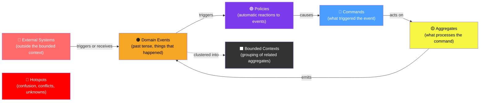

# 🟠 Event Storming

> [!abstract] TL;DR
> Event Storming is a collaborative **domain discovery workshop** invented by Alberto Brandolini. Domain experts and developers together map domain events (orange stickies) on a long wall timeline. From these events, they identify commands, aggregates, policies, bounded contexts, and hotspots. The output is a shared understanding of the business domain — the foundation for DDD tactical design and microservices decomposition.

## Intuition — analogy FIRST

Event Storming is like **turning a business process into a movie storyboard** — but done collaboratively on a very long wall. Instead of frames in a film, you have sticky notes: orange for things that happened (events), blue for actions requested (commands), yellow for the business rules that react to events (policies). The story flows left-to-right through time. Everyone in the room — domain experts, architects, developers — adds notes and argues about the ordering. By the end, you have a complete picture of the business nobody had in their head alone, showing where things are messy (red "hotspot" notes), where the domain really starts and ends (bounded contexts), and who or what causes things to happen.

---

## How It Works



## Key Concepts / Details

### The Three Levels of Event Storming

**Level 1 — Big Picture Event Storming** (2–4 hours, entire domain):
- Goal: Shared understanding of the whole business domain
- Participants: All stakeholders, domain experts, developers
- Output: Timeline of domain events, hotspots, rough bounded context boundaries
- When: Starting a new project, exploring an unknown legacy domain

**Level 2 — Process Level Event Storming** (2–4 hours, one bounded context):
- Goal: Understand the detailed flow of one process
- Participants: Domain experts + developers for that context
- Output: Commands, aggregates, policies, external systems mapped
- When: Before designing a specific service

**Level 3 — Design Level Event Storming** (ongoing, per aggregate):
- Goal: Design the actual code — aggregates, value objects, domain events
- Output: Aggregate design ready for implementation
- When: Just before coding; outputs drive the DDD tactical design

### Sticky Note Color Code

| Color | Represents | Format | Example |
|-------|-----------|--------|---------|
| 🟠 Orange | Domain Event | Past tense verb | `OrderPlaced`, `PaymentFailed` |
| 🔵 Blue | Command | Imperative verb | `PlaceOrder`, `CancelPayment` |
| 🟡 Yellow | Aggregate | Noun | `Order`, `Payment`, `Customer` |
| 🟣 Purple | Policy / Reaction | "When... then..." | `When OrderPlaced → ReserveStock` |
| 🩷 Pink | External System | System name | `PayPal`, `Stripe`, `Legacy ERP` |
| 🔴 Red | Hotspot | Question/problem | `Who owns the price?` |
| ⬛ Black | Bounded Context | Context name | `Order Management`, `Payments` |
| 🟢 Green | Read Model/View | What user sees | `Order summary screen` |

### Running a Big Picture Session

**Step 1 — Prepare the space** (30 min before):
- Tape together 5-10 meters of paper/whiteboard on a wall
- Put out unlimited orange, blue, yellow, purple, pink, red sticky notes
- Write "start here" on the left, "end here" on the right

**Step 2 — Chaos (45 min)**:
- Everyone (silently or quietly) writes domain events on orange stickies
- Format: **past tense verb + noun** (e.g., "Order Placed", "Payment Failed")
- Stick them on the wall in rough timeline order
- No debate yet — just get everything on the wall

**Step 3 — Enforce timeline (30 min)**:
- Group and reorder events into a coherent timeline
- Remove obvious duplicates (discuss which word to keep)
- Add missing events that nobody wrote

**Step 4 — Hotspots (15 min)**:
- Mark anything confusing, disputed, or unknown with a red sticky
- "Who decides the price?" "What happens if inventory is out?" "This process is unclear"

**Step 5 — Context boundaries (30 min)**:
- Draw vertical lines to separate groups of related events
- These are your bounded context candidates
- Name each context (noun phrase: "Order Management", "Inventory", "Payments")

**Step 6 — Commands and actors (30 min, optional)**:
- For each event, add the blue command that triggered it
- Add who (actor) or what (policy) issued the command

### From Events to Code

Event Storming output directly maps to DDD tactical patterns:

```
Event Storming Output          DDD Tactical Concept
───────────────────────────   ─────────────────────────
Orange sticky (event)      →  Domain Event class
Blue sticky (command)      →  Command class / use case
Yellow sticky (aggregate)  →  Aggregate Root class
Purple sticky (policy)     →  Domain Service / Saga
Black context boundary     →  Bounded Context / package
Red hotspot                →  Risk to resolve before coding
```

```java
// Event Storming identified: "Order Placed" event, "Place Order" command, "Order" aggregate

// 1. Domain Event
public record OrderPlaced(
    UUID orderId,
    String customerId,
    List<OrderLine> items,
    Money total,
    Instant occurredAt
) implements DomainEvent {}

// 2. Command
public record PlaceOrderCommand(
    String customerId,
    List<CartItem> items,
    ShippingAddress address
) {}

// 3. Aggregate handles command, emits event
public class Order {  // Aggregate Root
    
    public static Order place(PlaceOrderCommand command, 
                               PricingService pricing) {
        // business rules
        if (command.items().isEmpty()) 
            throw new DomainException("Cannot place empty order");
        
        Order order = new Order(UUID.randomUUID(), command.customerId(),
                                command.items(), OrderStatus.PENDING);
        
        // Register domain event (to be published after commit)
        order.registerEvent(new OrderPlaced(
            order.id, order.customerId, order.lines, order.total, Instant.now()
        ));
        
        return order;
    }
}

// 4. Policy: "When OrderPlaced → ReserveStock"
@Component
public class ReserveStockOnOrderPlaced {
    
    @EventListener
    public void on(OrderPlaced event) {
        // Triggered automatically after OrderPlaced
        inventoryService.reserveStock(
            event.orderId(), event.items()
        );
    }
}
```

### Common Bounded Context Patterns Found in Event Storming

```
E-commerce Example — Event Storming output:

CATALOG         │ ORDERING          │ PAYMENTS        │ FULFILLMENT
────────────────┼───────────────────┼─────────────────┼──────────────
ProductAdded    │ CartItemAdded     │ PaymentInitiated│ WarehousePicked
PriceUpdated    │ OrderPlaced       │ PaymentSucceeded│ ShipmentCreated
StockDepleted   │ OrderConfirmed    │ PaymentFailed   │ Delivered
                │ OrderCancelled    │ RefundIssued    │ ReturnStarted
                │                   │                 │
Policy:         │ Policy:           │ Policy:         │ Policy:
When PriceUp →  │ When PaySuccess → │ When PayFail →  │ When OrderConf
Notify catalog  │ Confirm order     │ Cancel order    │ → Pick items
```

### Hotspot Resolution Process

Hotspots (red stickies) are gold — they reveal where the business logic is unclear:

**Common hotspot types:**
- **Ownership disputes**: "Does `Order` or `Customer` own loyalty points?"
- **Timing conflicts**: "Does stock reservation happen before or after payment?"
- **Missing events**: "What happens when partial delivery arrives?"
- **External system dependencies**: "When does PayPal notify us vs when do we poll?"

**Resolution**: Schedule follow-up conversations with the right domain experts. Don't resolve in the workshop — capture and schedule.

## Real-World Notes

- **Use physical stickies**: Remote tools (Miro, Mural) work but physical stickies get better participation. People move, cluster, and discuss differently in person.
- **Facilitator is critical**: The facilitator keeps the session moving, prevents one voice dominating, and ensures events are past-tense verbs. This is a skill — practice it.
- **Not a design session**: Event Storming discovers the domain. Architecture and code design come after. Don't let developers start discussing technical implementation during the workshop.
- **Multiple sessions**: A big e-commerce domain might need 3–4 Big Picture sessions across a week, followed by Process sessions for each bounded context.

## Common Pitfalls

- **Events in present tense or future tense**: "Order is Placed" or "Order will be Placed" — wrong. Must be past tense: "Order Placed". Past tense forces clarity about what actually happened.
- **Starting with commands not events**: Some teams want to list commands first ("what can the user do?"). Start with events — they force business thinking, not UI thinking.
- **No domain experts in the room**: A session with only developers produces developer-assumptions, not business reality. If the domain expert says "our business doesn't work that way," that's the entire value of the exercise.
- **Skipping hotspots**: Teams tempted to resolve every hotspot in the session lose momentum. Mark it red and move on — hotspots are debts to settle later.

## Related Concepts
- [[Domain_Driven_Design_Java]] — Event Storming output maps directly to DDD tactical patterns
- [[Hexagonal_Architecture]] — Bounded contexts become service/package boundaries
- [[Monolith_to_Microservices]] — Bounded contexts from Event Storming are the decomposition seams

## Review Questions
1. What are the three levels of Event Storming and when is each used?
2. What do orange, blue, yellow, and purple stickies represent?
3. How does an orange sticky note map to Java code?
4. What is a hotspot in Event Storming and how should it be handled?
5. Why must domain events be written in past tense?

## Sources
- Alberto Brandolini — *Introducing EventStorming* (Leanpub, 2021)
- EventStorming.com — https://www.eventstorming.com/
- Vaughn Vernon — *Domain-Driven Design Distilled* (Chapter on Event Storming)

#java #event-storming #ddd #domain-discovery #architecture
