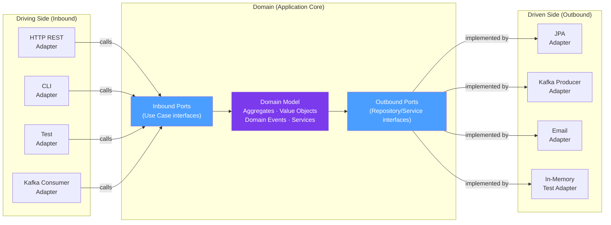

# ⬡ Hexagonal Architecture

> [!abstract] TL;DR
> Hexagonal Architecture (Ports and Adapters) puts the **domain at the center** and defines explicit **ports** (interfaces) for everything the domain talks to. The outside world communicates through **adapters** — implementations of those ports. This makes the domain completely isolated from frameworks, databases, and HTTP concerns. You can swap Spring Data JPA for MongoDB, or test with in-memory adapters, without touching domain code.

## Intuition — analogy FIRST

A hexagonal architecture is like a **universal power adapter**. Your laptop (domain) has one standard port (the charging standard — the "port"). You can plug it into UK sockets, US sockets, EU sockets, or a USB-C hub — each is an adapter that converts the local power standard to what your laptop needs. The laptop doesn't know or care whether it's in London or New York. Similarly, your domain doesn't know whether it's talking to a PostgreSQL database, a Kafka queue, or an in-memory test double — all of these are adapters that implement the domain's port interfaces.

---

## How It Works



## Key Concepts / Details

### Ports

**Inbound Ports** (Driving): Interfaces that the domain exposes to the outside world. They represent **use cases** — what the application can do.

**Outbound Ports** (Driven): Interfaces that the domain requires from the outside world. They represent **dependencies** — what the application needs.

```java
// INBOUND PORT — a use case the application exposes
public interface PlaceOrderUseCase {
    OrderId placeOrder(PlaceOrderCommand command);
}

// INBOUND PORT — another use case
public interface GetOrderQuery {
    OrderDetails getOrder(UUID orderId);
    List<OrderDetails> getOrdersByCustomer(String customerId);
}

// OUTBOUND PORT — something the domain needs (to persist)
public interface OrderRepository {
    void save(Order order);
    Optional<Order> findById(UUID id);
}

// OUTBOUND PORT — something the domain needs (to notify)
public interface OrderEventPublisher {
    void publish(DomainEvent event);
}

// OUTBOUND PORT — something the domain needs (external service)
public interface PricingPort {
    Money calculatePrice(List<CartItem> items, String customerId);
}
```

### Application Service (Use Case Implementation)

The application service implements the inbound port. It orchestrates domain objects and calls outbound ports. It has no business logic — only coordination.

```java
@Service
@Transactional
public class PlaceOrderService implements PlaceOrderUseCase {
    
    // Outbound ports injected by Spring
    private final OrderRepository orderRepository;
    private final OrderEventPublisher eventPublisher;
    private final PricingPort pricing;
    private final InventoryPort inventory;
    
    public PlaceOrderService(OrderRepository orderRepository,
                             OrderEventPublisher eventPublisher,
                             PricingPort pricing,
                             InventoryPort inventory) {
        this.orderRepository = orderRepository;
        this.eventPublisher = eventPublisher;
        this.pricing = pricing;
        this.inventory = inventory;
    }
    
    @Override
    public OrderId placeOrder(PlaceOrderCommand command) {
        // 1. Validate (domain guards)
        if (command.items().isEmpty()) 
            throw new InvalidCommandException("Order must have items");
        
        // 2. Check inventory (outbound port call)
        inventory.checkAvailability(command.items());
        
        // 3. Price the order (outbound port call)
        Money total = pricing.calculatePrice(command.items(), command.customerId());
        
        // 4. Create domain aggregate
        Order order = Order.create(command.customerId(), command.items(), total);
        
        // 5. Persist via outbound port
        orderRepository.save(order);
        
        // 6. Publish domain events
        order.pullEvents().forEach(eventPublisher::publish);
        
        return new OrderId(order.getId());
    }
}
```

### Inbound Adapters (Driving Side)

```java
// REST adapter (Spring MVC) — calls the inbound port
@RestController
@RequestMapping("/api/v1/orders")
public class OrderController {
    
    private final PlaceOrderUseCase placeOrder;  // inbound port
    private final GetOrderQuery getOrder;         // inbound port
    
    @PostMapping
    public ResponseEntity<OrderResponse> placeOrder(@RequestBody PlaceOrderRequest request) {
        PlaceOrderCommand command = PlaceOrderMapper.toCommand(request);
        OrderId orderId = placeOrder.placeOrder(command);
        return ResponseEntity.created(URI.create("/api/v1/orders/" + orderId.value()))
                             .body(new OrderResponse(orderId.value()));
    }
    
    @GetMapping("/{id}")
    public OrderResponse getOrder(@PathVariable UUID id) {
        OrderDetails order = getOrder.getOrder(id);
        return OrderMapper.toResponse(order);
    }
}

// Kafka consumer adapter — calls the same inbound port
@Component
public class OrderCommandKafkaAdapter {
    
    private final PlaceOrderUseCase placeOrder;
    
    @KafkaListener(topics = "order-commands")
    public void onOrderCommand(PlaceOrderMessage message) {
        PlaceOrderCommand command = KafkaMapper.toCommand(message);
        placeOrder.placeOrder(command);  // same use case, different trigger
    }
}
```

### Outbound Adapters (Driven Side)

```java
// JPA adapter implementing the OrderRepository outbound port
@Repository
public class JpaOrderRepositoryAdapter implements OrderRepository {
    
    private final OrderJpaRepository springDataJpa;
    private final OrderPersistenceMapper mapper;
    
    @Override
    public void save(Order order) {
        OrderEntity entity = mapper.toEntity(order);
        springDataJpa.save(entity);
    }
    
    @Override
    public Optional<Order> findById(UUID id) {
        return springDataJpa.findById(id)
                           .map(mapper::toDomain);
    }
}

// Kafka adapter implementing the OrderEventPublisher outbound port
@Component
public class KafkaOrderEventPublisher implements OrderEventPublisher {
    
    private final KafkaTemplate<String, Object> kafka;
    
    @Override
    public void publish(DomainEvent event) {
        String topic = topicFor(event.getClass());
        kafka.send(topic, event);
    }
    
    private String topicFor(Class<? extends DomainEvent> type) {
        return switch (type.getSimpleName()) {
            case "OrderPlaced" -> "order-placed";
            case "OrderCancelled" -> "order-cancelled";
            default -> "domain-events";
        };
    }
}

// In-memory test adapter (used in tests without Spring context)
public class InMemoryOrderRepository implements OrderRepository {
    
    private final Map<UUID, Order> store = new HashMap<>();
    
    @Override
    public void save(Order order) { store.put(order.getId(), order); }
    
    @Override
    public Optional<Order> findById(UUID id) { return Optional.ofNullable(store.get(id)); }
}
```

### Package Structure

```
src/main/java/com/example/
├── domain/                          ← Domain core (no framework deps)
│   ├── model/
│   │   ├── Order.java               (Aggregate Root)
│   │   ├── OrderLine.java           (Entity)
│   │   ├── Money.java               (Value Object)
│   │   └── OrderStatus.java         (Value Object / enum)
│   ├── events/
│   │   ├── DomainEvent.java         (interface)
│   │   └── OrderPlaced.java         (Domain Event)
│   └── exception/
│       └── DomainException.java
│
├── application/                     ← Application layer (ports + use cases)
│   ├── port/
│   │   ├── in/                      ← Inbound ports (use case interfaces)
│   │   │   ├── PlaceOrderUseCase.java
│   │   │   └── GetOrderQuery.java
│   │   └── out/                     ← Outbound ports
│   │       ├── OrderRepository.java
│   │       ├── OrderEventPublisher.java
│   │       └── PricingPort.java
│   └── service/                     ← Use case implementations
│       ├── PlaceOrderService.java
│       └── GetOrderService.java
│
└── adapter/                         ← Adapters (Spring, JPA, Kafka, etc.)
    ├── in/
    │   ├── web/
    │   │   └── OrderController.java (REST adapter)
    │   └── messaging/
    │       └── OrderCommandKafkaAdapter.java
    └── out/
        ├── persistence/
        │   ├── JpaOrderRepositoryAdapter.java
        │   ├── OrderEntity.java     (JPA @Entity)
        │   └── OrderJpaRepository.java (Spring Data)
        ├── messaging/
        │   └── KafkaOrderEventPublisher.java
        └── pricing/
            └── PricingServiceHttpAdapter.java
```

### Testing Without Framework

The core benefit: domain and application logic are testable without Spring:

```java
// Pure unit test — no Spring, no database, no Kafka
class PlaceOrderServiceTest {
    
    // In-memory test adapters
    private InMemoryOrderRepository orderRepo = new InMemoryOrderRepository();
    private InMemoryEventPublisher eventPublisher = new InMemoryEventPublisher();
    private MockPricingPort pricingPort = new MockPricingPort();
    private MockInventoryPort inventoryPort = new MockInventoryPort();
    
    private PlaceOrderService sut = new PlaceOrderService(
            orderRepo, eventPublisher, pricingPort, inventoryPort);
    
    @Test
    void placing_order_saves_it_and_publishes_event() {
        pricingPort.willReturn(Money.of(99.99, "USD"));
        inventoryPort.willConfirmAvailability();
        
        PlaceOrderCommand command = new PlaceOrderCommand("cust-1", 
                List.of(new CartItem("prod-1", 2)));
        
        OrderId result = sut.placeOrder(command);
        
        assertThat(orderRepo.findById(result.value())).isPresent();
        assertThat(eventPublisher.publishedEvents())
                .hasSize(1)
                .first().isInstanceOf(OrderPlaced.class);
    }
}
```

## Real-World Notes

- **Hexagonal vs N-tier layered**: N-tier (Presentation → Service → DAO → DB) has the domain depending on the database. Hexagonal inverts this: the domain defines the port interface, and the DB adapter implements it.
- **Port granularity**: One use case per port method keeps ports small and testable. Grouping all order queries into one `OrderQueryPort` is also acceptable if they're always used together.
- **Mappers are essential**: Every adapter boundary needs a mapper (domain ↔ persistence entity, domain ↔ REST DTO). This is boilerplate but necessary — mixing concerns (JPA annotations on domain objects) defeats the architecture.

## Common Pitfalls

- **JPA annotations on domain objects**: Adding `@Entity`, `@Column` on `Order.java` (the domain aggregate) mixes persistence concerns into the domain. The JPA entity (`OrderEntity`) should be a separate class in the adapter layer.
- **Business logic leaking into the controller**: The REST adapter should only translate HTTP ↔ command/response. Any `if` statement checking business rules in the controller violates hexagonal architecture.
- **Over-applying**: A simple CRUD service with no business logic doesn't need hexagonal architecture. The overhead of ports/adapters/mappers is only justified when domain logic is complex enough to warrant isolation.

## Related Concepts
- [[Domain_Driven_Design_Java]] — DDD provides the domain model; hexagonal provides the structural shell
- [[Clean_Architecture_Java]] — Clean Architecture is a more formalized version of the same idea
- [[SOLID_Principles_Java]] — DIP at the code level is what makes hexagonal architecture possible

## Review Questions
1. What is the difference between an inbound port and an outbound port?
2. Where does the application service live — domain, application, or adapter layer?
3. Why should JPA `@Entity` annotations NOT appear on domain aggregate classes?
4. How does hexagonal architecture enable testing without Spring?
5. What is the "Dependency Rule" in hexagonal architecture and which direction do dependencies point?

## Sources
- Alistair Cockburn — Hexagonal Architecture: https://alistair.cockburn.us/hexagonal-architecture/
- Tom Hombergs — *Get Your Hands Dirty on Clean Architecture*
- Netflix Tech Blog — Hexagonal Architecture at Netflix

#java #hexagonal #ports-and-adapters #architecture #ddd
