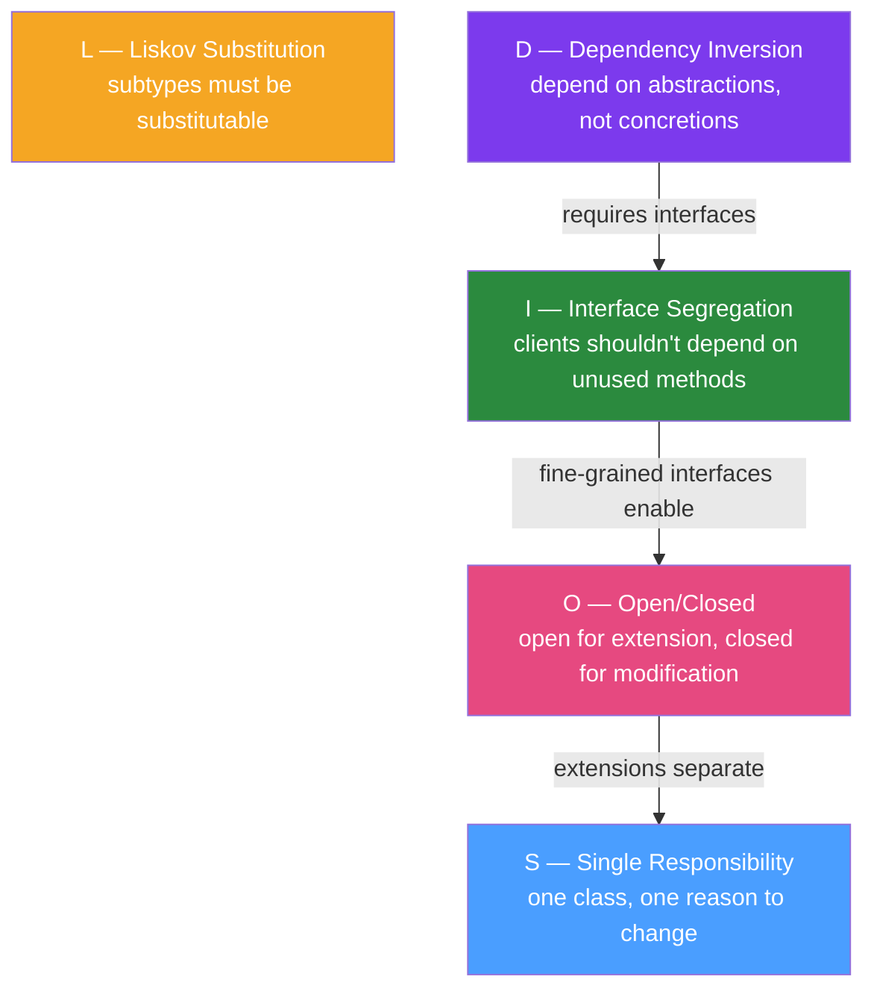

# 🧱 SOLID Principles in Java

> [!abstract] TL;DR
> SOLID is five object-oriented design principles that produce code that is easy to extend, test, and maintain: **S**ingle Responsibility, **O**pen/Closed, **L**iskov Substitution, **I**nterface Segregation, and **D**ependency Inversion. Each principle solves a specific class of design problem. The principles work together: following DIP forces you to use interfaces (ISP), which enables OCP, which naturally separates responsibilities (SRP).

## Intuition — analogy FIRST

SOLID principles are like the **rules of a well-run restaurant kitchen**. SRP: every chef has one role (pastry chef doesn't also do dishes). OCP: the menu can add new dishes without retraining the kitchen from scratch. LSP: any sous chef can cover for the head chef without surprising customers. ISP: the dessert chef doesn't need to know the seafood ordering system. DIP: the head chef gives instructions to "a cook" not "specifically Marie" — so anyone with the right skills can fill the role. Without these rules, kitchen chaos ensues: one person doing everything, recipes that break whenever the menu changes, and nobody able to cover for anyone else.

---

## How It Works



## Key Concepts / Details

### S — Single Responsibility Principle

**One class should have one reason to change.**

❌ **Violation**: `OrderService` validates, persists, AND sends email:

```java
public class OrderService {
    public void processOrder(Order order) {
        // Responsibility 1: validation
        if (order.getItems().isEmpty()) throw new ValidationException("No items");
        if (order.getCustomerId() == null) throw new ValidationException("No customer");
        
        // Responsibility 2: persistence
        orderRepository.save(order);
        
        // Responsibility 3: notification
        emailClient.send(order.getCustomerEmail(), buildConfirmationEmail(order));
        
        // Responsibility 4: inventory
        inventoryService.reserve(order.getItems());
    }
}
```

✅ **Fixed**: Separate classes for each responsibility:

```java
public class OrderValidator { void validate(Order order) { ... } }
public class OrderRepository { void save(Order order) { ... } }
public class OrderNotificationService { void sendConfirmation(Order order) { ... } }

public class OrderApplicationService {
    // Orchestrates — still one responsibility (application flow)
    public void processOrder(Order order) {
        validator.validate(order);
        repository.save(order);
        notificationService.sendConfirmation(order);
        inventoryService.reserve(order.getItems());
    }
}
```

### O — Open/Closed Principle

**Open for extension, closed for modification.** Add behaviour without modifying existing code.

❌ **Violation**: Add new discount type by modifying existing class:

```java
public class PriceCalculator {
    public BigDecimal calculate(Order order, String discountType) {
        BigDecimal base = order.getSubtotal();
        if ("PERCENTAGE".equals(discountType)) return base.multiply(BigDecimal.valueOf(0.9));
        if ("FIXED".equals(discountType)) return base.subtract(BigDecimal.TEN);
        if ("LOYALTY".equals(discountType)) return ... // must modify this class every time
        throw new IllegalArgumentException("Unknown discount: " + discountType);
    }
}
```

✅ **Fixed**: Strategy pattern — extend by adding new implementations:

```java
public interface DiscountStrategy {
    BigDecimal apply(BigDecimal price);
}

@Component public class PercentageDiscount implements DiscountStrategy {
    public BigDecimal apply(BigDecimal price) { return price.multiply(BigDecimal.valueOf(0.9)); }
}

@Component public class FixedDiscount implements DiscountStrategy {
    public BigDecimal apply(BigDecimal price) { return price.subtract(BigDecimal.TEN); }
}

// PriceCalculator never changes when new discounts are added:
public class PriceCalculator {
    public BigDecimal calculate(Order order, DiscountStrategy strategy) {
        return strategy.apply(order.getSubtotal());
    }
}
```

### L — Liskov Substitution Principle

**Subtypes must be substitutable for their base type without breaking the program.**

❌ **Violation**: The classic Rectangle/Square problem:

```java
class Rectangle {
    protected int width, height;
    public void setWidth(int w) { width = w; }
    public void setHeight(int h) { height = h; }
    public int area() { return width * height; }
}

class Square extends Rectangle {
    @Override
    public void setWidth(int w) { width = height = w; }  // LSP violation!
    @Override
    public void setHeight(int h) { width = height = h; } // Changes both dimensions
}

// Code that works for Rectangle breaks for Square:
Rectangle r = new Square();
r.setWidth(5);
r.setHeight(3);
assert r.area() == 15;  // FAILS for Square: area() == 9
```

✅ **Fixed**: Don't inherit where behaviour semantics differ:

```java
sealed interface Shape permits Rectangle, Square {}
record Rectangle(int width, int height) implements Shape {
    int area() { return width * height; }
}
record Square(int side) implements Shape {
    int area() { return side * side; }
}
```

### I — Interface Segregation Principle

**Clients should not be forced to depend on methods they don't use.**

❌ **Violation**: Fat interface forces implementers to implement irrelevant methods:

```java
public interface Worker {
    void work();
    void eat();    // Robot doesn't eat!
    void sleep();  // Robot doesn't sleep!
}

public class Robot implements Worker {
    public void work() { /* works */ }
    public void eat() { throw new UnsupportedOperationException(); }  // forced!
    public void sleep() { throw new UnsupportedOperationException(); }
}
```

✅ **Fixed**: Split into focused interfaces:

```java
public interface Workable { void work(); }
public interface Feedable { void eat(); }
public interface Sleepable { void sleep(); }

public class Human implements Workable, Feedable, Sleepable {
    public void work() { ... }
    public void eat() { ... }
    public void sleep() { ... }
}

public class Robot implements Workable {
    public void work() { ... }
    // No unused method implementations
}
```

**Spring example**: `UserDetailsService` (just `loadUserByUsername`) vs the fat `UserDetails` interface that has `getPassword`, `getAuthorities`, `isEnabled`, etc. — Spring Security splits these correctly.

### D — Dependency Inversion Principle

**High-level modules should not depend on low-level modules. Both should depend on abstractions.**

❌ **Violation**: `OrderService` directly depends on `JpaOrderRepository` (concrete class):

```java
public class OrderService {
    private final JpaOrderRepository repository;  // concrete implementation!
    
    public OrderService() {
        this.repository = new JpaOrderRepository(dataSource);  // creates it too!
    }
}
```

✅ **Fixed**: Depend on the `OrderRepository` interface:

```java
public interface OrderRepository {  // abstraction
    void save(Order order);
    Optional<Order> findById(UUID id);
}

@Service
public class OrderService {
    private final OrderRepository repository;  // depends on abstraction
    
    public OrderService(OrderRepository repository) {  // injected (DI)
        this.repository = repository;
    }
}

@Repository
public class JpaOrderRepository implements OrderRepository { ... }  // concrete in infra layer

// In tests: inject MockOrderRepository
// In prod: Spring injects JpaOrderRepository
```

**Spring does DI for you**: `@Autowired` + `@Service`/`@Repository` annotations implement DIP.

## Real-World Notes

- **SOLID is a compass, not a law**: Small scripts and simple CRUD don't need full SOLID rigour. Apply SOLID where change is frequent — domain logic, business rules, integrations.
- **SRP most misunderstood**: SRP is about reasons to change, not the number of methods. A class with 30 methods that all serve the same business concern follows SRP. A class with 3 methods serving 3 different business actors violates it.
- **OCP via polymorphism**: Java's `@Override` and interfaces are the primary OCP tools. Factories, Strategies, and Visitors are common patterns that enable OCP.

## Common Pitfalls

- **Interface for every class (ISP abuse)**: Creating `OrderServiceImpl` implementing `OrderService` when there's only ever one implementation is boilerplate, not ISP. Use interfaces when you have (or anticipate) multiple implementations.
- **Single method interfaces everywhere**: Extreme ISP leads to dozens of single-method interfaces harder to understand than one cohesive interface. Group related methods.
- **DIP means no `new`**: DIP doesn't mean never instantiate concrete classes — it means high-level business logic shouldn't. Value objects, simple POJOs, and utility classes are fine to `new`.

## Related Concepts
- [[Domain_Driven_Design_Java]] — DDD applies SOLID at the domain model level
- [[Hexagonal_Architecture]] — Hexagonal architecture is DIP applied at the architectural level
- [[Clean_Architecture_Java]] — Clean Architecture formalises the DIP-driven layer structure

## Review Questions
1. What does "one reason to change" mean in SRP? Give an example of a violation.
2. How does the Strategy pattern implement OCP?
3. Why does Square extending Rectangle violate LSP?
4. What is the difference between ISP and SRP?
5. How does Spring's dependency injection implement DIP?

## Sources
- Robert C. Martin — *Clean Code* and *Agile Software Development: Principles, Patterns, and Practices*
- SOLID explained visually: https://www.digitalocean.com/community/conceptual-articles/s-o-l-i-d-the-first-five-principles-of-object-oriented-design

#java #solid #design #oop #principles
