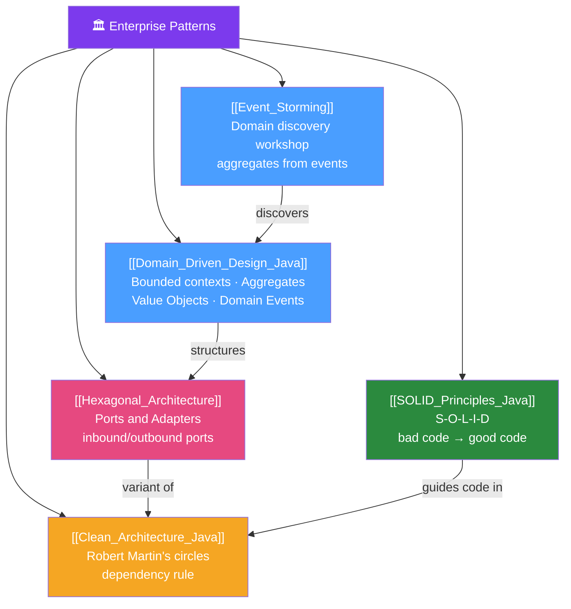

# 🗺️ Enterprise Patterns — Map of Content

> [!abstract] What This Section Covers
> Enterprise architecture patterns give structure to complex Java applications. Domain-Driven Design provides the vocabulary (bounded contexts, aggregates, domain events). Hexagonal and Clean Architecture provide the structural templates for keeping business logic independent of frameworks. SOLID principles provide the code-level guidelines for flexible design. Event Storming provides the discovery workshop to map domains before coding. Together, these patterns produce systems that are testable, maintainable, and aligned with business reality.

## Concept Map

## Learning Path
1. [[SOLID_Principles_Java]] — Code-level design principles before architectural patterns.
2. [[Event_Storming]] — Discover the domain before designing it.
3. [[Domain_Driven_Design_Java]] — Strategic and tactical DDD patterns.
4. [[Hexagonal_Architecture]] — Structure code so business logic is framework-independent.
5. [[Clean_Architecture_Java]] — Robert Martin's take on layered independence.

## All Notes at a Glance
| Note | Difficulty | What You'll Learn |
|------|------------|-------------------|
| [[Domain_Driven_Design_Java]] | Advanced | Bounded contexts, Aggregate, Value Object, Repository, Domain Event, ACL |
| [[Hexagonal_Architecture]] | Advanced | Ports and adapters, inbound/outbound, package structure, Spring wiring |
| [[Clean_Architecture_Java]] | Advanced | Dependency rule, entity/use-case/adapter layers, when to avoid |
| [[SOLID_Principles_Java]] | Intermediate | Each SOLID principle with before/after Java code examples |
| [[Event_Storming]] | Intermediate | Workshop format, sticky note colors, output: bounded context map |

## Key Questions This Section Answers
- What is an Aggregate Root and why does it control access to child entities?
- How does Hexagonal Architecture differ from layered (N-tier) architecture?
- What does the "Dependency Rule" mean in Clean Architecture?
- What problem does each SOLID principle solve?
- How do you run an Event Storming workshop?
- What is the difference between a Domain Service and an Application Service?

## Related Sections
- [[_MOC_Java_Master|↑ Java Master MOC]]
- [[_MOC_Java_Legacy|↔ Java Legacy]] — DDD bounded contexts define decomposition seams
- [[_MOC_Performance_Advanced|↔ Performance Advanced]] — Performance often conflicts with clean architecture; know the trade-offs

#java #architecture #ddd #patterns #MOC
