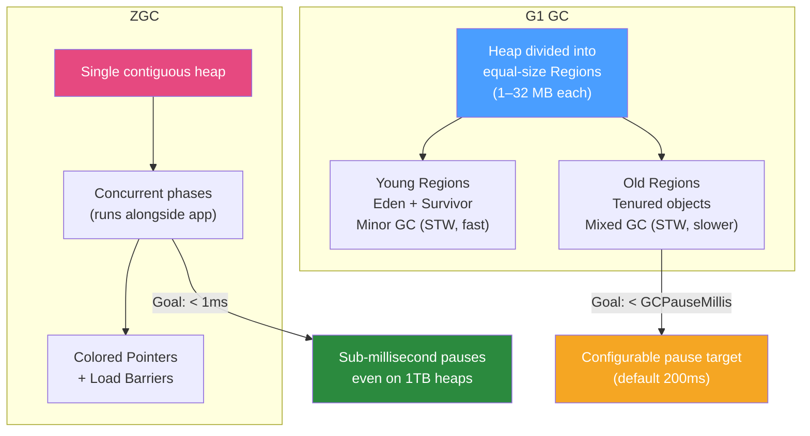

# ♻️ G1 and ZGC Garbage Collectors

> [!abstract] TL;DR
> Java 21 ships with three production-ready GC options: **G1** (Garbage-First — default, good all-around, target < 200ms pauses), **ZGC** (Z Garbage Collector — ultra-low latency, sub-millisecond pauses, Java 15+ production), and **Shenandoah** (Red Hat's low-pause GC, similar to ZGC). G1 is the right choice for most applications. ZGC wins when you need sub-10ms GC pauses with large heaps (> 4 GB). SerialGC and ParallelGC are legacy — avoid for new applications.

## Intuition — analogy FIRST

Garbage collection is like **cleaning a house while people still live in it**. **G1** is like a professional cleaning crew: they divide the house into rooms (regions) and clean the dirtiest rooms first (Garbage-First). Sometimes they ask everyone to stop and leave (Stop-The-World pause) while they do a deep clean. Pauses are usually short but occasionally longer for the big "mixed GC" sessions. **ZGC** is like a futuristic cleaning robot: it cleans almost entirely while people are still walking around (concurrent phases), using coloured reference tags to track which objects are being moved. It never makes people wait more than a millisecond. The trade-off: the robot uses slightly more CPU for its constant background work.

---

## How It Works



## Key Concepts / Details

### G1 GC (Garbage-First) — Default Since Java 9

G1 divides the heap into equal-size regions (1–32 MB each). Regions are tagged as Eden, Survivor, Old, or Humongous (for large objects).

**G1 Collection Phases**:
1. **Minor GC** (Young Collection): Eden regions become full → move live objects to Survivor/Old regions. STW, usually 5–50ms.
2. **Concurrent Marking**: G1 marks live objects concurrently while app runs. Low overhead.
3. **Mixed GC**: Cleans Young + some Old regions (those with most garbage — "Garbage First"). STW, usually 50–200ms.
4. **Full GC**: Rare, expensive fallback when G1 can't keep up. Single-threaded in older JDK versions.

```bash
# G1 JVM flags
java -XX:+UseG1GC \                          # Enable G1 (default in Java 9+)
     -Xms4g -Xmx4g \                         # Fixed heap (min=max reduces resize pauses)
     -XX:MaxGCPauseMillis=200 \               # Pause target (G1 tries to meet this)
     -XX:G1HeapRegionSize=16m \               # Region size (default auto-calculated)
     -XX:G1NewSizePercent=20 \                # Min % of heap for young gen
     -XX:G1MaxNewSizePercent=60 \             # Max % of heap for young gen
     -XX:InitiatingHeapOccupancyPercent=45 \  # When to start concurrent marking (% of heap used)
     -XX:G1ReservePercent=10 \                # Reserve % for promotion overflow
     -jar myapp.jar

# GC logging (essential for tuning)
java -Xlog:gc*:file=/var/log/gc.log:time,level,tags:filecount=5,filesize=100m \
     -jar myapp.jar
```

**G1 Key Metrics to Monitor**:
```bash
# Parse GC log for pause times
grep "GC pause" /var/log/gc.log | awk '{print $NF}' | sort -n | tail -20

# Key GC log patterns:
# [GC pause (G1 Young) 45ms]   → Young collection (normal, should be short)
# [GC pause (G1 Mixed) 180ms]  → Mixed collection (old gen cleaning)
# [Full GC (Ergonomics) 3s]    → ALERT: G1 fell back to Full GC — heap too small or IHOP misconfigured
```

**G1 Tuning Guide**:
| Symptom | Tuning Action |
|---------|--------------|
| Long mixed GC pauses | Reduce `-XX:G1MixedGCCountTarget` to spread cleanup |
| Full GC happening | Increase `-Xmx` or lower `-XX:InitiatingHeapOccupancyPercent` |
| Many humongous allocations | Increase region size: `-XX:G1HeapRegionSize=32m` |
| Young collection too long | Reduce heap size or `-XX:G1MaxNewSizePercent` |

### ZGC (Z Garbage Collector) — Low Latency

ZGC is a concurrent, region-based, compacting GC designed for sub-millisecond pause times on heaps from 8 MB to 16 TB. Available from Java 15+ as production-ready.

**How ZGC achieves low pauses**:
- **Colored pointers**: ZGC uses bits in 64-bit pointers (metadata bits) to track object state (marked, remapped, finalized)
- **Load barriers**: Every time the JVM reads a reference, a small JIT-compiled barrier checks the colour bits and potentially fixes the reference
- **Concurrent phases**: Almost all GC work (marking, relocation, reference processing) happens concurrently with application threads
- **Short STW phases**: Only 3 short STW phases for synchronisation points, typically < 1ms each

```bash
# ZGC JVM flags
java -XX:+UseZGC \                        # Enable ZGC
     -Xms4g -Xmx4g \                      # Fixed heap (especially important for ZGC)
     -XX:ZCollectionInterval=5 \           # Trigger ZGC at least every 5s (avoid idle heap bloat)
     -XX:ZUncommitDelay=300 \              # Uncommit unused heap memory after 300s
     -XX:ConcGCThreads=4 \                 # Concurrent GC threads (ZGC uses these heavily)
     -Xlog:gc*:file=/var/log/gc.log:time,level,tags \
     -jar myapp.jar

# ZGC Generational (Java 21+ — best of both worlds)
java -XX:+UseZGC -XX:+ZGenerational \     # Generational ZGC (Java 21+, recommended)
     -Xms4g -Xmx4g \
     -jar myapp.jar
```

**ZGC Key Metrics**:
```bash
# ZGC log output: pause times should all be < 10ms
# [1.234s][info][gc] GC(0) Pause Mark Start 0.456ms
# [1.678s][info][gc] GC(0) Pause Mark End 0.234ms
# [2.456s][info][gc] GC(0) Pause Relocate Start 0.123ms
# [2.987s][info][gc] GC(0) Garbage Collection (Metadata GC Threshold) 1234M->456M
```

### GC Comparison Table

| GC | Default? | Pause Target | Throughput | Heap Size | Best For |
|----|---------|-------------|-----------|-----------|----------|
| **Serial GC** | -client mode | Seconds | Low | < 1 GB | Single-core, tiny apps |
| **Parallel GC** | Java 8 | Hundreds of ms | Highest | Medium | Batch, throughput-critical |
| **G1 GC** | Java 9–21 | 200ms target | High | 4–64 GB | General purpose (most apps) |
| **ZGC** | Opt-in | < 1ms | Slightly lower | 8 MB – 16 TB | Low-latency, large heaps |
| **Shenandoah** | OpenJDK only | < 10ms | Similar to ZGC | Medium-large | Red Hat workloads |

### Choosing a GC

```
Is response time latency critical (P99 < 100ms required)?
  YES → Use ZGC (Java 21 with Generational ZGC preferred)
  NO  → Use G1 (default)

Is the heap > 32 GB?
  YES → ZGC handles large heaps better (G1 mixed GC pauses grow with heap)
  NO  → G1 is fine

Is throughput (batch processing) the primary concern?
  YES → Parallel GC (-XX:+UseParallelGC) — maximum throughput, high pauses OK
  NO  → G1 or ZGC

Are you on Java 8?
  YES → Parallel GC or G1 (-XX:+UseG1GC flag required on Java 8)
  Java 9+ → G1 is default
```

### GC Tuning Common Flags

```bash
# Essential for any GC — always set
-Xms<size> -Xmx<size>             # Min/max heap — set equal in production to prevent resize
-XX:+ExitOnOutOfMemoryError       # Fail fast on OOM (better than zombie process)
-XX:+HeapDumpOnOutOfMemoryError   # Capture heap dump for analysis
-XX:HeapDumpPath=/var/log/heapdumps/

# GC logging — always enable in production
-Xlog:gc*:file=/var/log/gc.log:time,level,tags:filecount=5,filesize=100m

# G1-specific tuning
-XX:MaxGCPauseMillis=200           # Pause target
-XX:InitiatingHeapOccupancyPercent=45  # When to start concurrent marking

# ZGC-specific
-XX:ZCollectionInterval=5          # Force ZGC every N seconds if idle

# Container-aware memory (essential in Kubernetes/Docker)
-XX:+UseContainerSupport           # Respect container memory limits (default Java 10+)
-XX:MaxRAMPercentage=75.0          # Use 75% of container RAM for heap
```

### Reading GC Logs for Troubleshooting

```bash
# Enable unified GC logging (Java 9+)
-Xlog:gc*:file=/var/log/gc.log:time,uptime,level,tags

# Sample G1 log output:
[2026-07-26T10:00:01.234+0000][1.234s][info][gc] GC(1) Pause Young (Normal) (G1 Young) 2048M->1024M(4096M) 45.234ms
#                                                                          ^type     ^before  ^after  ^total   ^pause duration

# Sample ZGC log output:
[2026-07-26T10:00:01.234+0000][info][gc] GC(3) Garbage Collection (Proactive) 2048M(50%)->1024M(25%)
[2026-07-26T10:00:01.234+0000][info][gc] GC(3) Pause Mark Start 0.432ms  ← STW: < 1ms

# Use GCViewer or GCEasy.io to visualise GC logs
# Upload your gc.log to: https://gceasy.io/ for free analysis
```

## Real-World Notes

- **Set -Xms = -Xmx in production**: Allowing the heap to grow/shrink causes unnecessary GC pauses for heap resizing. In containers, set both to the same value.
- **G1 on Java 21**: G1 in Java 21 is significantly improved over Java 11. If you're running Java 11 with G1 and seeing long pauses, upgrading the JDK (even before tuning) often helps.
- **ZGC Generational (Java 21)**: Generational ZGC (`-XX:+ZGenerational`) collects short-lived objects more efficiently. For most workloads it's 15–30% higher throughput than non-generational ZGC with the same sub-ms pauses.

## Common Pitfalls

- **-MaxGCPauseMillis is a goal, not a guarantee**: G1 will try to meet the 200ms target but will exceed it if needed. It's a hint, not a hard limit.
- **Heap too small for ZGC**: ZGC needs headroom to do concurrent relocation. If heap utilisation stays above 70%, ZGC degrades. For ZGC, provision heap at ~40-50% peak utilisation.
- **Mixing -Xms < -Xmx in containers**: In Kubernetes with -Xmx from `MaxRAMPercentage`, not setting `-Xms` means the JVM starts with a tiny heap and resizes under load — causing full GC storms on startup. Set `-Xms` to at least 50% of `-Xmx`.

## Related Concepts
- [[JVM_Profiling_Tools]] — JFR GC events provide GC pause data for analysis
- [[Heap_Analysis]] — GC pressure often indicates a memory leak
- [[Native_Memory_Tracking]] — Metaspace (off-heap) also affects total memory usage

## Review Questions
1. What is the "Garbage-First" strategy in G1 GC and what does it optimise for?
2. What mechanism does ZGC use to achieve sub-millisecond pause times?
3. When should you choose ZGC over G1?
4. What does `-XX:InitiatingHeapOccupancyPercent` control in G1?
5. Why should `-Xms` and `-Xmx` be set to the same value in production?

## Sources
- OpenJDK GC documentation: https://docs.oracle.com/en/java/javase/21/gctuning/
- ZGC wiki: https://wiki.openjdk.org/display/zgc
- G1 GC tuning guide: https://www.oracle.com/technical-resources/articles/java/g1gc.html
- GCEasy.io for GC log analysis: https://gceasy.io/

#java #performance #gc #g1 #zgc #garbage-collection #jvm-tuning
