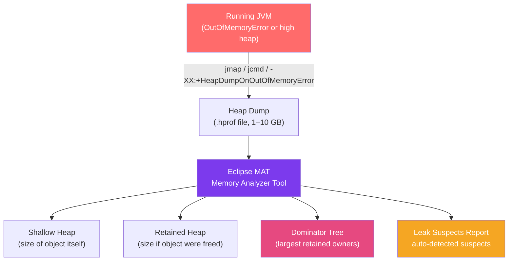

# 🗂️ Heap Analysis

> [!abstract] TL;DR
> Heap dumps capture the entire state of the Java heap at a moment in time. Analysed with Eclipse MAT (Memory Analyzer Tool), they reveal memory leaks, large object clusters, and reference chains keeping objects alive unexpectedly. Key concepts: **shallow heap** (size of the object itself), **retained heap** (total memory freed if the object were GC'd), and **dominator tree** (who is keeping what alive). The most common leaks in Java are: static collection references, listener/observer not removed, and ThreadLocal values not cleared.

## Intuition — analogy FIRST

A heap dump is like a **detailed X-ray of your warehouse**. The warehouse (JVM heap) contains thousands of boxes (objects). The X-ray shows you not just that the warehouse is full, but exactly which boxes are there, how large each is, and which boxes are connected by ropes (references). Eclipse MAT is the radiologist who reads the X-ray: "This one box (HashMap) has 8 million ropes connecting to other boxes, and together they account for 4 GB — that's your problem." Without the X-ray, you'd be opening boxes randomly trying to figure out why the warehouse is overflowing.

---

## How It Works



## Key Concepts / Details

### Generating Heap Dumps

```bash
# Method 1: Automatic on OutOfMemoryError (recommended for production)
java -XX:+HeapDumpOnOutOfMemoryError \
     -XX:HeapDumpPath=/var/log/heapdumps/ \
     -jar myapp.jar

# Method 2: On-demand with jmap (attach to running JVM)
jmap -dump:live,format=b,file=/tmp/heap.hprof <PID>

# "live" = only include live objects (skip unreachable, smaller file)
# format=b = binary format (required for MAT)

# Method 3: jcmd (newer, preferred over jmap)
jcmd <PID> GC.heap_dump /tmp/heap.hprof

# Method 4: VisualVM — Heap Dump button in Memory tab

# Method 5: Kubernetes — exec into pod and jcmd
kubectl exec -it <pod-name> -- jcmd 1 GC.heap_dump /tmp/heap.hprof
kubectl cp <pod-name>:/tmp/heap.hprof ./heap.hprof
```

### Eclipse MAT — Key Analysis Views

```bash
# Download: https://eclipse.dev/mat/
# Or via Eclipse plugin
# Open: File → Open Heap Dump → select .hprof file
```

**Leak Suspects Report** (automatic, start here):
- MAT identifies object groupings that look like leaks
- Shows: "One instance of X keeps Y MB alive (Z% of heap)"
- The "Details" link shows the retention path

**Dominator Tree**:
- Shows objects sorted by **retained heap** (largest memory holder at top)
- "Who is responsible for keeping the most memory alive?"

```
Dominator Tree example output:
Class                              Shallow    Retained    %
─────────────────────────────────────────────────────────
java.util.HashMap @ 0xc8f3a0      48 bytes   4,123 MB   82%
  └─ com.example.CacheService      32 bytes   4,123 MB   82%
       └─ productCache (HashMap)    48 bytes   4,123 MB   82%
            └─ [2,800,000 entries]
```

**Object Histogram** (`Ctrl+H`):
- All class types sorted by instance count or total size
- Look for: unexpectedly high instance counts of your domain classes

```
Object Histogram:
Class                      # Instances   Shallow Heap
─────────────────────────────────────────────────────
byte[]                     1,203,421     1,823 MB
char[]                     987,654       892 MB
java.lang.String           987,654       23 MB
com.example.ProductDto     2,800,000     134 MB   ← 2.8M DTOs?!
```

**OQL (Object Query Language)** — SQL-like queries on the heap:

```sql
-- Find all Strings longer than 1000 chars
SELECT s FROM java.lang.String s WHERE s.count > 1000

-- Find all HashMap instances with > 100,000 entries
SELECT h FROM java.util.HashMap h WHERE h.size > 100000

-- Find all instances of your specific class
SELECT * FROM com.example.service.CacheService
```

### Shallow Heap vs Retained Heap

```java
// Example class:
class Order {
    UUID id;             // 16 bytes reference
    String customerId;   // 16 bytes reference (String itself elsewhere)
    List<OrderLine> lines; // 16 bytes reference (List elsewhere)
}
```

| Metric | Definition | Example |
|--------|-----------|---------|
| **Shallow Heap** | Size of the object header + fields only | Order = ~64 bytes |
| **Retained Heap** | Memory freed if this object + all exclusively-referenced objects were GC'd | Order + all its OrderLines = 4 KB |

An object with tiny shallow heap but huge retained heap is the classic leak pattern.

### Common Java Memory Leak Patterns

**Pattern 1: Static collection accumulation**

```java
// LEAK: static field holds references forever
public class EventBus {
    private static final List<EventListener> LISTENERS = new ArrayList<>();
    
    public static void register(EventListener listener) {
        LISTENERS.add(listener);  // never removed!
    }
    // Fix: use WeakReference or require explicit unregister
}

// FIXED: WeakReference allows GC when caller is garbage
private static final List<WeakReference<EventListener>> LISTENERS = new ArrayList<>();
```

**Pattern 2: Observer/Listener not removed**

```java
// LEAK: JButton holds reference to listener (and listener holds reference to form)
public class ProductForm {
    private JButton saveButton;
    
    public ProductForm(EventBus bus) {
        bus.register(this::onProductUpdated);  // registered but never unregistered
    }
    // When ProductForm is "closed," it can't be GC'd because EventBus still holds it
    
    // FIX: implement AutoCloseable and unregister
    public void close() {
        bus.unregister(this::onProductUpdated);
    }
}
```

**Pattern 3: ThreadLocal not cleared**

```java
// LEAK: ThreadLocal in thread pool threads — lives for the pool lifetime
public class RequestContext {
    private static final ThreadLocal<UserSession> SESSION = new ThreadLocal<>();
    
    public static void set(UserSession session) { SESSION.set(session); }
    
    // MISSING: remove() call in finally block
    // In a thread pool, the thread is reused — old session persists
    
    // FIX: always call SESSION.remove() in finally
    public static void clear() { SESSION.remove(); }
}

// Usage pattern:
try {
    RequestContext.set(session);
    processRequest();
} finally {
    RequestContext.clear();  // critical!
}
```

**Pattern 4: Caching without eviction**

```java
// LEAK: unbounded cache
public class ProductRepository {
    private final Map<UUID, Product> cache = new HashMap<>();  // grows forever!
    
    public Product findById(UUID id) {
        return cache.computeIfAbsent(id, this::loadFromDb);
    }
    
    // FIX: use a bounded cache (LRU eviction)
    private final Map<UUID, Product> cache = Collections.synchronizedMap(
            new LinkedHashMap<>(1000, 0.75f, true) {  // LRU with capacity limit
                @Override
                protected boolean removeEldestEntry(Map.Entry eldest) {
                    return size() > 1000;  // evict when > 1000 entries
                }
            });
    
    // OR: Use Caffeine (modern, recommended)
    private final Cache<UUID, Product> cache = Caffeine.newBuilder()
            .maximumSize(10_000)
            .expireAfterAccess(Duration.ofMinutes(30))
            .build();
}
```

**Pattern 5: Finalizers (avoid them)**

```java
// PROBLEM: Objects with finalize() methods can't be GC'd in a single collection
// They go to a finalisation queue which may back up, preventing GC
@Override
protected void finalize() throws Throwable {
    // Don't do this — use AutoCloseable/try-with-resources instead
}

// FIX: Implement AutoCloseable
public class FileProcessor implements AutoCloseable {
    @Override
    public void close() throws Exception {
        // cleanup here
    }
}
```

### Analysing a Heap Dump — Step-by-Step

```
1. Open MAT → File → Open Heap Dump
2. Generate → "Leak Suspects Report" → read the report
3. If leak suspects report finds something: follow the reference chain
4. If not: check Dominator Tree (Window → Heap Dump Overview → Dominator Tree)
5. Sort by Retained Heap — find the top offender
6. Right-click → "List Objects" → "with incoming references" to see who holds it
7. Right-click → "Path to GC Roots" to see what's keeping it alive
8. OQL to query specific objects if needed
```

### MAT — Reference Chain

When you find a leaked object, trace back to the GC root:

```
Path to GC root example:
com.example.UserSession @ 0xab12cd  (retained: 850 MB)
  ↑ field SESSION in RequestContextHolder
  ↑ field value in ThreadLocal @ 0x1234ab
  ↑ ThreadLocalMap entry in Thread "http-nio-8080-exec-42"  ← GC Root!

Analysis: Thread pool thread holds a UserSession via ThreadLocal.
           Someone forgot to call SESSION.remove() in request processing.
```

## Real-World Notes

- **Heap dump file size**: A 2 GB heap produces a ~2 GB .hprof file. Analyse on a machine with RAM > 2× the heap dump size. Use MAT's `-vmargs -Xmx8g` if needed.
- **Live heap dump in Kubernetes**: `kubectl exec` into the pod, generate the dump, then `kubectl cp` it out. For large dumps, copy directly to an S3-mounted volume or use `kubectl exec -- bash -c "jcmd 1 GC.heap_dump /dev/stdout" > heap.hprof`.
- **Don't dump production under load**: `jmap -dump` requires a safepoint (STW pause), which can pause your app for seconds. Prefer `jcmd GC.heap_dump` which is safer, or trigger it on OOM automatically.

## Common Pitfalls

- **Analysing without "live" filter**: A full heap dump includes unreachable objects already waiting for GC. Include `,live` in jmap to exclude them: `jmap -dump:live,format=b,file=...`
- **Confusing large object count with leak**: 10M String objects might be normal. The question is: are they growing unboundedly? Compare two heap dumps from different times (MAT: "Compare Heap Dumps").
- **Not checking GC roots**: Finding a large object cluster means nothing without the reference chain back to a GC root. The GC root is where the leak is actually introduced.

## Related Concepts
- [[JVM_Profiling_Tools]] — Allocation profiling finds which code is creating objects
- [[G1_ZGC_Collectors]] — Heap pressure affects GC behaviour
- [[Native_Memory_Tracking]] — Memory beyond the Java heap also contributes to OOM

## Review Questions
1. What is the difference between shallow heap and retained heap?
2. How do you generate a heap dump automatically when an OOM error occurs?
3. What are the three most common Java memory leak patterns?
4. How does the Dominator Tree view in Eclipse MAT help find memory leaks?
5. Why should you always call `ThreadLocal.remove()` in a finally block?

## Sources
- Eclipse MAT documentation: https://eclipse.dev/mat/docs/
- JVM troubleshooting guide: https://docs.oracle.com/en/java/javase/21/troubleshoot/
- Java Performance by Charlie Hunt and Binu John

#java #performance #heap #memory-leak #mat #jmap
