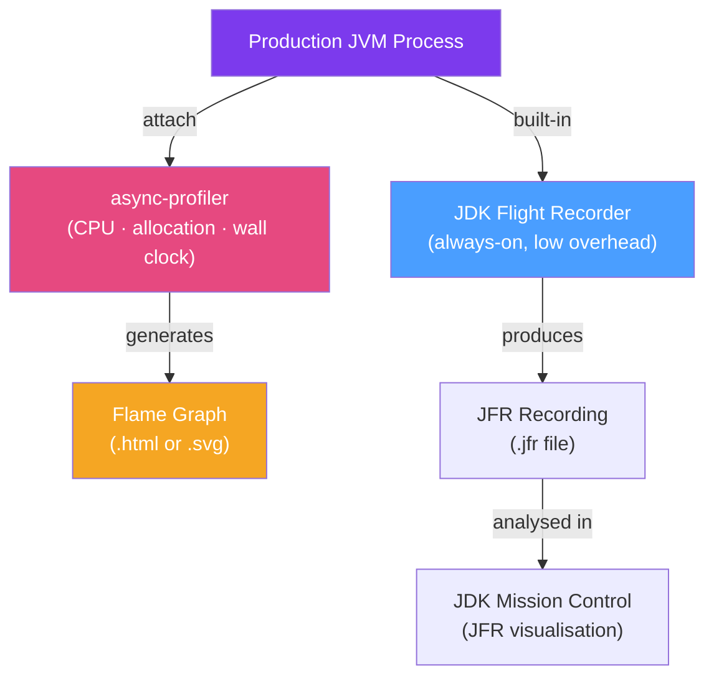

# 🔥 JVM Profiling Tools

> [!abstract] TL;DR
> JVM profiling tools reveal where time and memory are actually spent — as opposed to where you think they're spent. **async-profiler** is the best CPU profiler: it uses AsyncGetCallTrace (safe for production) and generates flame graphs. **JDK Flight Recorder (JFR)** is a low-overhead always-on profiler built into the JDK. **VisualVM** and **JConsole** provide GUI-based monitoring. Allocation profiling finds objects creating GC pressure. Always profile before optimising — gut feelings about performance are wrong more often than not.

## Intuition — analogy FIRST

JVM profiling is like **tracking where your entire workforce spends their time** using badge swipes. Without profiling, you're guessing: "I think the report generation is slow." With profiling, you see: "Thread pool X spends 73% of CPU time in the JSON serialiser, which calls `String.format()` in a hot loop." A flame graph is the badge-swipe report: the width of each box shows how much time was spent in that method and its callees. The widest box at the top of a stack is where your optimisation effort belongs.

---

## How It Works



## Key Concepts / Details

### async-profiler — CPU Profiling

async-profiler is the gold-standard Java CPU profiler. It uses the AsyncGetCallTrace JVMTI API which safely profiles threads even during GC and JIT compilation.

```bash
# Download async-profiler
wget https://github.com/async-profiler/async-profiler/releases/download/v3.0/async-profiler-3.0-linux-x64.tar.gz
tar -xzf async-profiler-3.0-linux-x64.tar.gz

# Find the JVM PID
jps -l  # or: ps aux | grep java

# Profile CPU for 30 seconds, generate flame graph
./asprof -d 30 -f /tmp/cpu-flame.html <PID>

# Profile wall-clock time (includes blocking time) — reveals I/O waits
./asprof -d 30 -e wall -f /tmp/wall-flame.html <PID>

# Profile memory allocations (find what's creating GC pressure)
./asprof -d 30 -e alloc -f /tmp/alloc-flame.html <PID>

# Combine: CPU + allocation in one recording
./asprof start -e cpu,alloc <PID>
./asprof stop -f /tmp/combined-flame.html <PID>
```

**Interpreting flame graphs**:
- **X-axis**: Methods are sorted alphabetically (NOT chronological) — width = time spent
- **Y-axis**: Call stack — top is where time was spent, bottom is entry point
- **Wide boxes at top**: Hot methods — candidates for optimisation
- **Tall stacks**: Deep call chains (could indicate recursion or proxy overhead)

```bash
# In production with minimal flags — async-profiler is safe for production:
./asprof -d 60 -e cpu -o flamegraph -f /tmp/prod-$(date +%s).html $(jps -l | grep MyApp | awk '{print $1}')
```

### JDK Flight Recorder (JFR)

JFR is built into OpenJDK 11+. It records JVM events with < 1% overhead, suitable for always-on production profiling.

```bash
# Start recording via command line
java -XX:StartFlightRecording=duration=60s,filename=recording.jfr,settings=profile MyApp

# Start recording on already-running JVM (via jcmd)
jcmd <PID> JFR.start duration=60s filename=/tmp/recording.jfr settings=profile
jcmd <PID> JFR.dump filename=/tmp/recording.jfr   # dump without stopping
jcmd <PID> JFR.stop                                 # stop recording

# List active recordings
jcmd <PID> JFR.check
```

```java
// Programmatic JFR recording (Java 14+)
import jdk.jfr.Recording;

Recording recording = new Recording();
recording.setName("performance-recording");
recording.enable("jdk.CPUSample").withPeriod(Duration.ofMillis(20));
recording.enable("jdk.ObjectAllocationInNewTLAB");
recording.enable("jdk.GarbageCollection");
recording.start();

// ... run workload ...

recording.dump(Path.of("/tmp/recording.jfr"));
recording.stop();
```

**JFR Key Event Categories**:
| Event Category | What It Shows |
|----------------|---------------|
| CPU Sample | Which methods consume CPU |
| Object Allocation in New TLAB | What objects are allocated (allocation profiling) |
| Garbage Collection | GC frequency, duration, cause |
| Thread Park/Unpark | Lock contention, blocking |
| Socket Read/Write | Network I/O |
| File Read/Write | Disk I/O |
| Exception | Exception frequency (throws are expensive) |

### JDK Mission Control (JMC)

GUI tool for analysing JFR recordings:

```bash
# Download JDK Mission Control
# https://adoptium.net/jmc/
# Open a .jfr file: File → Open File → recording.jfr
```

Key views in JMC:
- **Automated Analysis**: Flags known performance issues (GC overhead, lock contention)
- **Method Profiling**: CPU flame graph (top methods by samples)
- **Memory**: Heap usage, allocation by class
- **Threads**: Thread states timeline — when threads are blocked, running, or waiting

### VisualVM — GUI Profiling

For development environments, VisualVM provides a visual profiler without command-line setup:

```bash
# Install via SDKMAN or download from https://visualvm.github.io/
sdk install visualvm
visualvm

# Or use the bundled jvisualvm (JDK 8, removed in JDK 9+)
jvisualvm
```

VisualVM features:
- CPU profiling (method-level time %)
- Memory profiling (heap allocation by class)
- Thread monitoring
- MBean browser (JMX)
- Sampler (low overhead, no agent required)

### Spring Boot Actuator Metrics for Production Visibility

```properties
# application.properties
management.endpoints.web.exposure.include=metrics,health,info,prometheus
management.metrics.export.prometheus.enabled=true
```

```java
// Expose custom timer metric
@Service
public class OrderService {
    private final MeterRegistry registry;
    private final Timer orderProcessingTimer;
    
    public OrderService(MeterRegistry registry) {
        this.registry = registry;
        this.orderProcessingTimer = Timer.builder("order.processing.time")
                .description("Time to process an order")
                .register(registry);
    }
    
    public void processOrder(Order order) {
        orderProcessingTimer.record(() -> doProcess(order));
    }
}
```

```bash
# Prometheus query to find slow endpoints:
histogram_quantile(0.99, rate(http_server_requests_seconds_bucket[5m]))
```

### Allocation Profiling — Finding GC Pressure

```bash
# async-profiler allocation profile
./asprof -d 30 -e alloc -f /tmp/alloc.html <PID>

# In the flame graph, look for:
# - Large allocations from unexpected methods
# - char[] allocations from string concatenation in loops
# - byte[] from serialisation
```

Common allocation hot-spots in Java:
```java
// BAD: String concatenation in loop creates many char[] objects
for (int i = 0; i < 10000; i++) {
    result += items.get(i).getName();  // O(n^2) allocations
}

// GOOD: StringBuilder
StringBuilder sb = new StringBuilder();
for (Item item : items) sb.append(item.getName());

// BAD: Boxing in hot path
Map<Long, Long> counts = new HashMap<>();
for (long id : ids) counts.put(id, counts.getOrDefault(id, 0L) + 1); // autoboxing

// GOOD: Primitive map (Eclipse Collections / Koloboke)
LongLongHashMap counts = LongLongHashMap.newWithExpectedSize(ids.size());
```

### Continuous Profiling

For long-running services, use continuous profiling platforms:
- **Grafana Pyroscope** — OSS continuous profiling, integrates with async-profiler
- **Elastic APM** — auto-instruments Spring Boot, captures stack traces
- **Datadog Continuous Profiler** — production-safe, 24/7 profiling
- **Cloud providers** — AWS CodeGuru Profiler, Google Cloud Profiler

```yaml
# docker-compose.yml for Pyroscope:
services:
  pyroscope:
    image: grafana/pyroscope:latest
    ports:
      - "4040:4040"

# Spring Boot app with Pyroscope agent:
# java -javaagent:pyroscope.jar -Dpyroscope.server.address=http://pyroscope:4040 
#      -Dpyroscope.application.name=order-service -jar app.jar
```

## Real-World Notes

- **Profile first, optimise second**: Don't add `StringBuilder` everywhere pre-emptively. Profile to find the 3% of code responsible for 97% of the performance problem (Pareto principle).
- **Safepoint bias in traditional profilers**: Older sampling profilers (JProfiler, YourKit with sampling mode) only capture stack traces at safepoints — this biases results. async-profiler avoids this.
- **JFR for production, async-profiler for dev**: JFR has < 1% overhead and is always safe. async-profiler is faster to get results for interactive debugging but should be used with care in production.

## Common Pitfalls

- **Benchmarking without JVM warm-up**: JIT compilation happens lazily. A benchmark that doesn't warm up the JVM will show startup costs, not steady-state performance. Use JMH (Java Microbenchmark Harness).
- **Profiling with -Xss (small stack)**: Virtual threads (Java 21) have very small stacks. Profiling tool compatibility with virtual threads varies — check your profiler version.
- **Missing safepoint cost**: If your app has long GC pause but the CPU profiler doesn't show it, look at wall-clock profiling or JFR GC events — safepoints stop all threads and aren't always attributed.

## Related Concepts
- [[Heap_Analysis]] — Use heap dumps to investigate allocation findings from profiling
- [[Thread_Dump_Analysis]] — Thread state timelines from JFR complement thread dumps
- [[G1_ZGC_Collectors]] — Profiling GC events informs GC tuning decisions

## Review Questions
1. What is the difference between CPU profiling and wall-clock profiling?
2. Why is async-profiler considered safer than traditional profilers for production use?
3. How do you generate a flame graph with async-profiler in 3 commands?
4. What JFR events would you look at to diagnose high CPU usage?
5. What is "allocation profiling" and what problem does it help solve?

## Sources
- async-profiler GitHub: https://github.com/async-profiler/async-profiler
- JFR documentation: https://docs.oracle.com/en/java/javase/21/jfapi/
- Brendan Gregg — Flame Graphs: https://www.brendangregg.com/flamegraphs.html
- JMH (benchmarking): https://github.com/openjdk/jmh

#java #performance #profiling #async-profiler #jfr #flame-graphs
