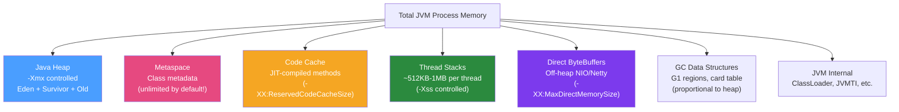

# 🧠 Native Memory Tracking

> [!abstract] TL;DR
> The JVM uses memory beyond the Java heap: Metaspace (class metadata), Code Cache (JIT-compiled methods), Thread stacks, GC data structures, and direct buffers. **Native Memory Tracking (NMT)** (`-XX:NativeMemoryTracking=summary`) lets you see a breakdown of all these categories via `jcmd VM.native_memory`. Understanding native memory is essential when container OOM kills your Java process even though heap usage looks normal — the culprit is often Metaspace, direct memory, or off-heap native libraries.

## Intuition — analogy FIRST

The Java heap is like **the storage area you officially track** in your warehouse system. But the warehouse also has maintenance rooms (Code Cache for JIT code), filing cabinets for building permits (Metaspace for class metadata), delivery bays (Thread stacks), and loading docks (Direct Buffer memory). Your inventory system (heap monitoring) shows 40% full, but the warehouse (container) is actually 95% full — because nobody measured the maintenance rooms. Native Memory Tracking is the comprehensive building survey that shows every room's size, not just the main storage area.

---

## How It Works



## Key Concepts / Details

### Enabling Native Memory Tracking

```bash
# Enable NMT (adds ~5-10% overhead — use "summary" not "detail" in production)
java -XX:NativeMemoryTracking=summary -jar myapp.jar

# For detailed analysis (higher overhead — dev/staging only)
java -XX:NativeMemoryTracking=detail -jar myapp.jar

# View current NMT report (while app is running)
jcmd <PID> VM.native_memory summary
jcmd <PID> VM.native_memory detail  # if started with detail mode

# Baseline — snapshot for comparison
jcmd <PID> VM.native_memory baseline

# Compare current to baseline (find what grew)
jcmd <PID> VM.native_memory summary.diff
```

### Reading NMT Output

```
Native Memory Tracking:

Total: reserved=6,234,823KB, committed=4,567,432KB
                              ^^^^^^^^                ← Committed = actually used
                ^^^^^^^^^^^^                         ← Reserved = virtual address space reserved

-         Java Heap (reserved=4,194,304KB, committed=4,194,304KB)
                    (mmap: reserved=4,194,304KB, committed=4,194,304KB)
 
-          Metaspace (reserved=528,384KB, committed=302,180KB)
                     (mmap: reserved=524,288KB, committed=298,084KB)
                     (malloc=4,096KB, #24,531)

-      Class (reserved=1,056,768KB, committed=120,564KB)
             (classes #21,000)
             # 21,000 classes loaded ← normal for large Spring Boot app

-             Thread (reserved=516,228KB, committed=516,228KB)
                     (thread #504)    ← 504 threads × ~1MB each = 504 MB!
                     (stack: reserved=514,528KB, committed=514,528KB)

-               Code (reserved=395,264KB, committed=102,336KB)
                     (mmap: reserved=393,216KB, committed=100,352KB)

-                GC (reserved=174,748KB, committed=174,748KB)

-          Internal (reserved=37,484KB, committed=37,484KB)

-             Other (reserved=1,228KB, committed=1,228KB)

-            Symbol (reserved=40,548KB, committed=40,548KB)
                    (arena=40,048KB #1)

-    Native Memory Tracking (reserved=12,960KB, committed=12,960KB)
```

### Metaspace — The Classic Leak

Metaspace stores class metadata. It grows when new classes are loaded and shrinks when classloaders are GC'd. Dynamic class generation (Spring proxies, Hibernate, Groovy, JRuby, OSGi) creates many classloaders.

```bash
# Symptom: Metaspace keeps growing → eventually OOM: Metaspace
# jcmd diff shows: Metaspace committed growing by 10MB/hour
```

**Common Metaspace leak causes**:

```java
// 1. Dynamic proxy creation in a loop (Spring AOP proxy generation):
// If you're generating new proxy classes every request, they accumulate
// Fix: reuse proxy instances; avoid Proxy.newProxyInstance() in hot paths

// 2. Custom ClassLoader that never becomes unreachable:
public class PluginLoader {
    // LEAK: classloader held in static field → all loaded classes stay in Metaspace
    private static final Map<String, ClassLoader> LOADERS = new HashMap<>();
    
    public void loadPlugin(String name) {
        URLClassLoader loader = new URLClassLoader(new URL[]{pluginUrl});
        LOADERS.put(name, loader);  // never removed → ClassLoader never GC'd
    }
    
    // FIX: remove from map and close loader when plugin unloaded
    public void unloadPlugin(String name) throws IOException {
        ClassLoader loader = LOADERS.remove(name);
        if (loader instanceof URLClassLoader ucl) ucl.close();
    }
}

// 3. Groovy/Kotlin script evaluation creating classes per script execution:
GroovyShell shell = new GroovyShell();
// BAD: new classes created per call
for (String script : scripts) shell.evaluate(script);

// FIX: parse scripts once, cache the Script object
Map<String, Script> cache = new HashMap<>();
Script parsed = cache.computeIfAbsent(scriptText, s -> shell.parse(s));
parsed.run();
```

**Metaspace flags**:
```bash
# Cap Metaspace to detect leaks faster (and prevent unbounded growth)
java -XX:MaxMetaspaceSize=512m -jar myapp.jar

# Monitor Metaspace via JFR
jcmd <PID> JFR.start duration=60s filename=recording.jfr

# Prometheus (Spring Boot Actuator) Metaspace metric:
# jvm_memory_used_bytes{area="nonheap",id="Metaspace"}
```

### Code Cache — JIT Compiled Code

The Code Cache stores JIT-compiled native machine code. If it fills up, the JVM de-optimises methods (falls back to interpreted mode) — causing sudden performance degradation.

```bash
# Code Cache flags
java -XX:ReservedCodeCacheSize=512m \    # Default ~240MB — increase for large apps
     -XX:InitialCodeCacheSize=160m \
     -XX:+UseCodeCacheFlushing \         # Allow evicting old JIT code (default true in modern JVM)
     -jar myapp.jar

# Monitor Code Cache (should be well below ReservedCodeCacheSize)
jcmd <PID> VM.native_memory summary | grep Code

# JFR event for CodeCache
jcmd <PID> JFR.start duration=60s settings=profile filename=/tmp/r.jfr
# Then in JMC: check "Code Cache Statistics" view
```

**Symptom of Code Cache full**:
```
Java HotSpot(TM) 64-Bit Server VM warning: CodeCache is full.
Compiler has been disabled.
Try increasing the code cache size using -XX:ReservedCodeCacheSize=
```

### Thread Stack Memory

Each thread reserves stack space (default ~512KB–1MB). In apps with many threads, this adds up:

```bash
# 500 threads × 1MB = 500MB non-heap memory
# This is committed memory — not heap, not visible in heap metrics

# Check thread count
jcmd <PID> VM.native_memory summary | grep Thread

# Reduce stack size (only if you don't have deep call stacks)
java -Xss256k -jar myapp.jar  # reduce from 512KB to 256KB

# Virtual threads (Java 21) — extremely small stacks
# Virtual threads use ~few KB each instead of ~1MB
# 10,000 virtual threads = ~10MB (vs 10GB for platform threads)
ExecutorService exec = Executors.newVirtualThreadPerTaskExecutor();
```

### Direct ByteBuffer Memory

NIO direct buffers and Netty off-heap buffers bypass the Java heap:

```java
// Direct buffer — allocated off-heap
ByteBuffer direct = ByteBuffer.allocateDirect(1024 * 1024);  // 1MB off-heap!
// Not tracked by -Xmx, not GC'd by heap GC

// Netty uses off-heap by default for its buffer pool
// Large Netty application may have GBs of off-heap direct memory

// Spring WebFlux / Netty apps: monitor direct memory
# -XX:MaxDirectMemorySize=512m    ← cap direct memory
# JMX: java.nio:type=BufferPool,name=direct (useMemory, capacity)
```

**Spring Boot Actuator metric for direct memory**:
```
# Prometheus metric
jvm_buffer_total_capacity_bytes{id="direct"}
jvm_buffer_memory_used_bytes{id="direct"}
```

### Total Memory Estimation for Containers

```
Container memory limit = Java Heap + Off-Heap

Off-Heap components:
  Metaspace:     ~200–500 MB (depends on class count)
  Code Cache:    ~200–500 MB (JIT compiled code)
  Thread stacks: threads × 512KB (e.g., 200 threads = 100 MB)
  Direct memory: varies (Netty apps: 256 MB+)
  GC overhead:   ~10% of heap
  JVM internals: ~50–100 MB

Rule of thumb:
  Container limit ≥ -Xmx + 512 MB (for all off-heap)

Example for 2 GB heap:
  Kubernetes: limits.memory = 3Gi
  JVM: -Xmx2048m -Xms2048m -XX:MaxMetaspaceSize=384m

# Using MaxRAMPercentage in container:
java -XX:+UseContainerSupport \
     -XX:MaxRAMPercentage=75.0 \    # 75% of container RAM for heap
     # leaves 25% for off-heap
     -jar myapp.jar
```

### NMT diff — Finding Memory Growth

```bash
# Take baseline
jcmd <PID> VM.native_memory baseline

# Wait 30 minutes under load

# Check what grew (+ = grew, - = shrank)
jcmd <PID> VM.native_memory summary.diff

# Sample diff output showing Metaspace leak:
-          Metaspace (reserved=796,672KB +268,288KB, committed=534,180KB +231,948KB)
#                                          ^^^^^^^^^ Grew by 256 MB in 30 min! → Metaspace leak
```

## Real-World Notes

- **Container OOM without heap OOM**: The most common confusing scenario. Heap is at 2 GB (well within -Xmx), but the container is OOM killed at 3 GB limit. Root cause: Metaspace or direct memory consuming the remaining 1 GB. NMT reveals this instantly.
- **Metaspace unlimited by default**: Without `-XX:MaxMetaspaceSize`, Metaspace grows until the OS kills the process. Always set a limit in production.
- **JVM reserved vs committed**: Reserved = virtual address space allocated (on 64-bit, very cheap — doesn't use RAM). Committed = actually backed by RAM or swap. Monitor committed for real memory usage.

## Common Pitfalls

- **Setting container limit equal to -Xmx**: `limits.memory: 4Gi` with `-Xmx4g` leaves zero headroom for off-heap. The container will be OOM killed under normal operation. Always add 512 MB–1 GB.
- **Ignoring direct memory with Spring WebFlux**: Reactive Spring Boot apps use Netty, which allocates direct buffers. A typical WebFlux app might use 300–800 MB of direct memory. Account for this in container sizing.
- **NMT overhead**: `-XX:NativeMemoryTracking=detail` has ~10% CPU overhead. Use `summary` in production for monitoring, `detail` only in staging for diagnosis.

## Related Concepts
- [[Heap_Analysis]] — Heap analysis for the Java heap portion
- [[G1_ZGC_Collectors]] — GC data structures contribute to native memory
- [[JVM_Profiling_Tools]] — JFR records Metaspace events

## Review Questions
1. Why might a Java container be OOM killed even when heap usage is low?
2. What is Metaspace and what causes it to leak?
3. How do you generate an NMT baseline and compare to it later?
4. What is the "Rule of Thumb" for sizing a container's memory limit relative to -Xmx?
5. What JVM flag limits the size of direct ByteBuffer memory?

## Sources
- NMT documentation: https://docs.oracle.com/en/java/javase/21/vm/native-memory-tracking.html
- JDK troubleshooting guide: https://docs.oracle.com/en/java/javase/21/troubleshoot/
- Metaspace deep-dive: https://stuefe.de/posts/metaspace/what-is-metaspace/

#java #performance #native-memory #metaspace #nmt #off-heap
