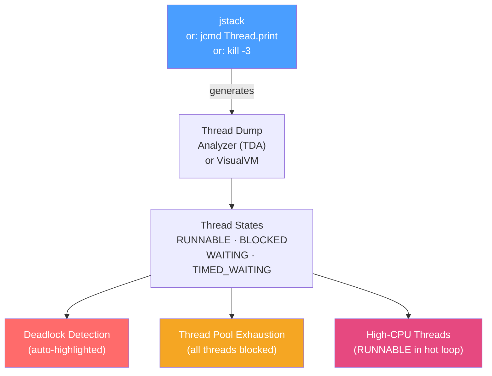

# 🧵 Thread Dump Analysis

> [!abstract] TL;DR
> A thread dump captures the state and stack trace of every thread in the JVM at a snapshot in time. It is the primary tool for diagnosing **deadlocks**, **thread pool exhaustion**, **high CPU** from runaway threads, and **blocking** from synchronisation or I/O. Tools: `jstack` (command line), `jcmd Thread.print`, `kill -3` (sends SIGQUIT), VisualVM thread timeline, and TDA (Thread Dump Analyzer GUI). Always take 3+ dumps 10 seconds apart — one snapshot is misleading.

## Intuition — analogy FIRST

A thread dump is like **taking a photograph of all workers in a factory at the same moment** and freezing them mid-action. The photo shows: which workers are actively moving (RUNNABLE), which are sitting at a locked door waiting (BLOCKED), which are waiting for someone to hand them work (WAITING), and which are stuck in a knot — Worker A holds Key 1 and waits for Key 2, Worker B holds Key 2 and waits for Key 1 (DEADLOCK). A single photo might catch someone mid-step and look odd; three photos 10 seconds apart tell you if someone is consistently stuck vs just pausing briefly.

---

## How It Works



## Key Concepts / Details

### Generating Thread Dumps

```bash
# Method 1: jstack (most common)
jstack <PID> > thread-dump-1.txt
# Wait 10 seconds
jstack <PID> > thread-dump-2.txt
# Wait 10 seconds
jstack <PID> > thread-dump-3.txt

# Method 2: jcmd (newer, recommended)
jcmd <PID> Thread.print > thread-dump.txt
jcmd <PID> Thread.print -l > thread-dump.txt  # -l includes locked objects

# Method 3: SIGQUIT (prints to stdout/logs — useful when jstack can't attach)
kill -3 <PID>  # sends SIGQUIT signal

# Method 4: Kubernetes
kubectl exec -it <pod-name> -- jcmd 1 Thread.print > thread-dump.txt

# Method 5: Spring Boot Actuator (HTTP endpoint)
curl http://localhost:8080/actuator/threaddump > thread-dump.json
```

### Thread States

| State | Meaning | Typical Cause |
|-------|---------|---------------|
| **RUNNABLE** | Actively executing or ready to run | Normal; could also be in I/O syscall (appearing busy but blocked in OS) |
| **BLOCKED** | Waiting to acquire a synchronized lock | Lock contention; another thread holds the monitor |
| **WAITING** | Waiting indefinitely (`Object.wait()`, `LockSupport.park()`) | `Thread.join()`, blocking queue take, `CountDownLatch.await()` |
| **TIMED_WAITING** | Waiting with timeout (`Thread.sleep()`, `wait(long)`) | `Thread.sleep()`, `Future.get(timeout)`, `ScheduledExecutorService` |
| **NEW** | Created but not yet started | Not yet `.start()`-ed |
| **TERMINATED** | Finished execution | Normal end; thread pool reuses |

### Reading a Thread Dump

```
"http-nio-8080-exec-42" #142 daemon prio=5 os_prio=0 cpu=1234.56ms elapsed=3600.0s tid=0x00007f5b3c001800 nid=0x8d2c waiting for monitor entry [0x00007f5b18ffd000]
   java.lang.Thread.State: BLOCKED (on object monitor)
        at com.example.service.OrderService.processOrder(OrderService.java:87)
        - waiting to lock <0x000000071a8b3490> (a com.example.service.OrderService)
        at com.example.controller.OrderController.placeOrder(OrderController.java:45)
        ...

Key parts:
"http-nio-8080-exec-42"  → Thread name
daemon                   → Daemon thread (dies with JVM)
cpu=1234.56ms            → Total CPU consumed since thread start
State: BLOCKED           → Currently waiting for a lock
- waiting to lock <0x...> → The lock hex ID it's waiting for
```

### Deadlock Detection

Deadlocks are reported at the bottom of the thread dump:

```
Found one Java-level deadlock:
=============================

"Thread-A":
  waiting to lock monitor 0x00007f5b3c0018b8 (object 0x000000076aab0820, a java.lang.Object),
  which is held by "Thread-B"

"Thread-B":
  waiting to lock monitor 0x00007f5b3c001918 (object 0x000000076aab0830, a java.lang.Object),
  which is held by "Thread-A"

Java stack information for the threads listed above:
===================================================
"Thread-A":
        at com.example.TransferService.transfer(TransferService.java:42)
        - waiting to lock <0x000000076aab0820> (Account B)
        - locked <0x000000076aab0830> (Account A)

"Thread-B":
        at com.example.TransferService.transfer(TransferService.java:42)
        - waiting to lock <0x000000076aab0830> (Account A)
        - locked <0x000000076aab0820> (Account B)
```

**Fixing the deadlock** in this example:

```java
// BAD: Two threads locking accounts in different orders → deadlock
public void transfer(Account from, Account to, Money amount) {
    synchronized(from) {        // Thread A locks Account A
        synchronized(to) {      // Thread A tries to lock Account B (held by Thread B)
            from.debit(amount);
            to.credit(amount);
        }
    }
}

// FIX: Always lock in consistent order (by ID)
public void transfer(Account from, Account to, Money amount) {
    Account first = from.getId().compareTo(to.getId()) < 0 ? from : to;
    Account second = first == from ? to : from;
    
    synchronized(first) {
        synchronized(second) {
            from.debit(amount);
            to.credit(amount);
        }
    }
}

// BETTER FIX: Use java.util.concurrent.locks.ReentrantLock with tryLock
public void transfer(Account from, Account to, Money amount) throws InterruptedException {
    Lock lock1 = from.getLock();
    Lock lock2 = to.getLock();
    
    while (true) {
        if (lock1.tryLock()) {
            try {
                if (lock2.tryLock(100, TimeUnit.MILLISECONDS)) {
                    try {
                        from.debit(amount);
                        to.credit(amount);
                        return;
                    } finally { lock2.unlock(); }
                }
            } finally { lock1.unlock(); }
        }
        Thread.sleep(50);  // back off before retry
    }
}
```

### Diagnosing Thread Pool Exhaustion

```
# All executor threads in BLOCKED or WAITING state = pool is exhausted

"executor-thread-1" BLOCKED at com.example.ExternalClient.call
"executor-thread-2" BLOCKED at com.example.ExternalClient.call  
"executor-thread-3" BLOCKED at com.example.ExternalClient.call
... 
"executor-thread-200" BLOCKED at com.example.ExternalClient.call
# → All 200 threads waiting on the same slow external call
```

**Solutions**:
```java
// 1. Increase pool size (short-term fix)
@Bean
public ThreadPoolTaskExecutor executor() {
    ThreadPoolTaskExecutor executor = new ThreadPoolTaskExecutor();
    executor.setCorePoolSize(50);
    executor.setMaxPoolSize(200);
    executor.setQueueCapacity(500);
    executor.setRejectedExecutionHandler(new ThreadPoolExecutor.CallerRunsPolicy());
    return executor;
}

// 2. Add timeout to external calls (proper fix)
@Bean
public RestTemplate restTemplate() {
    HttpComponentsClientHttpRequestFactory factory = new HttpComponentsClientHttpRequestFactory();
    factory.setConnectTimeout(Duration.ofSeconds(2));
    factory.setReadTimeout(Duration.ofSeconds(5));
    return new RestTemplate(factory);
}

// 3. Use virtual threads for I/O-bound work (Java 21)
ExecutorService virtualExecutor = Executors.newVirtualThreadPerTaskExecutor();
// Virtual threads don't exhaust a thread pool — each task gets its own virtual thread
```

### Diagnosing High CPU — Finding the Hot Thread

```bash
# Step 1: Find PID of Java process
jps -l

# Step 2: Find the thread consuming most CPU (Linux)
top -H -p <PID>
# OR
ps -eLo pid,tid,psr,pcpu --sort=-pcpu | head -20

# Step 3: Note the TID in decimal (e.g., 36750)
# Convert to hex: printf '%x\n' 36750  → 8F8E

# Step 4: Find that thread ID (nid) in the thread dump
jstack <PID> | grep -A 20 "nid=0x8f8e"

# Result: you see exactly which line of code is consuming 100% CPU
# "for-loop-thread" nid=0x8f8e runnable
#   at com.example.DataProcessor.process(DataProcessor.java:142)
#   at com.example.DataProcessor.run(DataProcessor.java:67)
```

### Using TDA (Thread Dump Analyzer)

TDA is a GUI tool for visualising thread dumps:

```bash
# Download: https://github.com/irockel/tda
java -jar tda-2.4.jar
# File → Open → select thread dump text file
# View: Thread groups, monitor usage, deadlock detection
```

### Thread Dump Patterns Reference

| Pattern | What You See | Likely Cause |
|---------|--------------|--------------|
| All threads WAITING in `park()` | All executor threads parked | Pool is idle; no tasks submitted |
| Many threads BLOCKED on same lock | Stack shows same object lock | Lock contention — consider striping or concurrent collections |
| Thread in RUNNABLE with no stack progress | Thread burns CPU in loop | Busy-wait loop or infinite computation |
| "Found deadlock" section present | Cyclic lock dependency | Classic deadlock — fix lock ordering |
| All http threads in BLOCKED in JDBC call | All pool threads waiting on DB | DB query too slow; connection pool exhausted; no query timeout |
| Thread with huge cpu= elapsed value | One thread consumed hours of CPU | Runaway computation; possible infinite loop |

## Real-World Notes

- **Take 3 dumps, 10 seconds apart**: A single dump is a snapshot; a thread BLOCKED might just be mid-operation. Three dumps reveal persistent blocking vs transient.
- **Compare thread names across dumps**: If "http-nio-8080-exec-42" appears BLOCKED in all 3 dumps, it's persistently stuck.
- **Virtual thread dumps (Java 21)**: Virtual threads appear in thread dumps differently. Use `jcmd <PID> Thread.dump_to_file -format=json <file.json>` for structured output including virtual threads.

## Common Pitfalls

- **Diagnosing high memory from thread dump**: Thread dumps show thread state, not memory. For memory issues, use heap dumps. Thread dumps only help with memory if you see excessive thread count (each thread stack takes ~512KB).
- **Ignoring GC threads**: Thread dumps include GC threads. A long `VM Thread` in BLOCKED during STW GC pauses isn't a bug — it's expected.
- **Looking at non-daemon threads**: Focus on application threads. `Reference Handler`, `Finalizer`, `Signal Dispatcher` are JVM internal threads and usually benign.

## Related Concepts
- [[JVM_Profiling_Tools]] — Wall-clock profiling reveals blocking as well as CPU usage
- [[Heap_Analysis]] — Combined with thread dump for full JVM diagnosis
- [[G1_ZGC_Collectors]] — STW GC pauses show up as all threads BLOCKED during pause

## Review Questions
1. What is the difference between BLOCKED and WAITING thread states?
2. How do you find which thread is consuming the most CPU on Linux and then find it in a thread dump?
3. What does it mean when all executor threads are in BLOCKED state?
4. How does JVM automatically report deadlocks in thread dumps?
5. Why should you always take 3 thread dumps 10 seconds apart rather than just one?

## Sources
- Oracle JDK troubleshooting guide: https://docs.oracle.com/en/java/javase/21/troubleshoot/
- TDA Thread Dump Analyzer: https://github.com/irockel/tda
- Java Concurrency in Practice — Brian Goetz

#java #performance #threads #deadlock #jstack #concurrency
