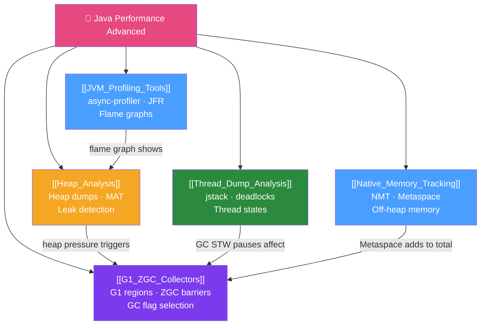

# 🔬 Java Performance Advanced — Map of Content

> [!abstract] What This Section Covers
> Advanced JVM performance engineering: profiling tools to find bottlenecks, heap dump analysis to locate memory leaks, thread dump analysis to diagnose deadlocks and contention, modern garbage collector selection (G1 vs ZGC), and Native Memory Tracking to understand what lives outside the Java heap. These topics separate Java engineers who tune performance from those who guess at it.

## Concept Map

## Learning Path
1. [[JVM_Profiling_Tools]] — Start with profiling to find *what* is slow before optimising.
2. [[Heap_Analysis]] — Analyse memory allocation and find leaks.
3. [[Thread_Dump_Analysis]] — Diagnose concurrency issues, deadlocks, and high CPU.
4. [[G1_ZGC_Collectors]] — Choose and tune the right garbage collector.
5. [[Native_Memory_Tracking]] — Understand memory beyond the Java heap.

## All Notes at a Glance
| Note | Difficulty | What You'll Learn |
|------|------------|-------------------|
| [[JVM_Profiling_Tools]] | Advanced | async-profiler, JFR, VisualVM, flame graphs, allocation profiling |
| [[Heap_Analysis]] | Advanced | Heap dump creation, MAT retained heap, shallow heap, common leak patterns |
| [[Thread_Dump_Analysis]] | Advanced | jstack, thread states, deadlock detection, high-CPU thread identification |
| [[G1_ZGC_Collectors]] | Advanced | G1 regions/mixed GC, ZGC load barriers, -XX flags, when to use each |
| [[Native_Memory_Tracking]] | Advanced | NMT summary/detail, jcmd commands, Metaspace tuning, container pitfalls |

## Key Questions This Section Answers
- How do you generate a flame graph with async-profiler?
- What is the difference between shallow heap and retained heap?
- How do you identify a deadlock from a thread dump?
- When should you choose ZGC over G1?
- What is Metaspace and why does it matter for containerised Java?
- How does Native Memory Tracking help diagnose "why is the container OOM killed?"

## Related Sections
- [[_MOC_Java_Master|↑ Java Master MOC]]
- [[_MOC_Enterprise_Patterns|↔ Enterprise Patterns]] — Architectural choices affect GC pressure
- [[_MOC_Java_DevOps|↔ Java DevOps]] — Kubernetes memory limits interact with JVM tuning

#java #performance #jvm #profiling #gc #MOC
