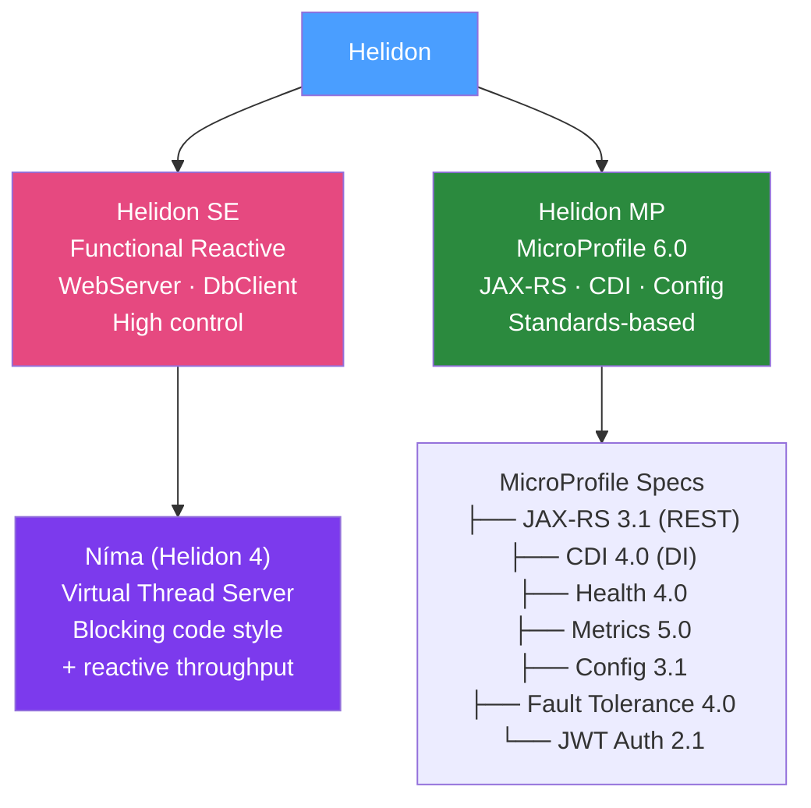

# 🌊 Helidon Framework

> [!abstract] TL;DR
> Helidon is Oracle's open-source Java microservices framework with two variants: **Helidon SE** (functional reactive, no framework magic, similar to Vert.x) and **Helidon MP** (MicroProfile standard implementation — JAX-RS, CDI, MicroProfile Config, Health, Metrics, Fault Tolerance). Helidon 4 (Níma) adds virtual threads support, combining reactive throughput with synchronous code style. Best for teams standardising on MicroProfile specifications or Oracle-stack Java workloads.

## Intuition — analogy FIRST

Helidon's two variants are like two types of bicycle. **Helidon SE** is a **high-performance racing bike** — minimal, fast, low-level. You control every gear, every brake. Maximum performance, but you must handle everything manually. **Helidon MP** is a **feature-rich commuter bike** — built-in lights, fenders, a basket. Less control, but you spend more time riding (writing business logic) and less time assembling components. MicroProfile is the industry standard that defines what features the "commuter bike" must have — so any MicroProfile app works on Quarkus MP, Open Liberty, or Helidon MP.

---

## How It Works



## Key Concepts / Details

### Helidon MP (MicroProfile) — JAX-RS Style

Helidon MP is the easiest entry point if you know JAX-RS/CDI:

```xml
<!-- pom.xml -->
<dependency>
    <groupId>io.helidon.microprofile.bundles</groupId>
    <artifactId>helidon-microprofile</artifactId>
</dependency>
```

```java
// JAX-RS Resource (same annotations as any JAX-RS app)
@Path("/api/orders")
@ApplicationScoped
@Produces(MediaType.APPLICATION_JSON)
@Consumes(MediaType.APPLICATION_JSON)
public class OrderResource {
    
    @Inject
    private OrderService orderService;
    
    @POST
    @Transactional  // JTA transaction management
    public Response placeOrder(PlaceOrderRequest request) {
        Order order = orderService.place(request.toCommand());
        return Response.created(URI.create("/api/orders/" + order.getId()))
                       .entity(order)
                       .build();
    }
    
    @GET
    @Path("/{id}")
    public Response getOrder(@PathParam("id") UUID id) {
        return orderService.findById(id)
                .map(Response::ok)
                .orElse(Response.status(404))
                .build();
    }
}

// Application entry point
@ApplicationScoped
public class Main {
    public static void main(String[] args) {
        Helidon.start();  // starts embedded Netty + CDI container
    }
}
```

### MicroProfile Configuration

```java
// MicroProfile Config — inject config values
@ApplicationScoped
public class OrderService {
    
    @Inject
    @ConfigProperty(name = "order.max.items", defaultValue = "100")
    private int maxItems;
    
    @Inject
    @ConfigProperty(name = "order.timeout.seconds", defaultValue = "30")
    private long timeoutSeconds;
}
```

```properties
# microprofile-config.properties (on classpath)
order.max.items=150
order.timeout.seconds=45

# Environment variables override (CONFIG_PROPERTY_NAME style):
# ORDER_MAX_ITEMS=200  ← overrides config file
```

### MicroProfile Health

```java
// Liveness check
@Liveness
@ApplicationScoped
public class DatabaseLiveness implements HealthCheck {
    
    @Inject
    DataSource dataSource;
    
    @Override
    public HealthCheckResponse call() {
        try (Connection conn = dataSource.getConnection()) {
            if (conn.isValid(1)) {
                return HealthCheckResponse.up("database");
            }
        } catch (SQLException e) {
            return HealthCheckResponse.down("database");
        }
        return HealthCheckResponse.down("database");
    }
}

// Readiness check
@Readiness
@ApplicationScoped
public class CacheReadiness implements HealthCheck {
    
    @Inject
    CacheService cacheService;
    
    @Override
    public HealthCheckResponse call() {
        return cacheService.isReady()
                ? HealthCheckResponse.up("cache")
                : HealthCheckResponse.down("cache");
    }
}

// Access at: GET /health/live (liveness) and GET /health/ready (readiness)
```

### MicroProfile Fault Tolerance

```java
@ApplicationScoped
public class InventoryClient {
    
    @GET
    @Path("/api/inventory/{id}")
    @Retry(maxRetries = 3, delay = 200, delayUnit = ChronoUnit.MILLIS)
    @Fallback(fallbackMethod = "fallbackInventory")
    @Timeout(value = 5, unit = ChronoUnit.SECONDS)
    @CircuitBreaker(successThreshold = 3, requestVolumeThreshold = 10, 
                   failureRatio = 0.5, delay = 5000)
    public InventoryDto getInventory(UUID productId) {
        // real HTTP call to inventory service
        return client.target("http://inventory-service")
                     .path("/api/inventory/" + productId)
                     .request(MediaType.APPLICATION_JSON)
                     .get(InventoryDto.class);
    }
    
    public InventoryDto fallbackInventory(UUID productId) {
        // Return default value when circuit is open or retries exhausted
        return new InventoryDto(productId, 0, "UNKNOWN");
    }
}
```

### MicroProfile Metrics

```java
@ApplicationScoped
public class OrderService {
    
    @Counted(name = "orders.placed", 
             description = "Total orders placed",
             absolute = true)
    @Timed(name = "orders.placement.time",
           description = "Time to place an order",
           absolute = true)
    public Order placeOrder(PlaceOrderCommand command) {
        // ... business logic
    }
    
    @Gauge(name = "orders.pending.count",
           unit = MetricUnits.NONE,
           description = "Current pending order count")
    public long getPendingOrderCount() {
        return orderRepository.countByStatus(OrderStatus.PENDING);
    }
}

// Metrics available at: GET /metrics (Prometheus format)
// GET /metrics/application/orders.placed
```

### MicroProfile JWT Authentication

```java
// Secure endpoints with JWT (MicroProfile JWT 2.1)
@Path("/api/admin/orders")
@ApplicationScoped
@RolesAllowed("admin")  // Requires "admin" role in JWT
public class AdminOrderResource {
    
    @Inject
    @Claim(standard = Claims.sub)
    private String userId;  // Inject JWT claim
    
    @GET
    public List<Order> getAllOrders() {
        return orderRepository.findAll();
    }
}

// microprofile-config.properties for JWT:
# mp.jwt.verify.publickey.location=META-INF/public-key.pem
# mp.jwt.verify.issuer=https://auth.example.com
```

### Helidon SE — Reactive (Low-Level)

```java
// Helidon SE — build the server programmatically
public class Main {
    public static void main(String[] args) {
        WebServer server = WebServer.builder()
                .routing(routing -> routing
                        .get("/api/orders/{id}", (req, res) -> {
                            UUID id = UUID.fromString(req.path().pathParameters().get("id"));
                            orderService.findById(id)
                                    .ifPresentOrElse(
                                            order -> res.send(order),
                                            () -> res.status(Http.Status.NOT_FOUND_404).send());
                        })
                        .post("/api/orders", (req, res) -> {
                            req.content()
                               .as(PlaceOrderRequest.class)
                               .thenApply(r -> orderService.place(r.toCommand()))
                               .thenAccept(order -> res.status(Http.Status.CREATED_201).send(order));
                        }))
                .port(8080)
                .build();
        
        server.start();
        System.out.println("Server started on port " + server.port());
    }
}
```

### Helidon Níma (Virtual Threads, Helidon 4)

```java
// Helidon 4 (Níma) — blocking code with virtual thread throughput
WebServer server = WebServer.builder()
        .virtualThreads(true)  // Use virtual threads for I/O
        .routing(routing -> routing
                .get("/api/orders/{id}", (req, res) -> {
                    // This BLOCKS but runs on a virtual thread
                    // → huge concurrency without callback spaghetti
                    UUID id = UUID.fromString(req.path().pathParameters().get("id"));
                    Order order = orderRepository.findById(id);  // blocking DB call
                    res.send(order);  // blocking response
                }))
        .build();

// Java 21 virtual threads + Helidon Níma = simple code + high throughput
// No reactive programming needed for most use cases
```

### Helidon vs Quarkus vs Micronaut

| Feature | Helidon SE | Helidon MP | Quarkus | Micronaut |
|---------|-----------|-----------|---------|-----------|
| Style | Reactive/functional | MicroProfile standard | CDI + JAX-RS | Compile-time DI |
| Standards | Minimal | MicroProfile 6 | Partial | Partial |
| Native image | Yes | Yes | Excellent | Excellent |
| Oracle support | Yes | Yes | Red Hat | Object Computing |
| Best for | Reactive microservices | MicroProfile standardisation | Cloud-native, k8s | Polyglot JVM |

## Real-World Notes

- **Helidon MP for Jakarta EE teams**: If your team comes from a Jakarta EE / Wildfly / Open Liberty background, Helidon MP uses the same JAX-RS/CDI/JTA annotations — zero relearning.
- **MicroProfile portability**: A Helidon MP application can run on Open Liberty, Quarkus (with MP extensions), WildFly, or Helidon with minimal config changes. This is MicroProfile's promise.
- **Níma is the future**: Helidon 4's Níma server with virtual threads is arguably the cleanest implementation of the virtual thread model — no Mutiny/Reactor complexity, just regular blocking code.

## Common Pitfalls

- **Helidon SE learning curve**: Helidon SE is reactive without a reactive framework abstraction (no Mutiny/Reactor). The raw callback style is verbose. Use Helidon MP or Níma for teams not comfortable with raw reactive.
- **Smaller ecosystem**: Fewer third-party integrations than Spring Boot. You may need to write your own adapters for some libraries.
- **MicroProfile spec lag**: MicroProfile specs update slower than Spring Boot. Some modern patterns (structured concurrency, advanced virtual thread support) may not be in MicroProfile specs yet.

## Related Concepts
- [[Quarkus_Framework]] — Also implements MicroProfile specs; more aggressive build-time optimisation
- [[Micronaut_Framework]] — Competing framework with compile-time DI
- [[Java_8_to_21_Migration]] — Virtual threads (Java 21) power Helidon Níma

## Review Questions
1. What are the two variants of Helidon and when would you choose each?
2. Which MicroProfile specification handles circuit breakers and retries?
3. How does Helidon Níma combine blocking code style with reactive throughput?
4. What does `@ConfigProperty` do in Helidon MP and how do environment variables override it?
5. What is the "portability" promise of MicroProfile?

## Sources
- Helidon documentation: https://helidon.io/docs/v4
- MicroProfile specs: https://microprofile.io/specifications/
- Helidon Níma blog: https://medium.com/helidon/helidon-n%C3%ADma-helidon-on-virtual-threads-130bb2ea2088

#java #helidon #microprofile #oracle #virtual-threads #jax-rs
