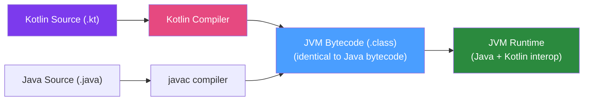

# 🎯 Kotlin for Java Developers

> [!abstract] TL;DR
> Kotlin is a statically typed JVM language (by JetBrains) that compiles to Java bytecode and interoperates fully with Java libraries. It eliminates Java boilerplate: **null safety** (compile-time NPE prevention), **data classes** (replaces POJOs), **extension functions** (add methods to existing classes), **smart casts**, **when expressions** (enhanced switch). **Coroutines** provide structured concurrency that is simpler than CompletableFuture and complements Java 21 virtual threads. Spring Boot has first-class Kotlin support with a Kotlin DSL.

## Intuition — analogy FIRST

Kotlin is like **upgrading from a classic car to the same model with modern features** — same engine (JVM bytecode), same road compatibility (Java libraries), but now you have automatic parking (null safety compiler checks), a backup camera (smart casts), and a heads-up display (extension functions). You can still drive in the same lanes as Java cars (interop), and Java drivers can ride in your Kotlin car too (calling Kotlin from Java). You get all the speed improvements with zero disruption to the Java ecosystem you rely on.

---

## How It Works



## Key Concepts / Details

### Null Safety — No More NPE

Kotlin distinguishes nullable (`String?`) from non-nullable (`String`) types at compile time:

```kotlin
// Non-nullable — compiler guarantees never null
val name: String = "Alice"
// name = null  // COMPILE ERROR

// Nullable — must handle null explicitly
val name: String? = null
// name.length  // COMPILE ERROR — must check first

// Safe call operator ?.
val length: Int? = name?.length  // null if name is null, otherwise name.length

// Elvis operator ?: (default value if null)
val length: Int = name?.length ?: 0

// Not-null assertion !! (throws KotlinNullPointerException if null — avoid)
val length: Int = name!!.length  // dangerous, use only when certain

// Smart cast (no explicit cast needed after null check)
fun printLength(name: String?) {
    if (name != null) {
        println(name.length)  // Smart cast: name is String here, not String?
    }
}

// Java Interop: Java types are "platform types" (String!) — unknown nullability
// Annotate Java with @Nullable/@NonNull for better Kotlin interop
```

### Data Classes — Replace Java POJOs

```kotlin
// Kotlin data class — generates equals/hashCode/toString/copy/componentN automatically
data class Order(
    val id: UUID = UUID.randomUUID(),
    val customerId: String,
    val items: List<OrderItem>,
    val status: OrderStatus = OrderStatus.PENDING,
    val total: BigDecimal
)

// Usage
val order = Order(customerId = "cust-1", items = listOf(...), total = BigDecimal("99.99"))

// Copy with changes
val confirmed = order.copy(status = OrderStatus.CONFIRMED)

// Destructuring
val (id, customerId, items) = order

// Comparable Java code would need: 15 lines of boilerplate (Lombok or IDE-generated)
```

### Extension Functions

```kotlin
// Add methods to existing classes without inheritance
fun String.toCamelCase(): String {
    return split("_")
        .joinToString("") { it.capitalize() }
        .replaceFirstChar { it.lowercase() }
}

// Usage:
val camel = "my_field_name".toCamelCase()  // → "myFieldName"

// Extend Java classes!
fun BigDecimal.toMoney(currency: String) = Money(this, currency)
val price = BigDecimal("99.99").toMoney("USD")

// Extend Spring types
fun HttpHeaders.setJson() = this.apply { contentType = MediaType.APPLICATION_JSON }
```

### When Expression (Enhanced Switch)

```kotlin
// When as expression (returns a value) — exhaustive for sealed classes
val message = when (order.status) {
    OrderStatus.PENDING    -> "Your order is being processed"
    OrderStatus.CONFIRMED  -> "Order confirmed! Preparing for dispatch"
    OrderStatus.SHIPPED    -> "Your order is on its way"
    OrderStatus.DELIVERED  -> "Delivered! Enjoy your purchase"
    OrderStatus.CANCELLED  -> "Your order has been cancelled"
}  // Compiler enforces: every enum value must be covered

// When with type checks (smart cast)
fun process(event: DomainEvent): String = when (event) {
    is OrderPlaced     -> "Order ${event.orderId} placed"
    is OrderCancelled  -> "Order ${event.orderId} cancelled"
    is PaymentReceived -> "Payment of ${event.amount} received"
    else               -> "Unknown event: ${event::class.simpleName}"
}
```

### Sealed Classes — Algebraic Types

```kotlin
// Sealed class = closed hierarchy (sum type)
sealed class OrderResult
data class Success(val order: Order) : OrderResult()
data class Failure(val errorCode: String, val message: String) : OrderResult()
object InsufficientInventory : OrderResult()

// When is exhaustive over sealed class (no else needed):
fun handleResult(result: OrderResult) = when (result) {
    is Success             -> processOrder(result.order)
    is Failure             -> throw OrderException(result.message)
    InsufficientInventory  -> sendBackorderNotification()
}
// If you add a new subclass and forget to handle it: COMPILE ERROR
```

### Kotlin Coroutines — Structured Concurrency

Coroutines are Kotlin's concurrency model — lightweight threads managed by the language runtime:

```kotlin
// Add dependency: org.jetbrains.kotlinx:kotlinx-coroutines-core
// and for Spring: org.jetbrains.kotlinx:kotlinx-coroutines-reactor

// Suspend function — can be paused and resumed without blocking a thread
suspend fun fetchOrder(id: UUID): Order {
    delay(100)  // suspend (doesn't block the thread!) — simulates async I/O
    return orderRepository.findById(id) ?: throw OrderNotFoundException(id)
}

// Launch concurrent coroutines
suspend fun processOrder(orderId: UUID) = coroutineScope {
    val order = async { fetchOrder(orderId) }          // concurrent
    val inventory = async { checkInventory(orderId) }  // concurrent
    val payment = async { validatePayment(orderId) }   // concurrent
    
    // All three run concurrently; await all results
    Triple(order.await(), inventory.await(), payment.await())
}

// Flow — cold stream (like Reactor's Flux or RxJava's Observable)
fun orderEvents(): Flow<OrderEvent> = flow {
    emit(OrderPlaced(orderId))
    delay(1000)
    emit(OrderConfirmed(orderId))
}
```

**Coroutines vs Java virtual threads**:
| | Kotlin Coroutines | Java Virtual Threads (Java 21) |
|--|--|--|
| Basis | Continuation-based (compile-time transform) | OS thread scheduling (JVM-level) |
| Language support | Kotlin only (suspend keyword) | JVM-wide (any language) |
| Structured concurrency | Built-in (coroutineScope) | Project Loom (structured concurrency API) |
| Interop | Integrates with Java via bridge APIs | Native to JVM |
| Best for | Kotlin codebases, reactive pipelines | Java 21+ applications, simpler model |

### Spring Boot with Kotlin

Spring Boot has first-class Kotlin support:

```kotlin
// Spring Boot main
@SpringBootApplication
class OrderServiceApplication

fun main(args: Array<String>) {
    runApplication<OrderServiceApplication>(*args)
}

// Kotlin-style Spring REST controller
@RestController
@RequestMapping("/api/orders")
class OrderController(
    private val orderService: OrderService  // Constructor injection (idiomatic Kotlin)
) {
    
    @PostMapping
    @ResponseStatus(HttpStatus.CREATED)
    fun placeOrder(@RequestBody request: PlaceOrderRequest): OrderResponse {
        val order = orderService.place(request.toCommand())
        return OrderResponse.from(order)
    }
    
    @GetMapping("/{id}")
    fun getOrder(@PathVariable id: UUID): OrderResponse {
        return orderService.findById(id)
            ?.let { OrderResponse.from(it) }
            ?: throw ResponseStatusException(HttpStatus.NOT_FOUND)
    }
}

// Spring Kotlin DSL (lambda-based bean registration)
@Configuration
class BeanConfig {
    @Bean
    fun orderProcessingStep(
        reader: ItemReader<Order>,
        processor: ItemProcessor<Order, Order>,
        writer: ItemWriter<Order>
    ) = StepBuilder("processOrders", jobRepository)
            .chunk<Order, Order>(100, transactionManager)
            .reader(reader)
            .processor(processor)
            .writer(writer)
            .build()
}
```

### Kotlin Data Classes as JPA Entities

```kotlin
// Kotlin entity (requires open classes + all-open plugin for Hibernate proxies)
// Add: kotlin-allopen plugin + kotlin-jpa plugin in pom.xml

@Entity
@Table(name = "orders")
data class Order(
    @Id
    @GeneratedValue
    val id: UUID? = null,
    
    val customerId: String,
    
    @Enumerated(EnumType.STRING)
    var status: OrderStatus = OrderStatus.PENDING,
    
    @Column(name = "created_at")
    val createdAt: Instant = Instant.now()
) {
    // JPA requires a no-arg constructor — kotlin-jpa plugin generates this
}
```

### Kotlin vs Java Summary

| Feature | Java | Kotlin |
|---------|------|--------|
| Null safety | @Nullable annotations (not enforced) | Compile-time (String vs String?) |
| Boilerplate | verbose (Lombok helps) | Minimal |
| Data classes | record (Java 16+) or Lombok | Built-in `data class` |
| Switch | (Java 21 pattern matching) | `when` (expression + exhaustive) |
| Extension methods | No | Yes |
| Coroutines | Virtual threads (Java 21) | Built-in coroutines |
| Interop with Java | N/A | Seamless |
| Spring support | Full | Full |

## Real-World Notes

- **Gradle + Kotlin DSL**: Kotlin is also used for Gradle build scripts (`build.gradle.kts`). This gives type-safe, autocomplete-enabled build configuration.
- **Kotlin on Android**: Kotlin is the official Android language. Skills transfer between Android and backend development.
- **Migration from Java**: You can add Kotlin files to an existing Java project (mixed codebase). Migrate file by file — no big-bang rewrite required. IntelliJ has a Java-to-Kotlin converter.

## Common Pitfalls

- **Java interop nullability**: When calling Java from Kotlin, the Kotlin compiler can't verify nullability. Use `@Nullable`/`@NonNull` on Java methods, or use `?.` defensively.
- **`open` for Hibernate**: Kotlin classes are `final` by default. Hibernate needs to subclass entities for proxying. The `kotlin-allopen` Maven plugin fixes this automatically.
- **Coroutine context leaks**: Not using `coroutineScope { }` means child coroutines can leak if the parent is cancelled. Always use structured concurrency (`coroutineScope`, `supervisorScope`).

## Related Concepts
- [[Scala_Overview]] — Another JVM language with stronger functional programming
- [[Quarkus_Framework]] — Quarkus + Kotlin is a popular combination
- [[Micronaut_Framework]] — Micronaut was designed with Kotlin in mind

## Review Questions
1. What is the difference between `String` and `String?` in Kotlin and why does it matter?
2. What does a Kotlin `data class` auto-generate compared to a Java class?
3. What is an extension function and how is it useful?
4. How does a Kotlin `suspend` function differ from a regular function?
5. What problem does Kotlin's `sealed class` solve compared to a regular class hierarchy?

## Sources
- Kotlin documentation: https://kotlinlang.org/docs/
- Spring Boot Kotlin guide: https://spring.io/guides/tutorials/spring-boot-kotlin/
- Kotlin coroutines guide: https://kotlinlang.org/docs/coroutines-guide.html

#java #kotlin #jvm #coroutines #null-safety #spring-kotlin
