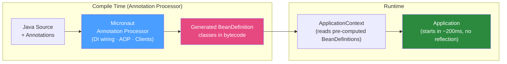

# 🔬 Micronaut Framework

> [!abstract] TL;DR
> Micronaut is a JVM framework (Java, Kotlin, Groovy) that performs **dependency injection and AOP at compile time** using annotation processors — eliminating startup reflection and enabling GraalVM native image without extra configuration. Key features: compile-time DI (zero reflection), Micronaut Data (compile-time query generation), integrated test containers, and excellent GraalVM support. Faster startup than Spring Boot on the JVM and similar to Quarkus; unlike Quarkus, it natively supports all three JVM languages.

## Intuition — analogy FIRST

Traditional Spring Boot is like a **smart home system that learns your preferences while you're living in it** — it discovers your devices, auto-configures everything, and adapts at runtime. It's flexible but takes time to configure on every startup. Micronaut is like a **smart home that was fully configured at the factory** — all the wiring, all the device connections were established before you moved in. No startup delay, no runtime discovery. The trade-off: you can't add new devices at runtime (no dynamic class loading), and the factory configuration process (compile time) takes longer.

---

## How It Works



## Key Concepts / Details

### Getting Started

```xml
<!-- pom.xml -->
<parent>
    <groupId>io.micronaut</groupId>
    <artifactId>micronaut-parent</artifactId>
    <version>4.3.0</version>
</parent>

<dependencies>
    <dependency>
        <groupId>io.micronaut</groupId>
        <artifactId>micronaut-inject-java</artifactId>
        <scope>provided</scope>     <!-- annotation processor -->
    </dependency>
    <dependency>
        <groupId>io.micronaut</groupId>
        <artifactId>micronaut-http-server-netty</artifactId>
    </dependency>
    <dependency>
        <groupId>io.micronaut.data</groupId>
        <artifactId>micronaut-data-jdbc</artifactId>
    </dependency>
</dependencies>
```

```bash
# Or use Micronaut Launch
curl https://launch.micronaut.io/create/default/com.example.orders \
  -d features=data-jdbc,http-server,postgres \
  -o orders.zip && unzip orders.zip

# Run
./mvnw mn:run
```

### Dependency Injection (Compile-Time)

```java
// @Singleton — compile-time singleton bean
@Singleton
public class OrderService {
    
    private final OrderRepository repository;  // Constructor injection (recommended)
    private final EventPublisher events;
    
    public OrderService(OrderRepository repository, EventPublisher events) {
        this.repository = repository;
        this.events = events;
    }
    
    public Order placeOrder(PlaceOrderCommand command) {
        Order order = Order.create(command);
        repository.save(order);
        events.publishEvent(new OrderPlaced(order.getId()));
        return order;
    }
}

// @Requires — conditional beans (compile-time)
@Singleton
@Requires(property = "feature.new-pricing", value = "true")
public class NewPricingService implements PricingService { ... }

@Singleton
@Requires(missingProperty = "feature.new-pricing")
public class LegacyPricingService implements PricingService { ... }
```

### HTTP Controllers

```java
@Controller("/api/orders")
public class OrderController {
    
    private final OrderService orderService;
    
    public OrderController(OrderService orderService) {
        this.orderService = orderService;
    }
    
    @Post
    @Status(HttpStatus.CREATED)
    public OrderResponse placeOrder(@Body PlaceOrderRequest request) {
        Order order = orderService.placeOrder(request.toCommand());
        return OrderResponse.from(order);
    }
    
    @Get("/{id}")
    public HttpResponse<OrderResponse> getOrder(UUID id) {
        return orderService.findById(id)
                .map(o -> HttpResponse.ok(OrderResponse.from(o)))
                .orElse(HttpResponse.notFound());
    }
    
    @Get
    public List<OrderResponse> listOrders(@QueryValue Optional<String> status) {
        return orderService.findAll(status.orElse(null)).stream()
                .map(OrderResponse::from)
                .toList();
    }
}
```

### Micronaut Data — Compile-Time Queries

Micronaut Data generates SQL/JPA queries at compile time (no Hibernate runtime generation):

```java
// JDBC repository (no JPA EntityManager — raw JDBC with mapping)
@JdbcRepository(dialect = Dialect.POSTGRES)
public interface OrderRepository extends CrudRepository<Order, UUID> {
    
    // Query generated at compile time from method name
    List<Order> findByStatus(OrderStatus status);
    
    List<Order> findByCustomerIdOrderByCreatedAtDesc(String customerId);
    
    // Custom query with @Query
    @Query("SELECT * FROM orders WHERE created_at > :since AND status = :status")
    List<Order> findRecentByStatus(Instant since, OrderStatus status);
    
    // Count query
    long countByStatus(OrderStatus status);
    
    // Exists check
    boolean existsByCustomerIdAndStatus(String customerId, OrderStatus status);
    
    // Delete by criteria
    void deleteByStatus(OrderStatus status);
}

// Domain entity with Micronaut Data annotations
@MappedEntity("orders")
public class Order {
    @Id
    @GeneratedValue
    private UUID id;
    
    @MappedProperty("customer_id")
    private String customerId;
    
    private OrderStatus status;
    
    @DateCreated
    private Instant createdAt;
}
```

### Declarative HTTP Clients

```java
// Type-safe HTTP client — generated at compile time
@Client("inventory-service")  // service name from discovery, or URL
public interface InventoryClient {
    
    @Get("/api/inventory/{productId}")
    Mono<InventoryDto> getInventory(UUID productId);
    
    @Post("/api/inventory/reserve")
    Single<ReservationResult> reserve(@Body ReservationRequest request);
}

// Usage
@Singleton
public class OrderService {
    private final InventoryClient inventoryClient;
    
    public void placeOrder(PlaceOrderCommand cmd) {
        inventoryClient.getInventory(cmd.productId())
                .block();  // or use reactive pipeline
    }
}
```

### Configuration and Environments

```yaml
# src/main/resources/application.yml
micronaut:
  application:
    name: order-service
  server:
    port: 8080
  datasources:
    default:
      url: jdbc:postgresql://localhost:5432/orders
      username: ${DB_USER:orders}
      password: ${DB_PASSWORD:orders}

# Environment-specific overrides: application-prod.yml
micronaut:
  datasources:
    default:
      url: jdbc:postgresql://prod-db:5432/orders
```

```java
// Type-safe configuration binding
@ConfigurationProperties("order")
public class OrderConfiguration {
    private int maxItemsPerOrder = 100;
    private Duration processingTimeout = Duration.ofSeconds(30);
    
    // getters/setters...
}

@Singleton
public class OrderService {
    @Inject
    OrderConfiguration config;
    
    public void validateOrder(Order order) {
        if (order.items().size() > config.getMaxItemsPerOrder())
            throw new ValidationException("Too many items");
    }
}
```

### Testing

```java
// Micronaut test with embedded server
@MicronautTest
class OrderControllerTest {
    
    @Inject
    @Client("/")
    HttpClient client;
    
    @Inject
    OrderRepository repository;
    
    @Test
    void placeOrder_returnsCreated() {
        PlaceOrderRequest request = new PlaceOrderRequest("cust-1", List.of(...));
        
        HttpResponse<OrderResponse> response = client.toBlocking()
                .exchange(HttpRequest.POST("/api/orders", request), OrderResponse.class);
        
        assertThat(response.status()).isEqualTo(HttpStatus.CREATED);
        assertThat(response.body().orderId()).isNotNull();
    }
}
```

### GraalVM Native Image

```bash
# Build native executable (much simpler than Quarkus — usually works out of the box)
./mvnw package -Dpackaging=native-image

# With Docker (no local GraalVM)
./mvnw package -Dpackaging=docker-native

# Micronaut's compile-time processing means most native-image issues are pre-solved
# Reflection configs are automatically generated by the annotation processor
```

### Micronaut vs Spring Boot vs Quarkus

| Feature | Micronaut | Spring Boot | Quarkus |
|---------|-----------|-------------|---------|
| DI model | Compile-time | Runtime reflection | Compile-time (CDI) |
| Languages | Java + Kotlin + Groovy | Java + Kotlin + Groovy | Java + Kotlin |
| ORM | Micronaut Data (compile-time) | Spring Data JPA | Panache (JPA wrapper) |
| Reactive | RxJava/Reactor | Project Reactor | Mutiny |
| Native image | Excellent | Spring AOT (improving) | Excellent |
| Dev mode | Basic | Spring DevTools | Outstanding (Dev Services) |
| Ecosystem maturity | Growing | Massive | Growing |
| GraalVM native | First-class | Available | First-class |
| Best for | Polyglot JVM teams | Enterprise Java | Cloud-native + serverless |

## Real-World Notes

- **Interceptor stacking**: Micronaut's compile-time AOP means interceptors are compiled into the code path — no runtime overhead of proxy chains. `@Transactional`, `@Cacheable`, and `@Retry` all compile to bytecode.
- **Test containers integration**: `@MicronautTest` automatically starts embedded servers. With `@TestContainers` on the test class, Postgres/Kafka containers start automatically.
- **Micronaut + Kotlin**: Micronaut was designed with Kotlin in mind. Kotlin data classes work perfectly with Micronaut DI and are the preferred style for DTOs and configuration classes.

## Common Pitfalls

- **No runtime bean registration**: Unlike Spring, you can't register beans dynamically at runtime. All beans must be known at compile time. This is by design but surprises Spring Boot developers.
- **Annotation processor must be on classpath**: Forgetting `micronaut-inject-java` as an annotation processor dependency in Maven means DI code isn't generated — app crashes at startup with "No bean of type X found".
- **Hot reload limitations**: Unlike Spring DevTools or Quarkus Dev Mode, Micronaut's hot reload requires an IDE plugin (IntelliJ IDEA plugin). It's less seamless than Quarkus dev mode.

## Related Concepts
- [[Quarkus_Framework]] — Competing framework with similar build-time DI philosophy
- [[Kotlin_for_Java_Devs]] — Micronaut + Kotlin is a popular combination
- [[Helidon_Framework]] — MicroProfile-based alternative (more standards-based)

## Review Questions
1. How does Micronaut's compile-time DI differ from Spring's runtime reflection-based DI?
2. What does "compile-time query generation" mean in Micronaut Data?
3. How do you define a declarative HTTP client in Micronaut?
4. What does `@Requires` annotation do in Micronaut?
5. Why does Micronaut work better with GraalVM native image out-of-the-box compared to Spring Boot?

## Sources
- Micronaut documentation: https://docs.micronaut.io/
- Micronaut Launch: https://micronaut.io/launch/
- Micronaut Data: https://micronaut-projects.github.io/micronaut-data/

#java #micronaut #compile-time-di #cloud-native #graalvm #micronaut-data
