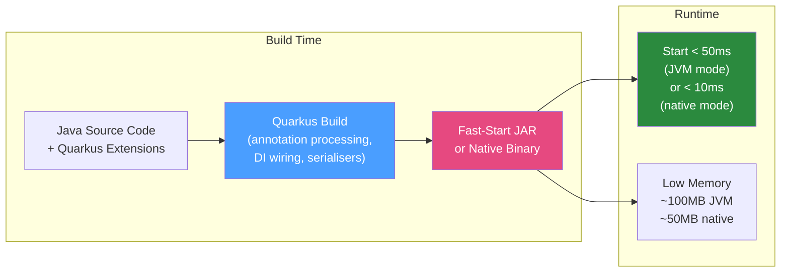

# ⚡ Quarkus Framework

> [!abstract] TL;DR
> Quarkus is a Kubernetes-native Java framework that moves framework work from runtime to **build time**, enabling fast startup (< 50ms) and low memory footprint. It supports **GraalVM native image** (compile Java to a native binary — startup in milliseconds, ~50 MB container). Core features: **build-time dependency injection** (CDI subset), **Panache** (active record or repository ORM), **Mutiny** (reactive streams), and exceptional **Dev Mode** with live reload. Best for serverless, FaaS, and container-first applications.

## Intuition — analogy FIRST

Traditional JVM startup is like opening a restaurant: unlock the doors, set up all the tables, warm up every appliance, train staff on all possible menu items — then serve the first customer (30 seconds later). Quarkus flips this: it does all the setup at build time (when you compile). By the time the app starts, everything is already arranged — the tables are set, appliances are pre-heated, and the menu is finalised. The first customer is served in 50ms. GraalVM native image goes further: it's like a food truck that comes pre-setup — no JVM, just a binary that runs immediately.

---

## How It Works



## Key Concepts / Details

### Getting Started

```bash
# Create a new Quarkus project
mvn io.quarkus.platform:quarkus-maven-plugin:3.8.0:create \
    -DprojectGroupId=com.example \
    -DprojectArtifactId=order-service \
    -Dextensions="rest,rest-jackson,hibernate-orm-panache,jdbc-postgresql,smallrye-openapi"

# Dev Mode (live reload — code changes reflected instantly)
./mvnw quarkus:dev

# Build native image (requires GraalVM or Docker)
./mvnw package -Dnative
./mvnw package -Dnative -Dquarkus.native.container-build=true  # Build in Docker (no local GraalVM needed)
```

### Dependency Injection (CDI Subset)

Quarkus uses CDI (Contexts and Dependency Injection) for DI, but processes it at build time:

```java
@ApplicationScoped  // Single instance (like Spring @Service)
public class OrderService {
    
    @Inject  // Inject (like Spring @Autowired)
    OrderRepository orderRepository;
    
    @Inject
    @RestClient  // Type-safe REST client
    InventoryService inventoryClient;
    
    public Order placeOrder(PlaceOrderCommand command) {
        Order order = new Order(command.customerId(), command.items());
        orderRepository.persist(order);
        return order;
    }
}

// Scopes in Quarkus CDI:
// @ApplicationScoped  — singleton (same as @Singleton but proxied)
// @Singleton          — true singleton (not proxied, no interceptors in some contexts)
// @RequestScoped      — per HTTP request
// @Dependent          — new instance per injection point
```

### Panache — ORM Layer

Quarkus Panache is a simplified JPA layer. Two styles: **Active Record** (entity has persistence methods) and **Repository** (separate class).

```java
// Active Record style (entity manages itself):
@Entity
public class Order extends PanacheEntity {  // PanacheEntity adds auto-generated Long id
    
    public String customerId;
    public String status;
    
    @OneToMany(cascade = CascadeType.ALL)
    public List<OrderLine> lines = new ArrayList<>();
    
    // Custom finder methods (auto-mapped by Panache)
    public static List<Order> findByCustomerId(String customerId) {
        return list("customerId", customerId);
    }
    
    public static List<Order> findPendingOrders() {
        return list("status = ?1 ORDER BY id DESC", "PENDING");
    }
    
    public static long countByStatus(String status) {
        return count("status", status);
    }
}

// Usage — no repository needed:
@ApplicationScoped
public class OrderService {
    
    @Transactional
    public Order placeOrder(PlaceOrderCommand command) {
        Order order = new Order();
        order.customerId = command.customerId();
        order.status = "PENDING";
        order.persist();  // Active Record: persist directly on the entity
        return order;
    }
    
    public List<Order> getCustomerOrders(String customerId) {
        return Order.findByCustomerId(customerId);
    }
}

// Repository style (cleaner for DDD):
@ApplicationScoped
public class OrderRepository implements PanacheRepository<Order> {
    
    public List<Order> findByCustomerId(String customerId) {
        return list("customerId", customerId);
    }
}
```

### REST with JAX-RS

Quarkus uses Jakarta REST (formerly JAX-RS) for REST endpoints:

```java
@Path("/api/orders")
@Produces(MediaType.APPLICATION_JSON)
@Consumes(MediaType.APPLICATION_JSON)
public class OrderResource {
    
    @Inject
    OrderService orderService;
    
    @POST
    @Transactional
    public Response placeOrder(PlaceOrderRequest request) {
        Order order = orderService.placeOrder(request.toCommand());
        return Response.created(URI.create("/api/orders/" + order.id))
                       .entity(order)
                       .build();
    }
    
    @GET
    @Path("/{id}")
    public Order getOrder(@PathParam("id") Long id) {
        return Order.findById(id);  // Panache active record
    }
    
    @GET
    public List<Order> getOrders(@QueryParam("customerId") String customerId) {
        return Order.findByCustomerId(customerId);
    }
}
```

### Mutiny — Reactive Programming

Quarkus uses SmallRye Mutiny for reactive streams:

```java
@Path("/api/orders")
public class ReactiveOrderResource {
    
    @Inject
    @RestClient
    ReactiveInventoryClient inventoryClient;
    
    @POST
    public Uni<Response> placeOrder(PlaceOrderRequest request) {
        // Uni = 0 or 1 item (like Mono in Project Reactor)
        // Multi = 0 to N items (like Flux in Project Reactor)
        return inventoryClient.checkAvailability(request.items())
                .map(available -> {
                    if (!available) throw new WebApplicationException(409);
                    Order order = new Order();
                    order.persist();
                    return Response.created(URI.create("/api/orders/" + order.id)).build();
                })
                .onFailure().recoverWithItem(e ->
                        Response.serverError().build());
    }
    
    @GET
    @Path("/stream")
    @Produces(MediaType.SERVER_SENT_EVENTS)
    public Multi<Order> streamOrders() {
        return Multi.createFrom().items(Order.streamAll());
    }
}
```

### GraalVM Native Image

```bash
# Build native executable
./mvnw package -Dnative

# Or build using Docker (no local GraalVM required)
./mvnw package -Dnative -Dquarkus.native.container-build=true

# Result: target/order-service-1.0-runner (native binary)
./target/order-service-1.0-runner
# Starts in < 50ms, uses ~50MB RAM

# Dockerfile for native image
FROM registry.access.redhat.com/ubi8/ubi-minimal:8.8
COPY target/*-runner /work/application
RUN chmod 775 /work
CMD ["/work/application", "-Dquarkus.http.host=0.0.0.0"]
```

**Native image limitations**:
- No runtime reflection (unless explicitly configured with `@RegisterForReflection`)
- No dynamic class loading at runtime
- Build takes 3–10 minutes (vs 10 seconds for JVM build)

```java
// If you need reflection in native image:
@RegisterForReflection
public class MyDto { ... }

// Or in resources/META-INF/native-image/reflect-config.json
```

### Dev Mode Features

```bash
./mvnw quarkus:dev
# Live reload: change .java file → hot-swapped automatically
# Dev UI: http://localhost:8080/q/dev/  (Swagger, DB browser, config)
# Continuous testing: tests run automatically on code change
# Dev Services: Quarkus auto-starts Postgres/Kafka/Redis via TestContainers!
```

### Quarkus vs Spring Boot

| Feature | Quarkus | Spring Boot |
|---------|---------|-------------|
| DI | CDI (build-time) | Spring (runtime reflection) |
| REST | JAX-RS / RESTEasy | Spring MVC / WebFlux |
| ORM | Panache (JPA wrapper) | Spring Data JPA |
| Reactive | Mutiny | Project Reactor |
| Startup (JVM) | ~200ms | ~2–5s |
| Startup (native) | ~20ms | ~80ms (Spring Native) |
| Native image | First-class support | Spring AOT (improving) |
| Ecosystem | Growing, 700+ extensions | Massive, de facto standard |
| Best for | Cloud-native, serverless | Enterprise, large teams |

## Real-World Notes

- **Dev Services**: One of Quarkus's best features. Add Postgres dependency and Quarkus automatically starts a Docker container for it in dev mode — zero configuration needed.
- **Extensions model**: Quarkus has 700+ extensions at https://code.quarkus.io/. Each extension handles build-time processing to make the library work in native mode.
- **Panache active record trade-off**: Active Record violates separation of concerns but is pragmatic for simple CRUD. Use Repository style for DDD-heavy applications.

## Common Pitfalls

- **Reflection in native image**: Third-party libraries that use reflection (Jackson, logging) need their reflection registrations. Most popular libraries have Quarkus extensions that handle this automatically.
- **CDI scope mismatches**: Injecting a `@RequestScoped` bean into `@ApplicationScoped` bean causes a runtime error. Quarkus detects most of these at build time.
- **Native build time**: Native compilation is slow (3–10 min). Use JVM mode for development, native only in CI/CD for the final production build.

## Related Concepts
- [[Micronaut_Framework]] — Competing framework with similar build-time philosophy
- [[Docker_Spring_Boot]] — Container considerations differ for native vs JVM images
- [[G1_ZGC_Collectors]] — GraalVM AOT: no JIT, so GC tuning works differently in native

## Review Questions
1. What is Quarkus's core innovation vs traditional Spring Boot?
2. What is Panache and what are the two programming styles it supports?
3. How does Mutiny's `Uni` differ from `CompletableFuture`?
4. What is a limitation of GraalVM native image you must plan for?
5. What are "Dev Services" in Quarkus?

## Sources
- Quarkus documentation: https://quarkus.io/guides/
- Quarkus cheat sheet: https://quarkus.io/get-started/
- Red Hat Quarkus GitHub: https://github.com/quarkusio/quarkus

#java #quarkus #native-image #panache #mutiny #cloud-native
