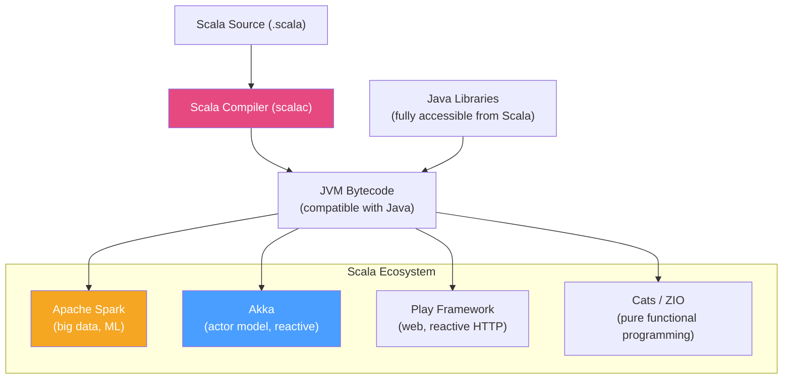

# 🔷 Scala Overview

> [!abstract] TL;DR
> Scala is a statically typed JVM language that fuses **functional programming** (immutability, higher-order functions, pattern matching, algebraic types) with **object-oriented programming**. It compiles to JVM bytecode and interoperates with Java. Scala is used heavily in **Apache Spark** (the Spark API is Scala-first), **Akka** (actor model concurrency), and **distributed systems** (Twitter, LinkedIn historically). Scala 3 (Dotty) simplifies the language significantly with cleaner syntax and better type inference.

## Intuition — analogy FIRST

Scala is like **Swiss German** — it's a proper language in its own right, but speakers of German (Java) can roughly understand it and vice versa. It looks similar on the surface but has features German doesn't: grammatical cases are handled automatically (type inference), new grammatical structures for expressing complex ideas (algebraic types, type classes), and everything is an expression that returns a value. Some Java developers find Scala's advanced type system (implicits, type classes, higher-kinded types) as challenging as learning German's cases — but once mastered, it enables expressiveness impossible in Java.

---

## How It Works



## Key Concepts / Details

### Core Syntax Differences from Java

```scala
// Variables
val name: String = "Alice"    // val = immutable (like Java final)
var count: Int = 0             // var = mutable
val inferred = "Hello"         // Type inference (String inferred)

// Functions
def add(a: Int, b: Int): Int = a + b    // Single-expression function
def greet(name: String) = s"Hello, $name"  // String interpolation

// Classes
class Order(val id: UUID, val customerId: String, var status: String)

// Objects (singletons — replaces Java static)
object OrderUtils {
    def formatId(id: UUID): String = id.toString.take(8)
}

// Case classes (like Kotlin data classes — immutable POJOs)
case class Order(
    id: UUID = UUID.randomUUID(),
    customerId: String,
    items: List[OrderItem],
    status: OrderStatus = OrderStatus.Pending,
    total: BigDecimal
)

// Case class auto-generates: equals/hashCode/toString/copy/unapply (for pattern matching)
val order = Order(customerId = "cust-1", items = List.empty, total = BigDecimal("99.99"))
val confirmed = order.copy(status = OrderStatus.Confirmed)
```

### Pattern Matching

Scala's pattern matching is more powerful than Java's switch:

```scala
// Match on type with extraction
def processEvent(event: DomainEvent): String = event match {
    case OrderPlaced(orderId, customerId, items, total, _) =>
        s"Order $orderId placed for $customerId: $total"
    case OrderCancelled(orderId, reason) =>
        s"Order $orderId cancelled: $reason"
    case PaymentReceived(orderId, amount, currency) if amount > 1000 =>
        s"Large payment of $amount $currency for order $orderId"
    case _ => "Unknown event"
}

// Match on values
val discount = customer.tier match {
    case "GOLD"     => 0.20
    case "SILVER"   => 0.10
    case "BRONZE"   => 0.05
    case _          => 0.0
}

// Match with guards (conditions)
val grade = score match {
    case s if s >= 90 => "A"
    case s if s >= 80 => "B"
    case s if s >= 70 => "C"
    case _            => "F"
}
```

### Sealed Traits — Algebraic Data Types

```scala
// Sealed trait = sealed interface in Java/Kotlin
sealed trait OrderResult
case class Success(order: Order) extends OrderResult
case class Failure(code: String, message: String) extends OrderResult
case object InsufficientInventory extends OrderResult

// Pattern matching is exhaustive over sealed traits:
def handle(result: OrderResult): Unit = result match {
    case Success(order)                  => processOrder(order)
    case Failure(code, msg)              => throw new OrderException(msg)
    case InsufficientInventory           => sendBackorderNotification()
    // Compiler warns if any case is missing
}
```

### Higher-Order Functions and Collections

```scala
// Functional collection operations
val orders: List[Order] = getOrders()

val pendingTotal = orders
    .filter(_.status == OrderStatus.Pending)      // filter: keeps matching elements
    .map(_.total)                                  // map: transforms elements
    .sum                                           // aggregate

// flatMap — used for chaining Option/Either (monadic composition)
def findCustomer(id: String): Option[Customer] = ???
def findActiveOrder(customerId: String): Option[Order] = ???

val order: Option[Order] = findCustomer("cust-1")
    .flatMap(c => findActiveOrder(c.id))  // chains Options safely
    .filter(_.status == OrderStatus.Pending)

// For comprehension (syntactic sugar for map/flatMap — like Java stream pipelines)
val result: Option[OrderSummary] = for {
    customer <- findCustomer("cust-1")         // findCustomer returns Option[Customer]
    order    <- findActiveOrder(customer.id)   // findActiveOrder returns Option[Order]
    if order.status == OrderStatus.Pending     // filter condition
} yield OrderSummary(customer, order)          // maps to result if all defined
```

### Option, Either — Safe Error Handling

```scala
// Option — replaces null (like Java's Optional, but deeply integrated in Scala)
val maybeOrder: Option[Order] = repository.findById(orderId)
val total = maybeOrder.map(_.total).getOrElse(BigDecimal.ZERO)

// Either — error OR success (Right = success, Left = error — "right is right")
def placeOrder(cmd: PlaceOrderCommand): Either[String, Order] = {
    if (cmd.items.isEmpty) Left("Order must have items")
    else if (cmd.customerId.isBlank) Left("Customer ID required")
    else Right(Order(customerId = cmd.customerId, items = cmd.items, total = calculateTotal(cmd)))
}

// Chain Either operations
val result: Either[String, OrderSummary] = for {
    order    <- placeOrder(command)
    payment  <- processPayment(order)
    summary  <- buildSummary(order, payment)
} yield summary

result match {
    case Right(summary) => log.info("Order placed: {}", summary)
    case Left(error)    => log.error("Order failed: {}", error)
}
```

### Apache Spark with Scala

Spark's native API is Scala. Most Spark tutorials and internal code is Scala:

```scala
import org.apache.spark.sql.{SparkSession, DataFrame}
import org.apache.spark.sql.functions._

val spark = SparkSession.builder()
    .appName("OrderAnalytics")
    .master("local[*]")
    .getOrCreate()

import spark.implicits._  // enables .toDS and .as[CaseClass]

// Read and process orders
val orders: DataFrame = spark.read
    .option("header", "true")
    .csv("s3://data/orders/")

// Strongly typed Dataset
case class OrderRecord(orderId: String, customerId: String, total: Double)
val orderDs = orders.as[OrderRecord]

// Analytics
val dailyRevenue = orders
    .withColumn("date", to_date(col("created_at")))
    .groupBy("date")
    .agg(
        sum("total").as("daily_revenue"),
        count("*").as("order_count"),
        avg("total").as("avg_order_value")
    )
    .orderBy(desc("date"))

dailyRevenue.show()
dailyRevenue.write.parquet("s3://results/daily-revenue/")
```

### Akka — Actor Model

```scala
import akka.actor.typed._
import akka.actor.typed.scaladsl._

// Message protocol
sealed trait OrderCommand
case class PlaceOrder(customerId: String, items: List[String], replyTo: ActorRef[OrderResult]) extends OrderCommand
case class CancelOrder(orderId: UUID, replyTo: ActorRef[OrderResult]) extends OrderCommand

// Actor
object OrderActor {
    def apply(): Behavior[OrderCommand] = Behaviors.receiveMessage {
        case PlaceOrder(customerId, items, replyTo) =>
            val order = Order(customerId = customerId, items = items.map(OrderItem))
            // persist and reply
            replyTo ! Success(order)
            Behaviors.same
            
        case CancelOrder(orderId, replyTo) =>
            // cancel logic
            replyTo ! Success(cancelledOrder)
            Behaviors.same
    }
}

// Usage
val system = ActorSystem(OrderActor(), "order-system")
implicit val timeout: Timeout = Timeout(5.seconds)

val result: Future[OrderResult] = system.ask(PlaceOrder("cust-1", List("item-1"), _))
```

### Scala 3 (Dotty) Improvements

Scala 3 (released 2021) simplifies many features Java developers find intimidating:

```scala
// Scala 3: cleaner enums (vs sealed traits for simple cases)
enum OrderStatus:
    case Pending, Confirmed, Shipped, Delivered, Cancelled

// Scala 3: extension methods (like Kotlin)
extension (s: String)
    def toOrderId: UUID = UUID.fromString(s)

// Scala 3: given/using replaces implicit (cleaner type class pattern)
given Ordering[Order] = Ordering.by(_.total)
val sorted = orders.sorted  // uses the given Ordering automatically

// Scala 3: union types
def parseId(value: String | Int): UUID = value match {
    case s: String => UUID.fromString(s)
    case i: Int    => UUID.fromString(s"00000000-0000-0000-0000-${i.toString.padStart(12, '0')}")
}
```

### When to Use Scala vs Java vs Kotlin

| Scenario | Recommended | Why |
|---------|-------------|-----|
| Apache Spark pipelines | **Scala** | Spark native API is Scala; Java API is verbose |
| Akka / actor systems | **Scala** | Akka Typed API is Scala-native |
| New microservice | **Kotlin** | Simpler than Scala, excellent Spring support |
| Existing Java team | **Kotlin** | Gentle migration, familiar paradigm |
| Pure functional (ZIO/Cats) | **Scala** | FP type classes not available in Kotlin |
| Android | **Kotlin** | Official Android language |

## Real-World Notes

- **Scala compilation is slow**: Scalac is significantly slower than javac or kotlinc. Large Scala projects can take 5–15 minutes to compile. Use incremental compilation (sbt or Gradle Scala plugin).
- **Binary compatibility**: Scala has no cross-version binary compatibility between major versions (2.12, 2.13, 3). Library dependencies must match your Scala version exactly.
- **ZIO for pure FP**: ZIO is a popular Scala library for writing pure functional effectful programs. It's the Scala equivalent of Haskell's IO monad. Very powerful, steep learning curve.

## Common Pitfalls

- **Implicits abuse (Scala 2)**: Scala 2's `implicit` keyword enables powerful features but can make code hard to understand. Scala 3 `given`/`using` is cleaner. Avoid deeply nested implicits.
- **Mutability in Scala**: Scala encourages immutability but doesn't enforce it. `var` and mutable collections exist. Choose `val` and `List/Set/Map` (immutable) by default.
- **Java team onboarding**: Scala's advanced features (higher-kinded types, implicits, type classes) require significant learning. Don't adopt Scala in a Java team without a dedicated training plan.

## Related Concepts
- [[Kotlin_for_Java_Devs]] — More accessible JVM alternative for Java teams
- [[Apache_Spark_Java]] — Spark's Java API vs Scala's native API
- [[Java_Streams_Advanced]] — Java Streams are inspired by Scala's collection API

## Review Questions
1. What is a Scala `case class` and what does it auto-generate?
2. How does Scala pattern matching differ from Java switch statements?
3. What is the difference between `Option` and `Either` in Scala?
4. How do Spark's Scala and Java APIs differ in terms of verbosity?
5. What does the `for` comprehension in Scala desugar into?

## Sources
- Scala documentation: https://docs.scala-lang.org/
- Scala 3 book: https://docs.scala-lang.org/scala3/book/
- Apache Spark Scala guide: https://spark.apache.org/docs/latest/rdd-programming-guide.html
- ZIO documentation: https://zio.dev/

#java #scala #functional-programming #jvm #akka #spark
