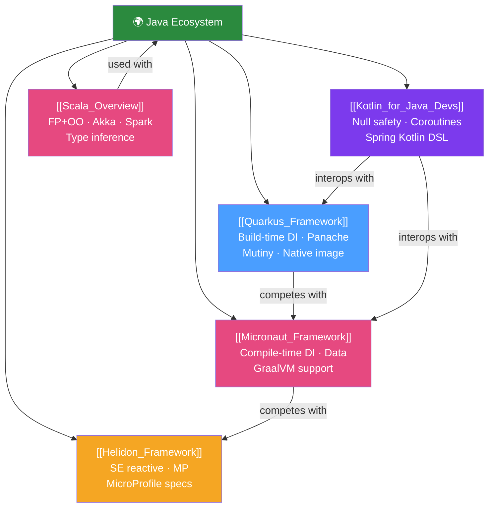

# 🌍 Java Ecosystem — Map of Content

> [!abstract] What This Section Covers
> The JVM ecosystem extends far beyond Spring Boot. Quarkus and Micronaut offer build-time optimisation and GraalVM native image support for cloud-native applications. Helidon brings MicroProfile to the JVM. Kotlin is a JVM language that compiles to Java bytecode and interoperates fully with Java libraries. Scala combines functional programming with object-oriented design. Understanding the alternatives makes you a more informed architect — knowing when to choose Spring Boot vs Quarkus vs Kotlin vs Scala.

## Concept Map

## Learning Path
1. [[Quarkus_Framework]] — The most popular Spring Boot alternative for cloud-native Java.
2. [[Micronaut_Framework]] — Compile-time DI and AOP, zero-reflection startup.
3. [[Helidon_Framework]] — MicroProfile standard on the JVM (Oracle-backed).
4. [[Kotlin_for_Java_Devs]] — The "better Java" that compiles to JVM bytecode.
5. [[Scala_Overview]] — Functional + OO language used in Spark and distributed systems.

## All Notes at a Glance
| Note | Difficulty | What You'll Learn |
|------|------------|-------------------|
| [[Quarkus_Framework]] | Intermediate | build-time DI, Panache ORM, Mutiny reactive, native image, dev mode |
| [[Micronaut_Framework]] | Intermediate | compile-time DI/AOP, Micronaut Data, GraalVM, comparison to Spring |
| [[Helidon_Framework]] | Intermediate | Helidon SE vs MP, JAX-RS, MicroProfile specs, Níma virtual threads |
| [[Kotlin_for_Java_Devs]] | Intermediate | null safety, data classes, coroutines, Spring Boot Kotlin DSL |
| [[Scala_Overview]] | Advanced | case classes, pattern matching, implicits, Akka, Apache Spark |

## Key Questions This Section Answers
- When should you choose Quarkus or Micronaut over Spring Boot?
- What is GraalVM native image and why does it matter?
- How does Kotlin's null safety system prevent NullPointerExceptions?
- What are Kotlin coroutines and how do they compare to Java virtual threads?
- What makes Scala's type system powerful?
- How does Akka differ from Java's CompletableFuture/virtual threads?

## Related Sections
- [[_MOC_Java_Master|↑ Java Master MOC]]
- [[_MOC_Java_Performance_Advanced|↔ Performance Advanced]] — Native image startup time vs JVM warm-up
- [[_MOC_Java_DevOps|↔ Java DevOps]] — Container images — native vs JVM sizes

#java #ecosystem #quarkus #micronaut #kotlin #scala #MOC
