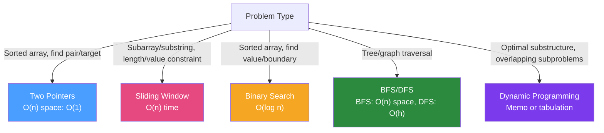

# 🧮 Coding Challenges in Java

> [!abstract] TL;DR
> Coding interviews test pattern recognition, not memorisation of solutions. The five most common patterns: **Two Pointers** (array/string problems), **Sliding Window** (subarray/substring problems), **Binary Search** (sorted arrays, search space), **Tree traversals** (BFS/DFS), and **Dynamic Programming** (optimal substructure). Learn the template for each pattern, then apply it. Java-specific: prefer `Deque` over `Stack`, use `char[]` for string mutation, and know when to use `HashMap` vs `TreeMap`.

## Intuition — analogy FIRST

Coding patterns are like **cooking techniques** — you don't memorise recipes for every dish; you learn to sauté, braise, bake, and grill. When you see a new dish, you identify which technique applies. Two Pointers is like "slicing from both ends of a baguette to find the right portion." Sliding Window is like "moving a focus along a conveyor belt, keeping track of what's in view." Binary Search is like "searching for a word in a dictionary by opening to the middle, deciding which half to search, and repeating." Once you know the technique, 80% of problems are applications of it.

---

## How It Works



## Key Concepts / Details

### Pattern 1: Two Pointers

**When to use**: Array/string problem, often sorted, find pair, triplet, palindrome check, or merge.

**Template**:
```java
// Template: Two pointers from ends
int left = 0, right = array.length - 1;
while (left < right) {
    if (condition(array[left], array[right])) {
        // found solution
        left++; right--;
    } else if (needLarger) {
        left++;  // move left pointer right to increase sum/value
    } else {
        right--;  // move right pointer left to decrease sum/value
    }
}
```

**Example: Two Sum in sorted array**
```java
// Given sorted array, find indices where arr[i] + arr[j] == target
public int[] twoSum(int[] numbers, int target) {
    int left = 0, right = numbers.length - 1;
    
    while (left < right) {
        int sum = numbers[left] + numbers[right];
        if (sum == target) return new int[]{left + 1, right + 1};  // 1-indexed
        else if (sum < target) left++;    // need larger sum
        else right--;                      // need smaller sum
    }
    return new int[]{-1, -1};  // not found
}
// Time: O(n)  Space: O(1)
```

**Example: Reverse a string**
```java
public void reverseString(char[] s) {
    int left = 0, right = s.length - 1;
    while (left < right) {
        char temp = s[left];
        s[left++] = s[right];
        s[right--] = temp;
    }
}
```

**3Sum variant** (sorted, find triplets summing to 0):
```java
public List<List<Integer>> threeSum(int[] nums) {
    List<List<Integer>> result = new ArrayList<>();
    Arrays.sort(nums);  // sort first
    
    for (int i = 0; i < nums.length - 2; i++) {
        if (i > 0 && nums[i] == nums[i-1]) continue;  // skip duplicates
        
        int left = i + 1, right = nums.length - 1;
        while (left < right) {
            int sum = nums[i] + nums[left] + nums[right];
            if (sum == 0) {
                result.add(List.of(nums[i], nums[left], nums[right]));
                while (left < right && nums[left] == nums[left+1]) left++;   // skip dups
                while (left < right && nums[right] == nums[right-1]) right--;
                left++; right--;
            } else if (sum < 0) left++;
            else right--;
        }
    }
    return result;
}
// Time: O(n^2)  Space: O(n) for result
```

### Pattern 2: Sliding Window

**When to use**: Subarray/substring problems with a constraint (max sum, max length, contains all chars).

```java
// Fixed size window:
int windowSum = 0;
for (int i = 0; i < k; i++) windowSum += arr[i];  // initialize first window
int maxSum = windowSum;

for (int i = k; i < arr.length; i++) {
    windowSum += arr[i] - arr[i - k];  // slide: add new, remove old
    maxSum = Math.max(maxSum, windowSum);
}

// Variable size window (expand right, shrink left):
int left = 0;
Map<Character, Integer> freq = new HashMap<>();
int maxLen = 0;

for (int right = 0; right < s.length(); right++) {
    freq.merge(s.charAt(right), 1, Integer::sum);  // add right char
    
    while (violatesConstraint(freq)) {             // shrink window from left
        char leftChar = s.charAt(left++);
        freq.merge(leftChar, -1, Integer::sum);
        if (freq.get(leftChar) == 0) freq.remove(leftChar);
    }
    
    maxLen = Math.max(maxLen, right - left + 1);
}
```

**Example: Longest substring without repeating characters**
```java
public int lengthOfLongestSubstring(String s) {
    Map<Character, Integer> lastSeen = new HashMap<>();
    int maxLen = 0, left = 0;
    
    for (int right = 0; right < s.length(); right++) {
        char c = s.charAt(right);
        if (lastSeen.containsKey(c) && lastSeen.get(c) >= left) {
            left = lastSeen.get(c) + 1;  // jump left past duplicate
        }
        lastSeen.put(c, right);
        maxLen = Math.max(maxLen, right - left + 1);
    }
    return maxLen;
}
// Time: O(n)  Space: O(min(n, alphabet))
```

### Pattern 3: Binary Search

**When to use**: Sorted array, find a value or boundary. Also: "find minimum X such that condition(X) is true."

```java
// Classic binary search
int left = 0, right = nums.length - 1;
while (left <= right) {
    int mid = left + (right - left) / 2;  // avoid overflow (NOT (left+right)/2)
    if (nums[mid] == target) return mid;
    else if (nums[mid] < target) left = mid + 1;
    else right = mid - 1;
}
return -1;

// Find leftmost position (first occurrence or insertion point):
int left = 0, right = nums.length;  // right = nums.length (not length-1!)
while (left < right) {
    int mid = left + (right - left) / 2;
    if (nums[mid] < target) left = mid + 1;
    else right = mid;   // preserve potential answer
}
// left = first index where nums[left] >= target
```

**Example: Search in rotated sorted array**
```java
public int search(int[] nums, int target) {
    int left = 0, right = nums.length - 1;
    while (left <= right) {
        int mid = left + (right - left) / 2;
        if (nums[mid] == target) return mid;
        
        if (nums[left] <= nums[mid]) {  // left half is sorted
            if (target >= nums[left] && target < nums[mid]) right = mid - 1;
            else left = mid + 1;
        } else {                         // right half is sorted
            if (target > nums[mid] && target <= nums[right]) left = mid + 1;
            else right = mid - 1;
        }
    }
    return -1;
}
// Time: O(log n)  Space: O(1)
```

### Pattern 4: Tree Traversals (BFS/DFS)

**BFS (Level-order) — use Deque as queue**:
```java
// BFS template
public List<List<Integer>> levelOrder(TreeNode root) {
    List<List<Integer>> result = new ArrayList<>();
    if (root == null) return result;
    
    Deque<TreeNode> queue = new ArrayDeque<>();  // Deque, not Stack!
    queue.offer(root);
    
    while (!queue.isEmpty()) {
        int levelSize = queue.size();
        List<Integer> level = new ArrayList<>();
        
        for (int i = 0; i < levelSize; i++) {
            TreeNode node = queue.poll();
            level.add(node.val);
            if (node.left != null) queue.offer(node.left);
            if (node.right != null) queue.offer(node.right);
        }
        result.add(level);
    }
    return result;
}

// DFS — recursive (inorder = left, root, right)
public void inorder(TreeNode node, List<Integer> result) {
    if (node == null) return;
    inorder(node.left, result);
    result.add(node.val);
    inorder(node.right, result);
}

// DFS — iterative with explicit stack (avoids stack overflow on deep trees)
public List<Integer> inorderIterative(TreeNode root) {
    List<Integer> result = new ArrayList<>();
    Deque<TreeNode> stack = new ArrayDeque<>();  // use Deque as stack
    TreeNode curr = root;
    
    while (curr != null || !stack.isEmpty()) {
        while (curr != null) { stack.push(curr); curr = curr.left; }
        curr = stack.pop();
        result.add(curr.val);
        curr = curr.right;
    }
    return result;
}
```

**Example: Validate BST**
```java
public boolean isValidBST(TreeNode root) {
    return validate(root, Long.MIN_VALUE, Long.MAX_VALUE);
}

private boolean validate(TreeNode node, long min, long max) {
    if (node == null) return true;
    if (node.val <= min || node.val >= max) return false;
    return validate(node.left, min, node.val) && 
           validate(node.right, node.val, max);
}
```

### Pattern 5: Dynamic Programming

**When to use**: Problem can be broken into overlapping subproblems with optimal substructure.

**Memoisation (top-down)**:
```java
// Fibonacci with memoisation
Map<Integer, Long> memo = new HashMap<>();
public long fib(int n) {
    if (n <= 1) return n;
    if (memo.containsKey(n)) return memo.get(n);
    long result = fib(n-1) + fib(n-2);
    memo.put(n, result);
    return result;
}

// Coin Change (minimum coins to make amount)
public int coinChange(int[] coins, int amount) {
    int[] dp = new int[amount + 1];
    Arrays.fill(dp, amount + 1);  // Initialize to "impossible" value
    dp[0] = 0;
    
    for (int i = 1; i <= amount; i++) {
        for (int coin : coins) {
            if (coin <= i) {
                dp[i] = Math.min(dp[i], dp[i - coin] + 1);
            }
        }
    }
    return dp[amount] > amount ? -1 : dp[amount];
}
// Time: O(amount × coins)  Space: O(amount)
```

**Longest Common Subsequence**:
```java
public int longestCommonSubsequence(String text1, String text2) {
    int m = text1.length(), n = text2.length();
    int[][] dp = new int[m + 1][n + 1];
    
    for (int i = 1; i <= m; i++) {
        for (int j = 1; j <= n; j++) {
            if (text1.charAt(i-1) == text2.charAt(j-1)) {
                dp[i][j] = dp[i-1][j-1] + 1;
            } else {
                dp[i][j] = Math.max(dp[i-1][j], dp[i][j-1]);
            }
        }
    }
    return dp[m][n];
}
```

### Java-Specific Interview Tips

```java
// Prefer ArrayDeque over Stack (LinkedList as stack is also fine):
Deque<Integer> stack = new ArrayDeque<>();
stack.push(1); stack.pop(); stack.peek();

// String operations — char[] for mutation:
char[] chars = s.toCharArray();
chars[0] = 'x';
String result = new String(chars);

// Character utilities:
Character.isDigit(c);    Character.isLetter(c);    Character.isAlphabetic(c);
Character.toLowerCase(c);  Character.toUpperCase(c);
c - 'a'  // index of char in alphabet (0-25)

// Integer utilities:
Integer.MAX_VALUE = 2147483647 = 2^31 - 1
Integer.MIN_VALUE = -2147483648
int mid = left + (right - left) / 2;  // prevents overflow

// Sort with custom comparator (Java 8 lambda):
Arrays.sort(intervals, (a, b) -> a[0] - b[0]);          // by first element
intervals.sort(Comparator.comparingInt(a -> a[0]));      // alternative
Arrays.sort(strs, (a, b) -> (a+b).compareTo(b+a));       // string combination sort

// Common data structures:
PriorityQueue<Integer> minHeap = new PriorityQueue<>();
PriorityQueue<Integer> maxHeap = new PriorityQueue<>(Collections.reverseOrder());
Map<Character, Integer> freq = new HashMap<>();
freq.merge(c, 1, Integer::sum);   // increment count
freq.getOrDefault(c, 0);          // get with default
```

## Real-World Notes

- **Communicate your thinking**: Say what pattern you recognise: "This looks like a sliding window problem because we need the longest subarray with a constraint." Interviewers value process over just getting the right answer.
- **Time complexity before coding**: State Big-O before writing code: "This will be O(n log n) for the sort plus O(n) for the two pointers, so O(n log n) overall." Shows systematic thinking.
- **Edge cases**: Empty input, single element, all same elements, target not in array. Mention them explicitly even if you don't handle all in code.

## Common Pitfalls

- **Integer overflow**: `left + right` overflows if both are close to `Integer.MAX_VALUE`. Use `left + (right - left) / 2` for mid in binary search.
- **Off-by-one in binary search**: The classic bug. Decide upfront: `while (left <= right)` with `right = length-1`, or `while (left < right)` with `right = length`. Stick to one style.
- **Modifying collections while iterating**: Causes `ConcurrentModificationException`. Collect removals and apply after the loop, or use `Iterator.remove()`.

## Related Concepts
- [[Core_Java_Interview]] — Know Java's built-in data structures (HashMap, PriorityQueue, Deque)
- [[System_Design_Java]] — System design interviews sometimes include implementation components
- [[Java_Streams_Advanced]] — Stream operations are functional equivalents of many array algorithms

## Review Questions
1. When do you use two pointers vs sliding window? Give an example of each.
2. What is the template for binary search to find the leftmost position?
3. When does BFS give better results than DFS for tree/graph problems?
4. What is memoisation and how does it convert exponential recursion to polynomial?
5. What is the integer overflow risk in binary search and how do you avoid it?

## Sources
- LeetCode: https://leetcode.com/
- NeetCode 150 roadmap: https://neetcode.io/roadmap
- CLRS — Introduction to Algorithms (Cormen et al.)

#java #interview #algorithms #dynamic-programming #binary-search #trees
