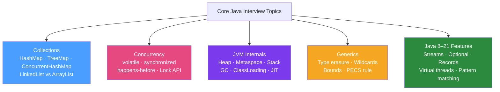

# 🧩 Core Java Interview Questions

> [!abstract] TL;DR
> Core Java interview questions test whether you understand the JVM deeply, not just how to use the API. Expect questions on HashMap internals (collision handling, Java 8 tree bins), concurrency primitives (volatile, synchronized, happens-before), JVM memory model (heap, metaspace, stack), generics (type erasure, wildcards), and Java 8–21 features (streams, Optional, records, virtual threads, pattern matching).

## Intuition — analogy FIRST

Core Java interviews are like a **car mechanic's certification exam**: you need to know not just how to drive the car (use the API), but how the engine works (HashMap internals), what the warning lights mean (exception types), how the transmission decides when to shift (JIT compilation), and what to do when the brakes fail (deadlock resolution). Surface-level "I use it every day" answers fail senior interviews. Depth of understanding is what separates senior candidates.

---

## How It Works



## Key Concepts / Details

### HashMap Internals — The #1 Asked Question

**Q: How does HashMap work internally in Java 8+?**

**A**: `HashMap` uses an **array of buckets** (default 16). Each key is hashed via `hash(key.hashCode())` to find its bucket index. Within a bucket, elements are stored in a **linked list** for collision handling. **Java 8 improvement**: when a bucket's linked list exceeds 8 entries (TREEIFY_THRESHOLD) AND the table has at least 64 entries, the list converts to a **red-black tree** (O(log n) lookups vs O(n) worst-case linked list).

```java
// HashMap key internals:
// 1. hash() method (not raw hashCode):
static final int hash(Object key) {
    int h;
    return (key == null) ? 0 : (h = key.hashCode()) ^ (h >>> 16);
    // XOR with high bits — spreads entropy, reduces collisions in small tables
}

// 2. Bucket index: (n-1) & hash  (where n = table capacity, always power of 2)

// 3. Java 8 treeification: bucket with > 8 entries → LinkedList → TreeMap (red-black tree)
// TREEIFY_THRESHOLD = 8
// UNTREEIFY_THRESHOLD = 6 (shrinks back to list when entries decrease)

// IMPORTANT: equals() and hashCode() must be consistent!
// If key1.equals(key2) → key1.hashCode() == key2.hashCode() (required)
// If key1.hashCode() == key2.hashCode() → key1.equals(key2) may be false (collision)

// HashMap capacity and load factor:
Map<String, Integer> map = new HashMap<>(100, 0.75f);
// Capacity: resize when size > capacity * loadFactor (75 entries for 100-capacity map)
// Resizing doubles the capacity (rehash all entries) — expensive operation
```

**Q: What is the difference between HashMap and ConcurrentHashMap?**

| Feature | HashMap | ConcurrentHashMap |
|---------|---------|-------------------|
| Thread safety | Not thread-safe | Thread-safe |
| Null keys/values | 1 null key allowed | No null keys/values |
| Locking (Java 8) | N/A | Bucket-level CAS (no global lock) |
| Iterator | Fail-fast (ConcurrentModificationException) | Weakly consistent (no exception) |

```java
// ConcurrentHashMap Java 8: CAS + synchronized per bucket (no global lock)
// For atomic operations, use:
map.computeIfAbsent(key, k -> new ArrayList<>());  // atomic
map.merge(key, 1, Integer::sum);                    // atomic increment
```

### Concurrency — Core Primitives

**Q: What does `volatile` guarantee and what doesn't it guarantee?**

**A**: `volatile` guarantees **visibility** (writes by one thread are immediately visible to all others) and **ordering** (prevents reordering around volatile reads/writes). It does **NOT** guarantee **atomicity** — `volatile int count; count++` is not thread-safe because `++` is a read-modify-write operation (3 steps).

```java
// CORRECT use of volatile: single writer, multiple readers
class StopFlag {
    private volatile boolean stopped = false;  // volatile ensures visibility
    
    public void stop() { stopped = true; }
    public boolean isStopped() { return stopped; }
}

// INCORRECT: volatile doesn't make compound operations atomic
volatile int count = 0;
count++;  // NOT atomic: read, increment, write — race condition

// CORRECT for counters: use AtomicInteger
AtomicInteger count = new AtomicInteger(0);
count.incrementAndGet();  // CAS — atomic
```

**Q: What is the Java Memory Model's "happens-before" relationship?**

**A**: Happens-before defines which actions are visible to subsequent actions. Key rules:
1. Monitor unlock → monitor lock (synchronized)
2. volatile write → volatile read
3. Thread start → thread actions
4. Thread actions → Thread.join() return
5. Constructor completion → finalizer start

```java
// Without happens-before: race condition
int value = 0;
Thread t1 = new Thread(() -> value = 42);
t1.start();
// value may be 0 here — no happens-before guarantee

// With happens-before via join:
t1.start();
t1.join();  // join establishes happens-before: t1's writes visible here
System.out.println(value);  // guaranteed to be 42
```

**Q: Explain `synchronized` vs `ReentrantLock` — when to use each?**

| Feature | synchronized | ReentrantLock |
|---------|-------------|---------------|
| Syntax | Built-in keyword | Explicit lock/unlock |
| Fairness | No | Configurable (`new ReentrantLock(true)`) |
| Try-lock | No | `tryLock(timeout)` |
| Interruptible | No | `lockInterruptibly()` |
| Multiple conditions | No (1 per object) | `newCondition()` |
| Recommended for | Simple cases | Advanced control |

```java
// ReentrantLock with tryLock (avoids deadlock)
ReentrantLock lock = new ReentrantLock();
if (lock.tryLock(100, TimeUnit.MILLISECONDS)) {
    try {
        // critical section
    } finally {
        lock.unlock();  // ALWAYS unlock in finally
    }
} else {
    // handle timeout
}
```

### JVM Memory Model

**Q: Describe the JVM memory areas.**

| Memory Area | Stored | Per-thread? | GC'd? |
|------------|--------|------------|-------|
| **Heap** | Objects, arrays | No (shared) | Yes |
| **Metaspace** | Class metadata, method bytecode | No (shared) | Only with ClassLoader |
| **Stack** | Stack frames, local variables, references | Yes | N/A (pop on return) |
| **PC Register** | Current instruction address | Yes | N/A |
| **Native Method Stack** | JNI method calls | Yes | N/A |
| **Code Cache** | JIT-compiled native code | No (shared) | Yes (code flushing) |

**Q: What is `StackOverflowError` vs `OutOfMemoryError`?**

```java
// StackOverflowError: too-deep recursion exhausts the thread stack
void recurse() { recurse(); }  // → StackOverflowError after ~1000–8000 frames

// OutOfMemoryError: Java heap space — not enough heap for new object allocation
List<byte[]> list = new ArrayList<>();
while(true) list.add(new byte[1024 * 1024]);  // → OOM: Java heap space

// OutOfMemoryError: Metaspace — too many class definitions loaded
// OutOfMemoryError: Direct buffer memory — too much off-heap direct memory
```

### Generics — Type Erasure and Wildcards

**Q: What is type erasure and why does it exist?**

**A**: Java generics use **type erasure** — generic type information is removed at compile time. `List<String>` and `List<Integer>` are both just `List` at runtime. This was done for **backward compatibility** with Java 1.4 bytecode.

```java
// At compile time: List<String>
List<String> strings = new ArrayList<>();
strings.add("hello");
String s = strings.get(0);

// At runtime (after erasure): same as List
List raw = new ArrayList();
raw.add("hello");
String s = (String) raw.get(0);  // compiler inserts cast

// CONSEQUENCE: Can't do instanceof with generics:
if (obj instanceof List<String>) { }  // COMPILE ERROR — type erased at runtime
if (obj instanceof List<?>) { }       // OK — wildcard
```

**Q: Explain the PECS rule for wildcards.**

**A**: PECS = **P**roducer **E**xtends, **C**onsumer **S**uper.
- If the collection **produces** items you read: use `<? extends T>` (upper bound)
- If the collection **consumes** items you write: use `<? super T>` (lower bound)

```java
// Producer (you read from it) — use extends
void printAll(List<? extends Number> numbers) {
    for (Number n : numbers) System.out.println(n);  // OK: can read as Number
}
// printAll(new ArrayList<Integer>())  // Works!
// printAll(new ArrayList<Double>())   // Works!

// Consumer (you write to it) — use super
void addNumbers(List<? super Integer> numbers) {
    numbers.add(42);    // OK: can write Integer
    numbers.add(100);   // OK
    // Number n = numbers.get(0);  // COMPILE ERROR: reads as Object, not Integer
}
// addNumbers(new ArrayList<Integer>()) // Works!
// addNumbers(new ArrayList<Number>())  // Works!
// addNumbers(new ArrayList<Object>())  // Works!
```

### Java 8–21 Features — Quick Q&A

**Q: What is the difference between `Stream.map()` and `Stream.flatMap()`?**

```java
// map: transform each element — one output per input
List<String> names = List.of("Alice", "Bob");
Stream<Integer> lengths = names.stream().map(String::length);  // [5, 3]

// flatMap: transform each element into a stream, then flatten
List<List<Integer>> nested = List.of(List.of(1,2), List.of(3,4));
Stream<Integer> flat = nested.stream().flatMap(Collection::stream);  // [1,2,3,4]

// Common flatMap use: Optional → Stream for filtering
Optional<String> opt = Optional.of("hello");
Stream<String> stream = opt.stream();  // Java 9+: stream of 0 or 1 elements
```

**Q: What are Java records (Java 16) and what do they auto-generate?**

```java
// Declare a record:
record Point(int x, int y) {}

// Auto-generated:
// - Final fields (private final int x, y)
// - Canonical constructor (Point(int x, int y))
// - Accessors (point.x(), point.y() — NOT getX())
// - equals(), hashCode(), toString()

Point p = new Point(3, 4);
System.out.println(p.x());       // 3
System.out.println(p);           // Point[x=3, y=4]
System.out.println(p.equals(new Point(3, 4)));  // true
```

**Q: What are virtual threads (Java 21) and when should you use them?**

```java
// Traditional platform threads: ~1:1 OS thread mapping, ~1MB stack
// Virtual threads: M:N mapping, ~few KB, scheduled by JVM

// Create a virtual thread
Thread vt = Thread.ofVirtual().start(() -> {
    // Blocking I/O doesn't pin an OS thread — JVM parks the virtual thread
    httpClient.get("https://api.example.com/data");
});

// Virtual thread executor
ExecutorService exec = Executors.newVirtualThreadPerTaskExecutor();
exec.submit(() -> {
    // Each task gets its own virtual thread — no pool exhaustion
    databaseCall();  // blocking — OK with virtual threads
});

// When to use: I/O-bound, high-concurrency applications
// When NOT to use: CPU-bound tasks (virtual threads don't help), synchronized blocks that pin
```

## Real-World Notes

- **String pool**: String literals are interned in the heap's string pool. `"hello" == "hello"` is `true` (same reference); `new String("hello") == new String("hello")` is `false`. Always use `.equals()`.
- **Final class optimisation**: `String`, `Integer` are final — JIT can inline calls without virtual dispatch overhead.

## Common Pitfalls

- **NullPointerException with auto-unboxing**: `Integer x = null; int y = x;` throws NPE at the unboxing. Always check for null before unboxing.
- **equals() and hashCode() contract**: If you override `equals()`, you MUST override `hashCode()`. Breaking this causes `HashMap`/`HashSet` to malfunction (objects become "unfindable").

## Related Concepts
- [[Spring_Interview_Questions]] — Spring is the most common framework in Java interviews
- [[Thread_Dump_Analysis]] — Thread dump questions build on concurrency knowledge
- [[G1_ZGC_Collectors]] — JVM GC questions often appear in senior Java interviews

## Review Questions
1. How does HashMap handle more than 8 collisions in the same bucket in Java 8+?
2. What does `volatile` guarantee that `synchronized` also guarantees, but `volatile` alone does NOT?
3. Why can't you do `instanceof List<String>` in Java?
4. What is the PECS rule for Java generics wildcards?
5. What is the difference between a platform thread and a virtual thread in Java 21?

## Sources
- OpenJDK source code: https://github.com/openjdk/jdk
- Java Language Specification: https://docs.oracle.com/javase/specs/jls/
- Java Concurrency in Practice — Brian Goetz

#java #interview #core-java #hashmap #concurrency #jvm #generics
