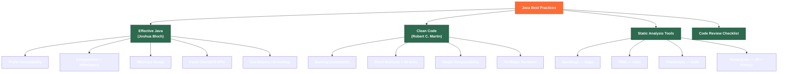

# ✅ Java Best Practices

> [!abstract] TL;DR
> Java best practices distill into three layers: **Effective Java** principles (prefer immutability, composition over inheritance, standard functional interfaces), **Clean Code** rules (short focused methods, intention-revealing names, single responsibility), and **static analysis tooling** (SpotBugs finds bugs, Checkstyle enforces style, PMD enforces code rules, SonarQube integrates all three with historical tracking). Mastering these patterns separates code that works from code that survives team scaling, refactoring pressure, and production incidents — and they are high-frequency interview topics at senior level.

---

## Intuition

Best practices are guardrails, not walls. A guardrail on a mountain road doesn't slow good drivers — it prevents disaster when conditions get treacherous (new team member, 2 AM hotfix, six-month-old unfamiliar code). Effective Java items are not stylistic preferences; they are lessons from tens of thousands of production Java systems, distilled into rules that prevent the most common, hardest-to-diagnose classes of bugs.

---

## How It Works

### Best Practices Ecosystem



---

## Key Concepts

### 1. Effective Java — Core Items

#### Item: Prefer Immutability

```java
// WRONG: mutable value object — defensive copies required everywhere
public class MutableMoney {
    private double amount;
    private String currency;
    // setters, equals breaks if mutated while in a set, threading bugs
}

// RIGHT: immutable value object
public final class Money {                     // final — no subclassing
    private final double amount;               // final fields
    private final String currency;

    public Money(double amount, String currency) {
        if (amount < 0) throw new IllegalArgumentException("Amount cannot be negative");
        this.amount   = amount;
        this.currency = Objects.requireNonNull(currency);
    }

    // Return new instance instead of mutating
    public Money add(Money other) {
        if (!this.currency.equals(other.currency))
            throw new IllegalArgumentException("Currency mismatch");
        return new Money(this.amount + other.amount, this.currency);
    }

    public double amount()   { return amount; }
    public String currency() { return currency; }

    // equals/hashCode based on fields — safe in HashMap/HashSet
    @Override public boolean equals(Object o) { /* field-by-field */ }
    @Override public int hashCode() { return Objects.hash(amount, currency); }
}

// Modern: use record — immutability enforced by compiler
record Money(double amount, String currency) {
    Money { if (amount < 0) throw new IllegalArgumentException(); }
    public Money add(Money other) { return new Money(amount + other.amount, currency); }
}
```

#### Item: Favor Composition over Inheritance

```java
// WRONG: inheritance for code reuse when IS-A doesn't hold
class Stack<E> extends ArrayList<E> {     // Stack IS-NOT-A ArrayList
    public E push(E item) { add(item); return item; }
    public E pop() { return remove(size() - 1); }
    // Bug: user can call stack.add(0, item) — bypasses stack contract!
}

// RIGHT: composition + forwarding
class Stack<E> {
    private final List<E> elements = new ArrayList<>();  // HAS-A relationship

    public E push(E item) { elements.add(item); return item; }
    public E pop() {
        if (elements.isEmpty()) throw new EmptyStackException();
        return elements.remove(elements.size() - 1);
    }
    public int size() { return elements.size(); }
    // ONLY expose the operations that make sense for a stack
}
```

#### Item: Use Standard Functional Interfaces

```java
import java.util.function.*;

// WRONG: custom functional interface for a standard shape
@FunctionalInterface interface MyPredicate<T> { boolean test(T t); }  // reinvents Predicate<T>
@FunctionalInterface interface MySupplier<T>  { T get(); }             // reinvents Supplier<T>
@FunctionalInterface interface Transformer<T> { T apply(T t); }        // reinvents UnaryOperator<T>

// RIGHT: use standard java.util.function interfaces
Predicate<String>      isBlank    = String::isBlank;
Supplier<List<String>> listMaker  = ArrayList::new;
UnaryOperator<String>  toUpper    = String::toUpperCase;
BiFunction<String, Integer, String> repeat = (s, n) -> s.repeat(n);
Consumer<String>       logger     = System.out::println;
Function<String, Integer> length  = String::length;

// Standard interface hierarchy cheat sheet:
// Supplier<T>        → () → T
// Consumer<T>        → T → void
// Predicate<T>       → T → boolean
// Function<T,R>      → T → R
// BiFunction<T,U,R>  → (T,U) → R
// UnaryOperator<T>   → T → T       (special Function)
// BinaryOperator<T>  → (T,T) → T   (special BiFunction)
// Runnable           → () → void
// Callable<V>        → () → V (throws)
```

#### Item: Prefer EnumMap and EnumSet

```java
// WRONG: using HashMap/HashSet with enum keys
Map<DayOfWeek, List<Task>> schedule = new HashMap<>();
Set<Permission> permissions         = new HashSet<>();

// RIGHT: EnumMap/EnumSet — backed by array, O(1), no hashing, no boxing
Map<DayOfWeek, List<Task>> schedule = new EnumMap<>(DayOfWeek.class);
// EnumMap is 2-4x faster than HashMap for enum keys and more memory-efficient

Set<Permission> permissions = EnumSet.of(Permission.READ, Permission.WRITE);
// EnumSet is backed by a single long bitmask — O(1) operations, tiny memory

// Use EnumSet for flag combinations instead of int bitmask
enum Permission { READ, WRITE, EXECUTE, ADMIN }
EnumSet<Permission> adminPerms = EnumSet.allOf(Permission.class);
EnumSet<Permission> readOnly   = EnumSet.of(Permission.READ);
boolean canWrite = adminPerms.contains(Permission.WRITE); // true
```

#### Item: Minimize Scope of Variables and Methods

```java
// WRONG: wide scope
String result;
for (int i = 0; i < list.size(); i++) {
    result = process(list.get(i));     // result visible outside loop unnecessarily
    save(result);
}

// RIGHT: narrow scope
for (String item : list) {
    String result = process(item);     // scoped to the loop iteration
    save(result);
}

// WRONG: public method that should be private
public class Order {
    public BigDecimal computeSubtotal() { /* internal computation */ }  // no external caller needs this
}

// RIGHT: keep internals private
public class Order {
    private BigDecimal computeSubtotal() { /* internal */ }
    public BigDecimal totalPrice() { return computeSubtotal().add(tax()); }
}
```

### 2. Clean Code Rules for Java

#### Naming Conventions

```java
// Classes: nouns or noun phrases
class OrderProcessor { }       // good
class DoStuff { }              // bad — vague verb

// Methods: verbs or verb phrases
void processOrder(Order o) { } // good
void order(Order o) { }        // bad — ambiguous noun

// Booleans: prefix with is/has/can/should
boolean isActive()   { }       // good
boolean active()     { }       // ambiguous
boolean hasOrders()  { }       // good
boolean canRefund()  { }       // good

// Constants: ALL_CAPS with underscores
static final int MAX_RETRY_COUNT = 3;

// Generic type parameters: single uppercase letters (with context)
// T = type, E = element, K = key, V = value, R = result, N = number
class Cache<K, V> { }
<T extends Comparable<T>> T max(List<T> list) { }

// Avoid mental mapping — use domain terms
// WRONG: int d = 86400;
// RIGHT: static final int SECONDS_PER_DAY = 86_400;
```

#### Short Methods and Single Responsibility

```java
// WRONG: one massive method doing everything
public void handleUserRegistration(HttpRequest req) {
    // 150 lines: parse request, validate, check duplicates,
    // hash password, save to DB, send email, log, return response
}

// RIGHT: each method does one thing, readable at a glance
public void handleUserRegistration(HttpRequest req) {
    var request = parseRegistrationRequest(req);
    validateRegistrationRequest(request);
    var user = createUser(request);
    notifyUser(user);
    auditLog.record("USER_REGISTERED", user.id());
}

private RegistrationRequest parseRegistrationRequest(HttpRequest req) { /* ... */ }
private void validateRegistrationRequest(RegistrationRequest req) { /* ... */ }
private User createUser(RegistrationRequest req) { /* ... */ }
private void notifyUser(User user) { /* ... */ }

// Rule of thumb: if you need to write a comment to explain what a block does,
// extract it into a method with that comment as the method name.
```

### 3. Common Java Code Smells

| Code Smell | Description | Refactoring |
|-----------|-------------|-------------|
| **Long Method** | Method > 20-30 lines; hard to name, test, or understand | Extract Method — split into smaller named methods |
| **Large Class** | Class with 500+ lines, 20+ methods — does too much | Extract Class — separate concerns into collaborators |
| **Feature Envy** | Method uses other class's data more than its own | Move Method — it belongs in the data class |
| **Data Class** | Class with only getters/setters, no behavior | Move behavior into the class; consider record |
| **Primitive Obsession** | Using `String` for email, `int` for currency | Introduce value objects (`Email`, `Money`) |
| **Long Parameter List** | Method with 5+ parameters | Introduce Parameter Object or Builder |
| **Duplicated Code** | Same logic copy-pasted in multiple places | Extract Method / Template Method |
| **Switch on Type** | Long `instanceof` or `switch` over type strings | Replace with polymorphism or sealed + pattern matching |
| **Magic Numbers** | `if (status == 3)` — what is 3? | Replace with named constant or enum |
| **Dead Code** | Unused methods/fields left in | Delete immediately; version control holds history |

### 4. Static Analysis Tools

```xml
<!-- Maven integration for all four tools -->

<!-- SpotBugs: detects actual bugs (null deref, resource leaks, threading) -->
<plugin>
    <groupId>com.github.spotbugs</groupId>
    <artifactId>spotbugs-maven-plugin</artifactId>
    <version>4.8.3</version>
    <configuration>
        <effort>Max</effort>
        <threshold>Medium</threshold>
        <failOnError>true</failOnError>
    </configuration>
</plugin>

<!-- Checkstyle: enforces code style (naming, indentation, blank lines) -->
<plugin>
    <groupId>org.apache.maven.plugins</groupId>
    <artifactId>maven-checkstyle-plugin</artifactId>
    <version>3.3.0</version>
    <configuration>
        <configLocation>google_checks.xml</configLocation>
        <failsOnError>true</failsOnError>
    </configuration>
</plugin>

<!-- PMD: code quality rules (complexity, unused variables, bad practices) -->
<plugin>
    <groupId>org.apache.maven.plugins</groupId>
    <artifactId>maven-pmd-plugin</artifactId>
    <version>3.21.0</version>
    <configuration>
        <rulesets><ruleset>/rulesets/java/quickstart.xml</ruleset></rulesets>
        <failOnViolation>true</failOnViolation>
    </configuration>
</plugin>
```

| Tool | Primary Focus | What It Catches |
|------|--------------|-----------------|
| **SpotBugs** | Bug patterns | Null dereference, resource leaks, thread safety violations, incorrect equals/hashCode |
| **PMD** | Code quality rules | Cyclomatic complexity, unused variables, avoid catching Throwable, empty catch blocks |
| **Checkstyle** | Style enforcement | Line length, indentation, naming conventions, import order, Javadoc presence |
| **SonarQube** | All + history | All of the above + code duplication, technical debt metrics, security hotspots, trend graphs |
| **Error Prone** | Compile-time bugs | Annotation-based: `@Nullable`, misused APIs caught at compile time (Google) |

### 5. Code Review Checklist

```
CORRECTNESS
□ No null pointer risks without null checks / Optional
□ All resources closed (try-with-resources)
□ Checked exceptions not silently swallowed (empty catch)
□ Collection mutation during iteration avoided
□ Thread safety: shared mutable state is synchronized or immutable
□ equals() and hashCode() implemented together and consistently

DESIGN
□ Classes are final unless designed for inheritance
□ Interfaces preferred over abstract classes for types
□ Composition used instead of inheritance for code reuse
□ Methods are short (< 20 lines), focused (one thing)
□ Parameters ≤ 4; Parameter Object used for more
□ Magic numbers replaced with named constants or enums

JAVA IDIOMS
□ Primitives used instead of wrappers in performance-sensitive paths
□ EnumMap/EnumSet used when keying on enums
□ Stream API not abused for simple for-each operations
□ Standard functional interfaces used instead of custom @FunctionalInterfaces
□ Records used for simple data carriers (DTOs, value objects)

SECURITY
□ User input validated and sanitized before use
□ SQL parameters use PreparedStatement placeholders (no concatenation)
□ Sensitive data not logged (passwords, tokens, PII)
□ Random uses SecureRandom for security-sensitive contexts

TESTING
□ Public API tested, not implementation details
□ Tests have descriptive names: given_when_then or should_do_X_when_Y
□ No logic in tests (no if/for in test body)
□ Each test has exactly one logical assertion (or one concept)
```

### 6. Avoid Unnecessary Object Creation

```java
// WRONG: new object every call
boolean isEmail(String s) {
    Pattern pattern = Pattern.compile("^[\\w.]+@[\\w.]+\\.[a-z]{2,}$"); // compiled on every call!
    return pattern.matcher(s).matches();
}

// RIGHT: compile once, reuse
private static final Pattern EMAIL_PATTERN =
    Pattern.compile("^[\\w.]+@[\\w.]+\\.[a-z]{2,}$");

boolean isEmail(String s) {
    return EMAIL_PATTERN.matcher(s).matches();
}

// WRONG: autoboxing in accumulation
Long sum = 0L;
for (long i = 0; i < 1_000_000; i++) { sum += i; } // 2M Long objects created

// RIGHT: primitive accumulation
long sum = 0L;
for (long i = 0; i < 1_000_000; i++) { sum += i; } // zero allocations

// String concatenation in loop
// WRONG:
String result = "";
for (String s : list) { result += s; }  // O(n²) — new String object each iteration

// RIGHT:
StringBuilder sb = new StringBuilder();
for (String s : list) { sb.append(s); }
String result = sb.toString();

// Or idiomatically:
String result = String.join("", list);
// or: list.stream().collect(Collectors.joining());
```

---

## Real-World Notes

- **Code reviews at FAANG**: reviewers look for Effective Java violations first — mutable shared state, unchecked exceptions swallowed, `equals()` without `hashCode()`. These are automatic re-review triggers.
- **SonarQube in CI**: set Quality Gate to fail the build on any new Critical or Blocker issue — this prevents technical debt from accumulating. Teams that let the gate be advisory accumulate thousands of issues within a year.
- **`@Nullable` / `@NotNull` annotations**: combine Checkstyle's `@NotNull` enforcement with SpotBugs' null analysis — most NullPointerExceptions in production are detectable statically.
- **PMD cyclomatic complexity**: set threshold to 10; methods above 10 branches are effectively untestable to 100% branch coverage. Flag them in PR to enforce extraction.

---

## Common Pitfalls

| Pitfall | Example | Fix |
|---------|---------|-----|
| `equals()` without `hashCode()` | Object behaves oddly in HashMap/HashSet | Always implement both, or use `@EqualsAndHashCode` (Lombok) or record |
| Mutable object in `static final` field | `static final List<String> ITEMS = new ArrayList<>()` — items can be modified | Use `List.of(...)` or `Collections.unmodifiableList(...)` |
| Catching `Exception` or `Throwable` | Swallows `OutOfMemoryError`, `InterruptedException` | Catch specific exception types; re-throw `Error` subtypes |
| `finalize()` for resource cleanup | Runs non-deterministically or not at all | Use `try-with-resources` and `Closeable` |
| `instanceof` chains over open hierarchy | Adding a new type breaks nothing — silently unhandled | Use sealed interfaces + switch for exhaustive dispatch |
| Returning `null` from methods | Caller must always guard against null | Return `Optional<T>`, empty collections, or throw descriptive exceptions |

---

## Related Notes

- [[_MOC_Interview_Prep|↑ Section MOC — Java Interview Prep]]
- [[Core_Java_Interview]] — interview questions on Java fundamentals
- [[Coding_Challenges_Java]] — algorithmic problem-solving in Java
- [[Spring_Interview_Questions]] — Spring-specific best practices and interview topics
- [[System_Design_Java]] — architecture-level best practices

---

## Review Questions

1. A colleague's code has `public class EmailService extends ArrayList<Email>`. Identify the Effective Java principle being violated, explain why this specific code is dangerous (what unexpected behaviors does it enable), and rewrite it using the correct principle.

2. SpotBugs reports a "Possible null pointer dereference" on `userRepo.findByEmail(email).getName()`. The method `findByEmail` returns `User` or `null`. Describe three different ways to fix this, ranked by idiomaticity in modern Java, and explain the trade-offs.

3. Your team's PMD report shows a method with cyclomatic complexity of 22 and Checkstyle reports 12 violations for the same file. Walking through the code review checklist, identify the five questions you would ask the author in the code review comment, each targeting a specific best practice from this note.

---

#Java #Interview_Prep #BestPractices #EffectiveJava #CleanCode #StaticAnalysis #CodeQuality #Intermediate
