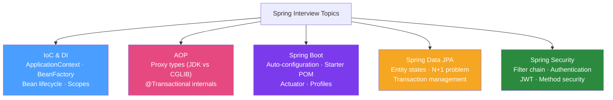

# 🌱 Spring Interview Questions

> [!abstract] TL;DR
> Spring interview questions focus on IoC/DI fundamentals, bean lifecycle and scopes, AOP internals (proxy types), Spring Boot auto-configuration mechanism, Spring Data JPA (entity states, N+1 problem, transactions), Spring Security (filter chain, JWT), and Spring WebFlux (reactive programming). Understanding *why* Spring works the way it does — not just *how* to use it — separates senior candidates.

## Intuition — analogy FIRST

Spring interviews are like **a car mechanic asking "how does the fuel injection system work"** versus "can you start this car?" You need to know both. Interviewers want to hear: "ApplicationContext is a BeanFactory that also adds message source, event publishing, and AOP proxy support. When the context starts, it reads all BeanDefinitions from @Configuration classes, instantiates singletons, runs BeanPostProcessors, and injects dependencies." That level of understanding — not just "I use @Autowired" — is what gets you the role.

---

## How It Works



## Key Concepts / Details

### Spring Core — IoC and DI

**Q: What is the difference between BeanFactory and ApplicationContext?**

**A**: `BeanFactory` is the basic DI container (lazy bean initialisation, no AOP/event support). `ApplicationContext` extends `BeanFactory` and adds: **AOP integration**, **event publishing** (`ApplicationEventPublisher`), **message source** (i18n), **resource loading**, and **eager singleton initialisation**. Always use `ApplicationContext` in production. `BeanFactory` is only for extremely memory-constrained embedded environments.

**Q: Explain the Spring bean lifecycle.**

```
Bean Lifecycle (simplified):
1. ApplicationContext reads BeanDefinitions (@Component, @Bean, XML)
2. Instantiation: constructor called (or factory method)
3. Dependency injection: @Autowired fields/setters populated
4. BeanNameAware, BeanFactoryAware callbacks
5. BeanPostProcessor.postProcessBeforeInitialization() — each registered BPP runs
6. @PostConstruct / InitializingBean.afterPropertiesSet()
7. BeanPostProcessor.postProcessAfterInitialization() — AOP proxies created here
8. Bean is READY — in ApplicationContext, returned to callers
--- Bean in use ---
9. ApplicationContext.close() called
10. @PreDestroy / DisposableBean.destroy()
11. Bean destroyed
```

```java
@Component
public class OrderService implements InitializingBean, DisposableBean {
    
    @PostConstruct  // Called after injection, before bean is ready
    public void init() {
        log.info("OrderService initialising — loading config");
    }
    
    @PreDestroy    // Called before destruction
    public void cleanup() {
        log.info("OrderService shutting down — releasing resources");
    }
    
    // Alternative (less preferred — couples to Spring API):
    @Override
    public void afterPropertiesSet() { /* init */ }
    
    @Override
    public void destroy() { /* cleanup */ }
}
```

**Q: What are the Spring bean scopes?**

| Scope | Description | Use Case |
|-------|------------|----------|
| **singleton** | One instance per ApplicationContext (default) | Stateless services |
| **prototype** | New instance per injection/getBean() | Stateful objects |
| **request** | One instance per HTTP request | Request-specific state |
| **session** | One instance per HTTP session | User session data |
| **application** | One instance per ServletContext | App-wide shared state |

```java
@Component
@Scope("prototype")  // New instance each time
public class OrderProcessor {
    private final List<Order> batch = new ArrayList<>();  // stateful — needs prototype
}
```

**Q: What is the difference between `@Component`, `@Service`, `@Repository`, `@Controller`?**

**A**: They are all specialisations of `@Component` (functionally equivalent for DI). The specialisations add **semantic meaning** and trigger specific framework behaviour:
- `@Repository`: enables Spring to translate persistence-layer exceptions to Spring's `DataAccessException` hierarchy
- `@Controller`: marks as MVC handler — Spring MVC dispatcher knows to map HTTP requests to it
- `@Service`: no extra behaviour — pure semantic annotation (business logic layer)

### AOP and Transactional

**Q: How does Spring AOP work internally?**

**A**: Spring AOP creates **proxy objects** around target beans. Two proxy types:
1. **JDK Dynamic Proxy**: Used when the bean implements an interface. Proxy implements the same interface and delegates to the target.
2. **CGLIB Proxy**: Used when the bean does NOT implement an interface. Proxy is a subclass of the target (bytecode generation at runtime).

```java
// IMPORTANT: @Transactional limitations due to proxy:
@Service
public class OrderService {
    
    @Transactional
    public void processOrder(Order order) {
        // Works — called from outside, goes through proxy
        saveOrder(order);
    }
    
    public void createAndProcess() {
        // BUG: self-invocation bypasses proxy → transaction NOT started!
        // this.processOrder(order) calls the real object, not the proxy
        processOrder(new Order());
    }
}
```

**Q: What happens if `@Transactional` method throws a `checked exception`?**

**A**: By default, `@Transactional` **only rolls back on unchecked exceptions** (RuntimeException and Error). Checked exceptions cause a **commit** (Spring assumes checked exceptions are business-expected conditions).

```java
@Transactional  // commits even if IOException thrown!
public void processFile() throws IOException {
    orderRepository.save(order);
    throw new IOException("File error");  // TRANSACTION COMMITS — data saved!
}

// FIX: specify rollback rules
@Transactional(rollbackFor = {IOException.class, Exception.class})
public void processFile() throws IOException { ... }

// OR: Always use unchecked exceptions for error propagation:
@Transactional
public void processFile() {
    try { ... }
    catch (IOException e) { throw new RuntimeException("File processing failed", e); }
}
```

### Spring Boot Auto-Configuration

**Q: How does Spring Boot auto-configuration work?**

**A**: `@SpringBootApplication` includes `@EnableAutoConfiguration`. Spring Boot scans `META-INF/spring/org.springframework.boot.autoconfigure.AutoConfiguration.imports` (Boot 2.7+) from all jars on the classpath. Each auto-configuration class is annotated with `@ConditionalOn*` to only activate when appropriate conditions are met.

```java
// Example: Spring Boot auto-configures DataSource IF:
@ConditionalOnClass(DataSource.class)  // 1. DataSource class is on classpath
@ConditionalOnMissingBean(DataSource.class)  // 2. No DataSource bean already defined
@ConditionalOnProperty(prefix = "spring.datasource", name = "url")  // 3. URL is configured
@Configuration
public class DataSourceAutoConfiguration {
    @Bean
    public DataSource dataSource(DataSourceProperties properties) {
        return DataSourceBuilder.create()
                .url(properties.getUrl())
                .username(properties.getUsername())
                .password(properties.getPassword())
                .build();
    }
}

// To debug which auto-configurations are active:
java -jar app.jar --debug  # prints auto-configuration report to console
# or: logging.level.org.springframework.boot.autoconfigure=DEBUG
```

### Spring Data JPA

**Q: What is the N+1 query problem and how do you fix it in Spring Data JPA?**

**A**: N+1 occurs when you fetch N parent entities and then issue 1 additional query per entity to fetch lazily-loaded relationships. Result: 1 + N queries instead of 1.

```java
// N+1 problem:
@Entity
public class Order {
    @OneToMany(fetch = FetchType.LAZY)  // lazy by default
    private List<OrderLine> lines;
}

// This triggers 1 query for orders, then N queries for lines:
List<Order> orders = orderRepository.findAll();
orders.forEach(o -> System.out.println(o.getLines().size()));  // N extra queries!

// FIX 1: EntityGraph
@EntityGraph(attributePaths = {"lines"})
List<Order> findAllWithLines();
// → Single JOIN query

// FIX 2: JPQL JOIN FETCH
@Query("SELECT o FROM Order o LEFT JOIN FETCH o.lines WHERE o.status = :status")
List<Order> findByStatusWithLines(@Param("status") OrderStatus status);

// FIX 3: @BatchSize (Hibernate — loads N lines in batches of 50)
@OneToMany
@BatchSize(size = 50)
private List<OrderLine> lines;
```

**Q: What are JPA entity states?**

| State | Description | Tracking |
|-------|------------|----------|
| **Transient** | New object, not yet persisted | No |
| **Managed/Persistent** | Associated with a Persistence Context | Yes — changes auto-detected |
| **Detached** | Was managed, PC closed | No — changes ignored |
| **Removed** | Scheduled for deletion | Yes — deleted on commit |

```java
@Transactional
public void updateOrder(UUID id) {
    Order order = repository.findById(id).get();  // state: MANAGED
    order.setStatus(CONFIRMED);  // dirty check — JPA detects this change
    // No save() call needed — JPA auto-flushes managed entities on commit!
}
```

### Spring Security

**Q: Describe the Spring Security filter chain.**

**A**: Spring Security is implemented as a chain of `javax.servlet.Filter` implementations wrapped in a `SecurityFilterChain`. Each request passes through filters in order:

```
Incoming Request
  → SecurityContextPersistenceFilter (load SecurityContext from session)
  → UsernamePasswordAuthenticationFilter (form login)
  → BasicAuthenticationFilter (HTTP Basic)
  → BearerTokenAuthenticationFilter (JWT — if configured)
  → ExceptionTranslationFilter (handles AccessDeniedException, AuthenticationException)
  → FilterSecurityInterceptor (checks URL authorization)
  → Your Controller
```

```java
@Configuration
@EnableWebSecurity
public class SecurityConfig {
    
    @Bean
    public SecurityFilterChain filterChain(HttpSecurity http) throws Exception {
        return http
            .csrf(csrf -> csrf.disable())  // disable for stateless REST APIs
            .sessionManagement(session -> 
                session.sessionCreationPolicy(SessionCreationPolicy.STATELESS))
            .authorizeHttpRequests(auth -> auth
                .requestMatchers("/api/public/**").permitAll()
                .requestMatchers("/api/admin/**").hasRole("ADMIN")
                .anyRequest().authenticated())
            .addFilterBefore(jwtAuthFilter, UsernamePasswordAuthenticationFilter.class)
            .build();
    }
    
    @Bean
    public AuthenticationManager authenticationManager(
            AuthenticationConfiguration config) throws Exception {
        return config.getAuthenticationManager();
    }
}
```

**Q: How does method-level security work?**

```java
@Service
public class OrderService {
    
    @PreAuthorize("hasRole('ADMIN') or #customerId == authentication.name")
    public List<Order> getOrdersForCustomer(String customerId) { ... }
    
    @PostAuthorize("returnObject.customerId == authentication.name")
    public Order getOrder(UUID id) { ... }
    
    @Secured("ROLE_ADMIN")  // simpler but less flexible than @PreAuthorize
    public void deleteOrder(UUID id) { ... }
}

// Must enable method security:
@EnableMethodSecurity  // Boot 3.x (replaces @EnableGlobalMethodSecurity)
```

### Spring WebFlux

**Q: When would you choose Spring WebFlux over Spring MVC?**

**A**: WebFlux is **not always faster**. Choose WebFlux when:
1. **High concurrency with I/O-heavy workloads** (many concurrent requests that mostly wait on I/O — microservices calling other services, streaming data)
2. **Backpressure** needed (e.g., streaming responses to slow clients)
3. **Functional reactive programming** style preferred

Choose Spring MVC when:
- Team is unfamiliar with reactive programming
- JDBC is used (blocking — WebFlux + blocking JDBC negates reactive benefits)
- Simpler mental model needed
- Java 21 virtual threads achieve similar I/O concurrency in MVC

## Real-World Notes

- **Circular dependency**: Spring can resolve field injection circular deps but fails for constructor injection. Constructor injection is preferred — and circular deps usually indicate a design problem (split the class).
- **@Transactional on class vs method**: Class-level `@Transactional` applies to all public methods. Method-level overrides class-level. Protected/private methods are never transactional (proxy limitation).

## Common Pitfalls

- **@Autowired on private fields**: Works but makes testing harder (can't inject without Spring). Prefer constructor injection — testable without Spring context.
- **LazyInitializationException**: Accessing a lazy-loaded entity after the Persistence Context closes. Fix: use `@Transactional` on the calling method, or use `@EntityGraph` to eager-load what you need.

## Related Concepts
- [[Core_Java_Interview]] — Spring builds on core Java concepts
- [[System_Design_Java]] — System design questions extend Spring knowledge
- [[Hexagonal_Architecture]] — Interview discussions on clean Spring architecture

## Review Questions
1. What is the difference between BeanFactory and ApplicationContext?
2. Why does `@Transactional` not work when a method calls another `@Transactional` method in the same class?
3. What is the N+1 problem and how do you fix it in Spring Data JPA?
4. Why does `@Transactional` not rollback on checked exceptions by default?
5. What filters are in the Spring Security filter chain and in what order do they run?

## Sources
- Spring Framework documentation: https://docs.spring.io/spring-framework/docs/
- Spring Security reference: https://docs.spring.io/spring-security/reference/
- Spring Boot reference: https://docs.spring.io/spring-boot/docs/

#java #interview #spring #spring-boot #spring-security #jpa
