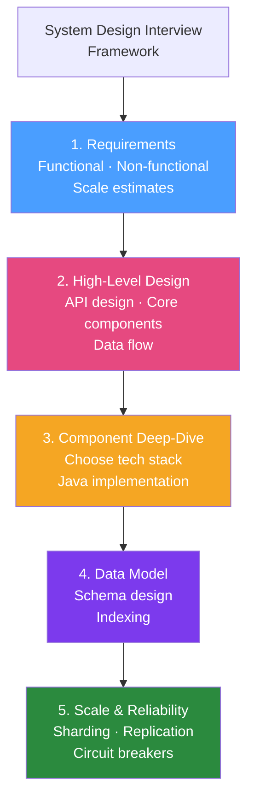

# 🏗️ System Design with Java

> [!abstract] TL;DR
> System design interviews test your ability to design scalable, maintainable systems. For Java developers, interviewers expect technology choices grounded in the ecosystem: Spring Boot for services, Spring Cloud Gateway for API gateway, Kafka for messaging, Redis for caching, PostgreSQL for relational data, and specific Java patterns (Circuit Breaker, Saga, CQRS) for distributed systems. Structure your answer: Requirements → Estimation → High-Level Design → Component Design → Data Model → Scale.

## Intuition — analogy FIRST

System design interviews are like **architecture pitch meetings**: you're the lead architect presenting to a panel of building experts. They don't want "let's use bricks" — they want "we'll use reinforced concrete for the load-bearing walls (database for consistency needs), glass curtain walls for the lobby (Redis for fast reads), steel I-beams for the floors (Kafka for event streaming), and a redundant elevator system (load balancer + horizontal scaling)." The panel knows buildings — you must explain why each material choice makes sense for this specific building, not just list materials.

---

## How It Works



## Key Concepts / Details

### Design #1: URL Shortener (Classic)

**Requirements**: 
- Create short URLs (`bit.ly/abc123`), redirect to original
- 100M writes/day, 10:1 read-write ratio → 1B reads/day

**Java Implementation Choices**:

```java
// API: Spring Boot REST
@RestController
@RequestMapping("/api")
public class UrlShortenerController {
    
    @Inject
    UrlShorteningService service;
    
    @PostMapping("/shorten")
    public ShortenResponse shorten(@RequestBody ShortenRequest request) {
        String shortCode = service.shorten(request.getLongUrl());
        return new ShortenResponse("https://sho.rt/" + shortCode);
    }
    
    @GetMapping("/{shortCode}")
    public ResponseEntity<Void> redirect(@PathVariable String shortCode) {
        String longUrl = service.resolve(shortCode);  // Redis first, DB fallback
        return ResponseEntity.status(HttpStatus.MOVED_PERMANENTLY)
                             .header("Location", longUrl)
                             .build();
    }
}

// Key algorithm: Base62 encoding of a unique ID
@Service
public class UrlShorteningService {
    private static final String CHARS = "abcdefghijklmnopqrstuvwxyzABCDEFGHIJKLMNOPQRSTUVWXYZ0123456789";
    
    private final UrlRepository repository;
    private final RedisTemplate<String, String> redis;
    
    public String shorten(String longUrl) {
        // Generate unique ID (Snowflake or UUID → Base62)
        long id = snowflakeIdGenerator.nextId();
        String shortCode = toBase62(id);
        
        repository.save(new UrlMapping(shortCode, longUrl, Instant.now()));
        return shortCode;
    }
    
    public String resolve(String shortCode) {
        // Cache-aside pattern: Redis → DB
        String cached = redis.opsForValue().get("url:" + shortCode);
        if (cached != null) return cached;
        
        String longUrl = repository.findByShortCode(shortCode)
                .orElseThrow(() -> new NotFoundException("Short URL not found"))
                .getLongUrl();
        
        redis.opsForValue().set("url:" + shortCode, longUrl, Duration.ofDays(7));
        return longUrl;
    }
    
    private String toBase62(long id) {
        StringBuilder sb = new StringBuilder();
        while (id > 0) {
            sb.insert(0, CHARS.charAt((int)(id % 62)));
            id /= 62;
        }
        return sb.toString();
    }
}
```

**Data Model**:
```sql
CREATE TABLE url_mappings (
    id BIGINT PRIMARY KEY,
    short_code VARCHAR(8) NOT NULL UNIQUE,
    long_url TEXT NOT NULL,
    created_at TIMESTAMPTZ NOT NULL,
    user_id BIGINT REFERENCES users(id),
    expires_at TIMESTAMPTZ
);
CREATE INDEX idx_short_code ON url_mappings(short_code);
```

**Scale notes**: Redis handles 99% of reads. PostgreSQL writes only (100M/day = ~1200 writes/second — single Postgres handles this). For global scale: CDN edge redirects with Redis clusters in each region.

### Design #2: Rate Limiter

**Requirements**: Limit API calls to 1000 requests per user per minute. Distributed (multiple app servers).

```java
// Token Bucket algorithm with Redis Lua script (atomic operation)
@Service
public class RateLimiter {
    
    private final RedisTemplate<String, String> redis;
    private final DefaultRedisScript<List<Long>> rateLimitScript;
    
    @PostConstruct
    public void initScript() {
        rateLimitScript = new DefaultRedisScript<>();
        rateLimitScript.setScriptText("""
            local key = KEYS[1]
            local capacity = tonumber(ARGV[1])
            local rate = tonumber(ARGV[2])
            local now = tonumber(ARGV[3])
            local tokens = tonumber(redis.call('get', key) or capacity)
            
            local elapsed = now - tonumber(redis.call('getex', key .. ':ts', 'EXAT', now) or now)
            tokens = math.min(capacity, tokens + elapsed * rate)
            
            if tokens >= 1 then
                tokens = tokens - 1
                redis.call('setex', key, 60, tokens)
                redis.call('set', key .. ':ts', now)
                return {1, tokens}   -- allowed, remaining tokens
            else
                return {0, 0}        -- denied
            end
        """);
    }
    
    public boolean isAllowed(String userId) {
        String key = "rate_limit:" + userId;
        List<Long> result = redis.execute(rateLimitScript,
                List.of(key),
                String.valueOf(1000),   // capacity
                String.valueOf(1000.0/60),  // rate per second
                String.valueOf(System.currentTimeMillis() / 1000));
        return result.get(0) == 1L;
    }
}

// Spring MVC interceptor to apply rate limiting
@Component
public class RateLimitInterceptor implements HandlerInterceptor {
    
    @Inject RateLimiter rateLimiter;
    
    @Override
    public boolean preHandle(HttpServletRequest request, HttpServletResponse response, 
                             Object handler) throws Exception {
        String userId = extractUserId(request);
        if (!rateLimiter.isAllowed(userId)) {
            response.setStatus(429);
            response.addHeader("Retry-After", "60");
            response.getWriter().write("{\"error\":\"Rate limit exceeded\"}");
            return false;
        }
        return true;
    }
}
```

### Design #3: Notification System

**Requirements**: Send email/SMS/push notifications. 10M notifications/day. Guaranteed delivery. Support retry.

**Architecture**:
```
                        Notification Request
                               ↓
                    [API Gateway / Notification API]
                               ↓
                    [Kafka: notification-requests topic]
                         ↙         ↓         ↘
            [Email Consumer] [SMS Consumer] [Push Consumer]
                    ↓              ↓              ↓
            [SendGrid API]  [Twilio API]   [FCM/APNs API]
                    ↓              ↓              ↓
                        [Kafka: notification-results topic]
                               ↓
                    [Status Tracker / Database]
```

```java
// Notification request producer
@Service
public class NotificationService {
    
    private final KafkaTemplate<String, NotificationRequest> kafka;
    private final NotificationRepository repository;
    
    @Transactional
    public String sendNotification(NotificationCommand command) {
        // Persist first (outbox pattern) — ensures at-least-once delivery
        Notification notification = repository.save(new Notification(
                command.userId(), command.type(), command.message(), "PENDING"));
        
        // Publish to Kafka (idempotent producer)
        kafka.send("notification-requests", 
                   notification.getId().toString(),
                   new NotificationRequest(notification.getId(), command));
        
        return notification.getId().toString();
    }
}

// Email consumer with retry and DLQ
@Service
public class EmailNotificationConsumer {
    
    @KafkaListener(topics = "notification-requests", 
                   containerFactory = "retryableKafkaListenerFactory")
    public void process(NotificationRequest request) {
        if (request.type() != NotificationType.EMAIL) return;
        
        try {
            sendGridClient.send(request.toEmailMessage());
            markDelivered(request.notificationId());
        } catch (SendGridException e) {
            log.error("Email send failed for {}: {}", request.notificationId(), e.getMessage());
            throw e;  // Re-throw → triggers retry by Kafka consumer factory
        }
    }
    
    @KafkaListener(topics = "notification-requests.DLT")  // Dead letter topic
    public void handleFailedNotifications(NotificationRequest request) {
        markFailed(request.notificationId(), "Max retries exceeded");
        alertOncall("Notification permanently failed: " + request.notificationId());
    }
}
```

### Design #4: Twitter-Like Feed

**Requirements**: Users follow others and see their timeline. 100M users, celebrities with 10M+ followers. Timeline loads in < 500ms.

**Fan-out strategies**:

| Strategy | Best For | Trade-off |
|----------|---------|-----------|
| **Fan-out on write** (push) | Regular users | Pre-computed timelines; celebrity's tweet → 10M writes |
| **Fan-out on read** (pull) | Celebrity accounts | No pre-compute; slow read (fan in from 10M users) |
| **Hybrid** | All cases | Regular users: push. Celebrities: pull and merge |

```java
// Hybrid timeline service
@Service
public class TimelineService {
    
    private final RedisTemplate<String, String> redis;
    private final PostRepository postRepository;
    private final FollowRepository followRepository;
    
    private static final int CELEBRITY_THRESHOLD = 10_000;
    
    // Push: when a user posts, push to followers' timelines
    public void fanOutOnWrite(Post post) {
        User poster = post.getUser();
        
        if (poster.getFollowerCount() < CELEBRITY_THRESHOLD) {
            // Regular user: push to all follower timelines (fan-out on write)
            List<String> followerIds = followRepository.getFollowerIds(poster.getId());
            String postJson = serialize(post);
            
            for (String followerId : followerIds) {
                String timelineKey = "timeline:" + followerId;
                redis.opsForList().leftPush(timelineKey, postJson);
                redis.opsForList().trim(timelineKey, 0, 999);  // keep last 1000 posts
            }
        }
        // Celebrity: do NOT fan out — pull on read
    }
    
    // Read: merge pre-computed timeline + celebrity posts
    public List<Post> getTimeline(String userId, int page) {
        // 1. Get pre-computed timeline from Redis
        int start = page * 20;
        List<String> cachedPosts = redis.opsForList()
                .range("timeline:" + userId, start, start + 19);
        
        // 2. Find celebrity accounts this user follows
        List<String> celebrityIds = followRepository.getCelebrityFollowees(
                userId, CELEBRITY_THRESHOLD);
        
        if (!celebrityIds.isEmpty()) {
            // 3. Pull recent posts from celebrity accounts (fan-out on read for celebrities)
            List<Post> celebrityPosts = postRepository
                    .findRecentPostsByUsers(celebrityIds, 20);
            
            // 4. Merge and sort by time
            return mergeSortByTime(deserializePosts(cachedPosts), celebrityPosts)
                    .subList(0, 20);
        }
        
        return deserializePosts(cachedPosts);
    }
}
```

### Java Technology Stack Cheat Sheet

| Requirement | Java Technology | Notes |
|------------|----------------|-------|
| REST API | Spring Boot + Spring MVC | Standard choice |
| API Gateway | Spring Cloud Gateway | Request routing, rate limiting |
| Async messaging | Apache Kafka | Event streaming, fan-out |
| Cache | Redis (Spring Data Redis) | Cache-aside, pub/sub, rate limiting |
| Relational DB | PostgreSQL (Spring Data JPA) | ACID transactions |
| Search | Elasticsearch (Spring Data ES) | Full-text, faceted search |
| Service discovery | Eureka / Consul | Spring Cloud integration |
| Circuit breaker | Resilience4j | Spring Boot auto-config |
| Distributed tracing | Micrometer + Zipkin / Jaeger | Spring Boot Actuator integration |
| Config management | Spring Cloud Config | Centralised configuration |

## Real-World Notes

- **Structure your answer**: Requirements (2 min) → Estimations (1 min) → High-level design (5 min) → Deep-dive components (10 min) → Trade-offs (5 min). Don't jump straight to code.
- **Mention trade-offs explicitly**: "I chose eventual consistency here because strong consistency would require a distributed transaction across three services, adding latency and complexity. For a notification system, eventual is acceptable."
- **Java-specific wins**: Mention Spring Cloud components, virtual threads for high concurrency, Kafka consumer groups for horizontal scaling of consumers.

## Common Pitfalls

- **Jumping to implementation too early**: Always clarify functional requirements and scale before drawing anything. Misunderstanding "100M users" as daily vs total changes the entire design.
- **Forgetting failures**: Every external call can fail. Show circuit breakers, retries, dead letter queues, and fallbacks in your design.
- **Ignoring data model**: Many candidates sketch the API and skip the database schema. Indexing strategy, partition key choices, and normalization vs denormalization are critical design decisions.

## Related Concepts
- [[Domain_Driven_Design_Java]] — Bounded contexts inform service decomposition in system design
- [[Spring_Interview_Questions]] — Framework knowledge backs up implementation choices
- [[Kafka_Streams]] — Event streaming patterns used in notification/feed systems

## Review Questions
1. How would you implement a rate limiter that works across multiple application server instances?
2. What is the fan-out problem with celebrity accounts in a social feed, and how do you solve it?
3. How would you design a URL shortener's data layer to handle 10 billion redirects per day?
4. What is the Outbox Pattern and why does the notification service use it?
5. How do you choose between fan-out-on-write and fan-out-on-read for a social timeline?

## Sources
- System Design Interview by Alex Xu (Volumes 1 and 2)
- Designing Data-Intensive Applications by Martin Kleppmann
- AWS Architecture Center: https://aws.amazon.com/architecture/

#java #interview #system-design #architecture #kafka #redis
