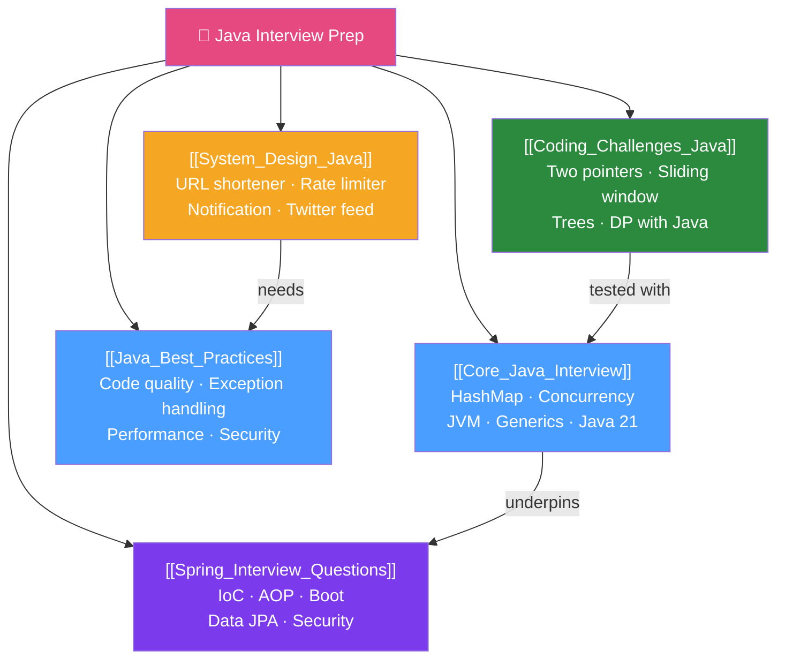

# 🎯 Java Interview Prep — Map of Content

> [!abstract] What This Section Covers
> Comprehensive interview preparation for senior Java engineer roles. Core Java internals (HashMap, concurrency, JVM), Spring ecosystem questions, system design with Java, coding challenge patterns with Java implementations, and Java best practices. This section synthesises knowledge from the entire vault into interview-ready answers and hands-on practice.

## Concept Map

## Learning Path
1. [[Core_Java_Interview]] — Master the fundamentals first — everything else builds on them.
2. [[Spring_Interview_Questions]] — Spring is expected for 90% of Java backend roles.
3. [[System_Design_Java]] — Senior roles require system design; prepare Java-specific answers.
4. [[Coding_Challenges_Java]] — Practice patterns, not individual problems.
5. [[Java_Best_Practices]] — Demonstrate senior engineering maturity with best practices.

## All Notes at a Glance
| Note | Difficulty | What You'll Learn |
|------|------------|-------------------|
| [[Core_Java_Interview]] | Intermediate–Advanced | HashMap internals, concurrency, JVM memory, generics, Java 8–21 Q&A |
| [[Spring_Interview_Questions]] | Intermediate–Advanced | IoC, AOP, Boot, Data JPA, Security, WebFlux common questions |
| [[System_Design_Java]] | Advanced | 4 complete system designs with Java implementation choices |
| [[Coding_Challenges_Java]] | Intermediate | 5 algorithmic patterns with Java code templates |
| [[Java_Best_Practices]] | Intermediate | Code quality, exception handling, performance, security, testing |

## Key Questions This Section Answers
- How does HashMap handle hash collisions in Java 8+?
- What is the difference between @Component, @Service, @Repository in Spring?
- How do you design a rate limiter system that handles 10K requests/second?
- What is the two-pointer technique and when do you apply it?
- What does "fail fast" mean in exception handling?

## Related Sections
- [[_MOC_Java_Master|↑ Java Master MOC]]
- [[_MOC_Enterprise_Patterns|↔ Enterprise Patterns]] — System design uses DDD/Hexagonal concepts
- [[_MOC_Performance_Advanced|↔ Performance Advanced]] — Performance questions appear in senior interviews

#java #interview #preparation #MOC
