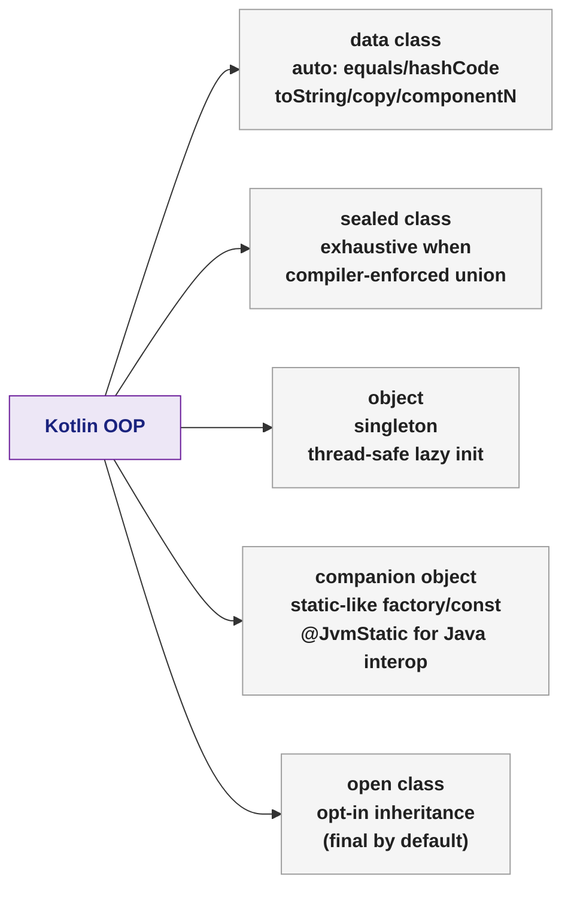

# 🟣 Kotlin Classes and OOP

> [!abstract] TL;DR
> Kotlin classes are concise by default: properties in the primary constructor, auto-generated `equals`/`hashCode`/`toString`/`copy` for `data class`, `sealed class` for exhaustive type hierarchies, `object` for singletons, and `companion object` for static-like members. Abstract classes allow partial implementation while interfaces allow multiple-type contracts with default methods. Unlike Java, all classes are `final` by default — use `open` to allow subclassing.

---

## Intuition

Java requires explicit getters, setters, and constructors even for the simplest data holders. Kotlin's `data class` collapses all of that into one line. Kotlin's `sealed class` is the typed-union Kotlin borrows from functional languages — it lets the compiler verify you've handled every possible case in a `when` expression, the same guarantee Java's sealed classes provide (see [[Interfaces_and_Modern_Types]]).

---

## How It Works

### Class Declaration and Primary Constructor

```kotlin
// Primary constructor in the header — properties declared with val/var
class Person(val name: String, val age: Int) {
    // init block — runs as part of primary constructor
    init {
        require(name.isNotBlank()) { "Name cannot be blank" }
        require(age >= 0) { "Age must be non-negative" }
    }

    // Computed property (no backing field needed)
    val isAdult: Boolean get() = age >= 18

    // Secondary constructor — must delegate to primary with this(...)
    constructor(name: String) : this(name, 0)
}

val p = Person("Alice", 30)
println(p.name)       // "Alice" — no getter boilerplate
println(p.isAdult)    // true

// Visibility modifiers: public (default), private, protected, internal (module)
class BankAccount(private val owner: String, private var balance: Double) {
    fun deposit(amount: Double) { balance += amount }
    fun getBalance() = balance
}
```

### `data class` — Kotlin's Records Equivalent

```kotlin
// data class generates: equals, hashCode, toString, copy(), componentN()
data class Point(val x: Double, val y: Double)

val p1 = Point(3.0, 4.0)
val p2 = p1.copy(y = 0.0)    // non-destructive update → Point(3.0, 0.0)
val (x, y) = p1               // destructuring via component1(), component2()

println(p1)                    // Point(x=3.0, y=4.0) — toString auto-generated
println(p1 == Point(3.0, 4.0)) // true — structural equality via equals()

// In Java: records (Java 16) serve the same role — see [[Interfaces_and_Modern_Types]]
// Kotlin data class added 2016; Java record added 2021. Same idea, different lineage.
```

### `sealed class` — Exhaustive Type Hierarchies

```kotlin
// All subtypes must be in the same package (Kotlin 1.1+: same file; 1.5+: same package)
sealed class Result<out T>
data class Success<T>(val value: T)  : Result<T>()
data class Failure(val error: String): Result<Nothing>()
object  Loading                      : Result<Nothing>()

// when is exhaustive — no else needed (compiler enforces all branches)
fun <T> handle(result: Result<T>): String = when (result) {
    is Success -> "Got: ${result.value}"
    is Failure -> "Error: ${result.error}"
    Loading    -> "Please wait…"
}
// Adding a new subtype breaks the when — caught at compile time, not runtime
```

### `enum class` — Type-Safe Constants with Behaviour

```kotlin
enum class Direction(val degrees: Int) {
    NORTH(0), EAST(90), SOUTH(180), WEST(270);

    fun opposite(): Direction = entries[(ordinal + 2) % 4]
}

println(Direction.NORTH.opposite())  // SOUTH
println(Direction.entries)           // [NORTH, EAST, SOUTH, WEST]

// enum can implement interfaces
interface Printable { fun print() }
enum class Status : Printable {
    ACTIVE { override fun print() = println("Active") },
    INACTIVE { override fun print() = println("Inactive") }
}
```

### `object` Declaration — Singleton

```kotlin
// object is a singleton — created lazily on first access, thread-safe
object AppConfig {
    val baseUrl = "https://api.example.com"
    var retryCount = 3

    fun buildUrl(path: String) = "$baseUrl/$path"
}

AppConfig.buildUrl("users")  // no instantiation needed

// object expression — anonymous object (replaces Java anonymous class)
val comparator = object : Comparator<String> {
    override fun compare(a: String, b: String) = a.length - b.length
}
```

### `companion object` — Static-Like Members

```kotlin
class Database private constructor(val url: String) {
    companion object {
        // Factory method pattern
        fun create(url: String): Database {
            require(url.startsWith("jdbc:")) { "Invalid JDBC URL" }
            return Database(url)
        }

        const val DEFAULT_TIMEOUT = 30  // compile-time constant

        // @JvmStatic for Java interop: Database.create("jdbc:...") in Java
        @JvmStatic fun fromEnv(): Database = create(System.getenv("DB_URL"))
    }
}

val db = Database.create("jdbc:postgresql://localhost/mydb")
// Java: Database.fromEnv();  // @JvmStatic makes it a true static call
```

### Inheritance — `open` by Default Is Closed

```kotlin
// Kotlin classes are final by default — must opt-in to inheritance
open class Animal(val name: String) {
    open fun sound(): String = "..."
}

class Dog(name: String) : Animal(name) {
    override fun sound() = "Woof"  // override must be explicit
}

// Abstract class — partially implemented, cannot be instantiated
abstract class Shape {
    abstract fun area(): Double
    fun describe() = "Area = ${area()}"  // concrete method
}

class Circle(val radius: Double) : Shape() {
    override fun area() = Math.PI * radius * radius
}

// Interface — can have default methods, no state
interface Drawable {
    fun draw()                            // abstract
    fun drawWithBorder() = draw()         // default method (Kotlin allows this)
}
```

## OOP Feature Comparison



| Kotlin Feature | Java Equivalent | Kotlin Advantage |
|----------------|-----------------|-----------------|
| `data class` | POJO + Lombok / Record (Java 16) | 1 line; `copy()` built-in |
| `sealed class` | `sealed interface` (Java 17) | Available since Kotlin 1.0 |
| `object` | Singleton enum / static holder | Thread-safe, lazy, natural syntax |
| `companion object` | `static` members | Can implement interfaces, have state |
| `open class` | `class` (extendable by default) | Prefer composition; explicit inheritance opt-in |

## Common Pitfalls

| # | Pitfall | Fix |
|---|---------|-----|
| 1 | Forgetting `open` on a class you want to mock or extend | Add `open` or use an interface; or enable the `all-open` Kotlin compiler plugin for Spring |
| 2 | `data class` with mutable `List` field — shallow equality | Use `List` (read-only) not `MutableList`; deep copy in `copy()` won't deep-copy nested collections |
| 3 | `companion object` not annotated with `@JvmStatic` — Java callers see `Companion.method()` | Add `@JvmStatic` to companion members accessed from Java |
| 4 | `sealed class` subtype in different package (Kotlin < 1.5) | Upgrade to Kotlin 1.5+ or keep all subtypes in the same file |
| 5 | `object` (singleton) holding mutable state — hard to test | Inject state via constructor instead; keep objects stateless |

## Review Questions

1. How does Kotlin's `data class` compare to Java's `record` (Java 16)? What does Kotlin's `copy()` do that Java's record lacks natively?
2. Why are Kotlin classes `final` by default? How does this encourage composition over inheritance?
3. A `sealed class Result<T>` has subtypes `Success<T>` and `Failure`. You add a third subtype `Pending`. Where does the compiler force you to handle this new type?

---

Related: [[Kotlin_Overview]] | [[Kotlin_Null_Safety]] | [[Kotlin_Functions]] | [[Kotlin_Generics]] | [[Kotlin_Delegation]] | [[Interfaces_and_Modern_Types]]

#Kotlin
