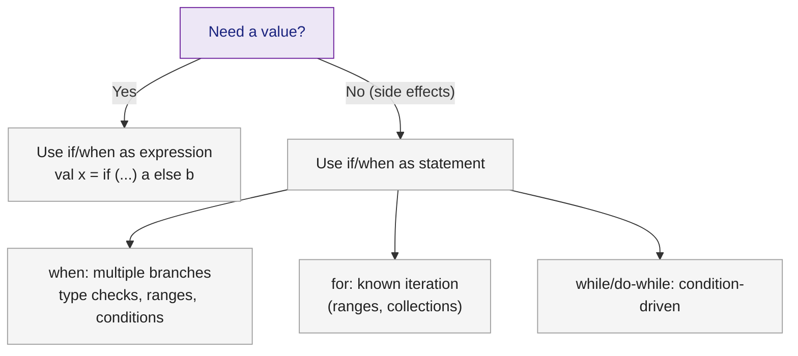

# 🟣 Kotlin Control Flow

> [!abstract] TL;DR
> In Kotlin, `if` and `when` are **expressions** that return values, eliminating the need for Java's ternary operator and verbose switch statements. `for` loops work over any `Iterable` and support ranges (`1..10`), `until`, `downTo`, and `step`. `when` replaces `switch` with exhaustive matching, type checks, range tests, and arbitrary conditions. `break`/`continue`/`return` can target labeled outer loops directly.

---

## Intuition

Java's `switch` is a statement — it can't produce a value, forces `break` everywhere, and allows fall-through bugs. Kotlin's `when` is an expression: it produces a value, never falls through, and can match types, ranges, and custom conditions. Similarly, `if` in Kotlin is an expression — `val x = if (a > b) a else b` replaces Java's ternary `a > b ? a : b`.

---

## How It Works

### `if` as an Expression

```kotlin
// Java ternary: int max = (a > b) ? a : b;
// Kotlin — if is an expression returning the last value of the chosen branch
val max: Int = if (a > b) a else b

// Multiline if-expression — each branch can be a block; last expression is the value
val grade = if (score >= 90) {
    println("Excellent!")
    "A"
} else if (score >= 70) {
    "B"
} else {
    "C"
}

// Traditional statement use still works
if (isDebug) println("Debug mode")
```

### `when` Expression — Kotlin's Supercharged `switch`

```kotlin
// Basic when — replaces Java switch, no fall-through, no break needed
val day = 3
val dayName = when (day) {
    1    -> "Monday"
    2    -> "Tuesday"
    3    -> "Wednesday"
    6, 7 -> "Weekend"           // multiple values in one branch
    else -> "Weekday"           // else required when not exhaustive
}

// when with type checks — replaces instanceof chains
fun describe(obj: Any): String = when (obj) {
    is Int    -> "Integer: $obj"
    is String -> "String of length ${obj.length}"  // smart cast inside branch
    is List<*> -> "List with ${obj.size} elements"
    null      -> "null"
    else      -> "Unknown: ${obj::class.simpleName}"
}

// when with range checks
val category = when (score) {
    in 90..100 -> "A"
    in 80 until 90 -> "B"
    in 70 until 80 -> "C"
    else -> "F"
}

// when without argument — replaces if-else chains
val message = when {
    temperature > 35 -> "Heat warning"
    temperature < 0  -> "Frost warning"
    isRaining        -> "Take an umbrella"
    else             -> "Enjoy the day"
}

// Exhaustive when with sealed classes — no else required
sealed class Shape
data class Circle(val r: Double) : Shape()
data class Rect(val w: Double, val h: Double) : Shape()

fun area(s: Shape): Double = when (s) {
    is Circle -> Math.PI * s.r * s.r
    is Rect   -> s.w * s.h
    // Compiler enforces exhaustiveness — all sealed subtypes covered
}
```

### `for` Loops and Ranges

```kotlin
// Inclusive range 1..10 (like Java for i = 1; i <= 10; i++)
for (i in 1..10) print("$i ")        // 1 2 3 4 5 6 7 8 9 10

// until — exclusive upper bound (1 until 10 → 1 to 9)
for (i in 0 until list.size) println(list[i])

// downTo — count down
for (i in 10 downTo 1) print("$i ")  // 10 9 8 7 6 5 4 3 2 1

// step — custom increment
for (i in 0..20 step 4) print("$i ") // 0 4 8 12 16 20

// Iterate a collection with indices
val fruits = listOf("apple", "banana", "cherry")
for ((index, fruit) in fruits.withIndex()) {
    println("$index: $fruit")
}

// Iterate a map
val capitals = mapOf("UK" to "London", "FR" to "Paris")
for ((country, capital) in capitals) {
    println("$country → $capital")
}
```

### `while` and `do-while`

```kotlin
var x = 0
while (x < 5) {
    print(x++)
}

do {
    val input = readLine()
    println("Got: $input")
} while (input != "quit")
```

### Labels — `break` and `continue` with Outer Loops

```kotlin
// Labels solve the "break out of nested loop" problem without flags or exceptions
outer@ for (i in 1..5) {
    for (j in 1..5) {
        if (j == 3) continue@outer   // skip rest of inner loop, advance outer
        if (i == 4) break@outer      // break out of the outer loop entirely
        print("($i,$j) ")
    }
}

// return@label — return from a lambda to its enclosing function
fun processItems(items: List<Int>) {
    items.forEach { item ->
        if (item < 0) return@forEach  // continue to next item (not return from processItems)
        println(item)
    }
    println("Done")  // always reached
}
```

### `throw` as an Expression

```kotlin
// throw can appear anywhere an expression is expected
val port = config["port"] ?: throw IllegalStateException("port not configured")

// Combined with Elvis for precondition checks
fun requirePositive(n: Int): Int {
    return if (n > 0) n else throw IllegalArgumentException("Expected positive, got $n")
}

// Idiomatic shortcut using stdlib:
val n = requireNotNull(value) { "value must not be null" }
require(n > 0) { "n must be positive" }
check(isInitialized) { "not initialized yet" }
```

## Control Flow Decision Guide



## Common Pitfalls

| # | Pitfall | Fix |
|---|---------|-----|
| 1 | Using `if` without `else` as an expression | Without `else`, the expression type is `Unit`, not the branch type; always add `else` |
| 2 | `when` without `else` on non-exhaustive type | Compiler warns; add `else ->` or use a sealed type for automatic exhaustiveness |
| 3 | Forgetting `@label` direction with nested lambdas | `return` inside a lambda returns from the enclosing function; use `return@lambdaName` to return from just the lambda |
| 4 | Using `1..10` when exclusive upper bound intended | Use `until` for exclusive: `0 until list.size` not `0..list.size-1` |
| 5 | Fall-through assumption from Java switch habit | Kotlin `when` never falls through; list multiple values with commas: `1, 2 ->` |

## Review Questions

1. What does it mean for `if` to be an expression in Kotlin? How does this replace Java's ternary operator?
2. Write a `when` expression that classifies a `Shape` sealed class (`Circle`, `Rectangle`, `Triangle`) — why is no `else` branch needed?
3. What does `return@forEach` do inside a `forEach` lambda, and how does it differ from a plain `return`?

---

Related: [[Kotlin_Types_and_Variables]] | [[Kotlin_Functions]] | [[Kotlin_Classes_and_OOP]] | [[Kotlin_Null_Safety]]

#Kotlin
